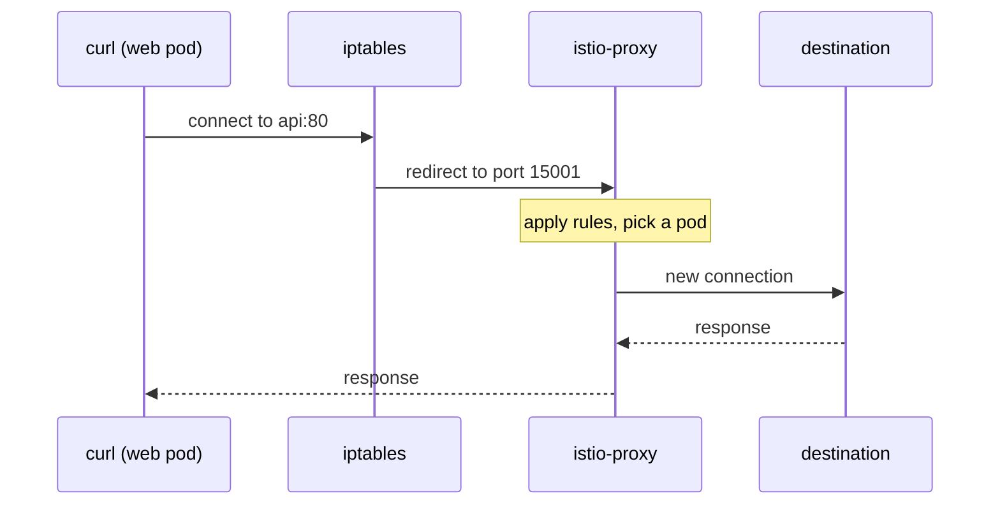

# The Sidecar And The Data Path

Astronaut, everything in this course is a way of telling a proxy what to do. Before any of those orders make sense, you need to know where that proxy is, how it got on board, and how a signal (a request) that was never addressed to it ends up going through it anyway. That is this part.

Nothing here is configured by you. It is the machinery that exists the moment a namespace is injected, and it is the reason a `VirtualService` can change behaviour without a single line of application code changing.

## The problem a mesh is trying to solve

A service that calls other services has to deal with a list of concerns that have nothing to do with what the service is for: retries, timeouts, TLS, which version of a dependency to call, what to do when a dependency is slow, and how to report what happened. Solve them in the application and you solve them once per language, per framework, per team, and you redeploy the application every time the policy changes.

A **service mesh** moves that list out of the application and into infrastructure that sits beside it. Picture it as the fleet's shared signal network. Istio's version of "beside it" is a second container in every pod (every spaceship) — a proxy, the ship's communications officer — plus a control plane, mission control, that programs every one of those proxies from a single set of objects you write.

The trade is worth stating plainly, because it is the thing to remember when something behaves strangely later: **your application is no longer talking directly to the network.** Two communications officers now sit between any two services, one on each ship, and the behaviour you observe is theirs.

## What injection actually adds

The namespace label does it:

```yaml
metadata:
  name: mesh-demo
  labels:
    istio-injection: enabled
```

With that label present, a Kubernetes **mutating admission webhook** registered by Istio intercepts every pod creation in the namespace and rewrites the pod spec on its way into the cluster. Think of it as the launch pad crew putting a communications officer on board every ship that launches from this planet. Nothing modifies your Deployment; the Deployment is unchanged and the change lands on the pods it produces. That is why a namespace labelled *after* its pods were created needs a `rollout restart` before anything is injected — existing pods were admitted before the rule applied.

Two things are added:

```text
 initContainers:
   istio-init      runs once, writes iptables rules in the pod's network
                   namespace, and exits.
   istio-proxy     restartPolicy: Always — a NATIVE SIDECAR. Listed among the
                   init containers, but it starts before your app and keeps
                   running for the pod's life.

 containers:
   <your app>      unchanged
```

That placement surprises people, so it is worth being precise. On Kubernetes 1.28 and later, a container declared in `initContainers` **with `restartPolicy: Always`** is a *native sidecar*: the kubelet starts it in order, like an init container, but never waits for it to exit. Istio uses that mechanism, which is why `istio-proxy` appears in the init list and is nevertheless running the whole time.

Two consequences follow. The proxy is guaranteed to be up **before** your application's first request, which the old arrangement could not promise. And native sidecars still count toward the `READY` column — which is why a pod with one application container reads `2/2`.

`istio-proxy` holds two processes: **Envoy**, the proxy that moves the traffic (the communications officer at the radio), and **istio-agent**, a small supervisor that fetches orders and certificates for it from mission control. When this course says "the sidecar", it means Envoy.

<!-- astrona:playground:renew -->

> [!TIP]
> **Try it — the whole difference, in one column**
>
> ```sh
> kubectl -n mesh-demo get pods
> kubectl -n mesh-legacy get pods
> ```
>
> Expect something like:
>
> ```text
> NAME                   READY   STATUS    RESTARTS   AGE
> api-6c9f7d8b84-2xq4r   2/2     Running   0          3m
> web-5f8c6d7b9c-nk82p   2/2     Running   0          3m
> NAME                      READY   STATUS    RESTARTS   AGE
> legacy-7d5b8c6f94-tm9vk   1/1     Running   0          3m
> ```
>
> Same image in `web` and `legacy`, same cluster, one label of difference. `2/2` is a meshed workload; `1/1` is not. This is the first thing to check whenever Istio "is not doing anything" to a workload.

The `READY` column counts containers, not what they are. Ask the pod directly what it is running to see the injected pieces by name.

> [!TIP]
> **Try it — name the containers**
>
> ```sh
> kubectl -n mesh-demo get pod -l app=web \
>   -o jsonpath='{range .items[0].spec.initContainers[*]}{.name}{" restartPolicy="}{.restartPolicy}{"\n"}{end}{"--- containers ---\n"}{.items[0].spec.containers[*].name}{"\n"}'
> ```
>
> Expect something like:
>
> ```text
> istio-init restartPolicy=
> istio-proxy restartPolicy=Always
> --- containers ---
> web
> ```
>
> Both injected pieces are init containers, and the `restartPolicy` is what separates them. `istio-init` has none, so it runs once and exits. `istio-proxy` has `Always`, which makes it a native sidecar: started in order, before `web`, and never waited on. If the proxy came up after the app, the app's first requests would escape the mesh.

## How traffic gets redirected into the proxy

`curl http://api/` inside the `web` pod opens a connection to the `api` Service. The application does not know about the proxy and is not configured to use one. The redirect is done below the application, by the `iptables` rules `istio-init` installed in the pod's network namespace:

- Outbound traffic leaving the pod is redirected to the proxy's port **15001**.
- Inbound traffic arriving at the pod is redirected to the proxy's port **15006**.
- Traffic the proxy itself originates is exempt, or the rules would loop.

The proxy then does the real work: it terminates the connection, reads the signal, decides where it should go, opens its own connection to the chosen destination, and relays the reply back. The app never radios another ship directly; every signal is passed through the communications officer.



Take from this that the application's connection and the proxy's connection are **two different connections**. Timeouts, retries and mTLS all belong to the second one, which is why Istio can retry a request the application only sent once.

The proxy listens on a handful of fixed ports, and they are worth recognising in output before you meet them under pressure:

| Port | What it is |
| --- | --- |
| `15001` | outbound — where the pod's own outgoing traffic is redirected |
| `15006` | inbound — where traffic arriving for this pod is redirected |
| `15000` | Envoy's administration interface, bound to localhost inside the pod |
| `15020` | istio-agent: merged metrics, plus the readiness endpoint Kubernetes probes |
| `15021` | health checking — the port the mesh uses to ask "is this proxy up?" |
| `15090` | Envoy's own Prometheus metrics |

You will not normally connect to these by hand. You need to recognise them because they show up in listener dumps, in access logs, and in "why is this port already in use" questions.

## Two proxies see every in-mesh request

Because both ends are injected, a request from `web` to `api` passes through two proxies: `web`'s on the way out and `api`'s on the way in. Each writes its own access log line, the way both ships record the same signal in their own flight log. That is not redundancy — the two ends do different jobs. Routing, retries and timeouts are decided by the **caller's** proxy; authorization and inbound TLS termination are enforced by the **receiver's**.

> [!TIP]
> **Try it — one request, two log lines**
>
> ```sh
> kubectl -n mesh-demo exec deploy/web -- curl -s -o /dev/null http://api/
> sleep 1
> kubectl -n mesh-demo logs deploy/web -c istio-proxy --tail=1
> kubectl -n mesh-demo logs deploy/api -c istio-proxy --tail=1
> ```
>
> Expect something like (trimmed, and wrapped here to fit):
>
> ```text
> [2026-09-29T09:41:02.118Z] "GET / HTTP/1.1" 200 … outbound|80||api.mesh-demo.svc.cluster.local …
> [2026-09-29T09:41:02.119Z] "GET / HTTP/1.1" 200 … inbound|8080|| …
> ```
>
> The same request, a millisecond apart, from both sides. `outbound` is the caller choosing a destination; `inbound` is the receiver handing it to the application. Those two long tokens are **cluster names**, and decoding them is the next part's subject.

The `sleep 1` is not decoration: the proxy flushes its access log asynchronously, so reading the log in the same breath as the request will often show you the *previous* line and look like nothing happened.

Access logging is on here because the playground installs the `demo` profile, which sets `meshConfig.accessLogFile` to stdout. A production install often does not, which is worth knowing before you go looking for these lines on a real cluster and conclude the mesh is broken.

## What an uninjected workload changes

`mesh-legacy` gives you the contrast directly. The `legacy` pod is a ship with no communications officer, so nothing intercepts what it sends. Its traffic reaches `api` the ordinary Kubernetes way — DNS to the Service's virtual IP, then `kube-proxy` to a pod.

Predict what the logs will show before you run the next checkpoint: there is no proxy in the `legacy` pod to write a caller-side line, but the receiving end is still meshed.

> [!TIP]
> **Try it — a request only one proxy sees**
>
> ```sh
> kubectl -n mesh-legacy exec deploy/legacy -- curl -s -o /dev/null -w '%{http_code}\n' http://api.mesh-demo/
> sleep 1
> kubectl -n mesh-demo logs deploy/api -c istio-proxy --tail=1
> ```
>
> Expect something like:
>
> ```text
> 200
> [2026-09-29T18:19:49.877Z] "GET / HTTP/1.1" 200 … "api.mesh-demo" "10.244.0.11:8080" inbound|8080|| …
> ```
>
> The call succeeded and only the receiving proxy logged it — note the authority is `api.mesh-demo`, the name the legacy pod dialled. Nothing you write in this course would have applied to that request on the way out, because there was no proxy on the way out to apply it.

This is the rule that decides what the mesh can and cannot do for you: **a policy takes effect where a proxy exists.** Client-side features — routing, retries, timeouts, circuit breaking, load balancing — need the *caller* injected. A request from outside the mesh gets none of them, no matter how correct your objects are.

It also explains why so much of this course points its diagnostic commands at the client. When the wrong thing happens, the proxy that decided is in the pod that asked.

## Common pitfalls

> [!WARNING]
> **Labelling a namespace and expecting existing pods to change.** Injection happens at pod creation. Label first, then `kubectl rollout restart deployment -n <namespace>`.
>
> **Reading `2/2` as "healthy" rather than "injected".** It only tells you the proxy container exists. A proxy that is running and holds no useful configuration still reads `2/2`.
>
> **Looking for `istio-proxy` under `containers`.** On Kubernetes 1.28+ it is a native sidecar, declared in `initContainers` with `restartPolicy: Always`. It is running the whole time regardless.
>
> **Expecting Istio to apply client-side policy to an uninjected caller.** Routing, retries and timeouts live in the caller's proxy. No caller proxy, no policy.
>
> **Assuming access logs are always on.** The `demo` profile enables them. Many real installs do not, and their absence says nothing about whether traffic is flowing.
>
> **Treating the application's connection and the proxy's connection as one.** They are two. That distinction is what makes retries, pooling and mTLS possible, and it is why a single application request can appear more than once upstream.

> *Injection puts a proxy in the pod and rewrites the pod's own routing table so traffic cannot avoid it — everything else in this course is instructions for that proxy.*
