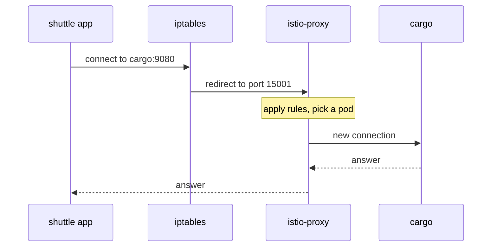

# Follow A Request Through Two Proxies

The application in a pod never sends its requests to the sidecar proxy on purpose, and nobody configures it to use one. Yet every request passes through the proxy. This part shows how that happens, why every request inside the mesh passes **two** sidecar proxies, and what changes for a client that has no sidecar proxy at all.

## How iptables sends traffic into the proxy

Start with one concrete request. When the `shuttle` pod runs `curl http://cargo:9080/`, its application opens a connection to the `cargo` Service. The application knows nothing about the proxy. The redirect happens below the application, in network rules that the `istio-init` container wrote into the pod before the application started. It writes these rules with **`iptables`**, the Linux tool that sets packet filtering and redirect rules in the kernel:

- Connections **leaving** the pod are redirected to the proxy's port **15001**.
- Connections **arriving** at the pod are redirected to the proxy's port **15006**.
- Connections that the proxy itself opens are let through. Without this rule, the traffic would loop back into the proxy forever.

The proxy then does the real work. It accepts the connection, reads the request, decides where it goes, opens its own connection to the chosen pod, and passes the response back.



The diagram shows the `iptables` rules sending the connection of the `shuttle` application to port `15001` of its proxy, and the proxy opening a new connection to a `cargo` pod.

The connection of the application and the connection of the proxy are **two different connections**. Timeouts, retries and encryption all belong to the second one. That is why the proxy can retry a request that the application sent only once.

The proxy listens on a few fixed ports. You will not connect to them by hand, but you will see them in proxy output:

| Port | What it is |
| --- | --- |
| `15001` | Outbound: where the pod's own outgoing connections are redirected |
| `15006` | Inbound: where connections arriving for this pod are redirected |
| `15000` | Envoy's administration interface, only reachable inside the pod |
| `15020` | istio-agent: merged Prometheus metrics, and the application health checks that Istio redirects here |
| `15021` | The health check of the proxy itself: Kubernetes asks it whether the proxy is ready |
| `15090` | Envoy's own Prometheus metrics |

## Two proxies log every request in the mesh

When both pods are in the mesh, a request from `shuttle` to `cargo` passes two sidecar proxies. The `shuttle` proxy handles it on the way out, and the `cargo` proxy handles it on the way in. Each proxy writes its own line in its **access log**, the log where Envoy records one line for every request it handles.

This is not double work, because the two proxies do different jobs. The **client's** proxy (the sender) decides routing, retries and timeouts. The **server's** proxy (the receiver) checks who may call and decrypts encrypted traffic.

<!-- astrona:playground:renew -->

To see both log lines, send one request from `shuttle` to `cargo`:

```sh
kubectl -n starfleet exec deploy/shuttle -- curl -s -o /dev/null -w '%{http_code}\n' http://cargo:9080/details/0
```

```text
200
```

Wait a second, then read the last line of both access logs:

```sh
kubectl -n starfleet logs deploy/shuttle -c istio-proxy --tail=1
kubectl -n starfleet logs deploy/cargo-v1 -c istio-proxy --tail=1
```

You should see:

```text
[2026-10-08T19:59:47.514Z] "GET /details/0 HTTP/1.1" 200 - via_upstream - "-" 0 178 45 31 "-" "curl/8.11.1" "2ffcae3f-ff9f-4401-98de-87a1a846b25c" "cargo:9080" "10.244.0.6:9080" outbound|9080||cargo.starfleet.svc.cluster.local 10.244.0.12:59346 10.96.239.41:9080 10.244.0.12:40704 - default
[2026-10-08T19:59:47.523Z] "GET /details/0 HTTP/1.1" 200 - via_upstream - "-" 0 178 27 25 "-" "curl/8.11.1" "2ffcae3f-ff9f-4401-98de-87a1a846b25c" "cargo:9080" "10.244.0.6:9080" inbound|9080|| 127.0.0.6:36935 10.244.0.6:9080 10.244.0.12:59346 outbound_.9080_._.cargo.starfleet.svc.cluster.local default
```

Both lines describe the same request: the request ID `2ffcae3f-…` is the same in both, and the times are a few milliseconds apart. The first line comes from the `shuttle` proxy. Its `outbound|9080||cargo…` means "I am sending this out to `cargo`". The second line comes from the `cargo` proxy. Its `inbound|9080||` means "this arrived for me". These long values are **cluster names**: Envoy's names for destinations. A cluster name holds the direction, the port and the host.

Envoy writes the log line a moment after the request ends. If you read the log at once, you may see the line before it and think nothing happened. Wait a second, then read it.

Your playground switches access logs on for the whole mesh. Many real installations do not, so a missing access log line there tells you nothing about whether requests are flowing.

## A client without a sidecar proxy

The `drifter` pod in the `outpost` namespace has no sidecar proxy. Nothing in its pod catches what it sends, so its requests reach `cargo` the plain Kubernetes way. The pod looks up the Service name in DNS, and **kube-proxy**, the Kubernetes component that forwards traffic for a Service's IP address to one of its pods, sends the connection to a `cargo` pod.

Predict the result before you run the next command. No proxy in the `drifter` pod can write a client-side log line. The `cargo` pod still has its sidecar proxy on the receiving end.

Send a request from `drifter` to `cargo`:

```sh
kubectl -n outpost exec deploy/drifter -- curl -s -o /dev/null -w '%{http_code}\n' http://cargo.starfleet:9080/details/0
```

```text
200
```

Wait a second, then read the last line of the `cargo` access log:

```sh
kubectl -n starfleet logs deploy/cargo-v1 -c istio-proxy --tail=1
```

You should see:

```text
[2026-10-08T19:59:49.769Z] "GET /details/0 HTTP/1.1" 200 - via_upstream - "-" 0 178 1 1 "-" "curl/8.11.1" "5f4cbf7c-b797-4ea2-83d7-1ff58ac1adc9" "cargo.starfleet:9080" "10.244.0.6:9080" inbound|9080|| 127.0.0.6:46973 10.244.0.6:9080 10.244.0.15:56306 - default
```

The request arrived, and only the `cargo` proxy logged it. The host is `cargo.starfleet`, the name that `drifter` asked for. There is no `outbound` line anywhere: there was no proxy in the `drifter` pod to write one, so no Istio rule could apply on the way out.

This gives the rule that decides what the mesh can do for you: **a rule takes effect only where a proxy exists.** Routing, retries, timeouts and load balancing all need a sidecar proxy in the **client** pod. A request from a pod without one gets none of them, however correct your Istio objects are.

> [!TIP]
> When the wrong thing happens to a request, look at the proxy of the pod that **sent** it. That is where the routing decision was made.

You now know how `iptables` rules send a pod's traffic through its proxy, why a request between two meshed pods shows up in two access logs, and why a client without a proxy gets no Istio rules. The proxies still need configuration to make these decisions, and nobody has written any yet. Where that configuration comes from is the next question.

## Common pitfalls

> [!WARNING]
> - **Expecting Istio rules to apply to a client without a proxy.** Routing, retries and timeouts live in the client's proxy. No client proxy means no rule.
> - **Reading the access log too fast.** Envoy writes the line a moment after the request. Wait a second.
> - **Assuming access logs are always on.** Many installations switch them off. A missing line says nothing about traffic.
> - **Treating the connection of the application and the connection of the proxy as one.** They are two connections. That is what makes retries and encryption possible.

## Your mission: Bring Workloads Into The Mesh With Sidecar Injection Lab

You can now tell a pod with a sidecar proxy from one without, and you know why it matters. The lab gives you workloads that look healthy but run without a sidecar proxy, and you must bring them into the mesh. The lab uses its own small app (`api`, `reports` and `billing` in the `mesh-demo` and `legacy-app` namespaces), not the Starfleet.

The lab runs in its own cluster, so first pause your playground. Nothing in it is lost:

```sh
astrona stop ats-014-playground-000-01
```

Then start the lab:

```sh
astrona run --git git@github.com:astrona-io/ATS014.git -c sections/section-000/module-01/labs/lab-01
```

The task is on the next page. Solve it on your own first. When you think you are done, send it for grading:

```sh
astrona submit -c sections/section-000/module-01/labs/lab-01
```

When the lab is done, remove it and start your playground again:

```sh
astrona destroy ats-014-lab-000-01
astrona start ats-014-playground-000-01
```
