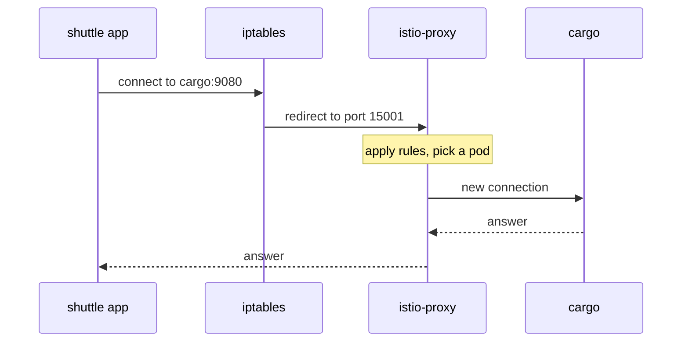

# Follow A Signal Through Two Proxies

Astronaut, the application never addresses its signals to the communications officer, and it is not configured to use one. Yet every signal goes through it. This part shows how that happens, why every signal inside the mesh passes **two** communications officers, and what changes for a ship that has none.

## How a signal gets redirected into the proxy

When the shuttle runs `curl http://cargo:9080/`, it opens a connection to the `cargo` Service. The shuttle's app knows nothing about the proxy. The redirect happens underneath the app, in network rules that `istio-init` wrote into the pod with `iptables` (the Linux firewall) before the app started:

- Signals **leaving** the pod are redirected to the proxy's port **15001**.
- Signals **arriving** at the pod are redirected to the proxy's port **15006**.
- Signals the proxy itself sends are let through, or the rules would loop forever.

The proxy then does the real work. It accepts the connection, reads the signal, decides where it goes, opens its own connection to the chosen ship, and passes the reply back.



The app's connection and the proxy's connection are **two different connections**. Timeouts, retries and encryption all belong to the second one. That is why Istio can retry a signal the app only sent once.

The proxy listens on a few fixed ports. You will not connect to them by hand, but you will see them in proxy output:

| Port | What it is |
| --- | --- |
| `15001` | outbound: where the pod's own outgoing signals are redirected |
| `15006` | inbound: where signals arriving for this pod are redirected |
| `15000` | Envoy's administration page, only reachable inside the pod |
| `15020` | istio-agent: merged metrics, and the readiness check Kubernetes uses |
| `15021` | the health check: "is this proxy up?" |
| `15090` | Envoy's own metrics |

## Two proxies see every signal in the mesh

When both ships are in the mesh, a signal from the shuttle to cargo passes two communications officers: the shuttle's on the way out, and cargo's on the way in. Each writes its own line in its own flight log (its access log), the way both ships record the same signal.

That is not doubled work. The two ends do different jobs. Routing, retries and timeouts are decided by the **sender's** proxy. Checking who may call, and unwrapping encrypted signals, happen in the **receiver's** proxy.

<!-- astrona:playground:renew -->

### One signal, two flight log lines

Send one signal from the shuttle to cargo, then read the last line of both flight logs:

```sh
kubectl -n starfleet exec deploy/shuttle -- curl -s -o /dev/null -w '%{http_code}\n' http://cargo:9080/details/0
```

```text
200
```

Wait a second, then read both logs:

```sh
kubectl -n starfleet logs deploy/shuttle -c istio-proxy --tail=1
kubectl -n starfleet logs deploy/cargo-v1 -c istio-proxy --tail=1
```

You should see:

```text
[2026-10-08T19:59:47.514Z] "GET /details/0 HTTP/1.1" 200 - via_upstream - "-" 0 178 45 31 "-" "curl/8.11.1" "2ffcae3f-ff9f-4401-98de-87a1a846b25c" "cargo:9080" "10.244.0.6:9080" outbound|9080||cargo.starfleet.svc.cluster.local 10.244.0.12:59346 10.96.239.41:9080 10.244.0.12:40704 - default
[2026-10-08T19:59:47.523Z] "GET /details/0 HTTP/1.1" 200 - via_upstream - "-" 0 178 27 25 "-" "curl/8.11.1" "2ffcae3f-ff9f-4401-98de-87a1a846b25c" "cargo:9080" "10.244.0.6:9080" inbound|9080|| 127.0.0.6:36935 10.244.0.6:9080 10.244.0.12:59346 outbound_.9080_._.cargo.starfleet.svc.cluster.local default
```

It is the same signal: the request ID `2ffcae3f-…` is identical in both lines, a few milliseconds apart. The first line is the shuttle's: `outbound|9080||cargo…` means "I am sending this out to cargo". The second is cargo's: `inbound|9080||` means "this arrived for me". Those long tokens are **cluster names**: Envoy's names for destinations, with the direction, the port and the beacon in them.

The flight log is written a moment after the signal. If you read it straight away, you may see the line before it and think nothing happened. Wait a second, then read.

Flight logs are switched on in your playground for the whole mesh. Many real installations do not switch them on, so a missing flight log there says nothing about whether signals are flowing.

## What changes for a ship without a communications officer

The drifter on the `outpost` planet has no communications officer. Nothing catches what it sends, so its signals reach cargo the plain Kubernetes way: the name is looked up, and `kube-proxy` passes the connection to a pod.

Predict the next result before you run it: no proxy on the drifter can write a sender line, but cargo still has its communications officer on the receiving end.

### A signal only one proxy sees

Send a signal from the drifter to cargo, then read cargo's flight log:

```sh
kubectl -n outpost exec deploy/drifter -- curl -s -o /dev/null -w '%{http_code}\n' http://cargo.starfleet:9080/details/0
```

```text
200
```

Wait a second, then read cargo's last line:

```sh
kubectl -n starfleet logs deploy/cargo-v1 -c istio-proxy --tail=1
```

You should see:

```text
[2026-10-08T19:59:49.769Z] "GET /details/0 HTTP/1.1" 200 - via_upstream - "-" 0 178 1 1 "-" "curl/8.11.1" "5f4cbf7c-b797-4ea2-83d7-1ff58ac1adc9" "cargo.starfleet:9080" "10.244.0.6:9080" inbound|9080|| 127.0.0.6:46973 10.244.0.6:9080 10.244.0.15:56306 - default
```

The signal arrived, and only cargo's communications officer logged it. The beacon name is `cargo.starfleet`, the name the drifter asked for. There is no `outbound` line anywhere, because there was no proxy on the drifter to write one, and no Istio rule could have been applied on the way out.

This is the rule that decides what the mesh can do for you: **a rule takes effect where a proxy exists.** Routing, retries, timeouts and load balancing all need a communications officer on the **sending** ship. A signal from a ship without one gets none of them, however correct your objects are.

> [!TIP]
> When the wrong thing happens to a signal, look at the proxy of the ship that **sent** it. That is where the decision was made.

## Common pitfalls

> [!WARNING]
> - **Expecting Istio rules to apply to a sender without a proxy.** Routing, retries and timeouts live in the sender's proxy. No sender proxy, no rule.
> - **Reading the flight log too fast.** It is written a moment after the signal. Wait a second.
> - **Assuming flight logs are always on.** Many installations switch them off. Their absence says nothing about traffic.
> - **Treating the app's connection and the proxy's connection as one.** They are two. That is what makes retries and encryption possible.

> *Every signal in the mesh passes two communications officers, and the one on the sending ship makes the routing decision.*

## Your mission: Which Workloads Are Actually In The Mesh

You can now tell a ship with a communications officer from one without, and you know why it matters. Now prove it in a graded mission: two workloads look healthy but fly without a communications officer, and you have to bring them into the mesh.

The mission runs in its own training solar system, so first pause your playground. Nothing in it is lost:

```sh
astrona stop ats-014-playground-000-01
```

Then start the mission:

```sh
astrona run --git git@github.com:astrona-io/ATS014.git -c sections/section-000/module-01/labs/lab-01
```

Read the task in [`question.md`](./labs/lab-01/question.md) and solve it on your own first. When you think you are done, send it for grading:

```sh
astrona submit -c sections/section-000/module-01/labs/lab-01
```

When the mission is done, remove it and wake your playground up again:

```sh
astrona destroy ats-014-lab-000-01
astrona start ats-014-playground-000-01
```
