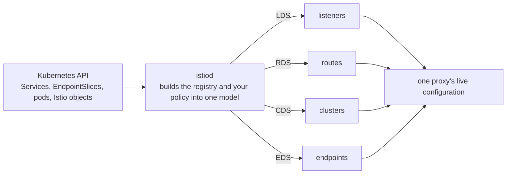
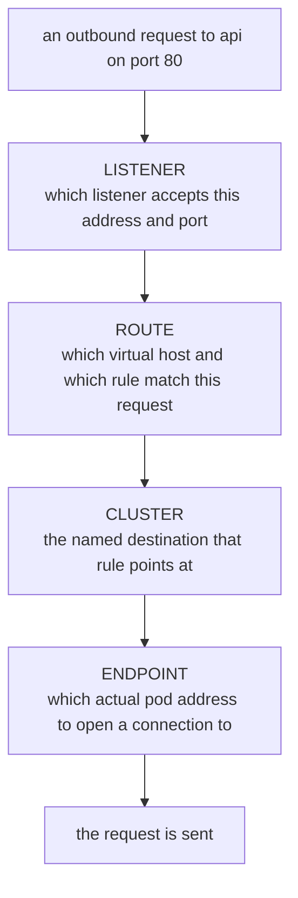

# How The Proxy Gets Its Configuration

> Prerequisite: [The Sidecar And The Data Path](./course-01-the-sidecar-and-the-data-path.md). Next: [The Diagnostic Toolkit](./course-03-the-diagnostic-toolkit.md).

Part 1 left a proxy in every pod with traffic redirected into it. A proxy with no instructions would drop everything, and yet `web` could already call `api` before you wrote a single Istio object. Something had already configured it.

That something is `istiod`, and this part is about what it knows, what it sends, and the four-layer structure of what the proxy ends up holding. Learn this structure once and every diagnostic command in the rest of the course becomes a lookup into one of its layers.

## `istiod` and the registry

`istiod` is the Istio control plane — a single Deployment in the `istio-system` namespace. It does three jobs: it watches Kubernetes, it builds Envoy configuration, and it issues the certificates workloads use to identify themselves.

What it watches is called the **service registry**: Istio's combined picture of everything callable in the mesh. On a plain Kubernetes install the registry is built from

- **Services** — each one becomes a destination with a name and a port,
- **EndpointSlices** — the pod addresses behind each Service,
- **pods** — their labels, their ports, and which node and locality they are on,
- **Istio's own objects** — `VirtualService`, `DestinationRule`, `Sidecar`, and (from section 070) `ServiceEntry` and `WorkloadEntry`, which add destinations Kubernetes does not know about.

The registry is the vocabulary. Your Istio objects are policy expressed *over* that vocabulary — which is why a `DestinationRule` for a host that does not exist is accepted and does nothing.

## xDS: four kinds of configuration, one stream

`istiod` does not write files into pods and it does not restart anything. It holds an open gRPC stream to every proxy and pushes configuration over **xDS** — Envoy's discovery APIs. There is one API per kind of resource, and the names are worth expanding because they appear in output as bare acronyms:

| Acronym | Name | What it carries |
| --- | --- | --- |
| **LDS** | Listener Discovery Service | the ports and addresses the proxy accepts traffic on |
| **RDS** | Route Discovery Service | the HTTP rules that choose a destination |
| **CDS** | Cluster Discovery Service | the named destinations themselves |
| **EDS** | Endpoint Discovery Service | the addresses behind each destination |



Everything in the proxy arrives on one of those four channels — which means every question about "did my change take effect" is a question about one of four things.

Because it is a push over a live stream, an accepted object reaches the proxies in seconds and nothing restarts. It also means `kubectl apply` returning is **not** proof that anything is configured: apply returns when the object is stored in Kubernetes, not when Envoy has it. Those are separate events, and the gap between them is where a surprising amount of confusion lives.

> [!TIP]
> **Try it — is every proxy up to date?**
>
> ```sh
> istioctl proxy-status
> ```
>
> Expect something like:
>
> ```text
> NAME                                                 CLUSTER      ISTIOD                    VERSION   SUBSCRIBED TYPES
> api-f9b4665f4-8ng5p.mesh-demo                        Kubernetes   istiod-7dc9684c55-9wgcn   1.30.5    4 (CDS,LDS,EDS,RDS)
> istio-egressgateway-b7dd4655b-zjtth.istio-system     Kubernetes   istiod-7dc9684c55-9wgcn   1.30.5    3 (CDS,LDS,EDS)
> istio-ingressgateway-7f54444996-f5zmc.istio-system   Kubernetes   istiod-7dc9684c55-9wgcn   1.30.5    3 (CDS,LDS,EDS)
> web-664dfc4d8c-cjpkc.mesh-demo                       Kubernetes   istiod-7dc9684c55-9wgcn   1.30.5    4 (CDS,LDS,EDS,RDS)
> ```
>
> One row per proxy **currently connected to the control plane**, which `istiod` instance it is connected to, its proxy version, and which of the xDS channels it subscribes to. The two gateways subscribe to three rather than four because nothing has given them routes to hold.
>
> Two ways to read it. A workload that should be meshed and is **missing from this list entirely** is not connected — injection, or the proxy itself, is the problem. And a proxy version that differs from the control plane's is the signature of a sidecar left behind by an upgrade.

Naming a single proxy turns the same command into a comparison between what `istiod` last sent and what that proxy acknowledged:

```sh
istioctl proxy-status web-664dfc4d8c-cjpkc.mesh-demo
```

```text
Clusters Match
Listeners Match
Routes Match (RDS last loaded at Tue, 29 Sep 2026 20:18:50 CEST)
```

Three `Match` lines mean the proxy is holding exactly what the control plane believes it sent. Anything other than `Match` is the answer to "my object is correct and nothing is happening".

## The four layers, and how a request walks down them

The four xDS types are not a flat list — they chain. A request entering the proxy is resolved down through them in order, and each layer answers one question:



Read that top to bottom whenever behaviour is wrong: the first layer that does not contain what you expect is where the problem is, and the layers above it are fine.

A worked instance, for `curl http://api/` from the `web` pod:

```text
 LISTENER   0.0.0.0:80                     accepts outbound traffic for port 80
 ROUTE      route config "80"              virtual host matching authority "api"
 CLUSTER    outbound|80||api.mesh-demo…    the destination that virtual host points at
 ENDPOINT   10.244.0.14:8080               the api pod, with the container port
```

Notice the port changes between the last two lines, because the cluster is named after the **Service** port and the endpoint is the **container** port. That is normal and catches people out once each.

### Layer 1 — listeners

> [!TIP]
> **Try it — the listener that accepts the call**
>
> ```sh
> istioctl proxy-config listener deploy/web -n mesh-demo --port 80
> ```
>
> Expect something like:
>
> ```text
> ADDRESSES PORT MATCH                                DESTINATION
> 0.0.0.0   80   Trans: raw_buffer; App: http/1.1,h2c Route: 80
> 0.0.0.0   80   ALL                                  PassthroughCluster
> ```
>
> The proxy accepts port 80 on any address. When it recognises the traffic as HTTP it hands it to a route configuration called `80` — the next layer down. The second row is the fallback: anything on port 80 that is *not* recognisable HTTP goes to `PassthroughCluster`, which forwards the bytes to their original address without routing them. That fallback is how a mis-declared protocol fails quietly rather than loudly, and it comes back in section 010.

Note what this listener is *not*: it is not per-Service. Every Service in the mesh on port 80 shares it, and the choice between them happens one layer down, by hostname.

### Layer 2 — routes

> [!TIP]
> **Try it — the route table for that port**
>
> ```sh
> istioctl proxy-config routes deploy/web -n mesh-demo --name 80 | head
> ```
>
> Expect something like:
>
> ```text
> NAME  VHOST NAME                                              DOMAINS                                             MATCH  VIRTUAL SERVICE
> 80    api.mesh-demo.svc.cluster.local:80                      api.mesh-demo.svc.cluster.local., api + 2 more...   /*
> 80    istio-egressgateway.istio-system.svc.cluster.local:80   istio-egressgateway.istio-system + 1 more...        /*
> 80    istio-ingressgateway.istio-system.svc.cluster.local:80  istio-ingressgateway.istio-system + 1 more...       /*
> ```
>
> One virtual host per destination on this port — including the two gateways, because this proxy is configured for the whole mesh. `DOMAINS` is every name a caller could have used: short, namespaced and fully qualified all reach the same place. `MATCH` is `/*` because the generated route accepts every path.

The `VIRTUAL SERVICE` column is **empty** here, and that is the thing to remember. These routes were generated by Istio from the Service itself; nothing you wrote is attached to them. Once you write a `VirtualService` in section 010, its name appears in that column — which makes it the fastest way to confirm your object bound to the host you meant rather than to some other one.

### Layers 3 and 4 — clusters and endpoints

A **cluster** is Envoy's word for a named destination: a name, a load balancing policy, and a set of endpoints. It has nothing to do with a Kubernetes cluster, and the collision is permanent, so read it as "destination" everywhere.

Cluster names are structured, not opaque:

```text
outbound | 80 | v2 | api.mesh-demo.svc.cluster.local
   │       │    │     └── the fully qualified host
   │       │    └──────── the subset name — EMPTY when there is no subset
   │       └───────────── the port, as the SERVICE defines it
   └───────────────────── direction: outbound (this proxy calling) or inbound (being called)
```

Subsets arrive in section 010; here every cluster has an empty subset field, which prints as `||` in the name and `-` in the `SUBSET` column.

> [!TIP]
> **Try it — the destination and what is behind it**
>
> ```sh
> istioctl proxy-config cluster deploy/web -n mesh-demo --fqdn api.mesh-demo.svc.cluster.local
> istioctl proxy-config endpoints deploy/web -n mesh-demo \
>   --cluster "outbound|80||api.mesh-demo.svc.cluster.local"
> ```
>
> Expect something like:
>
> ```text
> SERVICE FQDN                        PORT   SUBSET   DIRECTION   TYPE   DESTINATION RULE
> api.mesh-demo.svc.cluster.local     80     -        outbound    EDS
> ENDPOINT            STATUS      OUTLIER CHECK     CLUSTER
> 10.244.0.14:8080    HEALTHY     OK                outbound|80||api.mesh-demo.svc.cluster.local
> ```
>
> `TYPE: EDS` means the endpoint list is pushed dynamically rather than baked into the cluster — which is why scaling `api` changes the second listing with no change to the first. The empty `DESTINATION RULE` column is where a `DestinationRule` would appear once one exists.

## Every proxy is configured for the whole mesh

One more property, because it shapes a later module. `istiod` does not work out which services a workload actually calls. By default it sends every proxy the configuration for **every** Service in the mesh, in every namespace.

> [!TIP]
> **Try it — how much does one proxy carry?**
>
> ```sh
> istioctl proxy-config cluster deploy/web -n mesh-demo | wc -l
> ```
>
> Expect something like:
>
> ```text
> 24
> ```
>
> The number depends on what else is installed — it is an example, not a target. What matters is that it is far larger than the one service `web` calls. Section 010's second module is about cutting that down with a `Sidecar` object.

## Common pitfalls

> [!WARNING]
> **Treating `kubectl apply` as proof.** Apply stores the object. A separate push delivers it. `istioctl proxy-status` is what tells you the second one happened.
>
> **Reading "cluster" as "Kubernetes cluster".** In Envoy and in every `proxy-config` output it means one named destination inside one proxy.
>
> **Expecting the cluster port and the endpoint port to match.** The cluster carries the Service port, the endpoint carries the container port. Different by design.
>
> **Reading an empty `VIRTUAL SERVICE` column as a problem.** It means the route was generated from the Service and no `VirtualService` is attached to that virtual host.
>
> **Assuming a proxy only knows about what it calls.** By default it knows about everything in the mesh.

> *Listener, route, cluster, endpoint — four layers, pushed over four xDS channels. Every "why is this not working" question is a question about which layer stopped matching your expectation.*

## Reference

- [Istio architecture](https://istio.io/latest/docs/ops/deployment/architecture/) — `istiod`, the data plane, and what each is responsible for.
- [Envoy xDS overview](https://www.envoyproxy.io/docs/envoy/latest/intro/arch_overview/operations/dynamic_configuration) — the discovery APIs and how they relate.
- [Envoy listener and cluster model](https://www.envoyproxy.io/docs/envoy/latest/intro/arch_overview/upstream/upstream) — the definitions behind the four layers.
- [Debugging Envoy and istiod](https://istio.io/latest/docs/ops/diagnostic-tools/proxy-cmd/) — the upstream reference for `proxy-status` and `proxy-config`.
