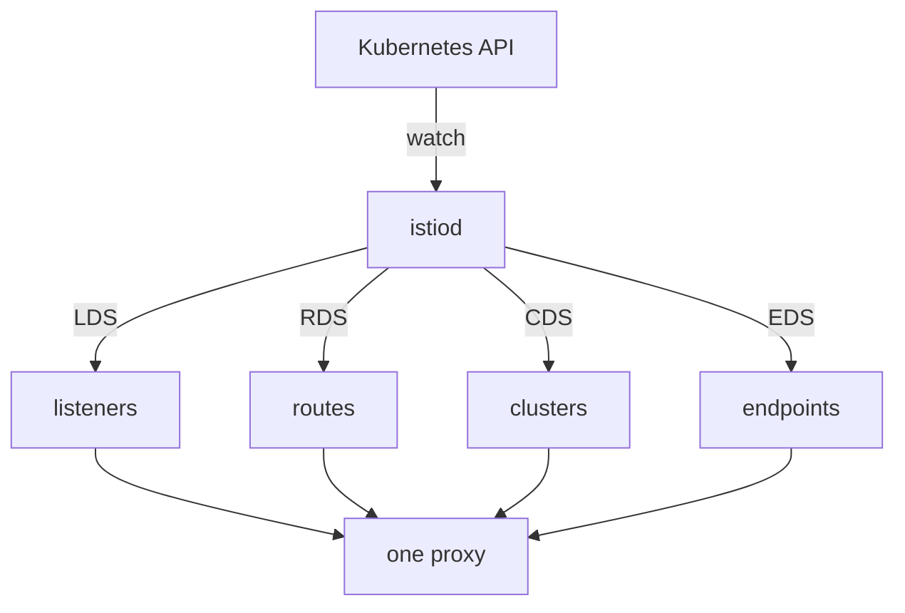

# How istiod Sends Configuration Over xDS

A sidecar proxy with no configuration would drop every request. Yet the `shuttle` pod could reach `cargo` before you wrote a single Istio object. Something had already configured every proxy: **`istiod`**, Istio's control plane. This part shows what `istiod` knows, how it sends configuration to the proxies, and how you check that every proxy received it.

## istiod and the service registry

`istiod` runs as one Deployment in the `istio-system` namespace. It does three jobs. It watches the Kubernetes API, it turns what it sees into configuration for Envoy, and it issues the certificates that workloads use to prove who they are.

What `istiod` builds from the Kubernetes API is the **service registry**: the list of hosts and endpoints that `istiod` knows about, that is, everything a request in the mesh can go to. On a plain Kubernetes installation, `istiod` builds the service registry from:

- **Services**: each Service becomes a host with a name and a port.
- **EndpointSlices**: the Kubernetes objects that list the pod addresses behind each Service.
- **Pods**: their labels, their ports, and the node and zone they run on.
- **Istio's own objects**, such as `VirtualService` (routing rules), `DestinationRule` (policies for a destination) and `ServiceEntry` (extra hosts that Kubernetes does not know about).

The service registry is the list of names. Your Istio objects are rules written *about* those names. That is why Istio accepts a rule for a name that is not in the service registry, and the rule then does nothing.

## xDS: four kinds of configuration on one connection

So how does the configuration reach the proxies? `istiod` does not write files into pods, and it never restarts anything. It keeps a live connection open to every proxy and sends the configuration over it. The set of Envoy APIs it uses for this is called **xDS** (the "x Discovery Services", where x stands for the kind of configuration). A proxy receives new configuration while it runs.

There is one API per kind of configuration. Their short names appear in command output, so learn them now:

| Short name | Long name | What it carries |
| --- | --- | --- |
| **LDS** | Listener Discovery Service | the ports and addresses the proxy accepts connections on |
| **RDS** | Route Discovery Service | the rules that choose a destination |
| **CDS** | Cluster Discovery Service | the named destinations themselves |
| **EDS** | Endpoint Discovery Service | the pod addresses behind each destination |



The diagram shows `istiod` watching the Kubernetes API and sending one proxy four kinds of configuration: listeners, routes, clusters and endpoints. Everything a proxy holds arrived through one of these four APIs.

Because the configuration travels over a live connection, a new object reaches the proxies within seconds, and nothing restarts. This also means that a finished `kubectl apply` is **not** proof that a proxy has your change. `kubectl apply` returns when the Kubernetes API server has stored the object. `istiod` then needs a moment to build the new configuration and push it to the proxies.

## Check that every proxy is connected and in sync

The command that shows this second step is `istioctl proxy-status`. It asks `istiod` which proxies are connected to it and what it has sent them.

<!-- astrona:playground:renew -->

List every proxy that `istiod` is talking to:

```sh
istioctl proxy-status
```

You should see one row per proxy:

```text
NAME                                     CLUSTER        ISTIOD                     VERSION     SUBSCRIBED TYPES
bridge-v1-bc4dc4fcc-vqnrp.starfleet      Kubernetes     istiod-995fd9df6-lqdbg     1.30.5      4 (CDS,LDS,EDS,RDS)
cargo-v1-6f787f8bd5-hv62g.starfleet      Kubernetes     istiod-995fd9df6-lqdbg     1.30.5      4 (CDS,LDS,EDS,RDS)
navcom-v1-7467bbc689-lg8xb.starfleet     Kubernetes     istiod-995fd9df6-lqdbg     1.30.5      4 (CDS,LDS,EDS,RDS)
probe-v1-7888d6c6d5-hvrtl.starfleet      Kubernetes     istiod-995fd9df6-lqdbg     1.30.5      4 (CDS,LDS,EDS,RDS)
probe-v2-58767cc46-x9qq9.starfleet       Kubernetes     istiod-995fd9df6-lqdbg     1.30.5      4 (CDS,LDS,EDS,RDS)
scout-v1-85bf65868-s745c.starfleet       Kubernetes     istiod-995fd9df6-lqdbg     1.30.5      4 (CDS,LDS,EDS,RDS)
scout-v2-866c98b568-tjdv5.starfleet      Kubernetes     istiod-995fd9df6-lqdbg     1.30.5      4 (CDS,LDS,EDS,RDS)
scout-v3-668c6dfc68-hvfxm.starfleet      Kubernetes     istiod-995fd9df6-lqdbg     1.30.5      4 (CDS,LDS,EDS,RDS)
shuttle-7b5db664c-zsftm.starfleet        Kubernetes     istiod-995fd9df6-lqdbg     1.30.5      4 (CDS,LDS,EDS,RDS)
```

Each row is one proxy that is connected to `istiod`. The row shows which `istiod` pod it talks to, the version of the proxy, and the four kinds of configuration it receives. Read the list in two ways:

- A pod that should be in the mesh and is **missing** from this list has no connected proxy. Check its injection, or the proxy container itself.
- A proxy whose `VERSION` differs from the others usually belongs to a pod that was not restarted after an upgrade.

The `drifter` pod is not in the list at all. It has no sidecar proxy, so `istiod` has nothing to connect to.

When you name one proxy, `istioctl proxy-status` compares what `istiod` last sent with what that proxy confirmed. First find the name of the `shuttle` pod:

```sh
kubectl -n starfleet get pod -l app=shuttle -o jsonpath='{.items[0].metadata.name}{"\n"}'
```

```text
shuttle-7b5db664c-zsftm
```

Then ask about that proxy. Use your own pod name, followed by `.starfleet`:

```sh
istioctl proxy-status shuttle-7b5db664c-zsftm.starfleet
```

You should see:

```text
Clusters Match
Listeners Match
Routes Match (RDS last loaded at Thu, 08 Oct 2026 21:58:46 CEST)
```

Three `Match` lines mean the proxy holds exactly what `istiod` sent. When an object looks correct and nothing happens, a line other than `Match` here tells you that the proxy did not get the change.

You now know that `istiod` builds the service registry from the Kubernetes API and pushes it to every proxy over four xDS APIs, and that `istioctl proxy-status` shows whether each proxy is connected and in sync. What the proxy actually does with the listeners, routes, clusters and endpoints it holds is still open.

## Common pitfalls

> [!WARNING]
> - **Treating `kubectl apply` as proof.** It stores the object. A separate push from `istiod` delivers it to the proxies. `istioctl proxy-status` shows the second step.
> - **Expecting a rule for an unknown name to fail.** If the name is not in the service registry, Istio accepts the rule, and the rule does nothing.
> - **Looking for a pod without a proxy in `istioctl proxy-status`.** The list only shows pods with a sidecar proxy.
