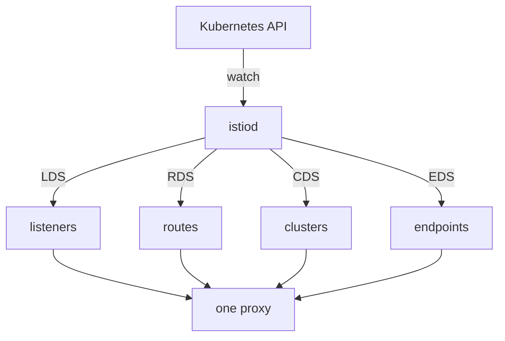

# How Mission Control Sends Orders

Astronaut, a communications officer with no orders would drop every signal. Yet the shuttle could already reach cargo before you wrote a single Istio object. Somebody had already given every proxy its orders: mission control, `istiod`. This part shows what mission control knows, how it sends the orders, and how to check that every ship received them.

## Mission control and its star chart

`istiod` is the Istio control plane: one Deployment in the `istio-system` namespace. It does three jobs. It watches Kubernetes, it turns what it sees into orders for Envoy, and it hands out the certificates that ships use to prove who they are.

What it watches is called the **service registry**: Istio's picture of everything that can be called in the mesh. Think of it as mission control's star chart: every planet and beacon it knows how to reach. On a plain Kubernetes installation the star chart is built from:

- **Services**: each one becomes a destination with a name and a port.
- **EndpointSlices**: the pod addresses behind each Service.
- **Pods**: their labels, their ports, and which node and zone they run in.
- **Istio's own objects**, such as `VirtualService`, `DestinationRule` and `ServiceEntry`, which add rules and extra destinations Kubernetes does not know about.

The star chart is the list of names. Your Istio objects are rules written *about* those names. That is why a rule for a name that is not on the star chart is accepted and does nothing.

## xDS: four kinds of orders on one channel

`istiod` does not write files into pods, and it never restarts anything. It keeps a live connection open to every proxy and sends the orders over it. The family of Envoy interfaces it uses is called **xDS** (the x Discovery Services). Picture mission control radioing new orders to every ship while it is in flight: no ship has to land.

There is one interface per kind of order. Their short names show up in command output, so learn them now:

| Short name | Long name | What it carries |
| --- | --- | --- |
| **LDS** | Listener Discovery Service | the ports and addresses the proxy accepts signals on |
| **RDS** | Route Discovery Service | the rules that choose a destination |
| **CDS** | Cluster Discovery Service | the named destinations themselves |
| **EDS** | Endpoint Discovery Service | the pod addresses behind each destination |



`istiod` watches Services, EndpointSlices, pods and Istio objects through the Kubernetes API, builds one picture of the mesh, and sends each proxy its orders on these four channels. Everything a proxy holds arrived on one of them.

Because the orders travel over a live connection, a new object reaches the proxies within seconds, and nothing restarts. It also means that `kubectl apply` finishing is **not** proof that a proxy has your change. `kubectl apply` returns when Kubernetes has stored the object, not when Envoy has it. Mission control writing the orders down is not the same as the ship hearing them.

<!-- astrona:playground:renew -->

### Is every proxy connected?

List every proxy that mission control is talking to:

```sh
istioctl proxy-status
```

You should see one row per proxy:

```text
NAME                                     CLUSTER        ISTIOD                     VERSION     SUBSCRIBED TYPES
bridge-v1-bc4dc4fcc-vqnrp.starfleet      Kubernetes     istiod-995fd9df6-lqdbg     1.30.5      4 (CDS,LDS,EDS,RDS)
cargo-v1-6f787f8bd5-hv62g.starfleet      Kubernetes     istiod-995fd9df6-lqdbg     1.30.5      4 (CDS,LDS,EDS,RDS)
navcom-v1-7467bbc689-lg8xb.starfleet     Kubernetes     istiod-995fd9df6-lqdbg     1.30.5      4 (CDS,LDS,EDS,RDS)
probe-v1-7888d6c6d5-hvrtl.starfleet      Kubernetes     istiod-995fd9df6-lqdbg     1.30.5      4 (CDS,LDS,EDS,RDS)
probe-v2-58767cc46-x9qq9.starfleet       Kubernetes     istiod-995fd9df6-lqdbg     1.30.5      4 (CDS,LDS,EDS,RDS)
scout-v1-85bf65868-s745c.starfleet       Kubernetes     istiod-995fd9df6-lqdbg     1.30.5      4 (CDS,LDS,EDS,RDS)
scout-v2-866c98b568-tjdv5.starfleet      Kubernetes     istiod-995fd9df6-lqdbg     1.30.5      4 (CDS,LDS,EDS,RDS)
scout-v3-668c6dfc68-hvfxm.starfleet      Kubernetes     istiod-995fd9df6-lqdbg     1.30.5      4 (CDS,LDS,EDS,RDS)
shuttle-7b5db664c-zsftm.starfleet        Kubernetes     istiod-995fd9df6-lqdbg     1.30.5      4 (CDS,LDS,EDS,RDS)
```

Each row is one ship that is connected to mission control: which `istiod` it talks to, the proxy's version, and the four kinds of orders it receives. Two ways to read it:

- A ship that should be in the mesh and is **missing** from this list is not connected. Look at injection or at the proxy itself.
- A proxy whose `VERSION` differs from the others is usually a ship left behind after an upgrade.

The drifter is not in the list at all. It has no communications officer, so mission control has nobody to talk to.

### Did one ship get exactly what mission control sent?

Name one proxy, and `proxy-status` compares what `istiod` last sent with what that proxy confirmed. First find the shuttle's pod name:

```sh
kubectl -n starfleet get pod -l app=shuttle -o jsonpath='{.items[0].metadata.name}{"\n"}'
```

```text
shuttle-7b5db664c-zsftm
```

Then ask about that proxy (use your own pod name, followed by `.starfleet`):

```sh
istioctl proxy-status shuttle-7b5db664c-zsftm.starfleet
```

You should see:

```text
Clusters Match
Listeners Match
Routes Match (RDS last loaded at Thu, 08 Oct 2026 21:58:46 CEST)
```

Three `Match` lines mean the proxy holds exactly what mission control believes it sent. Anything other than `Match` answers the question "my object is correct, so why is nothing happening?".

## Common pitfalls

> [!WARNING]
> - **Treating `kubectl apply` as proof.** It stores the object. A separate push delivers it to the proxies. `istioctl proxy-status` shows the second step.
> - **Expecting a rule for an unknown name to fail.** If the name is not on the star chart, the rule is accepted and does nothing.
> - **Looking for a ship without a proxy in `proxy-status`.** Only ships with a communications officer are listed.

> *Mission control watches Kubernetes, draws one star chart, and radios every communications officer its orders on four channels: listeners, routes, clusters and endpoints.*
