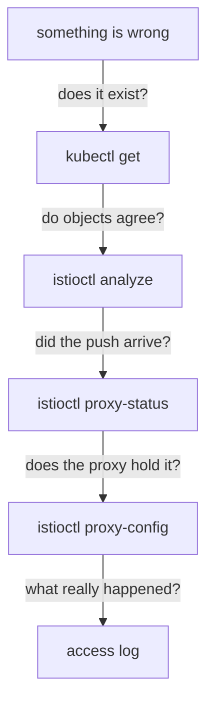

# The Diagnostic Toolkit

Istio's characteristic failure is not an error message. It is an object that exists, validates, and changes nothing — or changes something you did not intend. Nothing crashes, nothing logs a stack trace, and `kubectl get` shows everything present and correct.

Astronaut, this part is your fault-finding checklist: the set of commands that turn that silence into a sentence. It is short, it is the same four or five commands every time, and the order matters more than the commands do.

## The one habit

> An object existing in Kubernetes and a proxy acting on it are two different facts.

Almost every confusing hour in this domain comes from assuming the first implies the second. It does not, and there are several ordinary reasons why: the object is in the wrong namespace, its host does not resolve to anything, a `Sidecar` scoped the host away, the push has not landed, or the object is correct and something else takes precedence.

The toolkit is a ladder, like a pre-flight checklist. Start at the top and stop at the first rung that disagrees with you.



Each rung answers a different question, and skipping to the bottom is the usual mistake — reading access logs to diagnose an object that was never in the right namespace.

## `istioctl analyze` — do the objects agree?

Kubernetes validates one object against its schema. It cannot tell you that a `VirtualService` names a subset no `DestinationRule` defines, because that is a relationship between two objects. `istioctl analyze` runs Istio's own cross-object analysers over a namespace and reports what it finds with a stable `IST####` code.

> [!TIP]
> **Try it — what clean looks like**
>
> ```sh
> istioctl analyze -n mesh-demo
> ```
>
> Expect something like:
>
> ```text
> ✔ No validation issues found when analyzing namespace: mesh-demo.
> ```
>
> Worth running now, on a namespace with no Istio objects at all, so the clean result is familiar before you have something to break. From section 010 onward this command catches the single most common configuration error in the domain.

Know its limits as precisely as its strengths. `analyze` checks references between objects. It does **not** check that a label selector matches a real pod, that your rules are in a sensible order, or that the behaviour you configured is the behaviour you wanted. A clean `analyze` is necessary and nowhere near sufficient.

## `istioctl x describe pod` — what applies to this workload?

The `proxy-config` commands dump configuration. `istioctl experimental describe pod` — `x` is the short form of `experimental` — goes the other way: it takes one pod (one spaceship) and summarises everything the mesh is currently applying to it, in prose.

> [!TIP]
> **Try it — the mesh's own summary of a workload**
>
> ```sh
> istioctl x describe pod -n mesh-demo "$(kubectl -n mesh-demo get pod -l app=api -o jsonpath='{.items[0].metadata.name}')"
> ```
>
> Expect something like:
>
> ```text
> Pod: api-f9b4665f4-8ng5p
>    Pod Revision: default
>    Pod Ports: 8080 (api)
> --------------------
> Service: api
>    Port: http 80/HTTP targets pod port 8080
> --------------------
> Effective PeerAuthentication:
>    Workload mTLS mode: PERMISSIVE
> ```
>
> The exact sections depend on what exists; with no Istio objects yet there is little to report. The value is that it answers "what applies *here*" — once `VirtualService`, `DestinationRule` and policy objects exist, this is the one command that gathers them per workload instead of per object.

`PERMISSIVE` in that output is the install default: the workload accepts both mTLS and plain traffic. That is why the uninjected `legacy` pod in Part 1 could call `api` at all.

## `istioctl proxy-config` — what does the proxy hold?

This is the workhorse. Read it as **proxy** + **configuration**: it asks one communications officer to read back the orders they are holding right now, and the subcommand chooses which of the four layers from Part 2:

| Subcommand | Layer | Answers |
| --- | --- | --- |
| `listener` | LDS | is anything accepting traffic on this port? |
| `routes` | RDS | did my `VirtualService` arrive, and on which virtual host? |
| `cluster` | CDS | did my `DestinationRule` or `ServiceEntry` arrive? |
| `endpoints` | EDS | is this destination selecting any pods? |
| `secret` | SDS | does this workload have its certificates? |
| `bootstrap` | — | the static configuration the proxy started with |

You name a workload rather than a pod IP — `deploy/web -n mesh-demo` means "the Envoy inside that Deployment's pod". Add `-o json` when the table hides a detail; add `--fqdn`, `--port`, `--subset` or `--name` to make the output readable on a busy proxy.

There is no separate command for "show me everything", and you do not want one: the layered structure is what makes the answer findable.

## Response flags — the access log's one-word diagnosis

When a request fails, the proxy records **why** in a short flag field, early in the access log line, just after the HTTP status. The access log is the ship's black box flight log, and the response flag is the short code for what went wrong. It is the highest-information token in the whole log and it is easy to skim past.

| Flag | Meaning | Usually means |
| --- | --- | --- |
| `-` | no flag | nothing went wrong at the proxy layer |
| `NR` | No Route | the request matched no route — wrong host, or no rule matched |
| `UH` | No healthy Upstream | the cluster exists and has no usable endpoints |
| `NC` | No Cluster | a rule points at a subset or host the proxy has no cluster for, usually a missing `DestinationRule` subset |
| `UF` | Upstream connection Failure | the proxy could not connect to the endpoint it chose |
| `UO` | Upstream Overflow | a circuit breaker limit was hit — section 040 |
| `URX` | Upstream Retry eXceeded | the retry budget ran out — section 040 |
| `DC` | Downstream Connection termination | the caller hung up first |

`NR`, `NC` and `UH` explain most of the unexplained failures in this course, and they point at different halves of your setup. `NR` arrives as a **404**: no rule matched, so it is a routing problem. `NC` and `UH` arrive as a **503**: a rule matched, but its destination is missing (`NC`) or has no usable pods (`UH`). Reading the flag decides which half of your configuration to look at before you look at anything.

Break something deliberately to see one. Scaling `api` to zero replicas leaves the Service, the cluster and the route in place and removes only the endpoints behind them.

> [!TIP]
> **Try it — a 503 that names its own cause**
>
> ```sh
> kubectl -n mesh-demo scale deploy/api --replicas=0
> kubectl -n mesh-demo rollout status deploy/api --timeout=60s
> kubectl -n mesh-demo exec deploy/web -- curl -s -o /dev/null -w '%{http_code}\n' http://api/
> sleep 1
> kubectl -n mesh-demo logs deploy/web -c istio-proxy --tail=1
> istioctl proxy-config endpoints deploy/web -n mesh-demo \
>   --cluster "outbound|80||api.mesh-demo.svc.cluster.local"
> kubectl -n mesh-demo scale deploy/api --replicas=1
> ```
>
> Expect something like:
>
> ```text
> 503
> [2026-09-29T18:19:17.972Z] "GET / HTTP/1.1" 503 UH no_healthy_upstream - "delayed_connect_error:_Connection_refused" … outbound|80||api.mesh-demo.svc.cluster.local …
> ENDPOINT     STATUS     OUTLIER CHECK     CLUSTER
> ```
>
> `UH` in the log, `no_healthy_upstream` spelled out beside it, and a header row with nothing under it — the same fact seen three times: the destination is known and empty. Compare that with a wrong hostname, which produces `NR` and never reaches a cluster at all. The last line restores the Deployment.

## Where each tool stops

Knowing what a tool cannot see is what stops you trusting a clean result:

```text
 kubectl get          the object exists. Says nothing about whether it applies.
 istioctl analyze     objects reference each other correctly. Does NOT check
                        that selectors match real pods, or that order is sane.
 istioctl proxy-status the push landed. Says nothing about what was in it.
 istioctl proxy-config the proxy holds this. Says nothing about what it did
                        with a particular request.
 the access log       what happened to one real request. The final word, and
                        the only one that is evidence rather than intent.
```

Run them in that order and each one narrows the search. Run them out of order and you will read a lot of correct output while the problem sits one rung above.

## Common pitfalls

> [!WARNING]
> **Diagnosing from the server side.** Routing, retries, timeouts and load balancing are decided by the *caller's* proxy. Point `proxy-config` at the workload that made the request.
>
> **Trusting a clean `istioctl analyze`.** It checks references between objects, not that your labels select anything or that your rules are ordered sensibly.
>
> **Skipping straight to the access log.** If the object is in the wrong namespace, the log will faithfully show you nothing unusual.
>
> **Ignoring the response flag.** A bare 404 or 503 tells you little. `NR` (404) points at your routing rules, while `NC` and `UH` (503) point at the destination. Read the flag before you change anything.
>
> **Forgetting that `x` is `experimental`.** `istioctl x describe` is genuinely useful and genuinely subject to change between versions; do not build scripts on its output format.

> *Object exists, objects agree, push landed, proxy holds it, request survived it — five questions, in that order, and the first "no" is your answer.*
