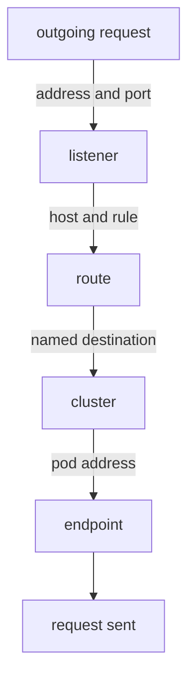

# Read Listeners, Routes, Clusters And Endpoints

The four kinds of configuration that `istiod` sends are not a loose pile. They form a chain, and every request passes down that chain one step at a time. Learn the chain once, and every diagnostic command becomes a question about one of its steps.

This part follows one request, from the `shuttle` pod to the `probe` Service on port `8000`, through all four steps. It ends with how much configuration a single proxy holds.

## The four layers a request passes through

Envoy matches every outgoing request against four layers, in order. Each layer answers one question:



The diagram shows the order: the listener comes first, then the route, the cluster and the endpoint.

A **listener** accepts the connection by address and port. A **route** picks a destination by the host name that the request asked for. A **cluster** is that destination: a named group of endpoints. An **endpoint** is the pod address the request finally goes to. When behaviour is wrong, read the chain from the top. The first layer that does not hold what you expect is where the problem is.

For a request from `shuttle` to `http://probe:8000/`, the chain looks like this:

```text
 LISTENER   0.0.0.0:8000                   accepts outgoing connections on port 8000
 ROUTE      route table "8000"             the virtual host for "probe"
 CLUSTER    outbound|8000||probe.starfleet…   the destination that entry points at
 ENDPOINT   10.244.0.13:8080               a probe pod, with its container port
```

Notice that the port changes in the last line. The cluster is named after the **Service** port (`8000`), and the endpoint uses the **container** port (`8080`). This is normal, and it confuses almost everybody the first time.

## Read each layer in the shuttle proxy

`istioctl proxy-config` reads the configuration that one proxy holds right now, one layer at a time. You name the workload, for example `deploy/shuttle -n starfleet`, and pick the layer with a subcommand: `listener`, `routes`, `cluster` or `endpoints`.

### Layer 1: the listener

<!-- astrona:playground:renew -->

Ask the `shuttle` proxy which listener accepts port `8000`:

```sh
istioctl proxy-config listener deploy/shuttle -n starfleet --port 8000
```

You should see:

```text
ADDRESSES PORT MATCH                                DESTINATION
0.0.0.0   8000 Trans: raw_buffer; App: http/1.1,h2c Route: 8000
0.0.0.0   8000 ALL                                  PassthroughCluster
```

The proxy accepts port `8000` on any address. When the traffic is HTTP, the listener hands it to the route table called `8000`, the next layer down. The second row is the fallback: any traffic on port `8000` that is not HTTP goes to `PassthroughCluster`. This is a built-in cluster that forwards the bytes to their original address without reading them.

This listener does not exist for the `probe` Service alone. Every Service on port `8000` shares it, and the next layer chooses between them by host name.

### Layer 2: the route table

Ask for the route table that the listener pointed to:

```sh
istioctl proxy-config routes deploy/shuttle -n starfleet --name 8000
```

You should see:

```text
NAME     VHOST NAME                                 DOMAINS                                                   MATCH     VIRTUAL SERVICE
8000     probe.starfleet.svc.cluster.local:8000     probe.starfleet.svc.cluster.local., probe + 2 more...     /*
```

The route table holds one **virtual host** per Service on this port. A virtual host is an entry for one host, with the names that lead to it and the rules for it. `DOMAINS` lists every name a client could use for the host: the short name `probe`, the full name, and more. `MATCH` is `/*` because this entry accepts every path.

The `VIRTUAL SERVICE` column is **empty**. `istiod` built this entry from the Service alone, and none of your objects is attached to it. When you write a `VirtualService` (an Istio object with routing rules for a host), its name appears in this column. This makes the column the quickest way to check that your `VirtualService` reached the host you meant.

### Layers 3 and 4: the cluster and its endpoints

A **cluster** is Envoy's word for a named destination: a name, a load balancing setting, and a list of endpoints. It has nothing to do with a Kubernetes cluster. The two meanings will always clash, so read "cluster" in proxy output as "destination".

Cluster names have a fixed shape:

```text
outbound | 8000 | v2 | probe.starfleet.svc.cluster.local
   │        │     │     └── the full host name
   │        │     └──────── the subset name: EMPTY when there is no subset
   │        └────────────── the port, as the SERVICE defines it
   └─────────────────────── direction: outbound (this proxy calling) or inbound (being called)
```

A **subset** is a named group of a Service's pods, selected by labels, for example `version: v2`. There are no subsets yet, so the subset field is empty. It shows as `||` in the name and as `-` in the `SUBSET` column.

Ask for the `probe` cluster, and then for the endpoints inside it:

```sh
istioctl proxy-config cluster deploy/shuttle -n starfleet --fqdn probe.starfleet.svc.cluster.local
istioctl proxy-config endpoints deploy/shuttle -n starfleet \
  --cluster "outbound|8000||probe.starfleet.svc.cluster.local"
```

You should see:

```text
SERVICE FQDN                          PORT     SUBSET     DIRECTION     TYPE     DESTINATION RULE
probe.starfleet.svc.cluster.local     8000     -          outbound      EDS
ENDPOINT             STATUS      OUTLIER CHECK     CLUSTER
10.244.0.13:8080     HEALTHY     OK                outbound|8000||probe.starfleet.svc.cluster.local
10.244.0.14:8080     HEALTHY     OK                outbound|8000||probe.starfleet.svc.cluster.local
```

The cluster carries port `8000`, and its two endpoints, the `probe-v1` and `probe-v2` pods, use port `8080`. `TYPE: EDS` means the endpoint list arrives separately, over EDS (Endpoint Discovery Service). That is why adding or removing `probe` pods changes the endpoint list without changing the cluster. The empty `DESTINATION RULE` column is where a `DestinationRule` (an Istio object with policies for a destination) appears once you write one.

## Every proxy holds configuration for every Service

By default, `istiod` does not work out which Services a workload actually calls. It sends every proxy the configuration for **every** Service in the mesh, in every namespace. So a proxy holds the whole service registry, even if its workload only ever calls one Service.

To see this, count the clusters that the `shuttle` proxy holds:

```sh
istioctl proxy-config cluster deploy/shuttle -n starfleet | wc -l
```

You should see something like:

```text
      20
```

The exact number depends on what else runs in the cluster, so treat it as an example, not a target. It is far more than the few Services that `shuttle` ever calls.

You can now follow a request through the listener, route, cluster and endpoint of a proxy, read each layer with `istioctl proxy-config`, and read a cluster name. You also know that each proxy holds configuration for the whole mesh. What is still open is how to use these commands in a fixed order when something goes wrong.

## Common pitfalls

> [!WARNING]
> - **Reading "cluster" as "Kubernetes cluster".** In proxy output it means one named destination inside one proxy.
> - **Expecting the cluster port and the endpoint port to match.** The cluster carries the Service port, the endpoint the container port. They differ by design.
> - **Reading an empty `VIRTUAL SERVICE` column as a problem.** It only means that no `VirtualService` is attached to that host yet.
> - **Assuming a proxy only knows the Services it calls.** By default it knows every Service in the mesh.
