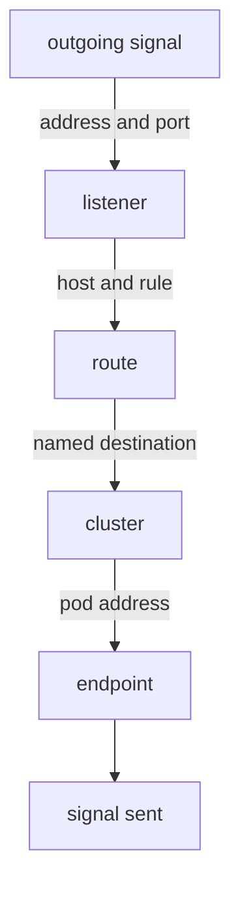

# Read The Proxy's Orders Layer By Layer

Astronaut, the four kinds of orders mission control sends are not a loose pile. They form a chain, and every signal walks down that chain one step at a time. Learn the chain once, and every diagnostic command in this course becomes a question about one of its steps.

This part follows one signal, from the shuttle to the probe on port `8000`, through all four steps, and ends with how much a single proxy carries.

## The chain a signal walks down

A signal entering the proxy is matched against the four layers in order. Each layer answers one question:



The **listener** catches the signal by port. The **route** picks a destination by the beacon name the signal asked for. The **cluster** is that destination. The **endpoint** is the pod address the signal finally goes to. When behaviour is wrong, read the chain from the top: the first layer that does not hold what you expect is where the problem is.

For a signal from the shuttle to `http://probe:8000/`, the chain looks like this:

```text
 LISTENER   0.0.0.0:8000                   catches outgoing signals on port 8000
 ROUTE      route table "8000"             the entry for the beacon "probe"
 CLUSTER    outbound|8000||probe.starfleet…   the destination that entry points at
 ENDPOINT   10.244.0.13:8080               a probe pod, with its container port
```

Notice that the port changes in the last line. The cluster is named after the **Service** port (`8000`), and the endpoint uses the **container** port (`8080`). That is normal, and it catches everybody out once.

<!-- astrona:playground:renew -->

### Layer 1: the listener

Ask the shuttle's proxy which listener catches port `8000`:

```sh
istioctl proxy-config listener deploy/shuttle -n starfleet --port 8000
```

You should see:

```text
ADDRESSES PORT MATCH                                DESTINATION
0.0.0.0   8000 Trans: raw_buffer; App: http/1.1,h2c Route: 8000
0.0.0.0   8000 ALL                                  PassthroughCluster
```

The proxy catches port `8000` on any address. When the signal is HTTP, it hands it to the route table called `8000`, the next layer down. The second row is the fallback: anything on port `8000` that is not HTTP goes to `PassthroughCluster`, which forwards the bytes to their original address without reading them.

This listener is not made for the probe alone. Every Service on port `8000` shares it, and the choice between them happens one layer down, by name.

### Layer 2: the route table

Ask for the route table that the listener pointed to:

```sh
istioctl proxy-config routes deploy/shuttle -n starfleet --name 8000
```

You should see:

```text
NAME     VHOST NAME                                 DOMAINS                                                   MATCH     VIRTUAL SERVICE
8000     probe.starfleet.svc.cluster.local:8000     probe.starfleet.svc.cluster.local., probe + 2 more...     /*
```

There is one entry, a **virtual host**, per beacon on this port. `DOMAINS` lists every name a sender could use for it: the short name `probe`, the full name, and more. `MATCH` is `/*` because this entry accepts every path.

The `VIRTUAL SERVICE` column is **empty**. Mission control built this entry from the Service alone, and none of your objects is attached to it. When you write a `VirtualService` for a beacon, its name shows up in this column. That makes this column the quickest way to check that your flight plan landed where you meant.

### Layers 3 and 4: the cluster and its endpoints

A **cluster** is Envoy's word for a named destination: a name, a way to spread signals over pods, and a list of endpoints. It has nothing to do with a Kubernetes cluster (the whole solar system). The two meanings will always clash, so read "cluster" in proxy output as "destination".

Cluster names have a fixed shape:

```text
outbound | 8000 | v2 | probe.starfleet.svc.cluster.local
   │        │     │     └── the full host name
   │        │     └──────── the subset name: EMPTY when there is no subset
   │        └────────────── the port, as the SERVICE defines it
   └─────────────────────── direction: outbound (this proxy calling) or inbound (being called)
```

Here there are no subsets yet, so the subset field is empty. It shows as `||` in the name and as `-` in the `SUBSET` column.

Ask for the probe's cluster, and then the endpoints inside it:

```sh
istioctl proxy-config cluster deploy/shuttle -n starfleet --fqdn probe.starfleet.svc.cluster.local
istioctl proxy-config endpoints deploy/shuttle -n starfleet \
  --cluster "outbound|8000||probe.starfleet.svc.cluster.local"
```

You should see:

```text
SERVICE FQDN                          PORT     SUBSET     DIRECTION     TYPE     DESTINATION RULE
probe.starfleet.svc.cluster.local     8000     -          outbound      EDS
ENDPOINT             STATUS      OUTLIER CHECK     CLUSTER
10.244.0.13:8080     HEALTHY     OK                outbound|8000||probe.starfleet.svc.cluster.local
10.244.0.14:8080     HEALTHY     OK                outbound|8000||probe.starfleet.svc.cluster.local
```

The cluster carries port `8000`, and its two endpoints, `probe-v1` and `probe-v2`, use port `8080`. `TYPE: EDS` means the endpoint list arrives separately, over EDS (Endpoint Discovery Service). That is why adding or removing probe pods changes the second listing without touching the first. The empty `DESTINATION RULE` column is where a `DestinationRule` would show up once you write one.

## Every proxy carries the whole star chart

By default, mission control does not work out which services a ship actually calls. It sends every proxy the orders for **every** Service in the mesh, on every planet. Every ship carries the full star chart of the solar system, even if it only ever signals one beacon.

### Count what one proxy carries

Count the destinations the shuttle's proxy holds:

```sh
istioctl proxy-config cluster deploy/shuttle -n starfleet | wc -l
```

You should see something like:

```text
      20
```

The exact number depends on what else runs in the solar system; it is an example, not a target. What matters is that it is far more than the few beacons the shuttle ever calls.

## Common pitfalls

> [!WARNING]
> - **Reading "cluster" as "Kubernetes cluster".** In proxy output it means one named destination inside one proxy.
> - **Expecting the cluster port and the endpoint port to match.** The cluster carries the Service port, the endpoint the container port. They differ by design.
> - **Reading an empty `VIRTUAL SERVICE` column as a problem.** It means no `VirtualService` is attached to that beacon yet.
> - **Assuming a proxy only knows what it calls.** By default it knows every Service in the mesh.

> *Listener, route, cluster, endpoint: every signal walks down these four layers, and every "why is this not working" question is a question about which layer surprised you.*
