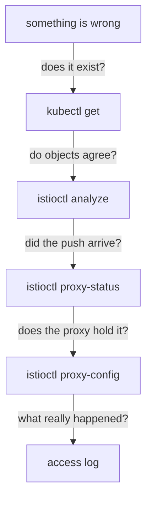

# Diagnose The Mesh With istioctl And Access Logs

Istio rarely fails with an error message. More often, an object exists, is valid, and changes nothing, or changes something you did not intend. Nothing crashes, and `kubectl get` shows every object in place.

This part gives you a short list of commands that find the cause in that situation. You use the same few commands every time, and the order you run them in matters more than the commands themselves.

## Check in a fixed order

One habit makes Istio problems much easier to find:

> An object existing in Kubernetes and a proxy acting on it are two different facts.

Most hours lost with Istio come from assuming that the first fact means the second. It does not, for simple reasons: the object is in the wrong namespace, its host name points at nothing, `istiod` has not pushed it yet, or another rule takes priority.

So run the checks in a fixed order. Start at the top, and stop at the first step that does not show what you expect.



The diagram shows the order of the checks, from `kubectl get` at the top to the access log at the bottom, with the question each step answers on the arrow.

Each step answers a different question. The usual mistake is to jump straight to the bottom and read access logs to debug an object that is in the wrong namespace.

## istioctl analyze: do the objects agree?

Kubernetes checks each object on its own. It cannot tell you that a `VirtualService` names a subset that no `DestinationRule` defines, because that is a link between two objects. `istioctl analyze` runs Istio's own checks across the objects in a namespace. It reports each problem with a fixed code, such as `IST0101`.

<!-- astrona:playground:renew -->

Run it on the `starfleet` namespace, which has no Istio objects yet:

```sh
istioctl analyze -n starfleet
```

You should see:

```text
✔ No validation issues found when analyzing namespace: starfleet.
```

Learn what a clean result looks like now, before you have something to break.

Know the limits of `istioctl analyze` as well as its strengths. It checks links between objects. It does **not** check that a label selects a real pod, that your rules are in a sensible order, or that the behaviour you configured is the behaviour you wanted. A clean result is a good start, not a proof.

## istioctl x describe pod: what applies to one pod?

The `istioctl proxy-config` commands print raw proxy configuration. `istioctl x describe pod` works the other way around: it takes one pod and sums up, in plain text, everything the mesh applies to it. The `x` is short for `experimental`.

Ask what the mesh applies to the `cargo` pod:

```sh
istioctl x describe pod -n starfleet "$(kubectl -n starfleet get pod -l app=cargo -o jsonpath='{.items[0].metadata.name}')"
```

You should see:

```text
Pod: cargo-v1-6f787f8bd5-hv62g
   Pod Revision: default
   Pod Ports: 9080 (cargo)
--------------------
Service: cargo
   Port: http 9080/HTTP targets pod port 9080
--------------------
Effective PeerAuthentication:
   Workload mTLS mode: PERMISSIVE
Skipping Gateway information (no ingress gateway pods)
```

With no Istio objects yet, there is little to report. The command becomes more useful once `VirtualService` and `DestinationRule` objects exist: it is the one command that gathers everything that applies to *one* pod.

The output also shows the mTLS mode. **mTLS** (mutual Transport Layer Security) is encryption where both sides of a connection present a certificate. `PERMISSIVE` is the default: the pod accepts both mTLS and plain text connections. That is why the `drifter` pod, which has no sidecar proxy and sends plain text, could still reach `cargo`.

## istioctl proxy-config: what does the proxy hold?

`istioctl proxy-config` is the command you will use most. It asks one sidecar proxy to print the configuration it holds right now. The subcommand chooses the layer:

| Subcommand | Layer | Answers |
| --- | --- | --- |
| `listener` | LDS | does the proxy accept connections on this port? |
| `routes` | RDS | did my `VirtualService` arrive, and for which host? |
| `cluster` | CDS | did my `DestinationRule` or `ServiceEntry` arrive? |
| `endpoints` | EDS | does this destination have any pods? |
| `secret` | SDS | does this proxy have its certificates? |
| `bootstrap` | none | the fixed settings the proxy started with |

**SDS** is the Secret Discovery Service, the xDS API that `istiod` uses to deliver certificates. LDS, RDS, CDS and EDS are the Listener, Route, Cluster and Endpoint Discovery Services. You name a workload, not a pod address: `deploy/shuttle -n starfleet` means "the Envoy inside the pod of that Deployment". Add `-o json` when the table hides a detail. Add `--fqdn`, `--port`, `--subset` or `--name` to keep the output short on a busy proxy.

## Response flags in the access log

When a request fails, Envoy writes the reason into its access log as a short code right after the status code. That code is the **response flag**, and it is the most useful part of the whole line:

| Flag | Meaning | Usually means |
| --- | --- | --- |
| `-` | no flag | nothing went wrong at the proxy |
| `NR` | No Route | the request matched no route: wrong host, or no rule fitted |
| `NC` | No Cluster | a rule points at a destination the proxy has no cluster for, usually a missing subset |
| `UH` | No healthy Upstream | the cluster exists, but has no usable pods |
| `UF` | Upstream connection Failure | the proxy could not connect to the pod it chose |
| `UO` | Upstream Overflow | a circuit breaker limit was hit |
| `URX` | Upstream Retry eXceeded | the retries ran out |
| `DC` | Downstream Connection termination | the client closed the connection first |

`NR`, `NC` and `UH` explain most unclear failures, and they point at different halves of your setup. `NR` comes back as a **`404`**: no rule fitted, so look at your routing. `NC` and `UH` come back as a **`503`**: a rule fitted, but its destination is missing (`NC`) or has no usable pods (`UH`). Read the flag before you change anything.

## Cause a 503 UH on purpose

The best way to learn a flag is to cause it. Scale the `cargo` Deployment down to zero pods. The Service, the cluster and the route all stay; only the pods behind them disappear:

```sh
kubectl -n starfleet scale deploy/cargo-v1 --replicas=0
kubectl -n starfleet rollout status deploy/cargo-v1 --timeout=60s
```

```text
deployment.apps/cargo-v1 scaled
deployment "cargo-v1" successfully rolled out
```

Now send a request from `shuttle` to `cargo`:

```sh
kubectl -n starfleet exec deploy/shuttle -- curl -s -o /dev/null -w '%{http_code}\n' http://cargo:9080/details/0
```

```text
503
```

Wait a second, then read the `shuttle` access log and the endpoints of the `cargo` cluster:

```sh
kubectl -n starfleet logs deploy/shuttle -c istio-proxy --tail=1
istioctl proxy-config endpoints deploy/shuttle -n starfleet \
  --cluster "outbound|9080||cargo.starfleet.svc.cluster.local"
```

You should see:

```text
[2026-10-08T20:00:09.510Z] "GET /details/0 HTTP/1.1" 503 UH no_healthy_upstream - "-" 0 19 5 - "-" "curl/8.11.1" "79a0ccde-46b7-44e5-862e-cf3616398551" "cargo:9080" "-" outbound|9080||cargo.starfleet.svc.cluster.local - 10.96.239.41:9080 10.244.0.12:53434 - default
ENDPOINT     STATUS     OUTLIER CHECK     CLUSTER
```

These are three views of the same fact. The flag says `UH`, with `no_healthy_upstream` spelled out next to it. The upstream address, the pod the proxy chose, is `"-"`: there was no pod to choose. And the endpoint list has a header with nothing under it. The proxy knows the destination, and the destination is empty.

Bring `cargo` back:

```sh
kubectl -n starfleet scale deploy/cargo-v1 --replicas=1
```

```text
deployment.apps/cargo-v1 scaled
```

## What each tool cannot see

Knowing what a tool cannot see stops you from trusting a clean result too much:

| Tool | What it proves | What it does not prove |
| --- | --- | --- |
| `kubectl get` | the object exists | that it applies to anything |
| `istioctl analyze` | objects point at each other correctly | that labels match real pods, or that the rule order is sensible |
| `istioctl proxy-status` | the proxy is connected and holds what `istiod` sent | what that configuration contains |
| `istioctl proxy-config` | the proxy holds this configuration | what it did with one particular request |
| access log | what happened to one real request | nothing more: it is the final evidence, not the intent |

Run them in that order, and each one narrows the search.

You now have a fixed order of checks, from `kubectl get` to the access log, and you can read the response flag that tells a routing problem (`NR`) from a destination problem (`NC`, `UH`). You have also seen a `503 UH` appear when a Service has no pods. The open question in a real failure is always the same: which check is the first one that disagrees with what you expect?

## Common pitfalls

> [!WARNING]
> - **Debugging from the server side.** The *client's* proxy decides routing, retries, timeouts and load balancing. Point `istioctl proxy-config` at the pod that sent the request.
> - **Trusting a clean `istioctl analyze`.** It checks links between objects, not that your labels select anything or that your rules are in a sensible order.
> - **Jumping straight to the access log.** If the object is in the wrong namespace, the log shows nothing unusual.
> - **Ignoring the response flag.** A bare `404` or `503` tells you little. `NR` (404) points at your routing, `NC` and `UH` (503) at the destination.
> - **Building scripts on `istioctl x describe`.** The `x` means experimental: its output can change between versions.

## Your mission: Fix A Service Selector That Matches No Pod Lab

You can now walk the checks from `kubectl get` to the access log and read a response flag. In the lab, the `bridge` page can no longer reach `cargo`, nothing reports an error, and you must find the cause and fix it.

The lab runs in its own cluster, so first pause your playground. Nothing in it is lost:

```sh
astrona stop ats-014-playground-000-01
```

Then start the lab:

```sh
astrona run --git git@github.com:astrona-io/ATS014.git -c sections/section-000/module-01/labs/lab-02
```

The task is on the next page. Solve it on your own first. When you think you are done, send it for grading:

```sh
astrona submit -c sections/section-000/module-01/labs/lab-02
```

When the lab is done, remove it and start your playground again:

```sh
astrona destroy ats-014-lab-000-01-02
astrona start ats-014-playground-000-01
```
