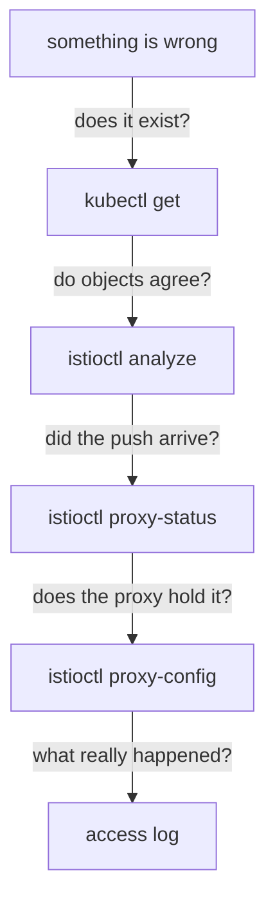

# The Diagnostic Toolkit

Astronaut, Istio rarely fails with an error message. It fails with an object that exists, is valid, and changes nothing, or changes something you did not intend. Nothing crashes, and `kubectl get` shows everything present and correct.

This part is your fault-finding checklist: a few commands that turn that silence into an answer. It is the same handful of commands every time, and the order you run them in matters more than the commands themselves.

## The one habit

> An object existing in Kubernetes and a proxy acting on it are two different facts.

Most confusing hours with Istio come from assuming the first means the second. It does not, for ordinary reasons: the object is on the wrong planet, its name points at nothing, the push has not arrived yet, or something else takes priority.

So use the toolkit like a pre-flight checklist. Start at the top, and stop at the first step that disagrees with what you expect.



Each step answers a different question. The usual mistake is to jump straight to the bottom, and read flight logs to debug an object that was never on the right planet.

## `istioctl analyze`: do the objects agree?

Kubernetes checks each object on its own. It cannot tell you that a `VirtualService` names a subset that no `DestinationRule` defines, because that is a link between two objects. `istioctl analyze` runs Istio's own checks across objects on a planet, and reports each problem with a fixed code like `IST0101`.

<!-- astrona:playground:renew -->

### See what a clean result looks like

Run it on your `starfleet` planet, which has no Istio objects yet:

```sh
istioctl analyze -n starfleet
```

You should see:

```text
✔ No validation issues found when analyzing namespace: starfleet.
```

Get to know the clean result now, before you have something to break.

Know its limits as well as its strengths. `analyze` checks links between objects. It does **not** check that a label selects a real pod, that your rules are in a sensible order, or that the behaviour you configured is the behaviour you wanted. A clean `analyze` is a good start, not a proof.

## `istioctl x describe pod`: what applies to this ship?

The `proxy-config` commands dump orders. `istioctl x describe pod` works the other way around: it takes one pod (one spaceship) and sums up everything the mesh applies to it, in plain text. The `x` is short for `experimental`.

### Describe the cargo ship

Ask the mesh what it applies to the cargo pod:

```sh
istioctl x describe pod -n starfleet "$(kubectl -n starfleet get pod -l app=cargo -o jsonpath='{.items[0].metadata.name}')"
```

You should see:

```text
Pod: cargo-v1-6f787f8bd5-hv62g
   Pod Revision: default
   Pod Ports: 9080 (cargo)
--------------------
Service: cargo
   Port: http 9080/HTTP targets pod port 9080
--------------------
Effective PeerAuthentication:
   Workload mTLS mode: PERMISSIVE
Skipping Gateway information (no ingress gateway pods)
```

With no Istio objects yet, there is little to report. Its value grows later: once flight plans and docking instructions exist, this is the one command that gathers everything that applies to *one* ship.

`PERMISSIVE` is the default: the ship accepts both encrypted mTLS (mutual Transport Layer Security) signals and plain ones. That is why the drifter, with no communications officer, could still reach cargo.

## `istioctl proxy-config`: what does the proxy hold?

This is the workhorse. It asks one communications officer to read back the orders it holds right now. The subcommand chooses the layer:

| Subcommand | Layer | Answers |
| --- | --- | --- |
| `listener` | LDS | is anything accepting signals on this port? |
| `routes` | RDS | did my `VirtualService` arrive, and on which beacon? |
| `cluster` | CDS | did my `DestinationRule` or `ServiceEntry` arrive? |
| `endpoints` | EDS | does this destination have any pods? |
| `secret` | SDS | does this ship have its certificates? |
| `bootstrap` | none | the fixed settings the proxy started with |

SDS is the Secret Discovery Service, the fifth channel mission control uses, for certificates. You name a workload, not a pod address: `deploy/shuttle -n starfleet` means "the Envoy inside that Deployment's pod". Add `-o json` when the table hides a detail, and `--fqdn`, `--port`, `--subset` or `--name` to keep the output short on a busy proxy.

## Response flags: the flight log's short diagnosis

When a signal fails, the proxy writes **why** into its flight log, as a short code right after the status code. That code is the **response flag**, and it is the most useful part of the whole line:

| Flag | Meaning | Usually means |
| --- | --- | --- |
| `-` | no flag | nothing went wrong at the proxy |
| `NR` | No Route | the signal matched no route: wrong host, or no rule fitted |
| `NC` | No Cluster | a rule points at a destination the proxy has no cluster for, usually a missing subset |
| `UH` | No healthy Upstream | the cluster exists, but has no usable pods |
| `UF` | Upstream connection Failure | the proxy could not connect to the pod it chose |
| `UO` | Upstream Overflow | a circuit breaker limit was hit |
| `URX` | Upstream Retry eXceeded | the retries ran out |
| `DC` | Downstream Connection termination | the sender hung up first |

`NR`, `NC` and `UH` explain most mystery failures, and they point at different halves of your setup. `NR` arrives as a **`404`**: no rule fitted, so look at your routing. `NC` and `UH` arrive as a **`503`**: a rule fitted, but its destination is missing (`NC`) or has no usable pods (`UH`). Read the flag before you change anything.

### Break a beacon on purpose

Scale cargo down to zero ships. The Service, the cluster and the route all stay; only the pods behind them disappear:

```sh
kubectl -n starfleet scale deploy/cargo-v1 --replicas=0
kubectl -n starfleet rollout status deploy/cargo-v1 --timeout=60s
```

```text
deployment.apps/cargo-v1 scaled
deployment "cargo-v1" successfully rolled out
```

Now send a signal from the shuttle to cargo:

```sh
kubectl -n starfleet exec deploy/shuttle -- curl -s -o /dev/null -w '%{http_code}\n' http://cargo:9080/details/0
```

```text
503
```

Wait a second, then read the shuttle's flight log and the cargo cluster's endpoints:

```sh
kubectl -n starfleet logs deploy/shuttle -c istio-proxy --tail=1
istioctl proxy-config endpoints deploy/shuttle -n starfleet \
  --cluster "outbound|9080||cargo.starfleet.svc.cluster.local"
```

You should see:

```text
[2026-10-08T20:00:09.510Z] "GET /details/0 HTTP/1.1" 503 UH no_healthy_upstream - "-" 0 19 5 - "-" "curl/8.11.1" "79a0ccde-46b7-44e5-862e-cf3616398551" "cargo:9080" "-" outbound|9080||cargo.starfleet.svc.cluster.local - 10.96.239.41:9080 10.244.0.12:53434 - default
ENDPOINT     STATUS     OUTLIER CHECK     CLUSTER
```

Three views of the same fact. The flag says `UH`, with `no_healthy_upstream` spelled out next to it. The chosen ship is `"-"`: there was nobody to choose. And the endpoint listing has a header with nothing under it. The destination is known, and it is empty.

Bring cargo back:

```sh
kubectl -n starfleet scale deploy/cargo-v1 --replicas=1
```

```text
deployment.apps/cargo-v1 scaled
```

## Where each tool stops

Knowing what a tool cannot see is what stops you trusting a clean result:

```text
 kubectl get           the object exists. Says nothing about whether it applies.
 istioctl analyze      objects point at each other correctly. Does NOT check that
                         labels match real pods, or that the order is sensible.
 istioctl proxy-status the proxy is connected and holds what was sent. Says
                         nothing about what was in it.
 istioctl proxy-config the proxy holds these orders. Says nothing about what it
                         did with one particular signal.
 the flight log        what happened to one real signal. The final word, and the
                         only one that is evidence rather than intent.
```

Run them in that order, and each one narrows the search.

## Common pitfalls

> [!WARNING]
> - **Debugging from the receiving side.** Routing, retries, timeouts and load balancing are decided by the *sender's* proxy. Point `proxy-config` at the ship that sent the signal.
> - **Trusting a clean `istioctl analyze`.** It checks links between objects, not that your labels select anything or that your rules are in a sensible order.
> - **Jumping straight to the flight log.** If the object is on the wrong planet, the log will show you nothing unusual.
> - **Ignoring the response flag.** A bare `404` or `503` tells you little. `NR` (404) points at your routing, `NC` and `UH` (503) at the destination.
> - **Building scripts on `istioctl x describe`.** The `x` means experimental: its output can change between versions.

> *Object exists, objects agree, push arrived, proxy holds it, signal survived it: five questions, in that order, and the first "no" is your answer.*

## Your mission: Find The Missing Supply Ship

You can now walk the checklist from `kubectl get` to the flight log, and read a response flag. Now prove it in a graded mission: the bridge can no longer reach its supply ship, nothing reports an error, and you have to find out why and fix it.

The mission runs in its own training solar system, so first pause your playground. Nothing in it is lost:

```sh
astrona stop ats-014-playground-000-01
```

Then start the mission:

```sh
astrona run --git git@github.com:astrona-io/ATS014.git -c sections/section-000/module-01/labs/lab-02
```

Read the task in [`question.md`](./labs/lab-02/question.md) and solve it on your own first. When you think you are done, send it for grading:

```sh
astrona submit -c sections/section-000/module-01/labs/lab-02
```

When the mission is done, remove it and wake your playground up again:

```sh
astrona destroy ats-014-lab-000-01-02
astrona start ats-014-playground-000-01
```
