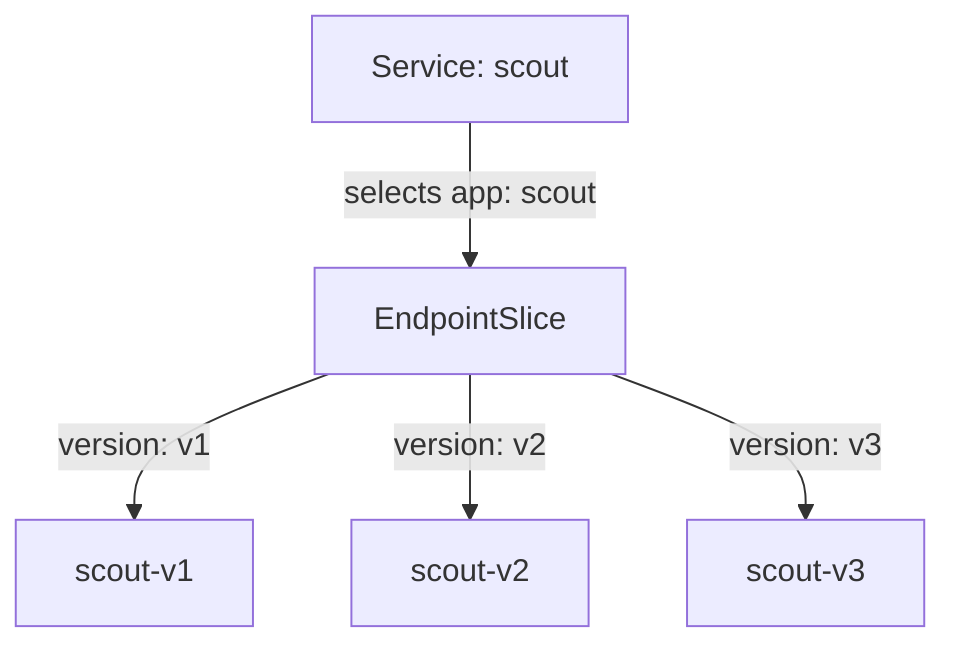

# See Where Requests Go Without Routing Rules

Before you change where requests go, find out where they go right now. With no Istio routing rules, the `scout` Service already delivers every request. But it cannot choose *which* version of `scout` gets the request. And the pod that does the choosing is not the one most people expect: it is the pod that sends the request.

This part shows both facts in your playground. Together they explain most routing surprises you will meet with Istio.

## What the Service already does

Plain Kubernetes already sends requests to the `scout` pods. What it cannot do is choose a pod by version. This section shows that gap clearly, because the rest of the module fills it.

### One Service, three versions

A Kubernetes **Service** gives a group of pods one name and one virtual IP address. It picks its pods with a label selector. The `scout` Service selects every pod with the label `app=scout`.

All three `scout` versions (v1, v2 and v3) carry that label. So all three receive requests sent to `scout`.

Kubernetes keeps the list of matching pods in an object called an **EndpointSlice**. An **endpoint** is one pod address: an IP address and a port. Istio uses the word "endpoint" for the same thing.



The diagram shows that the Service holds a selector, not addresses, and the EndpointSlice lists the three pods that match it. Each pod also has its own `version` label (`version=v1`, `v2` or `v3`).

### The version label is not used yet

The Service ignores the `version` label. For now, Istio ignores it too.

Without Istio, a Kubernetes component called **`kube-proxy`** picks one of the pods for each new connection. `kube-proxy` sees only an IP address and a port. It cannot read a URL path or an HTTP header. So it cannot do "send *my* requests to v2 and everyone else's to v1".

### See it in your playground

The `shuttle` pod is a test client in the mesh. You send test requests from it with `curl`. Paste this helper into your terminal first. It sends 10 requests from `shuttle` to `scout` and counts which version answered each one:

<!-- astrona:playground:renew -->

```sh
count_versions() { for i in $(seq 1 10); do
  kubectl exec -n starfleet deploy/shuttle -- curl -s "$@" | grep -o 'scout-v[0-9]' || echo none
done | sort | uniq -c; }
SCOUT=http://scout:9080/reviews
```

Now run it against the path `/reviews/0`:

```sh
count_versions $SCOUT/0
```

You get a mix of all three versions. One run gave:

```text
   2 scout-v1
   4 scout-v2
   4 scout-v3
```

Run it again and the numbers change, but all three versions keep answering. The Service only looks at `app=scout`, and every `scout` pod has that label. Right now you have no way to say "only v2". The rest of the module adds that.

After every routing change, run `count_versions` again. If the mix did not change, your rule has not reached the proxy of `shuttle` yet, or it does not match the request.

## The client's proxy makes the decision

In the mesh, Istio adds a **sidecar proxy** (Envoy) to every pod. It is a proxy container in the pod, and all inbound and outbound traffic of the pod passes through it. Every request leaves through the sidecar proxy of the pod that **sends** it. That proxy picks the destination pod before the request leaves.

The sidecar proxy in the receiving pod does not choose anything. It only passes the request to the application container in its own pod.

In your playground, the client is `shuttle`. That is why the commands in this module look at `deploy/shuttle`, the client, and not at `scout`. The next three steps prove it.

### The client's proxy knows every scout pod

First, list the `scout` pods and their IP addresses:

```sh
kubectl get pods -n starfleet -l 'app in (shuttle,scout)' -o wide
```

```text
NAME                       IP
scout-v1-85bf65868-vjbgc   10.244.0.8
scout-v2-866c98b568-dwfgc  10.244.0.10
scout-v3-668c6dfc68-m724r  10.244.0.11
shuttle-7b5db664c-lcz4p    10.244.0.9
```

The output is shortened to the name and IP columns. Your pod names and addresses will be different.

Now ask the sidecar proxy of `shuttle` which `scout` endpoints it knows. The command `istioctl proxy-config endpoints` prints the endpoints a proxy holds, and `--cluster` limits it to one destination:

```sh
istioctl proxy-config endpoints deploy/shuttle -n starfleet \
  --cluster "outbound|9080||scout.starfleet.svc.cluster.local"
```

```text
ENDPOINT             STATUS      OUTLIER CHECK     CLUSTER
10.244.0.10:9080     HEALTHY     OK                outbound|9080||scout.starfleet.svc.cluster.local
10.244.0.11:9080     HEALTHY     OK                outbound|9080||scout.starfleet.svc.cluster.local
10.244.0.8:9080      HEALTHY     OK                outbound|9080||scout.starfleet.svc.cluster.local
```

The proxy of `shuttle` holds the addresses of all three `scout` pods. `istiod`, Istio's control plane, sent them there. `istiod` builds the configuration for every proxy and sends it to them. Whichever pod gets a request, the proxy of `shuttle` picks it from this list.

### The client's proxy logs its choice

Send one request, then read the last line of the access log of the `shuttle` proxy. The **access log** is one line per request that the proxy writes in the `istio-proxy` container's log:

```sh
kubectl exec -n starfleet deploy/shuttle -- curl -s -o /dev/null -w "%{http_code}\n" http://scout:9080/reviews/0
kubectl logs -n starfleet deploy/shuttle -c istio-proxy --tail=1
```

```text
200
[2026-10-08T16:47:14.958Z] "GET /reviews/0 HTTP/1.1" 200 - via_upstream - "-" 0 436 393 392 "-" "curl/8.11.1" "778e16ae-638a-4271-affd-266cde10aa9a" "scout:9080" "10.244.0.11:9080" outbound|9080||scout.starfleet.svc.cluster.local 10.244.0.9:56974 10.96.155.93:9080 10.244.0.9:42666 - default
```

Two fields in that line matter here:

- `"10.244.0.11:9080"` is the pod the proxy of `shuttle` **chose**. In the pod list above, that is `scout-v3`.
- `outbound|9080||scout.starfleet.svc.cluster.local` is the cluster it chose from. In Envoy, a **cluster** is a named group of endpoints. This one has no subset name between the two `|` signs, so any of the three pods could have been picked.

### The server's proxy only accepts it

The chosen pod, `scout-v3`, logs the same request from its side:

```sh
kubectl logs -n starfleet deploy/scout-v3 -c istio-proxy --tail=1
```

```text
[2026-10-08T16:47:14.961Z] "GET /reviews/0 HTTP/1.1" 200 - via_upstream - "-" 0 436 388 387 "-" "curl/8.11.1" "778e16ae-638a-4271-affd-266cde10aa9a" "scout:9080" "10.244.0.11:9080" inbound|9080|| 127.0.0.6:35251 10.244.0.11:9080 10.244.0.9:56974 outbound_.9080_._.scout.starfleet.svc.cluster.local default
```

It is the same request: the request ID `778e16ae-…` is identical in both lines. But this side says `inbound|9080||`. The proxy of `scout-v3` did not choose anything. It accepted a request that the proxy of `shuttle` had already sent to it.

> [!TIP]
> When the wrong version answers, do not debug the pod that answered. Check the proxy of the pod that **sent** the request: `istioctl proxy-config ... deploy/<client>`. That is where the choice was made.

## What you know now

A Service selects pods by one label and cannot read a request. In the mesh, the sidecar proxy of the client holds every endpoint of the destination and picks one for each request. The server's proxy only accepts it. The open question is how to tell the client's proxy which version to pick. Istio needs two objects for that, and the first one names the versions.

## Common pitfalls

> [!WARNING]
> - **Expecting the Service to read the `version` label.** A Service only looks at its selector, here `app=scout`. Every pod with that label receives requests, whatever its version.
> - **Debugging the pod that answered.** The sidecar proxy of the pod that *sent* the request made the choice. Point your `istioctl proxy-config` and `kubectl logs` commands at the client, here `deploy/shuttle`.
> - **Trusting one run of `count_versions`.** Ten requests give a random mix. Run it a few times before you decide what the split is.
