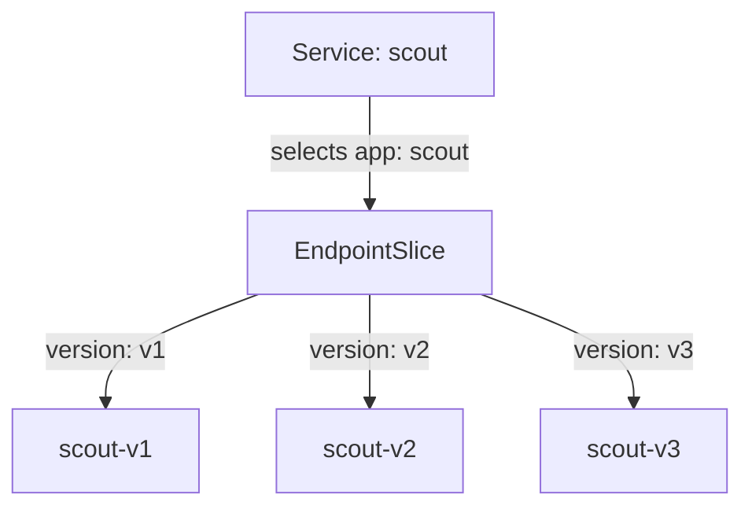
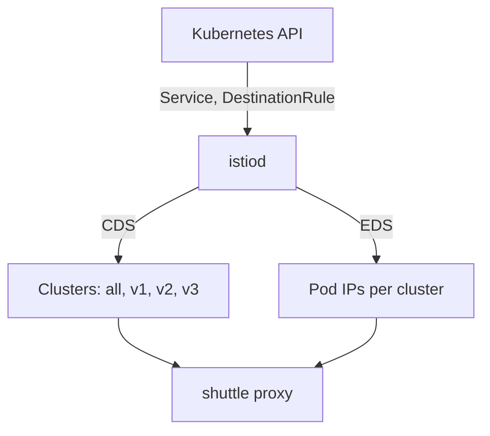

# Subsets And The Destination Vocabulary

Astronaut, before you can send a signal to "v2", something has to say what `v2` means. In this part, that is the job of a `DestinationRule`.

One fact surprises almost everyone. A correct `DestinationRule` on its own moves **no traffic at all**. It only creates names. This part shows what those names are made of, what Istio builds from them, and why a name that points at no ship is not an error.

## What the Service already does

Before you give Istio any orders, look at what already works without it. Plain Kubernetes already sends your signals to the scout ships. What it cannot do is choose *which* ship gets a signal. That gap is exactly what the rest of this part fills, so it pays to see it clearly first.

### One beacon, three ship classes

Start with the playground as it comes. The `scout` Service is a beacon: one call sign that a group of ships answers to. It picks its ships (pods) with one label, `app=scout`.

All three scout versions carry that label. So all three answer the same call sign.

Kubernetes keeps the list of matching pods in an object called an **EndpointSlice**. An **endpoint** is one pod address: an IP and a port. Istio uses the same word for the same thing.



The Service listens on port 9080 and selects every pod with `app=scout`. It holds a selector, not the addresses: Kubernetes keeps the EndpointSlice next to it current. Each pod also carries its own version label (`version=v1`, `v2` or `v3`).

### The second label nobody uses yet

Each pod also carries a second label, `version`. The Service ignores it. For now, Istio ignores it too.

Without Istio, a component called `kube-proxy` picks one of the pods for each new connection. It sees only an IP address and a port, like a radio that hears a signal but cannot read it. It cannot see a URL or a header. So it cannot do "send *my* signals to v2".

### See it in your playground

Send 10 signals from the shuttle to the scout beacon, and count which ship class answered each one:

```sh
count_versions $SCOUT/0
```

You get a mix of all three versions. One run gave:

```text
   2 scout-v1
   4 scout-v2
   4 scout-v3
```

Run it again and the numbers change, but all three versions keep answering. The Service only looks at `app=scout`, and every scout ship carries that label. You have no way yet to say "only v2, please". That is the problem this module solves.

> [!TIP]
> Keep this command and its output in mind. After every routing change in this module, run `count_versions` again. If the mix did not change, your rule has not reached the shuttle's proxy yet, or it does not match the signal.

## The decision happens in the caller

Every signal leaves through the communications officer (the sidecar proxy) of the ship that **sends** it. That officer makes the routing decision, before the signal leaves the ship. The proxy in the receiving ship only hands the signal to its crew (the app).

In your playground, the sender is the `shuttle`. So the commands below look at `deploy/shuttle`, the *client*, and not at `scout`.

Remember this when the wrong version answers. The proxy that chose it lives in the pod that asked.

## From Service to cluster: what mission control builds

The Service is a Kubernetes object, but the shuttle's communications officer never reads it directly. Mission control turns it into orders the proxy understands. Here you see what those orders look like, so you can later read them back and check them.

### Two of the four channels

`istiod` is mission control. It watches Kubernetes and sends each proxy its orders over four channels, together called **xDS**. Two of them matter here:

- **CDS** (cluster discovery service) carries the list of **clusters**. A cluster is a named destination the proxy can send to.
- **EDS** (endpoint discovery service) carries the endpoints, the pod addresses, inside each cluster.

A `DestinationRule` changes what goes out on both channels.



`istiod` (mission control) reads the Service, the EndpointSlice and the `DestinationRule` from the Kubernetes API. Over CDS it sends the shuttle's proxy one cluster per host, port and subset, and over EDS the pod addresses for each. So the proxy ends up with four destinations: all of `scout`, `v1`, `v2` and `v3`. One Service becomes several named destinations, each with its own filtered list of pods. That is the whole trick behind subsets.

### One cluster becomes four

Without a `DestinationRule`, the proxy has exactly one cluster for `scout`. It holds every ready pod.

A `DestinationRule` with three subsets adds three more clusters. They have the same host and the same port, but different pod filters. The original cluster stays.

## The subset field in a cluster name

Every cluster has a four-part name. The third part is the subset:

```text
outbound | 9080 | v2 | scout.starfleet.svc.cluster.local
                  └── the subset name. Empty until a DestinationRule defines one.
```

The other parts are simple. `outbound` means "a destination this proxy can call". `9080` is the **Service** port. The last part is the full name of the Service.

`outbound|9080||scout.starfleet.svc.cluster.local`, with nothing between the middle bars, is the cluster without a subset. It existed before you wrote anything, and it stays afterwards. `istioctl proxy-config clusters` shows that empty field as `-` in its `SUBSET` column.

## The `DestinationRule` object

Now you give the ship classes their names. This section shows the object that does it, field by field, and what changes in the proxy the moment you apply it.

### Docking instructions for one beacon

A `DestinationRule` is the **docking instructions** for one beacon. It says which ship classes answer the beacon, and how to approach them. Each subset is a **ship class**: the same model and call sign, a different build.

This is the rule for `scout`. You also find it in the playground, in the `examples/01-request-routing/` folder:

```yaml
apiVersion: networking.istio.io/v1
kind: DestinationRule
metadata:
  name: scout
  namespace: starfleet
spec:
  host: scout
  subsets:
  - name: v1
    labels:
      version: v1
  - name: v2
    labels:
      version: v2
  - name: v3
    labels:
      version: v3
```

Read it like this: *for the host `scout`, the word `v1` means the pods labelled `version: v1`.*

### Two fields that are easy to mix up

```text
 metadata.name        the object's name. You choose it. Nothing routes by it.
 metadata.namespace   where the object lives. Short host names are filled in from this.
 spec.host            the SERVICE this rule is about. A host name, not an object name.
 subsets[].name       the word a VirtualService will ask for later.
 subsets[].labels     pod labels. They decide which pods land in the subset.
```

Naming the object after its Service is a good habit, because it keeps things easy to find. But only `spec.host` does the work.

### Three facts to remember

- **The subset name is your choice.** `v1` is only a habit. `stable`, `canary` or `blue` work just as well. Nothing checks the name against the `version` label.
- **The labels match pods, not Services.** That is why the scout pods carry a `version` label that the Service ignores.
- **A subset that matches no pod is not an error.** It becomes a cluster with no endpoints. Nothing rejects it and nothing warns you. Signals sent there fail later with a `503`.

Keep **one `DestinationRule` per host**. Two objects for the same host give results that are hard to predict.

A `DestinationRule` is really a policy that the sending proxy applies to one host. Subsets are the part this module uses. The same object also holds settings for load balancing, connection limits and taking failing pods out of service.

## The labels are pod labels

Two separate selections run over the same pods:

```text
 Service.spec.selector       app=scout       → is this pod behind the Service?
 DestinationRule subset      version=v1        → of those pods, which ones are "v1"?
```

They do not depend on each other:

- A pod labelled `version: v1` but without `app=scout` is in no scout cluster at all.
- A pod with `app=scout` but no `version` label is in the cluster without a subset, but in no subset.

> [!TIP]
> **Try it: see the labels a subset will use**
>
> ```sh
> kubectl get pods -n starfleet -l app=scout --show-labels
> ```
>
> You see three ships, each `2/2` (the app plus its `istio-proxy`). Trimmed to the parts that matter:
>
> ```text
> NAME                        READY   STATUS    LABELS
> scout-v1-85bf65868-pjdcp    2/2     Running   app=scout,...,version=v1
> scout-v2-866c98b568-vh8zp   2/2     Running   app=scout,...,version=v2
> scout-v3-668c6dfc68-lsl4b   2/2     Running   app=scout,...,version=v3
> ```
>
> `app=scout` decides Service membership. `version` decides subset membership.

## Watching the clusters appear

You can apply the `DestinationRule` and watch what it builds, without changing any traffic. This is the clearest proof that subsets are names, not behaviour. The cluster list grows, and the traffic does not move.

Predict the result first: more clusters, and the same random mix of versions.

> [!TIP]
> **Try it: new clusters, no change in traffic**
>
> ```sh
> cat > destinationrule-scout.yaml <<'EOF'
> apiVersion: networking.istio.io/v1
> kind: DestinationRule
> metadata:
>   name: scout
>   namespace: starfleet
> spec:
>   host: scout
>   subsets:
>   - name: v1
>     labels:
>       version: v1
>   - name: v2
>     labels:
>       version: v2
>   - name: v3
>     labels:
>       version: v3
> EOF
> kubectl apply -f destinationrule-scout.yaml
> istioctl proxy-config clusters deploy/shuttle -n starfleet | grep scout
> count_versions $SCOUT/0
> ```
>
> You see:
>
> ```text
> destinationrule.networking.istio.io/scout created
> scout.starfleet.svc.cluster.local          9080      -          outbound      EDS              scout.starfleet
> scout.starfleet.svc.cluster.local          9080      v1         outbound      EDS              scout.starfleet
> scout.starfleet.svc.cluster.local          9080      v2         outbound      EDS              scout.starfleet
> scout.starfleet.svc.cluster.local          9080      v3         outbound      EDS              scout.starfleet
> ```
>
> and then a random mix of v1, v2 and v3 from `count_versions`. The `SUBSET` column (the third one) now has `-`, `v1`, `v2` and `v3`. The last column names the `DestinationRule` that built them. The traffic has not changed, because nothing *uses* the subsets yet.

Two details are worth keeping:

- `kubectl apply` returns when the object is stored, not when the proxy has it. If a listing still looks old, wait a second and run it again.
- The row with `-` did not go away. Signals that name no subset still have somewhere to go.

## Which pods landed in which cluster

`istioctl proxy-config endpoints` shows the pod list inside each cluster. It answers the question "does my subset actually select anything?". That question is behind most unexplained `503` errors in the next parts.

A cluster's full name is its ID, so `--cluster` takes the four-part string. Put it in quotes, so the shell does not read `|` as a pipe.

> [!TIP]
> **Try it: the pods behind one subset**
>
> ```sh
> istioctl proxy-config endpoints deploy/shuttle -n starfleet \
>   --cluster "outbound|9080|v2|scout.starfleet.svc.cluster.local"
> ```
>
> You see one row, the `scout-v2` pod (your IP address will differ):
>
> ```text
> ENDPOINT            STATUS      OUTLIER CHECK     CLUSTER
> 10.244.0.8:9080     HEALTHY     OK                outbound|9080|v2|scout.starfleet.svc.cluster.local
> ```
>
> The subset's labels picked one pod out of the Service's three.

`STATUS` is the proxy's own health view of the pod. `OUTLIER CHECK` says whether the proxy has taken the pod out of service for failing too often. Neither column tells you whether your labels were right. Only whether a row appears at all tells you that.

## When a subset selects nothing

This is the failure this part has been building up to. A subset whose labels match no pod is accepted everywhere. It becomes a cluster with an empty pod list. See it once on purpose, so you know it when it happens by accident.

This case needs a route that uses the subset. So it first applies the "all traffic to v1" `VirtualService`. Part 2 explains that object.

> [!TIP]
> **Try it: a subset that selects nothing (`503 UH`)**
>
> ```sh
> cat > virtualservice-scout.yaml <<'EOF'
> apiVersion: networking.istio.io/v1
> kind: VirtualService
> metadata:
>   name: scout
>   namespace: starfleet
> spec:
>   hosts:
>   - scout
>   http:
>   - route:
>     - destination:
>         host: scout
>         subset: v1
> EOF
> kubectl apply -f virtualservice-scout.yaml
> kubectl patch destinationrule scout -n starfleet --type merge -p '
> spec:
>   subsets:
>   - name: v1
>     labels:
>       version: v9
>   - name: v2
>     labels:
>       version: v2
>   - name: v3
>     labels:
>       version: v3'
> kubectl exec -n starfleet deploy/shuttle -- curl -s -o /dev/null -w "%{http_code}\n" $SCOUT/0
> kubectl logs -n starfleet deploy/shuttle -c istio-proxy --tail=1
> istioctl analyze -n starfleet
> ```
>
> You see (log line trimmed):
>
> ```text
> 503
> "GET /reviews/0 HTTP/1.1" 503 UH no_healthy_upstream ... outbound|9080|v1|scout.starfleet.svc.cluster.local
> Error [IST0173] (DestinationRule starfleet/scout) The Subset v1 defined in the DestinationRule does not select any pods. Which may lead to 503 UH (NoHealthyUpstream).
> ```
>
> If you still get `200`, or the log line is an older one, the new orders have not reached the communications officer yet. Wait a second and run the `curl` and `kubectl logs` lines again.
>
> The subset **exists**, so the `v1` cluster exists too: you can see it in the log line. But no pod has `version=v9`, so the cluster is empty. The flight log marks this with **`UH`**, "no healthy upstream". Put the correct rule back with `kubectl apply -f destinationrule-scout.yaml`.

## What `istioctl analyze` catches here

`istioctl analyze` runs Istio's own checks over the objects in a namespace. It also checks objects against each other, which plain YAML validation cannot do. You just saw one: `IST0173`, a subset that selects no pods.

The other check that matters in this module is `IST0101`: a `VirtualService` asks for a subset that no `DestinationRule` defines. Part 3 shows it.

Run it now, with the correct `DestinationRule` back in place, so you know what a clean result looks like:

```sh
istioctl analyze -n starfleet
```

```text
✔ No validation issues found when analyzing namespace: starfleet.
```

`analyze` is a quick first check. It does not prove the setup works. The endpoint listing above is still the surest way to see which pods a subset holds.

## Common pitfalls

> [!WARNING]
> - **Expecting a `DestinationRule` to move traffic.** It only defines names. If you applied one and the split did not change, it is working as designed.
> - **Mixing up `metadata.name` and `spec.host`.** Only `spec.host` decides which Service the rule is for.
> - **Treating subset labels as Service labels.** They match *pod* labels. A label only on the Deployment's own `metadata`, and not on the pod template, selects nothing.
> - **Checking too fast.** `kubectl apply` returns before mission control's new orders reach the proxy. A listing taken straight away can still show the old state.

> *A `DestinationRule` builds clusters, not behaviour. It names destinations so that something else can choose between them.*
