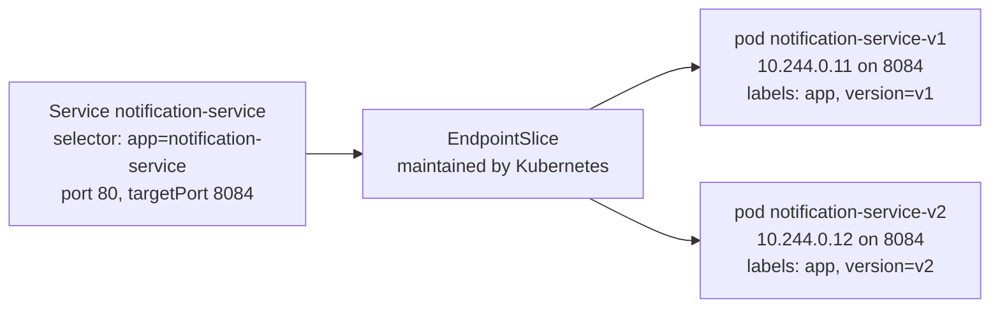
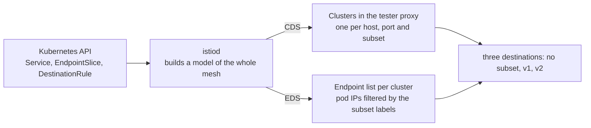

# Subsets And The Destination Vocabulary

> Prerequisite: [the module landing page](./course.md). Next: [Matching A Request](./course-02-matching-a-request.md).

Before Istio can send a request to "v2", something has to define what `v2` means. That is the `DestinationRule`'s entire job in this module, and it is worth its own part because of a property that surprises everyone the first time: applying a correct `DestinationRule` changes no traffic whatsoever. It creates vocabulary. This part settles what that vocabulary is made of, what the control plane builds out of it, and why a subset that matches nothing is not an error.

It assumes [section 000](../../section-000/module-01/course.md): that a proxy sits beside every pod, that `istiod` programs it over xDS, and that `istioctl proxy-config` prints what one currently holds. Everything below is about how a `DestinationRule` you write travels from `kubectl` through `istiod` into that proxy, and what it becomes when it lands.

## What the Service already does

Start from the state the playground hands you. The `notification-service` Service selects on `app: notification-service` and nothing else, so both the `v1` pod and the `v2` pod are endpoints of it.

"Endpoint" is Kubernetes' word, and it is worth being precise about it because Istio reuses the same word for the same thing. When you create a Service, Kubernetes continuously evaluates its `selector` against every pod in the namespace and records the addresses of the ready ones in an **EndpointSlice** object. That address list is the Service:



The Service does not hold the pod addresses itself: it holds a selector, and Kubernetes keeps the address list beside it.

Two things to notice, because both come back later. First, the addresses are **pod IPs and container ports** (`8084`), not the Service port (`80`) — the port number translates on the way in. Second, the pods also carry a `version` label, and the Service selector deliberately ignores it. Kubernetes has no opinion about `version`, and neither — yet — does Istio.

Without Istio, the choice between those two addresses belongs to `kube-proxy`, which load balances at the connection level. It sees an IP and a port. It cannot see a URL, a header or an HTTP method, because by the time it acts there is no HTTP yet — only a TCP connection being opened. That is the whole reason a plain Service cannot express "send *my* requests to v2".

> [!TIP]
> **Try it — the unconfigured baseline**
>
> ```sh
> kubectl -n routing-demo exec deploy/tester -- sh -c \
>   'for i in $(seq 1 20); do curl -s -X POST http://notification-service/notify; echo; done' | sort | uniq -c
> ```
>
> Expect something like:
>
> ```text
>   11 ["EMAIL"]
>    9 ["EMAIL","SMS"]
> ```
>
> The exact split varies run to run. `["EMAIL"]` is v1 and `["EMAIL","SMS"]` is v2 — two different answers from one Service name, with nothing you can do about which you get. That is the problem the module solves.

## The decision happens in the caller

One fact from foundations is worth repeating here, because every command in this module depends on it: **the routing decision is made by the caller's proxy, before the request leaves the calling pod.** The `tester` pod's own Envoy picks the destination and the endpoint; the receiving pod's Envoy only hands the request to nginx.

That is why every diagnostic command below names `deploy/tester` — the *client* — rather than the service being reached. If the wrong version answers, the proxy that chose it is in the pod that asked.

## From Service to cluster: what the control plane builds

Foundations covered the general pipeline: `istiod` watches Kubernetes, builds a model of the mesh, and pushes it to every proxy over the four xDS channels. What matters here is the specific thing a `DestinationRule` adds to it.

Two of those channels do the work. **CDS** carries the named destinations, and **EDS** carries the addresses behind each one. A `DestinationRule` changes what `istiod` puts on both:



One Service becomes several named destinations, and each destination gets its own filtered copy of the endpoint list — which is the whole trick subsets are built on.

Without any `DestinationRule` there is exactly one cluster for the Service, holding every ready endpoint. A `DestinationRule` with two subsets makes `istiod` build two *additional* clusters — same host, same port, different endpoint filters. The original stays; nothing is replaced.

## The subset field in a cluster name

Foundations introduced the four-field cluster name. This is the module where its third field stops being empty:

```text
outbound | 80 | v2 | notification-service.routing-demo.svc.cluster.local
                └── the subset name. Empty until a DestinationRule defines one.
```

`outbound|80||notification-service…`, with nothing between the middle pipes, is the subset-less cluster — the one that existed before you wrote anything and continues to exist afterwards. `istioctl proxy-config cluster` renders that same empty field as `-` in its `SUBSET` column, so one listing shows `-`, `v1` and `v2` once a two-subset rule is in place.

Two reminders from foundations that this module trips people on constantly: the port in the name is the **Service** port, while the endpoints behind it carry the **container** port; and `outbound` means this is a destination the proxy can call, which is why everything in this module is read from the caller's proxy.

## The `DestinationRule` object

```yaml
apiVersion: networking.istio.io/v1
kind: DestinationRule
metadata:
  name: notification-service
  namespace: routing-demo
spec:
  host: notification-service
  subsets:
    - name: v1
      labels:
        version: v1
    - name: v2
      labels:
        version: v2
```

Read it as: *for the host `notification-service`, the word `v1` means the endpoints labelled `version: v1`.*

Line by line, because two of these fields are routinely confused with each other:

```text
 metadata.name        the Kubernetes object's name. Arbitrary. Nothing routes by it.
 metadata.namespace   where the object lives — and what a short host name expands against.
 spec.host            the SERVICE this rule is about. A hostname, not an object name.
 subsets[].name       the vocabulary word a VirtualService will later ask for.
 subsets[].labels     pod labels. The filter that decides which endpoints land in the subset.
```

Naming the object the same as the Service, as above, is a convention that keeps things findable — but `spec.host` is what does the work. An object named `anything-at-all` with `spec.host: notification-service` behaves identically.

Three properties follow from the pipeline above:

- **The subset name is arbitrary.** `v1` and `v2` are convention. `stable`, `canary` and `blue` are equally valid; the name is a label for a cluster, not a reference to anything in Kubernetes. Nothing checks it against the `version` label — the fact that the subset called `v1` selects `version: v1` is your choice, repeated twice for readability.
- **The labels select over pods, not over Services.** They are matched against pod labels, which is why the pods in this playground carry a `version` label that the Service selector deliberately ignores.
- **A subset with no matching pods is not an error.** It produces a valid cluster with zero endpoints. Nothing rejects it, nothing warns; requests routed there fail at request time with 503. Istio validates that your YAML is well-formed, not that your labels match reality.

Keep **one `DestinationRule` per host**. Istio's behaviour when two objects name the same host has changed across versions and is not something to build on; a second object for a host that already has one is the kind of thing that works in your namespace and surprises someone else in theirs.

The general rule: **a `DestinationRule` is client-side policy for one host.** Everything in it is a decision the *calling* proxy makes about a destination — which is why it takes effect in the caller's Envoy, and why it needs no cooperation from the service being called. Subsets are the part this module uses; the same object is where load balancer settings, connection pool limits, outlier detection and TLS origination go in later sections.

## The labels are pod labels

This is the point where a mental model either forms correctly or causes trouble for the rest of the domain, so it is worth stating flatly. Two independent selections run over the same set of pods:

```text
 Service.spec.selector       app=notification-service        → decides Service membership
 DestinationRule subset      version=v1                      → decides subset membership
```

They are unrelated to each other. The Service selector answers "is this pod reachable under this name?" — the subset labels answer "of those, which ones does the word `v1` mean?". A subset does not have to be a subset of anything in particular; it is simply a label filter applied to whatever endpoints the Service already has. Label a pod `version: v1` without matching the Service selector and it is in no cluster at all; match the Service selector with no `version` label and the pod is reachable through the subset-less cluster but through neither subset.

> [!TIP]
> **Try it — confirm the labels a subset will select on**
>
> ```sh
> kubectl -n routing-demo get pods --show-labels
> ```
>
> Expect something like:
>
> ```text
> NAME                                       READY   STATUS    AGE   LABELS
> notification-service-v1-7d4c9b6f8d-x2mkq   2/2     Running   4m    app=notification-service,version=v1,...
> notification-service-v2-6f8b7c5d94-lq7rn   2/2     Running   4m    app=notification-service,version=v2,...
> tester-5c7d8f9b6c-8vzpl                    2/2     Running   4m    app=tester,...
> ```
>
> Both `app=` (Service membership) and `version=` (subset membership) are visible on the same pod, doing different jobs. `2/2` confirms each pod runs its application container plus the injected `istio-proxy` — the proxy that will hold the clusters you are about to create.

## Watching the clusters appear

Because the pipeline is observable, you can apply the `DestinationRule` and see exactly what it produced without sending a single request. This is the cleanest demonstration in the module that subsets are vocabulary rather than behaviour: the cluster list grows, and the traffic split does not move.

Predict the output before you run it. Three clusters where there was one, and a 50/50-ish split that looks exactly like the baseline.

> [!TIP]
> **Try it — two new clusters, zero change in behaviour**
>
> ```sh
> istioctl proxy-config cluster deploy/tester -n routing-demo | grep notification
> kubectl apply -f - <<'EOF'
> apiVersion: networking.istio.io/v1
> kind: DestinationRule
> metadata:
>   name: notification-service
>   namespace: routing-demo
> spec:
>   host: notification-service
>   subsets:
>     - name: v1
>       labels:
>         version: v1
>     - name: v2
>       labels:
>         version: v2
> EOF
> sleep 2
> istioctl proxy-config cluster deploy/tester -n routing-demo | grep notification
> kubectl -n routing-demo exec deploy/tester -- sh -c \
>   'for i in $(seq 1 20); do curl -s -X POST http://notification-service/notify; echo; done' | sort | uniq -c
> ```
>
> Expect something like:
>
> ```text
> notification-service.routing-demo.svc.cluster.local   80   -    outbound   EDS
> notification-service.routing-demo.svc.cluster.local   80   v1   outbound   EDS
> notification-service.routing-demo.svc.cluster.local   80   v2   outbound   EDS
>   10 ["EMAIL"]
>   10 ["EMAIL","SMS"]
> ```
>
> The `SUBSET` column goes from one `-` row to three rows. The response split is unchanged, because no rule has told anything to *use* those subsets. `EDS` in the last column is the discovery type: the proxy is told the endpoint list dynamically rather than holding fixed addresses.

Two details in that output are worth keeping. The `sleep 2` is there because the push is asynchronous — `kubectl apply` returns when the object is stored, not when Envoy has it. And the subset-less row did not disappear: requests that name no subset still have somewhere to go, which is what makes a default route possible in Part 3.

## Which endpoints landed in which cluster

One level further down, `proxy-config endpoints` shows the filtered endpoint list per cluster — the EDS half of the diagram. It is the command that answers "is my subset actually selecting anything?", which is the question behind most unexplained 503s in the next part.

Because a cluster's full name is its identifier, that is what `--cluster` takes: the four-field string, quoted so the shell does not treat `|` as a pipe.

> [!TIP]
> **Try it — the subset's endpoint list**
>
> ```sh
> istioctl proxy-config endpoints deploy/tester -n routing-demo \
>   --cluster "outbound|80|v2|notification-service.routing-demo.svc.cluster.local"
> ```
>
> Expect something like:
>
> ```text
> ENDPOINT             STATUS      OUTLIER CHECK     CLUSTER
> 10.244.0.12:8084     HEALTHY     OK                outbound|80|v2|notification-service.routing-demo.svc.cluster.local
> ```
>
> One endpoint — the `v2` pod, selected out of the Service's two by the subset's labels. The port is `8084`, the container port, even though the cluster is named `…|80|…`: the Service port lives in the cluster name and the container port in the endpoint.

`STATUS` is Envoy's own view of the endpoint from health checking, and `OUTLIER CHECK` is whether outlier detection has ejected it — a `DestinationRule` feature covered in a later section, hence `OK` here, meaning "not ejected". Neither column says anything about whether your labels were right. That is decided purely by whether a row appears at all.

Which gives the failure mode this part has been building towards. A subset whose labels match no pod is accepted by Kubernetes, accepted by Istio, pushed to every proxy, and produces a cluster with an empty endpoint list. Break it deliberately once, so the shape is familiar before Part 3 hands you a 503 with no explanation.

> [!TIP]
> **Try it — a subset that selects nothing**
>
> ```sh
> kubectl -n routing-demo patch destinationrule notification-service --type merge -p '
> spec:
>   subsets:
>     - name: v1
>       labels:
>         version: v1
>     - name: v2
>       labels:
>         version: v2-canary'
> sleep 2
> istioctl proxy-config endpoints deploy/tester -n routing-demo \
>   --cluster "outbound|80|v2|notification-service.routing-demo.svc.cluster.local"
> ```
>
> Expect something like:
>
> ```text
> ENDPOINT     STATUS     OUTLIER CHECK     CLUSTER
> ```
>
> The patch was accepted, the cluster still exists, and the command succeeds — with a header row and nothing under it. That empty list is what a "silently broken" subset looks like, and it is the difference between a configuration error you can see and a 503 you cannot explain. Re-apply the correct `DestinationRule` from the previous checkpoint before moving on.

## What `istioctl analyze` catches here

`istioctl analyze` runs Istio's own static analysers over the objects in a namespace — the same checks the control plane would apply, plus cross-object ones that YAML schema validation cannot express. In this module the one that matters is `ReferencedResourceNotFound`: a `VirtualService` naming a subset that no `DestinationRule` defines.

It is worth running now, while the namespace holds only a `DestinationRule`, so you know what a clean result looks like before Part 2 gives you something to break.

```sh
istioctl analyze -n routing-demo
```

```text
✔ No validation issues found when analyzing namespace: routing-demo.
```

Note what `analyze` does **not** check: whether a subset's labels match any pod. Zero endpoints is legal configuration, as the checkpoint above just demonstrated. The endpoint listing is the only thing that tells you.

## Common pitfalls

> [!WARNING]
> **Expecting a `DestinationRule` to move traffic.** It defines names. Applied alone it changes nothing, every time, by design. If you applied one and the split did not change, the configuration is working.
>
> **Confusing `metadata.name` with `spec.host`.** Only `spec.host` decides which Service the rule applies to. Matching names is a convention, not a mechanism.
>
> **Treating subset labels as Service labels.** They are matched against *pod* labels. A label that exists only on the Service object, or only on the Deployment's `metadata`, selects nothing — it must be on the pod template.
>

> **Checking too fast.** `kubectl apply` returns before the push lands. A `proxy-config` listing taken immediately can legitimately show the old state.

> *A `DestinationRule` builds clusters, not behaviour — it names destinations so that something else can choose between them.*

## Reference

- [DestinationRule API](https://istio.io/latest/docs/reference/config/networking/destination-rule/) — the full schema, including the `trafficPolicy` fields later sections fill in.
- [Traffic management concepts](https://istio.io/latest/docs/concepts/traffic-management/) — where subsets sit relative to the rest of the model.
- [Envoy cluster model](https://www.envoyproxy.io/docs/envoy/latest/intro/arch_overview/upstream/upstream) — what a cluster and an endpoint are in the proxy the mesh is made of.
- [Envoy xDS overview](https://www.envoyproxy.io/docs/envoy/latest/intro/arch_overview/operations/dynamic_configuration) — how LDS, RDS, CDS and EDS relate to each other.
- [Istio sidecar injection](https://istio.io/latest/docs/setup/additional-setup/sidecar-injection/) — how the `istio-proxy` container and its `iptables` rules get into a pod.
- `istioctl proxy-config cluster --help` — the filters (`--fqdn`, `--port`, `--subset`, `--direction`) that make the listing readable on a real cluster.
