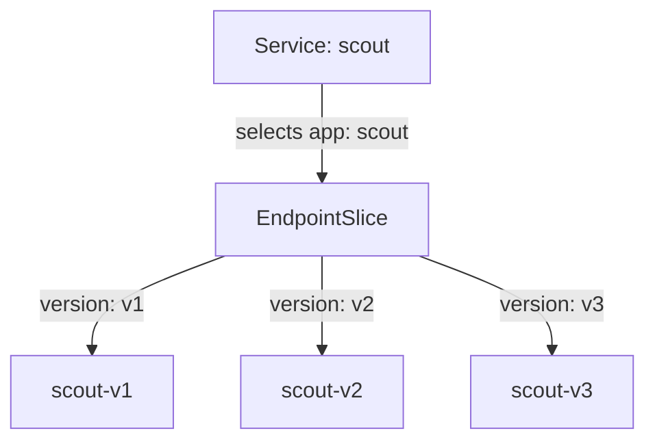

# Where Signals Go Today

Astronaut, before you change where signals go, find out where they go right now. Without any Istio rules, the scout beacon already delivers every signal, but it cannot pick *which* scout ship gets it. And when a ship does get picked, the choice is made in a place most people do not expect: the ship that sends the signal.

This part shows both facts in your own playground. Together they explain almost every routing surprise in this module.

## What the Service already does

Before you give Istio any orders, look at what already works without it. Plain Kubernetes already sends your signals to the scout ships. What it cannot do is choose *which* ship gets a signal. That gap is exactly what the rest of this part fills, so it pays to see it clearly first.

### One beacon, three ship classes

Start with the playground as it comes. The `scout` Service is a beacon: one call sign that a group of ships answers to. It picks its ships (pods) with one label, `app=scout`.

All three scout versions carry that label. So all three answer the same call sign.

Kubernetes keeps the list of matching pods in an object called an **EndpointSlice**. An **endpoint** is one pod address: an IP and a port. Istio uses the same word for the same thing.



The Service listens on port 9080 and selects every pod with `app=scout`. It holds a selector, not the addresses: Kubernetes keeps the EndpointSlice next to it current. Each pod also carries its own version label (`version=v1`, `v2` or `v3`).

### The second label nobody uses yet

Each pod also carries a second label, `version`. The Service ignores it. For now, Istio ignores it too.

Without Istio, a component called `kube-proxy` picks one of the pods for each new connection. It sees only an IP address and a port, like a radio that hears a signal but cannot read it. It cannot see a URL or a header. So it cannot do "send *my* signals to v2".

### See it in your playground

<!-- astrona:playground:renew -->

Send 10 signals from the shuttle to the scout beacon, and count which ship class answered each one:

```sh
count_versions $SCOUT/0
```

You get a mix of all three versions. One run gave:

```text
   2 scout-v1
   4 scout-v2
   4 scout-v3
```

Run it again and the numbers change, but all three versions keep answering. The Service only looks at `app=scout`, and every scout ship carries that label. You have no way yet to say "only v2, please". That is the problem this module solves.

> [!TIP]
> Keep this command and its output in mind. After every routing change in this module, run `count_versions` again. If the mix did not change, your rule has not reached the shuttle's proxy yet, or it does not match the signal.

## The decision happens in the caller

Every signal leaves through the communications officer (the sidecar proxy) of the ship that **sends** it. That officer picks the destination ship before the signal leaves. The communications officer on the receiving ship does not choose anything: it only hands the signal to its crew (the app).

In your playground, the sender is the `shuttle`. That is why the commands in this module look at `deploy/shuttle`, the *client*, and not at `scout`. You can see this for yourself in three steps.

### The shuttle already knows every scout ship

First, list the scout ships and their addresses:

```sh
kubectl get pods -n starfleet -l 'app in (shuttle,scout)' -o wide
```

```text
NAME                       IP
scout-v1-85bf65868-vjbgc   10.244.0.8
scout-v2-866c98b568-dwfgc  10.244.0.10
scout-v3-668c6dfc68-m724r  10.244.0.11
shuttle-7b5db664c-lcz4p    10.244.0.9
```

(Trimmed to the name and IP columns. Your pod names and addresses will be different.)

Now ask the shuttle's communications officer which scout ships it can send to:

```sh
istioctl proxy-config endpoints deploy/shuttle -n starfleet \
  --cluster "outbound|9080||scout.starfleet.svc.cluster.local"
```

```text
ENDPOINT             STATUS      OUTLIER CHECK     CLUSTER
10.244.0.10:9080     HEALTHY     OK                outbound|9080||scout.starfleet.svc.cluster.local
10.244.0.11:9080     HEALTHY     OK                outbound|9080||scout.starfleet.svc.cluster.local
10.244.0.8:9080      HEALTHY     OK                outbound|9080||scout.starfleet.svc.cluster.local
```

The shuttle holds the addresses of all three scout ships. Mission control put them there. Whichever ship gets a signal, the shuttle picks it from this list.

### The sender writes down its choice

Send one signal, then read the last line of the shuttle's flight log (its access log):

```sh
kubectl exec -n starfleet deploy/shuttle -- curl -s -o /dev/null -w "%{http_code}\n" http://scout:9080/reviews/0
kubectl logs -n starfleet deploy/shuttle -c istio-proxy --tail=1
```

```text
200
[2026-10-08T16:47:14.958Z] "GET /reviews/0 HTTP/1.1" 200 - via_upstream - "-" 0 436 393 392 "-" "curl/8.11.1" "778e16ae-638a-4271-affd-266cde10aa9a" "scout:9080" "10.244.0.11:9080" outbound|9080||scout.starfleet.svc.cluster.local 10.244.0.9:56974 10.96.155.93:9080 10.244.0.9:42666 - default
```

Two parts of that line matter here:

- `"10.244.0.11:9080"` is the ship the shuttle **chose**. In the pod list above, that is `scout-v3`.
- `outbound|9080||scout.starfleet.svc.cluster.local` is the destination it chose from: the scout cluster with no subset, so any of the three ships could have been picked.

### The receiver only accepts it

The chosen ship, `scout-v3`, logs the same signal from its side:

```sh
kubectl logs -n starfleet deploy/scout-v3 -c istio-proxy --tail=1
```

```text
[2026-10-08T16:47:14.961Z] "GET /reviews/0 HTTP/1.1" 200 - via_upstream - "-" 0 436 388 387 "-" "curl/8.11.1" "778e16ae-638a-4271-affd-266cde10aa9a" "scout:9080" "10.244.0.11:9080" inbound|9080|| 127.0.0.6:35251 10.244.0.11:9080 10.244.0.9:56974 outbound_.9080_._.scout.starfleet.svc.cluster.local default
```

It is the same signal: the request ID `778e16ae-…` is identical in both lines. But this side says `inbound|9080||`. The receiver did not choose anything. It accepted a signal that the shuttle had already sent to it.

> [!TIP]
> When the wrong version answers, do not debug the ship that answered. Check the proxy of the ship that **asked**: `istioctl proxy-config ... deploy/<caller>`. That is where the choice was made.

## Common pitfalls

> [!WARNING]
> - **Expecting the Service to read the `version` label.** A Service only looks at its selector, here `app=scout`. Every ship with that label answers, whatever its version.
> - **Debugging the ship that answered.** The choice was made by the communications officer of the ship that *sent* the signal. Point your `istioctl proxy-config` and `kubectl logs` commands at the caller, here `deploy/shuttle`.
> - **Trusting one run of `count_versions`.** Ten signals give a random mix. Run it a few times before you decide what the split is.

> *A Service knows which ships answer its call sign. Only the sender's communications officer decides which one gets the signal.*
