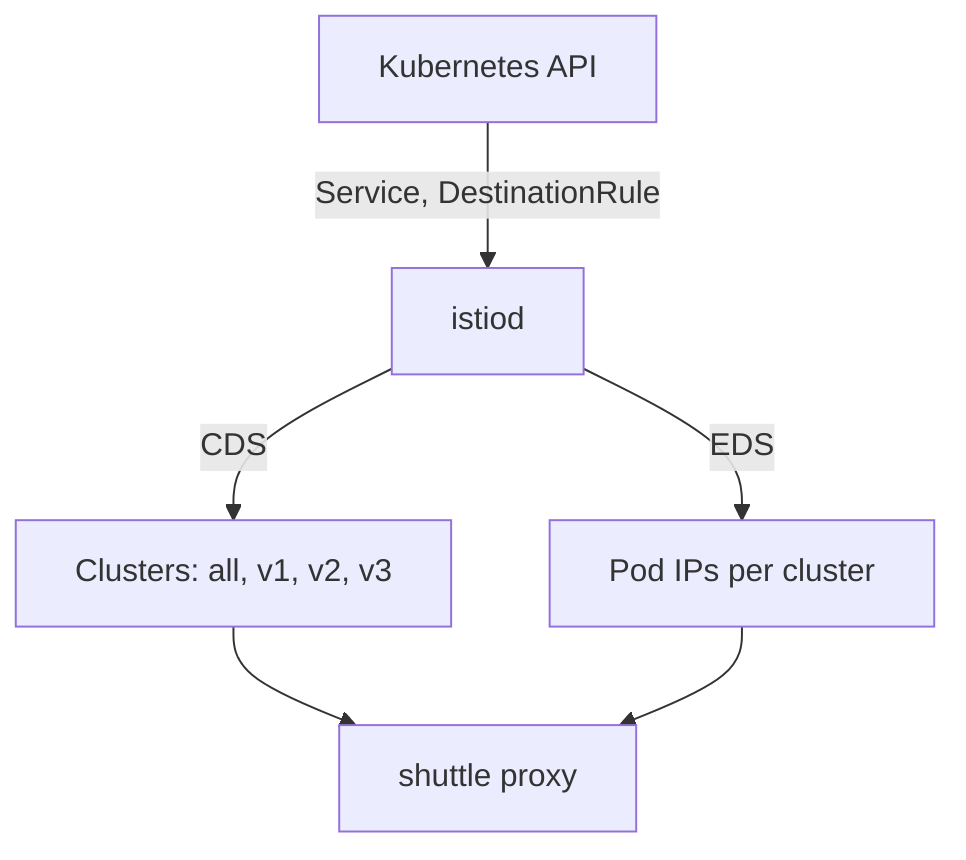

# Define Subsets With A DestinationRule

Before a request can go to "v2", some object must say what `v2` means. That is the job of a `DestinationRule`. A **`DestinationRule`** is an Istio object that defines named groups of pods, called subsets, for one Service, and sets how the client's proxy connects to them.

One fact surprises almost everyone. A correct `DestinationRule` on its own moves **no traffic at all**. It only creates names. This part shows what those names are made of, what `istiod` builds from them, and why a name that selects no pod is not an error.

## From Service to cluster: what istiod builds

The sidecar proxy (Envoy) of `shuttle` never reads a Kubernetes Service directly. `istiod`, Istio's control plane, turns the Service into configuration the proxy understands. This section shows what that configuration looks like, so you can read it back and check it later.

### Two of the xDS services

`istiod` watches Kubernetes and sends each proxy its configuration over a set of discovery services called **xDS**. xDS is the protocol `istiod` uses to push configuration to proxies while they run. Two of the services matter here:

- **CDS** (Cluster Discovery Service) carries the list of **clusters**. A cluster is a named destination the proxy can send requests to.
- **EDS** (Endpoint Discovery Service) carries the endpoints, the pod addresses, inside each cluster.

A `DestinationRule` changes what `istiod` sends over both services.



The diagram shows `istiod` reading the Service, the EndpointSlice and the `DestinationRule`, then sending the proxy of `shuttle` one cluster per host, port and subset over CDS, and the pod addresses for each over EDS.

So the proxy ends up with four clusters: all of `scout`, `v1`, `v2` and `v3`. One Service becomes several named clusters, each with its own filtered list of pods. That is all a subset is.

### One cluster becomes four

Without a `DestinationRule`, the proxy has exactly one cluster for `scout`. It holds every ready pod.

A `DestinationRule` with three subsets adds three more clusters. They have the same host and the same port, but a different pod filter. The original cluster stays.

## The subset field in a cluster name

Every cluster has a four-part name, separated by `|`. The third part is the subset:

```text
outbound | 9080 | v2 | scout.starfleet.svc.cluster.local
                  └── the subset name. Empty until a DestinationRule defines one.
```

The other parts are simple. `outbound` means "a destination this proxy sends requests to". `9080` is the **Service** port. The last part is the fully qualified domain name (FQDN), the full DNS name, of the Service.

`outbound|9080||scout.starfleet.svc.cluster.local`, with nothing between the middle bars, is the cluster without a subset. It existed before you wrote anything, and it stays afterwards. `istioctl proxy-config clusters` shows that empty field as `-` in its `SUBSET` column.

## The `DestinationRule` object

Now you give the three versions their names. This section shows the object that does it, field by field.

### A DestinationRule for scout

Each subset is a named group of pods behind the same Service, picked by pod labels. This is the rule for `scout`, with one subset per version.

<!-- astrona:playground:renew -->

Save this as `destinationrule-scout.yaml`:

```yaml
apiVersion: networking.istio.io/v1
kind: DestinationRule
metadata:
  name: scout
  namespace: starfleet
spec:
  host: scout
  subsets:
  - name: v1
    labels:
      version: v1
  - name: v2
    labels:
      version: v2
  - name: v3
    labels:
      version: v3
```

Apply it:

```sh
kubectl apply -f destinationrule-scout.yaml
```

```text
destinationrule.networking.istio.io/scout created
```

Read it like this: *for the host `scout`, the name `v1` means the pods with the label `version: v1`.*

### What each field does

The rule above has five fields. Two of them, `metadata.name` and `spec.host`, look alike and are easy to mix up:

```text
 metadata.name        the object's name. You choose it. Nothing routes by it.
 metadata.namespace   where the object lives. Short host names are filled in from this.
 spec.host            the SERVICE this rule is about. A host name, not an object name.
 subsets[].name       the word a VirtualService will ask for later.
 subsets[].labels     pod labels. They decide which pods land in the subset.
```

Naming the object after its Service, as here, makes it easy to find. But only `spec.host` decides which Service the rule is for.

### Three facts to remember

These three facts cause most subset mistakes:

- **The subset name is your choice.** `v1` is only a habit. `stable`, `canary` or `blue` work just as well. Istio does not compare the name with the `version` label.
- **The labels match pods, not Services.** That is why the `scout` pods carry a `version` label that the Service ignores.
- **A subset that matches no pod is not an error.** It becomes a cluster with no endpoints. Kubernetes accepts it and gives no warning. Requests sent there fail later with a `503`.

Keep **one `DestinationRule` per host**. Two `DestinationRule` objects for the same host give results that are hard to predict.

A `DestinationRule` holds more than subsets. The same object also sets the load balancing method of the client's proxy, its connection limits, and when it removes a failing endpoint (outlier detection). This module uses only the subsets.

## The labels are pod labels

Two different selections run over the same `scout` pods. The Service selector picks which pods are behind the Service. A subset then picks which of those pods belong to one subset:

```text
 Service.spec.selector       app=scout       → is this pod behind the Service?
 DestinationRule subset      version=v1      → of those pods, which ones are "v1"?
```

The two selections work together:

- A pod with `version: v1` but without `app=scout` is not behind the `scout` Service at all, so no subset can reach it.
- A pod with `app=scout` but no `version` label still receives requests to the Service, but it belongs to no subset.

### Look at the labels

List the `scout` pods with their labels:

```sh
kubectl get pods -n starfleet -l app=scout --show-labels
```

```text
NAME                        READY   STATUS    LABELS
scout-v1-85bf65868-pjdcp    2/2     Running   app=scout,...,version=v1
scout-v2-866c98b568-vh8zp   2/2     Running   app=scout,...,version=v2
scout-v3-668c6dfc68-lsl4b   2/2     Running   app=scout,...,version=v3
```

The output is shortened to the labels that matter. Your pod names will be different, because the end of each name is random.

Every pod has `app=scout`, so all three are behind the Service. Each one has a different `version`, so each lands in a different subset.

## Watching the clusters appear

The `DestinationRule` you applied already changed the configuration in the proxy of `shuttle`. It did not change where any request goes. Seeing both facts side by side is the clearest proof that subsets are only names.

### See the new clusters

Predict the result before you run it: more clusters in the proxy of `shuttle`, and the same random mix of versions as before. The `count_versions` helper sends 10 requests from `shuttle` to `scout` and counts the versions that answered; `$SCOUT` holds `http://scout:9080/reviews`.

```sh
istioctl proxy-config clusters deploy/shuttle -n starfleet | grep scout
count_versions $SCOUT/0
```

```text
scout.starfleet.svc.cluster.local          9080      -          outbound      EDS              scout.starfleet
scout.starfleet.svc.cluster.local          9080      v1         outbound      EDS              scout.starfleet
scout.starfleet.svc.cluster.local          9080      v2         outbound      EDS              scout.starfleet
scout.starfleet.svc.cluster.local          9080      v3         outbound      EDS              scout.starfleet
```

`count_versions` still gives a random mix of v1, v2 and v3. Look at the third column, `SUBSET`: it now has `-`, `v1`, `v2` and `v3`. The last column names the `DestinationRule` that built them. The traffic did not move, because no route *uses* the subsets yet.

The row with `-` did not go away. Requests that ask for no subset still have a cluster to go to.

`kubectl apply` returns as soon as Kubernetes has stored the object, not when the proxy has its new configuration. If a listing still looks old, wait a second and run it again before you start debugging.

## Which pods landed in which cluster

A subset is only useful if its labels actually select pods. `istioctl proxy-config endpoints` answers exactly that question: which pod addresses sit inside one cluster. Most unexplained `503` errors with subsets come down to this question.

### List the endpoints of one subset

A cluster's full four-part name is its ID, so `--cluster` takes the whole string. Put it in quotes, so the shell does not read `|` as a pipe:

```sh
istioctl proxy-config endpoints deploy/shuttle -n starfleet \
  --cluster "outbound|9080|v2|scout.starfleet.svc.cluster.local"
```

```text
ENDPOINT            STATUS      OUTLIER CHECK     CLUSTER
10.244.0.8:9080     HEALTHY     OK                outbound|9080|v2|scout.starfleet.svc.cluster.local
```

You see one row: the `scout-v2` pod. The subset's labels picked one pod out of the three behind the Service. Pod addresses change with every playground run, so your address will be different.

`STATUS` is the proxy's own view of the endpoint's health. `OUTLIER CHECK` says whether the proxy has removed the endpoint for failing too often. Neither column tells you whether your labels were right. Only whether a row appears at all tells you that.

## When a subset selects nothing

This is the failure the whole part leads to. Istio accepts a subset whose labels match no pod. It becomes a cluster with an empty list of endpoints. Break it once on purpose, so you recognise it when it happens by accident.

### Send requests to the subset

A subset only matters when a route uses it. A `VirtualService` is the Istio object that sets where requests to a host go. This one sends every request to `scout` to the `v1` subset.

Save this as `virtualservice-scout.yaml`:

```yaml
apiVersion: networking.istio.io/v1
kind: VirtualService
metadata:
  name: scout
  namespace: starfleet
spec:
  hosts:
  - scout
  http:
  - route:
    - destination:
        host: scout
        subset: v1
```

Apply it:

```sh
kubectl apply -f virtualservice-scout.yaml
```

### Break the subset

Now point the `v1` subset at a label no pod has, `version: v9`.

Save this as `destinationrule-scout-broken.yaml`:

```yaml
apiVersion: networking.istio.io/v1
kind: DestinationRule
metadata:
  name: scout
  namespace: starfleet
spec:
  host: scout
  subsets:
  - name: v1
    labels:
      version: v9
  - name: v2
    labels:
      version: v2
  - name: v3
    labels:
      version: v3
```

Apply it:

```sh
kubectl apply -f destinationrule-scout-broken.yaml
```

### Read the failure

Then check the result. Send one request, read the access log of the `shuttle` proxy, and run `istioctl analyze`:

```sh
kubectl exec -n starfleet deploy/shuttle -- curl -s -o /dev/null -w "%{http_code}\n" $SCOUT/0
kubectl logs -n starfleet deploy/shuttle -c istio-proxy --tail=1
istioctl analyze -n starfleet
```

```text
503
"GET /reviews/0 HTTP/1.1" 503 UH no_healthy_upstream ... outbound|9080|v1|scout.starfleet.svc.cluster.local
Error [IST0173] (DestinationRule starfleet/scout) The Subset v1 defined in the DestinationRule does not select any pods. Which may lead to 503 UH (NoHealthyUpstream).
```

The log line is shortened.

The subset **exists**, so the `v1` cluster exists too: you can see its name in the log line. But no pod has `version=v9`, so the cluster has no endpoints. The access log marks this with the response flag **`UH`**, "no healthy upstream". The proxy had no endpoint to send the request to.

If you still get `200`, or the log line is an older one, the new configuration has not reached the proxy yet. Wait a second and run the `curl` and `kubectl logs` lines again.

### Put it back

Apply the correct rule again:

```sh
kubectl apply -f destinationrule-scout.yaml
```

## What `istioctl analyze` catches here

`istioctl analyze` runs Istio's own checks over the objects in a namespace. Plain YAML validation checks one object at a time. `analyze` also checks objects against each other.

You just saw one of its findings: `IST0173`, a subset that selects no pods. The other finding that matters here is `IST0101`: a `VirtualService` asks for a subset that no `DestinationRule` defines.

### A clean result

Run it again, now that the correct `DestinationRule` is back:

```sh
istioctl analyze -n starfleet
```

```text
✔ No validation issues found when analyzing namespace: starfleet.
```

That is what a clean result looks like. `analyze` is a quick first check, not proof that everything works. To see which pods a subset really holds, list its endpoints with `istioctl proxy-config endpoints`.

## What you know now

A `DestinationRule` turns one Service into several clusters, one per subset, each filtered by pod labels. It moves no traffic by itself. A subset that selects no pod gives a `503 UH` in the access log and `IST0173` in `istioctl analyze`. The open question is how to make the client's proxy pick a subset, and that is the job of the `VirtualService`.

## Common pitfalls

> [!WARNING]
> - **Expecting a `DestinationRule` to move traffic.** It only defines names. If you applied one and the split did not change, it is working as designed.
> - **Mixing up `metadata.name` and `spec.host`.** Only `spec.host` decides which Service the rule is for.
> - **Treating subset labels as Service labels.** They match *pod* labels. A label only on the Deployment's own `metadata`, and not on the pod template, selects nothing.
> - **Checking too fast.** `kubectl apply` returns before `istiod` sends the new configuration to the proxy. A listing taken straight away can still show the old state.

## Your mission: Fix A DestinationRule Subset That Selects No Pods

You can now write a `DestinationRule`, list the endpoints of each subset, and spot a subset that selects nothing. The graded lab gives you a `DestinationRule` with one wrong label that makes every request from `jason` fail, and asks you to find and fix it.

The lab runs in its own cluster, so first pause your playground. Nothing in it is lost:

```sh
astrona stop ats-014-playground-010-01
```

Then start the lab:

```sh
astrona run --git git@github.com:astrona-io/ATS014.git -c sections/section-010/module-01/labs/lab-03
```

The task is on the next page. Solve it on your own first. When you think you are done, send it for grading:

```sh
astrona submit -c sections/section-010/module-01/labs/lab-03
```

When the lab is done, remove it and start your playground again:

```sh
astrona destroy ats-014-lab-010-01-03
astrona start ats-014-playground-010-01
```
