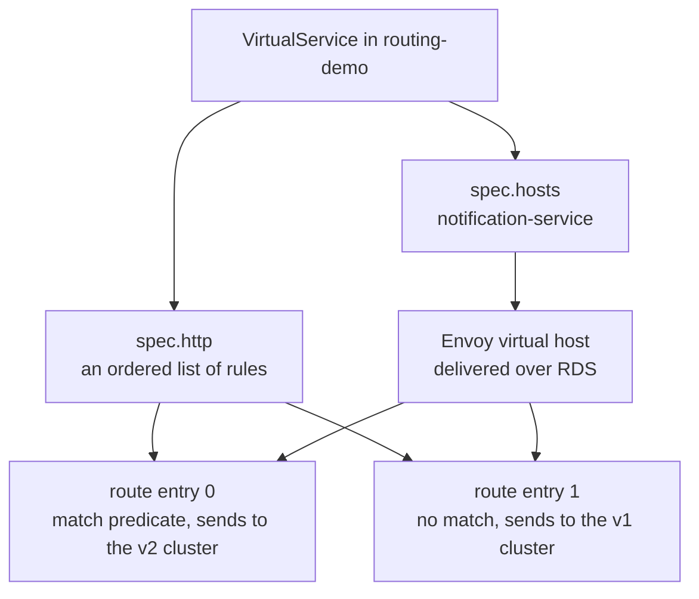
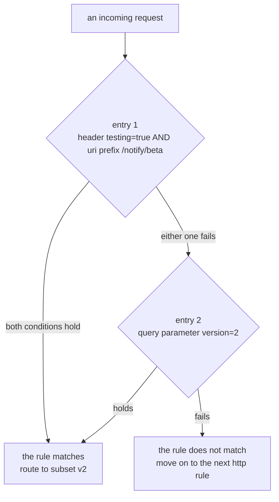

# Matching A Request

> Prerequisite: [Subsets And The Destination Vocabulary](./course-01-subsets-and-destination-vocabulary.md). Next: [Evaluation Order, Name Resolution And Proof](./course-03-evaluation-order-and-proof.md).

Part 1 gave you named destinations. This part is about the other half of a routing rule: the description of *which requests* it applies to. The `match` block is a small language, and nearly all of the mistakes people make with it come from two things — choosing the wrong string-comparison form, and misreading whether two conditions must both hold. This part settles both.

Before either, though, the object that carries `match` needs introducing, because it has two fields called "host" that mean different things.

## The `VirtualService` object

A `DestinationRule` said what the names mean. A `VirtualService` is where you say **which requests go to which name**. It is the object that turns "this Service" into "this decision".

```yaml
apiVersion: networking.istio.io/v1
kind: VirtualService
metadata:
  name: notification-service
  namespace: routing-demo
spec:
  hosts:
    - notification-service          # requests TO this name are governed by this object
  http:
    - match: [...]                  # one rule
      route:
        - destination:
            host: notification-service   # ...and this is where a matching request is SENT
            subset: v2
```

Line by line:

```text
 metadata.name    the Kubernetes object's name. Arbitrary, routes nothing.
 spec.hosts       WHO IS BEING CALLED. The name a client uses. Binds this object
                    to the route table for that host.
 spec.http        an ordered LIST of rules. Order is load-bearing — that is Part 3.
 http[].match     WHICH requests this rule applies to. Optional; absent means "all".
 http[].route     WHERE they go. Required. Names a host, optionally a subset from
                    a DestinationRule.
```

**The two host fields are the thing to get straight.** `spec.hosts` is the name on the *incoming* request — the address the caller dialled. `destination.host` is the name the proxy forwards to. In this module they happen to be the same string, because the module rewrites where `notification-service` traffic goes without changing what clients call. They are not required to match, and in later sections they routinely do not: an ingress `VirtualService` has `hosts: ["shop.example.com"]` and a `destination.host` of some internal Service.

Both accept short names, and both expand relative to the object's own namespace. That expansion causes enough trouble to get its own section in Part 3.

One more field is implied rather than written. A `VirtualService` with no `gateways` key applies to the reserved value `mesh` — meaning every sidecar in the mesh. That is why the rules below take effect for `tester` without anything being attached to it. Section 060 is where `gateways` becomes explicit and a `VirtualService` starts binding to an ingress instead.

And from Part 1, the fact that makes this observable: the rules are compiled and pushed into the **caller's** proxy. The matching happens inside the `tester` pod, before the request is on the network.

## The shape of one rule

A `VirtualService` holds a list under `http`. Each entry is one rule with two halves:

```yaml
http:
  - match:                      # WHICH requests — optional
      - headers:
          testing:
            exact: "true"
    route:                      # WHERE they go — required
      - destination:
          host: notification-service
          subset: v2
```

`route` names a destination from Part 1's vocabulary — the `subset: v2` resolves only because a `DestinationRule` defined it. `match` is optional, and a rule without one matches everything; Part 3 is about what that implies.

Underneath, this compiles into an Envoy **route entry**: a match predicate plus the name of the cluster to send matching requests to. Envoy groups route entries under a **virtual host**, keyed on the names from `spec.hosts`, and the whole structure is delivered over RDS — the route half of the xDS layering from Part 1:



`spec.hosts` decides *which* route table your rules land in; `spec.http` decides what is in it. Both halves have to be right before a single request changes course.

The `proxy-config routes` output you will meet in Part 3 is that compiled form, printed one route entry per line.

## Four things you can match on

| Match type | Matches against | Note |
| --- | --- | --- |
| `headers` | a named request header | header names are matched case-insensitively; values are not |
| `uri` | the request path | the path only — the query string is *not* part of it |
| `queryParams` | one named query parameter | matched after the path is split at `?` |
| `method` | the HTTP verb | `GET`, `POST`, … |

`headers` and `queryParams` are **maps**, not single values: you name the header or parameter as the key, and give it a string match as the value. Naming two headers under one `headers:` key means both must hold — it is the same AND as putting two different match types together, which the section below makes precise.

Two of those have a subtlety worth stating now, because each produces a rule that looks right and never fires.

**`uri` does not include the query string.** A request for `/notify?version=2` has a `uri` of `/notify`. Writing `uri: { exact: "/notify?version=2" }` matches nothing, ever. Query matching is `queryParams`' job, and it is a separate key for exactly this reason. Paths are also matched **case-sensitively** — `/Notify` is not `/notify`.

**Header names are conventionally lowercase.** HTTP/2 mandates lowercase header names, and Envoy normalises HTTP/1 headers to lowercase before matching, so `testing`, `Testing` and `TESTING` all work as the *key*. The **value** is compared literally — `exact: "true"` does not match a header whose value is `True`.

There are further match keys — `withoutHeaders` (matches when a header is absent or does not match), `authority` (the `Host` header), `scheme`, `port`, and `sourceLabels` (the labels of the *calling* workload, which section 080 uses) — but the four above are the ones this module's task is built from.

## The three string forms

`headers`, `uri`, `queryParams` and `authority` all take the same small choice of comparison, called a **string match**:

| Form | Semantics | Example that matches `/notify/beta/42` |
| --- | --- | --- |
| `exact` | the whole value, character for character | `exact: "/notify/beta/42"` |
| `prefix` | the value starts with this string | `prefix: "/notify"` |
| `regex` | an **RE2** regular expression against the whole value | `regex: "^/notify/.*$"` |

Three things to hold on to:

- **`prefix` is a plain string prefix.** `prefix: "/notify"` matches `/notify`, `/notify/beta` **and** `/notifyXYZ`. This is worth noting now because the Kubernetes `Ingress` API's `pathType: Prefix` is *element-wise* and does not match `/notifyXYZ` — the two APIs use the same word for different behaviour, and section 060 makes you translate between them.
- **`regex` is RE2, not PCRE.** RE2 is Google's linear-time regex engine. It deliberately omits backreferences and lookahead/lookbehind, because those are what make a regex able to blow up exponentially on hostile input. A pattern using `(?=`, `(?!` or `\1` will be rejected by the control plane rather than silently misbehaving.
- **`regex` is matched against the whole value.** Envoy requires the pattern to consume the complete string, so `regex: "beta"` does **not** match `/notify/beta`; you want `regex: ".*beta.*"` or an anchored `^/notify/.*$`.

The choice is not a style preference. `exact` is the one that cannot surprise you and is the right default for a header or a query value. `prefix` is right for a path *family* you own, and wrong any time the extra characters it lets through matter. `regex` is the escape hatch — correct when the others genuinely cannot express the rule, and worth avoiding otherwise, because a regex is the hardest of the three for the next person to read and the only one that can be subtly wrong while looking right.

`method` is the odd one out: it takes a string match applied to the verb, written directly as `method: { exact: POST }`.

> [!TIP]
> **Try it — one header rule, and the request that misses it**
>
> ```sh
> kubectl apply -f - <<'EOF'
> apiVersion: networking.istio.io/v1
> kind: VirtualService
> metadata:
>   name: notification-service
>   namespace: routing-demo
> spec:
>   hosts:
>     - notification-service
>   http:
>     - match:
>         - headers:
>             testing:
>               exact: "true"
>       route:
>         - destination:
>             host: notification-service
>             subset: v2
>     - route:
>         - destination:
>             host: notification-service
>             subset: v1
> EOF
> kubectl -n routing-demo exec deploy/tester -- \
>   curl -s -X POST -H "testing: true"  http://notification-service/notify
> kubectl -n routing-demo exec deploy/tester -- \
>   curl -s -X POST -H "TESTING: true"  http://notification-service/notify
> kubectl -n routing-demo exec deploy/tester -- \
>   curl -s -X POST -H "testing: True"  http://notification-service/notify
> ```
>
> Expect something like:
>
> ```text
> ["EMAIL","SMS"]
> ["EMAIL","SMS"]
> ["EMAIL"]
> ```
>
> The first two are the same request as far as matching is concerned — the header *name* is case-insensitive. The third falls through to the default rule because the header *value* `True` is not the string `true`. That third line is the entire argument for quoting values and being literal about them.

Notice also what did **not** happen: nothing was restarted, nothing was redeployed, and the split from Part 1 stopped being random the moment the object was accepted. This object is now the thing deciding, and the `DestinationRule` is finally being used rather than merely existing.

## Quoting, and the YAML trap underneath it

`exact: true` and `exact: "true"` are different documents. Unquoted `true` is a YAML **boolean**; the field wants a string, so the apply is rejected — which is the good outcome, because you find out immediately. The rejection names the field:

```text
Error from server: error when creating "STDIN": admission webhook "validation.istio.io" denied
the request: configuration is invalid: cannot unmarshal bool into string
```

The dangerous version is numeric. `exact: 2` parses as an integer and is likewise rejected by the schema, but the habit of leaving values unquoted eventually produces something that *is* a valid string and still wrong: YAML's older rules treat bare `yes`, `no`, `on` and `off` as booleans too, and a version string like `1.30` parses as the number `1.3`, losing the trailing zero before Istio ever sees it. Quote every header and query value and none of this can reach you.

## AND or OR: the rule that depends on indentation

This is the single most misread part of the object, and it is decided entirely by where an item sits in the list.

The shape to hold in your head is a **list of lists**. `match` is a list of alternatives; each alternative is a bundle of conditions that all have to hold:



Within an entry every condition has to hold; between entries only one entry has to. The diagram is the whole semantics of `match`.

In YAML, "a new entry" is a new `-` at the `match` level, and "another condition in the same entry" is another key aligned under the existing one:

```yaml
match:
  - headers:                 # ┐ entry 1
      testing:               # │  header AND uri must BOTH hold
        exact: "true"        # │
    uri:                     # │  ← aligned with `headers`, so same entry
      prefix: /notify/beta   # ┘
  - queryParams:             # ┐ entry 2 — ORed with entry 1
      version:               # │
        exact: "2"           # ┘
```

The rule:

- **Conditions inside one `-` entry are ANDed.** Every condition in that entry must hold.
- **Separate `-` entries are ORed.** The rule fires if any entry matches.

So the block above reads: *(header `testing: true` **AND** path starting `/notify/beta`) **OR** query `version=2`*.

The failure this causes is quiet in both directions. Collapsing three intended alternatives into one entry produces a rule that needs all three at once and therefore almost never fires. Splitting an intended conjunction into separate entries produces a rule far broader than you meant — which does fire, on traffic you did not intend to divert. Neither is an error; both are valid objects that behave differently from the sentence in your head.

Predict the output of the next checkpoint before running it: two conditions, ANDed, exercised one at a time and then together.

> [!TIP]
> **Try it — the same three conditions, ANDed then ORed**
>
> ```sh
> kubectl -n routing-demo patch virtualservice notification-service --type merge -p '
> spec:
>   http:
>     - match:
>         - headers:
>             testing:
>               exact: "true"
>           uri:
>             prefix: /notify/beta
>       route:
>         - destination:
>             host: notification-service
>             subset: v2
>     - route:
>         - destination:
>             host: notification-service
>             subset: v1'
> echo "--- ANDed: header alone, path alone, then both ---"
> kubectl -n routing-demo exec deploy/tester -- curl -s -X POST -H "testing: true" http://notification-service/notify
> kubectl -n routing-demo exec deploy/tester -- curl -s -X POST http://notification-service/notify/beta
> kubectl -n routing-demo exec deploy/tester -- curl -s -X POST -H "testing: true" http://notification-service/notify/beta
> ```
>
> Expect something like:
>
> ```text
> --- ANDed: header alone, path alone, then both ---
> ["EMAIL"]
> ["EMAIL"]
> ["EMAIL","SMS"]
> ```
>
> Two `v1` answers and one `v2`: neither condition alone is enough. Split the same two conditions onto separate `-` entries and re-run — all three lines become `["EMAIL","SMS"]`, because now either one suffices. Nothing but indentation changed.

## Reading a compiled match

Because a match compiles to an Envoy route entry, you can check your reading of the YAML against what the proxy actually holds. The JSON form of `proxy-config routes` shows the predicate, and it is unambiguous where the YAML is not: ANDed conditions appear as sibling fields of one `match` object, while ORed alternatives appear as separate entries in the `routes` array.

This is the habit worth forming. When a rule does not behave the way you read it, the compiled predicate is the arbiter — it is what is actually running, and it cannot be misread the way indentation can.

> [!TIP]
> **Try it — the predicate as Envoy stores it**
>
> ```sh
> istioctl proxy-config routes deploy/tester -n routing-demo -o json \
>   | grep -E '"prefix"|"exact"|"name": "testing"|"path"' | head -12
> ```
>
> Expect something like:
>
> ```text
> "path": "/notify/beta",
> "name": "testing",
> "exact": "true",
> "prefix": "/",
> ```
>
> The exact JSON field names shift between Envoy versions — the structure is what matters. The header condition and the path condition sit together in one match object: the AND you wrote. The trailing `"prefix": "/"` is the catch-all default rule, which matches every path; Part 3 is about why its position in the list is the most consequential thing in the object.

## Common pitfalls

> [!WARNING]
> **Matching a query string with `uri`.** The path stops at the `?`. `uri: { exact: "/notify?v=2" }` never matches anything. Use `queryParams`.
>
> **Assuming `prefix` respects path segments.** It does not. `prefix: "/notify"` also matches `/notifyXYZ`. The Kubernetes `Ingress` API's `Prefix` does respect segments — same word, different rule.
>
> **A `regex` that is not a full match.** `regex: "beta"` matches only the exact string `beta`, not any path containing it.
>
> **Comparing header values case-insensitively in your head.** The name is case-insensitive; the value is not. `True` ≠ `true`.
>
> **Leaving values unquoted.** `true`, `yes`, `off` and `1.30` are not strings to a YAML parser. Quote every header and query value.
>
> **Confusing `spec.hosts` with `destination.host`.** The first is who was called, the second is where it goes. Identical here, routinely different later.

> *Conditions inside one `-` entry are ANDed; separate `-` entries are ORed — the only difference is indentation.*

## Reference

- [VirtualService API](https://istio.io/latest/docs/reference/config/networking/virtual-service/) — the whole object, including `gateways`, `exportTo` and the fields later sections add to a rule.
- [HTTPMatchRequest API](https://istio.io/latest/docs/reference/config/networking/virtual-service/#HTTPMatchRequest) — every match key, including `withoutHeaders`, `authority`, `scheme`, `port` and `sourceLabels`.
- [StringMatch API](https://istio.io/latest/docs/reference/config/networking/virtual-service/#StringMatch) — the `exact` / `prefix` / `regex` choice, in one short page.
- [RE2 syntax](https://github.com/google/re2/wiki/Syntax) — what is and is not available in an Istio `regex`, and why.
- [Request routing task](https://istio.io/latest/docs/tasks/traffic-management/request-routing/) — the upstream walkthrough this module's scenario follows.
