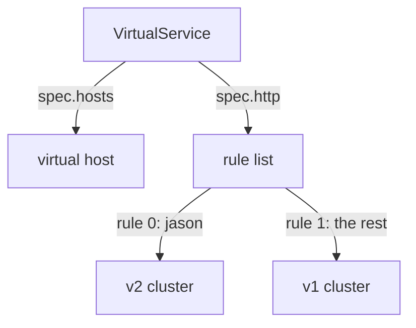
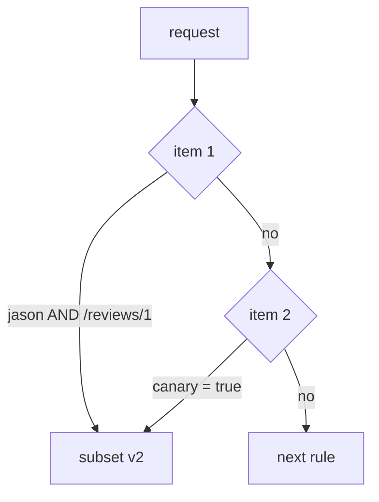

# Matching A Request

Part 1 gave you named destinations. This part is about the other half of a routing rule: *which signals* it applies to. That is the `match` block: reading the signal's label before deciding where it goes. Most mistakes with it come from two things. People pick the wrong way to compare text, or they misread whether two conditions must both be true. This part settles both.

First, though, you need the object that holds `match`. It has two fields called "host" that mean different things.

The commands below assume the `scout` `DestinationRule` from Part 1 is applied (subsets `v1`, `v2`, `v3`) and the `count_versions` helper is pasted.

## The `VirtualService` object

A `DestinationRule` says what the names mean. A `VirtualService` says **which requests go to which name**. Think of it as the **flight plan**: which way a signal flies, based on what it carries.

This is the "all traffic to v1" rule you used at the end of Part 1:

```yaml
apiVersion: networking.istio.io/v1
kind: VirtualService
metadata:
  name: scout
  namespace: starfleet
spec:
  hosts:
  - scout              # requests TO this name follow this flight plan
  http:
  - route:
    - destination:
        host: scout    # ...and this is where a matching request is SENT
        subset: v1
```

Line by line:

```text
 metadata.name    the object's name. You choose it. It routes nothing.
 spec.hosts       WHO IS BEING CALLED. The name a client uses.
 spec.http        an ordered LIST of rules. The order matters (Part 3).
 http[].match     WHICH requests this rule applies to. Optional: no match means "all".
 http[].route     WHERE they go. Required. Names a host, and optionally a subset.
```

**Keep the two host fields apart.** `spec.hosts` is the name on the *incoming* request: the address the caller used. `destination.host` is the name the proxy sends it on to. Here both are `scout`, because the module changes where `scout` traffic goes without changing what clients call. They do not have to match. A `VirtualService` at the edge of the mesh, for example, can have `hosts: ["starfleet.example.com"]` and send to an internal Service.

Both fields accept short names. Both are filled in from the object's own namespace. Part 3 shows the trouble that causes.

One more field is set for you. A `VirtualService` with no `gateways` field applies to the reserved value `mesh`, which means every sidecar in the mesh. That is why the rules below work for the `shuttle` pod without attaching anything to it.

And from Part 1: the rules are sent to the **caller's** proxy. The matching happens inside the `shuttle`, before the signal leaves it.

> [!TIP]
> **Try it: all traffic to v1**
>
> ```sh
> cat > virtualservice-scout.yaml <<'EOF'
> apiVersion: networking.istio.io/v1
> kind: VirtualService
> metadata:
>   name: scout
>   namespace: starfleet
> spec:
>   hosts:
>   - scout
>   http:
>   - route:
>     - destination:
>         host: scout
>         subset: v1
> EOF
> kubectl apply -f virtualservice-scout.yaml
> count_versions $SCOUT/0
> ```
>
> Expect:
>
> ```text
>   10 scout-v1
> ```
>
> The `shuttle`'s communications officer now sends every signal to v1. Refresh the bridge page: the stars are gone. Change `subset: v1` to `subset: v3`, apply again, and every answer becomes v3. That is how you switch versions with Istio, and how you switch back. You never touch the pods.

## The shape of one rule

The `http` field is a list. Each item is one rule with two halves:

```yaml
http:
- match:                  # WHICH requests (optional)
  - headers:
      end-user:
        exact: jason
  route:                  # WHERE they go (required)
  - destination:
      host: scout
      subset: v2
```

`route` names a destination from Part 1. `subset: v2` only works because a `DestinationRule` defined it. `match` is optional. A rule without one matches everything. Part 3 shows what follows from that.

Under the hood, each rule becomes an Envoy **route entry**: a test, plus the cluster to send matching requests to. Envoy groups the route entries under a **virtual host**, named after `spec.hosts`. The whole structure travels to the proxy over RDS (the route discovery service), the channel mission control uses for routes.



The `scout` `VirtualService` has two parts. `spec.hosts` (here `scout`) becomes an Envoy virtual host, sent to the proxy over RDS. `spec.http` is an ordered list of rules, and each rule becomes a route entry: entry 0 sends `end-user = jason` to the v2 cluster, entry 1 has no match and sends everything else to the v1 cluster. `spec.hosts` decides *which* route table your rules land in. `spec.http` decides what is in it. Both must be right before a single signal changes course.

## What a match can look at

A match condition says two things: **what** to compare, and **how** to compare it. First, the "what":

| What | Field | Note |
| --- | --- | --- |
| a request header | `headers: {end-user: {...}}` | header names ignore upper and lower case; values do not |
| the path | `uri: {...}` | the path only. The query string after `?` is *not* part of it |
| a URL parameter | `queryParams: {canary: {...}}` | the parameters after the `?` |
| the HTTP method | `method: {...}` | `GET`, `POST`, ... |
| the calling pod | `sourceLabels: {app: bridge}` | the labels of the workload that sends the request |

A **header** is a small label attached to a signal, like a tag painted on a crate before launch. When you log in on the bridge as `jason`, the `bridge` adds the header `end-user: jason` to every call it makes to `scout`.

`headers` and `queryParams` are **maps**. You name the header or parameter as the key, and give the comparison as the value. Two headers under one `headers:` key must both match.

Two of these have a catch, because each one can give a rule that looks right and never fires:

- **`uri` does not include the query string.** A request for `/reviews/0?canary=true` has a `uri` of `/reviews/0`. Use `queryParams` for the part after `?`. Paths also care about upper and lower case: `/Reviews` is not `/reviews`.
- **Header names ignore case, header values do not.** Envoy, the program inside the sidecar, turns all header names into lower case before it compares them. So `end-user`, `End-User` and `END-USER` all work as the *name*. But the *value* is compared exactly: `Jason` is not `jason`.

There are more match fields: `withoutHeaders`, `authority` (the `Host` header), `scheme` and `port`. The ones in the table above are the ones you use most.

> [!TIP]
> **Try it: jason gets v2, everyone else gets v1**
>
> ```sh
> cat > virtualservice-scout.yaml <<'EOF'
> apiVersion: networking.istio.io/v1
> kind: VirtualService
> metadata:
>   name: scout
>   namespace: starfleet
> spec:
>   hosts:
>   - scout
>   http:
>   - match:
>     - headers:
>         end-user:
>           exact: jason
>     route:
>     - destination:
>         host: scout
>         subset: v2
>   - route:
>     - destination:
>         host: scout
>         subset: v1
> EOF
> kubectl apply -f virtualservice-scout.yaml
> count_versions -H "end-user: jason" $SCOUT/0
> count_versions $SCOUT/0
> count_versions -H "End-User: jason" $SCOUT/0
> count_versions -H "end-user: Jason" $SCOUT/0
> ```
>
> Expect:
>
> ```text
>   10 scout-v2
>   10 scout-v1
>   10 scout-v2
>   10 scout-v1
> ```
>
> The jason request matches rule 1. The plain request does not, so it falls to the last rule. `End-User` still matches, because the header *name* ignores case. `Jason` does not, because the *value* must match exactly. If you need a value to ignore case, use a `regex` like `(?i)jason`.

## The three ways to compare text

`headers`, `uri`, `queryParams` and `authority` all use the same small choice of comparison, called a **string match**:

| Form | Matches | Example |
| --- | --- | --- |
| `exact: jason` | exactly `jason`, letter for letter | `jason`, but not `jasonx` or `Jason` |
| `prefix: ja` | anything that starts with `ja` | `jason`, `jane` |
| `regex: "jason\|jane"` | an RE2 pattern that must fit the **whole** value | `jason`, `jane`, but not `jasonx` |

A **regex** (regular expression) is a search pattern. `jason|jane` means "jason or jane". **RE2** is the pattern style Istio uses.

Three things to hold on to:

- **`prefix` is a plain text prefix.** It does not care about `/`. `prefix: "/reviews"` matches `/reviews`, `/reviews/0` **and** `/reviewsXYZ`. The Kubernetes `Ingress` API's `pathType: Prefix` does care about `/` and does not match `/reviewsXYZ`. Same word, different rule.
- **`regex` is RE2, not the style many languages use.** RE2 leaves out look-ahead (`(?=`) and back-references (`\1`), because those can make a pattern run for a very long time. Istio rejects a pattern that uses them.
- **`regex` must match the whole value.** It acts as if it had `^...$` around it ("from the first letter to the last"). So `regex: "jason"` does not match `jasonx`. For "contains jason", write `.*jason.*`. People often expect it to work like `grep`, which finds a word anywhere. It does not.

The choice is not about style. `exact` cannot surprise you, so it is the right default for a header or a query value. `prefix` is right for a group of paths you own, or a group of users like `beta-*`. `regex` is the last resort: use it when the others cannot express the rule. It is the hardest to read and the easiest to get subtly wrong.

`method` is written directly with the comparison: `method: { exact: POST }`.

> [!TIP]
> **Try it: prefix and regex side by side**
>
> ```sh
> cat > virtualservice-scout.yaml <<'EOF'
> apiVersion: networking.istio.io/v1
> kind: VirtualService
> metadata:
>   name: scout
>   namespace: starfleet
> spec:
>   hosts:
>   - scout
>   http:
>   - match:
>     - headers:
>         end-user:
>           prefix: ja
>     route:
>     - destination:
>         host: scout
>         subset: v2
>   - route:
>     - destination:
>         host: scout
>         subset: v1
> EOF
> kubectl apply -f virtualservice-scout.yaml
> count_versions -H "end-user: jane" $SCOUT/0
> count_versions -H "end-user: bob" $SCOUT/0
> ```
>
> Expect `10 scout-v2` for jane (her name starts with `ja`) and `10 scout-v1` for bob. Now change `prefix: ja` to `regex: "jason|jane"`, apply again, and try `jane` and `jasonx`. `jane` still gets v2. `jasonx` gets v1: the extra `x` breaks a whole-value match. The playground's [`examples/02-header-based-routing/cases/`](./playground/examples/02-header-based-routing/cases/) folder has both files ready (`c1-…prefix…`, `c2-…regex…`).

## Quoting, and the YAML trap underneath it

`exact: true` and `exact: "true"` are different. Without quotes, YAML reads `true` as a yes/no value (a boolean), not as text. The field wants text, so Istio rejects the object. That is the good outcome: you find out straight away.

The same goes for numbers. `exact: 2` is a number, not the text `"2"`. Older YAML rules also read bare `yes`, `no`, `on` and `off` as yes/no values, and a version like `1.30` becomes the number `1.3`. Quote every header and query value, and none of this can reach you.

> [!TIP]
> **Try it: a query parameter, quoted**
>
> ```sh
> cat > virtualservice-scout.yaml <<'EOF'
> apiVersion: networking.istio.io/v1
> kind: VirtualService
> metadata:
>   name: scout
>   namespace: starfleet
> spec:
>   hosts:
>   - scout
>   http:
>   - match:
>     - queryParams:
>         canary:
>           exact: "true"
>     route:
>     - destination:
>         host: scout
>         subset: v3
>   - route:
>     - destination:
>         host: scout
>         subset: v1
> EOF
> kubectl apply -f virtualservice-scout.yaml
> count_versions "$SCOUT/0?canary=true"
> count_versions $SCOUT/0
> ```
>
> Expect `10 scout-v3` for the URL with `?canary=true`, and `10 scout-v1` without it. A query parameter helps when the client cannot set headers, for example a link in a browser. Remove the quotes around `"true"` and apply again: Istio rejects the object.

## AND or OR: the rule that depends on one dash

This is the most misread part of the object. It is decided only by where an item sits in the list.

Think of `match` as a **list of lists**. `match` is a list of choices. Each choice is a bundle of conditions that must all be true.



Item 1 holds two conditions, `end-user = jason` AND path prefix `/reviews/1`. Item 2 holds one, `canary = true`. The rule matches, and sends the signal to v2, if item 1 is fully true or item 2 is true. Otherwise the proxy moves on to the next `http` rule. Inside an item, every condition must be true. Between items, only one item has to match. The picture shows the whole meaning of `match`.

In YAML, a new item starts with a new `-` at the `match` level. Another condition in the same item is another key lined up under the first one:

```yaml
# AND: one item                      # OR: two items
- match:                             - match:
  - headers:                           - headers:
      end-user: {exact: jason}             end-user: {exact: jason}
    uri: {prefix: /reviews/1}          - uri: {prefix: /reviews/1}
```

The only difference is one `-` in front of `uri`. The rule:

- **Conditions inside one `-` item are combined with AND.** All of them must be true.
- **Separate `-` items are combined with OR.** The rule fires if any item matches.

The mistake is quiet both ways. Squash three choices into one item, and the rule needs all three at once, so it almost never fires. Split one AND into separate items, and the rule fires on far more traffic than you meant. Neither is an error. Both are valid objects that behave differently from the sentence in your head.

Predict the next result before you run it.

> [!TIP]
> **Try it: the same two conditions, AND then OR**
>
> ```sh
> cat > virtualservice-scout.yaml <<'EOF'
> apiVersion: networking.istio.io/v1
> kind: VirtualService
> metadata:
>   name: scout
>   namespace: starfleet
> spec:
>   hosts:
>   - scout
>   http:
>   - match:
>     - headers:
>         end-user:
>           exact: jason
>       uri:
>         prefix: /reviews/1
>     route:
>     - destination:
>         host: scout
>         subset: v2
>   - route:
>     - destination:
>         host: scout
>         subset: v1
> EOF
> kubectl apply -f virtualservice-scout.yaml
> count_versions -H "end-user: jason" $SCOUT/0
> count_versions -H "end-user: jason" $SCOUT/1
> count_versions $SCOUT/1
> ```
>
> Expect:
>
> ```text
>   10 scout-v1
>   10 scout-v2
>   10 scout-v1
> ```
>
> Only jason on `/reviews/1` gets v2: both conditions must hold. Now put a `-` in front of `uri` (the file `cases/c4-virtualservice-or-match.yaml` in the playground) and run the same three lines. Now jason on any path gets v2, and anyone on `/reviews/1` gets v2. Only plain `/reviews/0` stays on v1. Nothing changed but one dash.

## Reading a compiled match

Each match becomes an Envoy route entry, so you can check your reading of the YAML against what the proxy holds. The JSON form of `proxy-config routes` shows the test. It is clear where the YAML is not: AND conditions sit side by side in one `match` object, while OR choices become separate entries in the `routes` list.

Make this a habit. When a rule does not behave the way you read it, the compiled test is the judge. It is what actually runs, and it cannot be misread the way indentation can.

> [!TIP]
> **Try it: the test as Envoy stores it**
>
> ```sh
> istioctl proxy-config routes deploy/shuttle -n starfleet --name 9080 -o json \
>   | grep -E '"prefix"|"exact"|"name": "end-user"' | head -12
> ```
>
> With the AND rule applied, look for the path prefix `/reviews/1` and the header name `end-user` with `exact` value `jason` inside the **same** match object. Further down is a `"prefix": "/"`: that is the catch-all rule, which matches every path. The exact JSON field names can change between Envoy versions. The structure is what matters.

## Common pitfalls

> [!WARNING]
> - **Matching a query string with `uri`.** The path stops at the `?`. Use `queryParams`.
> - **Expecting `prefix` to respect `/`.** It does not. `prefix: "/reviews"` also matches `/reviewsXYZ`.
> - **A `regex` that does not cover the whole value.** `regex: "jason"` does not match `jasonx`. Write `.*jason.*` for "contains".
> - **Expecting header values to ignore case.** Only header *names* do. `Jason` is not `jason`.
> - **Leaving values unquoted.** `true`, `yes`, `off` and `1.30` are not text to a YAML parser. Quote every header and query value.
> - **Mixing up `spec.hosts` and `destination.host`.** The first is who was called, the second is where the request goes.

> *Conditions inside one `-` item are combined with AND. Separate `-` items are combined with OR. The only difference is one dash.*
