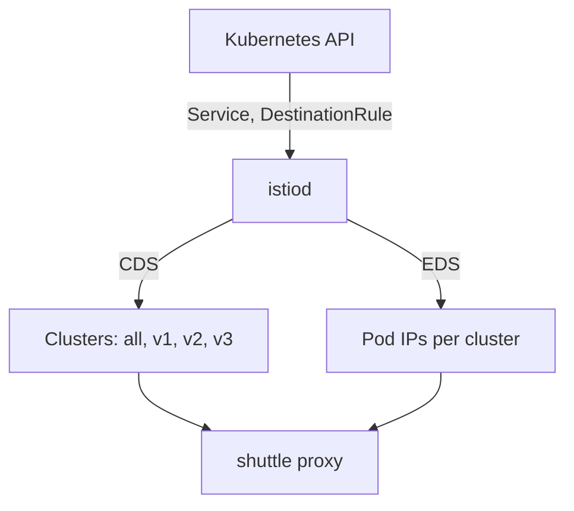

# Name The Ship Classes

Astronaut, before you can send a signal to "v2", something has to say what `v2` means. That is the job of a `DestinationRule`: the docking instructions for one beacon.

One fact surprises almost everyone. A correct `DestinationRule` on its own moves **no traffic at all**. It only creates names. This part shows what those names are made of, what mission control builds from them, and why a name that points at no ship is not an error.

## From Service to cluster: what mission control builds

The Service is a Kubernetes object, but the shuttle's communications officer never reads it directly. Mission control turns it into orders the proxy understands. Here you see what those orders look like, so you can later read them back and check them.

### Two of the four channels

`istiod` is mission control. It watches Kubernetes and sends each proxy its orders over four channels, together called **xDS**. Two of them matter here:

- **CDS** (cluster discovery service) carries the list of **clusters**. A cluster is a named destination the proxy can send to.
- **EDS** (endpoint discovery service) carries the endpoints, the pod addresses, inside each cluster.

A `DestinationRule` changes what goes out on both channels.



`istiod` (mission control) reads the Service, the EndpointSlice and the `DestinationRule` from the Kubernetes API. Over CDS it sends the shuttle's proxy one cluster per host, port and subset, and over EDS the pod addresses for each. So the proxy ends up with four destinations: all of `scout`, `v1`, `v2` and `v3`. One Service becomes several named destinations, each with its own filtered list of pods. That is the whole trick behind subsets.

### One cluster becomes four

Without a `DestinationRule`, the proxy has exactly one cluster for `scout`. It holds every ready pod.

A `DestinationRule` with three subsets adds three more clusters. They have the same host and the same port, but different pod filters. The original cluster stays.

## The subset field in a cluster name

Every cluster has a four-part name. The third part is the subset:

```text
outbound | 9080 | v2 | scout.starfleet.svc.cluster.local
                  └── the subset name. Empty until a DestinationRule defines one.
```

The other parts are simple. `outbound` means "a destination this proxy can call". `9080` is the **Service** port. The last part is the full name of the Service.

`outbound|9080||scout.starfleet.svc.cluster.local`, with nothing between the middle bars, is the cluster without a subset. It existed before you wrote anything, and it stays afterwards. `istioctl proxy-config clusters` shows that empty field as `-` in its `SUBSET` column.

## The `DestinationRule` object

Now you give the ship classes their names. This section shows the object that does it, field by field, and what changes in the proxy the moment you apply it.

### Docking instructions for one beacon

A `DestinationRule` is the **docking instructions** for one beacon. It says which ship classes answer the beacon, and how to approach them. Each subset is a **ship class**: the same model and call sign, a different build.

This is the rule for `scout`. Save it to a file and apply it to your playground.

<!-- astrona:playground:renew -->

Save this as `destinationrule-scout.yaml`:

```yaml
apiVersion: networking.istio.io/v1
kind: DestinationRule
metadata:
  name: scout
  namespace: starfleet
spec:
  host: scout
  subsets:
  - name: v1
    labels:
      version: v1
  - name: v2
    labels:
      version: v2
  - name: v3
    labels:
      version: v3
```

Apply it:

```sh
kubectl apply -f destinationrule-scout.yaml
```

```text
destinationrule.networking.istio.io/scout created
```

Read it like this: *for the host `scout`, the word `v1` means the pods labelled `version: v1`.*

### What each field does

The rule above has five fields. Two of them, `metadata.name` and `spec.host`, look alike and are easy to mix up:

```text
 metadata.name        the object's name. You choose it. Nothing routes by it.
 metadata.namespace   where the object lives. Short host names are filled in from this.
 spec.host            the SERVICE this rule is about. A host name, not an object name.
 subsets[].name       the word a VirtualService will ask for later.
 subsets[].labels     pod labels. They decide which pods land in the subset.
```

Naming the object after its Service, as here, keeps things easy to find. But only `spec.host` decides which beacon the docking instructions are for.

### Three facts to remember

- **The subset name is your choice.** `v1` is only a habit. `stable`, `canary` or `blue` work just as well. Nothing checks the name against the `version` label.
- **The labels match pods, not Services.** That is why the scout ships carry a `version` label that the Service ignores.
- **A subset that matches no pod is not an error.** It becomes a destination with no ships in it. Nothing rejects it and nothing warns you. Signals sent there fail later with a `503`.

Keep **one `DestinationRule` per host**. Two sets of docking instructions for the same beacon give results that are hard to predict.

A `DestinationRule` holds more than subsets. The same object also sets how the sending proxy spreads signals over the ships, how many connections it opens, and when it takes a failing ship out of formation. This module uses only the subsets.

## The labels are pod labels

Two different selections run over the same scout ships. The Service picks which ships answer its call sign. A subset then picks which of those ships belong to one ship class:

```text
 Service.spec.selector       app=scout       → is this pod behind the Service?
 DestinationRule subset      version=v1      → of those pods, which ones are "v1"?
```

The two selections do not depend on each other:

- A pod labelled `version: v1` but without `app=scout` is not behind the scout beacon at all, so no subset can reach it.
- A pod with `app=scout` but no `version` label still answers the beacon, but it belongs to no ship class.

### Look at the labels

List the scout ships with their labels:

```sh
kubectl get pods -n starfleet -l app=scout --show-labels
```

```text
NAME                        READY   STATUS    LABELS
scout-v1-85bf65868-pjdcp    2/2     Running   app=scout,...,version=v1
scout-v2-866c98b568-vh8zp   2/2     Running   app=scout,...,version=v2
scout-v3-668c6dfc68-lsl4b   2/2     Running   app=scout,...,version=v3
```

(Trimmed to the labels that matter. Your pod names will be different: the end of each name is random.)

Every ship carries `app=scout`, so all three answer the beacon. Each one carries a different `version`, so each lands in a different subset.

## Watching the clusters appear

The `DestinationRule` you applied above already changed what the shuttle's communications officer holds. It did not change where any signal goes. Seeing both facts side by side is the clearest proof that subsets are only names.

### See the new clusters

Predict the result before you run it: more destinations in the shuttle's proxy, and the same random mix of versions as before.

```sh
istioctl proxy-config clusters deploy/shuttle -n starfleet | grep scout
count_versions $SCOUT/0
```

```text
scout.starfleet.svc.cluster.local          9080      -          outbound      EDS              scout.starfleet
scout.starfleet.svc.cluster.local          9080      v1         outbound      EDS              scout.starfleet
scout.starfleet.svc.cluster.local          9080      v2         outbound      EDS              scout.starfleet
scout.starfleet.svc.cluster.local          9080      v3         outbound      EDS              scout.starfleet
```

`count_versions` still gives a random mix of v1, v2 and v3. Look at the third column, `SUBSET`: it now has `-`, `v1`, `v2` and `v3`. The last column names the `DestinationRule` that built them. The traffic did not move, because nothing *uses* the subsets yet.

The row with `-` did not go away. Signals that ask for no subset still have somewhere to go.

`kubectl apply` returns as soon as Kubernetes has stored the object, not when the proxy has its new orders. If a listing still looks old, wait a second and run it again before you start debugging.

## Which pods landed in which cluster

A subset is only useful if its labels actually pick up ships. `istioctl proxy-config endpoints` answers exactly that question: which pod addresses sit inside one destination. Most unexplained `503` errors in this module come down to this question.

### List the ships in one subset

A cluster's full four-part name is its ID, so `--cluster` takes the whole string. Put it in quotes, so the shell does not read `|` as a pipe:

```sh
istioctl proxy-config endpoints deploy/shuttle -n starfleet \
  --cluster "outbound|9080|v2|scout.starfleet.svc.cluster.local"
```

```text
ENDPOINT            STATUS      OUTLIER CHECK     CLUSTER
10.244.0.8:9080     HEALTHY     OK                outbound|9080|v2|scout.starfleet.svc.cluster.local
```

You see one row: the `scout-v2` ship. The subset's labels picked one ship out of the beacon's three. (Pod addresses change with every playground run, so your address will be different, and it may not match other addresses shown in this module.)

`STATUS` is the proxy's own view of the ship's health. `OUTLIER CHECK` says whether the proxy has pulled the ship out of formation for failing too often. Neither column tells you whether your labels were right. Only whether a row appears at all tells you that.

## When a subset selects nothing

This is the failure this part has been building up to. A subset whose labels match no ship is accepted everywhere. It becomes a destination with an empty list of ships. See it once on purpose, so you recognise it when it happens by accident.

### Send signals to the subset

A subset only matters when a route uses it. Save this "all signals to v1" flight plan as `virtualservice-scout.yaml`. For now, read it as "send every scout signal to the `v1` ship class":

```yaml
apiVersion: networking.istio.io/v1
kind: VirtualService
metadata:
  name: scout
  namespace: starfleet
spec:
  hosts:
  - scout
  http:
  - route:
    - destination:
        host: scout
        subset: v1
```

Apply it:

```sh
kubectl apply -f virtualservice-scout.yaml
```

### Break the subset

Now point the `v1` subset at a label no ship has, `version: v9`. Save this as `destinationrule-scout-broken.yaml`:

```yaml
apiVersion: networking.istio.io/v1
kind: DestinationRule
metadata:
  name: scout
  namespace: starfleet
spec:
  host: scout
  subsets:
  - name: v1
    labels:
      version: v9
  - name: v2
    labels:
      version: v2
  - name: v3
    labels:
      version: v3
```

Apply it:

```sh
kubectl apply -f destinationrule-scout-broken.yaml
```

### Read the failure

Send one signal, read the shuttle's flight log, and ask `istioctl analyze`:

```sh
kubectl exec -n starfleet deploy/shuttle -- curl -s -o /dev/null -w "%{http_code}\n" $SCOUT/0
kubectl logs -n starfleet deploy/shuttle -c istio-proxy --tail=1
istioctl analyze -n starfleet
```

```text
503
"GET /reviews/0 HTTP/1.1" 503 UH no_healthy_upstream ... outbound|9080|v1|scout.starfleet.svc.cluster.local
Error [IST0173] (DestinationRule starfleet/scout) The Subset v1 defined in the DestinationRule does not select any pods. Which may lead to 503 UH (NoHealthyUpstream).
```

(The log line is trimmed.)

The subset **exists**, so the `v1` destination exists too: you can see its name in the log line. But no ship has `version=v9`, so the destination is empty. The flight log marks this with **`UH`**, "no healthy upstream": there was nowhere to deliver the signal.

If you still get `200`, or the log line is an older one, the new orders have not reached the communications officer yet. Wait a second and run the `curl` and `kubectl logs` lines again.

### Put it back

Apply the correct rule again:

```sh
kubectl apply -f destinationrule-scout.yaml
```

## What `istioctl analyze` catches here

`istioctl analyze` runs Istio's own checks over the objects in a namespace. Unlike plain YAML validation, it also checks objects against each other. You just saw one of its findings: `IST0173`, a subset that selects no pods. The other check that matters in this module is `IST0101`: a `VirtualService` asks for a subset that no `DestinationRule` defines. You get it when a flight plan names a ship class that the docking instructions never listed.

### A clean result

Run it again, now that the correct `DestinationRule` is back:

```sh
istioctl analyze -n starfleet
```

```text
✔ No validation issues found when analyzing namespace: starfleet.
```

That is what a clean result looks like. `analyze` is a quick first check, not proof that everything works. To see which ships a subset really holds, list its endpoints as shown above.

## Common pitfalls

> [!WARNING]
> - **Expecting a `DestinationRule` to move traffic.** It only defines names. If you applied one and the split did not change, it is working as designed.
> - **Mixing up `metadata.name` and `spec.host`.** Only `spec.host` decides which Service the rule is for.
> - **Treating subset labels as Service labels.** They match *pod* labels. A label only on the Deployment's own `metadata`, and not on the pod template, selects nothing.
> - **Checking too fast.** `kubectl apply` returns before mission control's new orders reach the proxy. A listing taken straight away can still show the old state.

> *A `DestinationRule` builds clusters, not behaviour. It names destinations so that something else can choose between them.*
