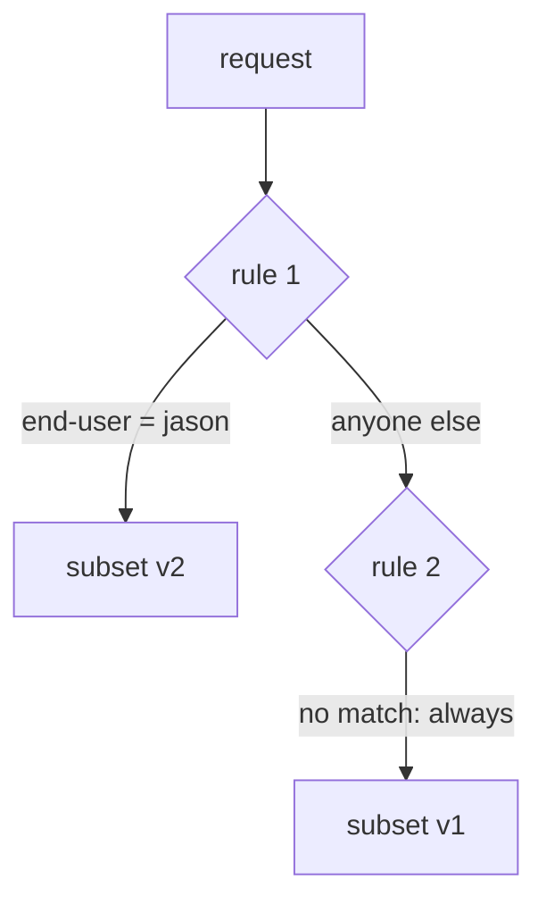
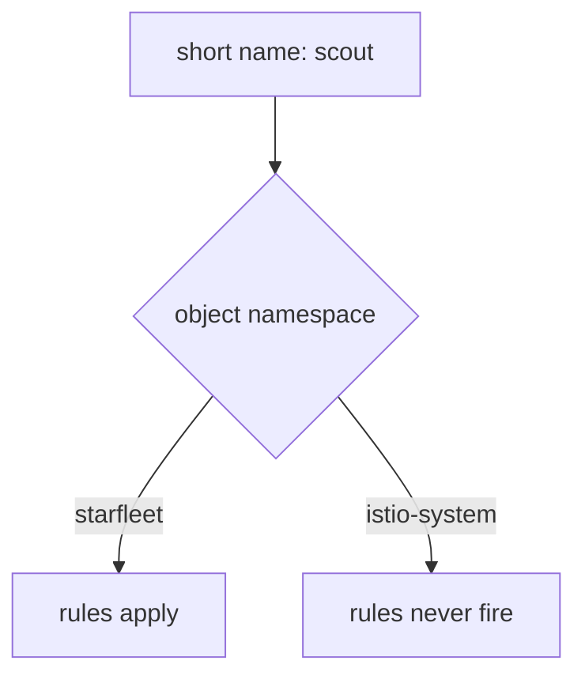

# Evaluation Order, Name Resolution And Proof

You can now name destinations and read a signal's label. Three things are left. Which rule wins when several could apply. How short host names are filled in, which can make a correct-looking object do nothing. And how to prove the proxy received your work. Almost every failure in this module lands in one of those three.

The commands below assume the `scout` `DestinationRule` from Part 1 and the `count_versions` helper.

## First match wins

The `http` field is a list of rules. For each signal, the proxy reads the list **from the top** and **stops at the first rule whose `match` fits**. There is no scoring, no "most specific rule wins", and no merging. Think of it as the flight plan's checklist: the crew reads it top to bottom and uses the first line that fits.



Rule 1 asks "is `end-user` equal to `jason`?". If yes, the signal goes to subset v2 and the checking stops. Rule 2 has no match, so it fits every signal that gets that far, and sends it to v1. There is one arrow out of every rule and no way back up. The order in your file is the order of the checks. Istio does not sort the rules for you.

A rule without `match` fits every request. This is the **catch-all** rule: the "everyone else" line at the bottom of the checklist. It can only ever be useful as the **last** rule. Put it first, and every rule below it is dead.

> [!TIP]
> **Try it: the right order, then the wrong order**
>
> Start with jason's rule first and the catch-all last (the same file as in Part 2):
>
> ```sh
> cat > virtualservice-scout.yaml <<'EOF'
> apiVersion: networking.istio.io/v1
> kind: VirtualService
> metadata:
>   name: scout
>   namespace: starfleet
> spec:
>   hosts:
>   - scout
>   http:
>   - match:
>     - headers:
>         end-user:
>           exact: jason
>     route:
>     - destination:
>         host: scout
>         subset: v2
>   - route:
>     - destination:
>         host: scout
>         subset: v1
> EOF
> kubectl apply -f virtualservice-scout.yaml
> count_versions -H "end-user: jason" $SCOUT/0
> ```
>
> Expect `10 scout-v2`. Now swap the order: put the catch-all first. That file is `examples/02-header-based-routing/02-virtualservice-scout-wrong-order.yaml` in the playground.
>
> ```sh
> cat > virtualservice-scout-wrong-order.yaml <<'EOF'
> apiVersion: networking.istio.io/v1
> kind: VirtualService
> metadata:
>   name: scout
>   namespace: starfleet
> spec:
>   hosts:
>   - scout
>   http:
>   - route:
>     - destination:
>         host: scout
>         subset: v1
>   - match:
>     - headers:
>         end-user:
>           exact: jason
>     route:
>     - destination:
>         host: scout
>         subset: v2
> EOF
> kubectl apply -f virtualservice-scout-wrong-order.yaml
> count_versions -H "end-user: jason" $SCOUT/0
> istioctl analyze -n starfleet
> ```
>
> Expect:
>
> ```text
>   10 scout-v1
> Warning [IST0130] (VirtualService starfleet/scout) VirtualService rule #1 not used
> (route without matches defined before).
> ```
>
> Rule #1 is the jason rule, because rules are counted from 0. It can never match, and `analyze` tells you so. `kubectl apply` prints the same warning. Put the right order back with `kubectl apply -f virtualservice-scout.yaml`.

## Why there is no "most specific" rule

If you come from `Ingress` or most web frameworks, you expect a longer, more specific path to win wherever it sits. Istio does not work that way, on purpose. **You** set the priority by ordering the list. The proxy does not guess it.

That gives a rule of thumb that answers almost every ordering question:

```text
  most specific rule       first
       ...
  least specific rule
  the catch-all (no match) last, always
```

The same idea explains a second trap. Two `VirtualService` objects for the same host have no set order between them. Istio only combines them in some cases, and you should not build on the result. Keep **one `VirtualService` per host**, with your order written inside its `http` list where you can see it.

## No catch-all: `404 NR`

Leaving out the catch-all is a different mistake. Once a `VirtualService` exists for `scout`, the proxy only knows the routes inside it. A request that matches no rule has no route at all. The proxy then answers with **`404`** ("not found") by itself.

This is valid configuration. Maybe you really wanted it. So `istioctl analyze` stays quiet. Always ask yourself: "What happens to requests that match nothing?"

> [!TIP]
> **Try it: only the jason rule, nothing for everyone else**
>
> ```sh
> cat > virtualservice-scout-no-catch-all.yaml <<'EOF'
> apiVersion: networking.istio.io/v1
> kind: VirtualService
> metadata:
>   name: scout
>   namespace: starfleet
> spec:
>   hosts:
>   - scout
>   http:
>   - match:
>     - headers:
>         end-user:
>           exact: jason
>     route:
>     - destination:
>         host: scout
>         subset: v2
> EOF
> kubectl apply -f virtualservice-scout-no-catch-all.yaml
> kubectl exec -n starfleet deploy/shuttle -- curl -s -o /dev/null -w "%{http_code}\n" $SCOUT/0
> kubectl exec -n starfleet deploy/shuttle -- curl -s -o /dev/null -w "%{http_code}\n" -H "end-user: jason" $SCOUT/0
> kubectl logs -n starfleet deploy/shuttle -c istio-proxy --tail=2
> istioctl analyze -n starfleet
> ```
>
> Expect (log line trimmed):
>
> ```text
> 404
> 200
> "GET /reviews/0 HTTP/1.1" 404 NR route_not_found ...
> ✔ No validation issues found
> ```
>
> The flight log marks it with **`NR`**, "no route". `analyze` does **not** catch this one. Put the full rule back with `kubectl apply -f virtualservice-scout.yaml`.

## Short host names are filled in from the object's namespace

`spec.hosts` and every `destination.host` accept a short name like `scout`. A short name works like a beacon's call sign without its planet. Istio fills in the planet for you: the **namespace of the object the name appears in** (each namespace is a planet in your solar system). Not the workload's namespace, and not the caller's.



Here the short name is `scout`, and the question is which namespace the **object** lives in. Only the namespace of the object you wrote counts: in `starfleet` the short name becomes `scout.starfleet.svc.cluster.local`, a Service that exists, so the rules apply. In `istio-system` it becomes `scout.istio-system.svc.cluster.local`, which does not exist, so the rules never fire.

Create the object in the wrong namespace and nothing happens. `kubectl get virtualservice` shows it. It is valid. And no rule ever fires, because the host it describes does not exist there.

The full name, `scout.starfleet.svc.cluster.local`, is the complete address: call sign, planet and solar system. People also call it the **FQDN** (fully qualified domain name). It cannot be misread. Use it whenever the object and the service do not live in the same namespace, and in the exam whenever you are unsure.

The same rule applies to `DestinationRule.spec.host`. A `DestinationRule` in the wrong namespace defines subsets for a host nobody calls.

> [!TIP]
> **Try it: the same rule with full names**
>
> ```sh
> cat > virtualservice-scout-fqdn.yaml <<'EOF'
> apiVersion: networking.istio.io/v1
> kind: VirtualService
> metadata:
>   name: scout
>   namespace: starfleet
> spec:
>   hosts:
>   - scout.starfleet.svc.cluster.local
>   http:
>   - route:
>     - destination:
>         host: scout.starfleet.svc.cluster.local
>         subset: v1
> EOF
> kubectl apply -f virtualservice-scout-fqdn.yaml
> count_versions $SCOUT/0
> ```
>
> Expect `10 scout-v1`. Here the short and the full name mean the same service, because the object lives in `starfleet`. The file has the same name (`scout`), so it replaces the earlier rule.

## The failure signatures

Most broken routing tasks show one of a few symptoms. Each points at a different part of your setup. The access log's **response flag** (the short code in the flight log for what went wrong) tells them apart. You find the flag in the access log line, right after the HTTP status code.

| Symptom | Flag | Means | Look at |
| --- | --- | --- | --- |
| **The wrong version answers, no error** | none | a rule matched that you did not expect | rule order; AND/OR; a catch-all above your rules |
| **`404`** | `NR` | no rule matched, and there is no catch-all | add a catch-all as the last rule |
| **`503`** | `NC` | the route names a subset with no cluster | subset name spelled wrong; `DestinationRule` missing, in another namespace, or not yet pushed |
| **`503`** | `UH` | the cluster exists but has no pods | subset labels match no pod; pods not ready (Part 1) |

`NC` and `UH` look the same to the caller. Both are a bare `503`, with nothing in the response or the app's logs. Reading the flag is what tells you which row you are in.

| Flag | Subset in `DestinationRule`? | Pods behind it? | Typical cause |
| --- | --- | --- | --- |
| `NC` | no | – | typo in `subset:`, `DestinationRule` missing or applied too late |
| `UH` | yes | none | wrong `labels`, pods not running or not ready |

`istioctl analyze` catches the common `NC` case, a subset that no `DestinationRule` defines, by checking the two objects against each other.

> [!TIP]
> **Try it: a typo in the subset name (`503 NC`)**
>
> ```sh
> cat > virtualservice-scout-typo.yaml <<'EOF'
> apiVersion: networking.istio.io/v1
> kind: VirtualService
> metadata:
>   name: scout
>   namespace: starfleet
> spec:
>   hosts:
>   - scout
>   http:
>   - route:
>     - destination:
>         host: scout
>         subset: v4
> EOF
> kubectl apply -f virtualservice-scout-typo.yaml
> kubectl exec -n starfleet deploy/shuttle -- curl -s -o /dev/null -w "%{http_code}\n" $SCOUT/0
> kubectl logs -n starfleet deploy/shuttle -c istio-proxy --tail=1
> istioctl analyze -n starfleet
> ```
>
> Expect (log line trimmed):
>
> ```text
> 503
> "GET /reviews/0 HTTP/1.1" 503 NC cluster_not_found ...
> Error [IST0101] (VirtualService starfleet/scout) Referenced host+subset in destinationrule not found: "scout+v4"
> ```
>
> If the log line is an older one, the flight log has not been written yet. Run the `kubectl logs` line again.
>
> `istiod` builds one cluster per subset in the `DestinationRule`. There is no `v4` subset, so there is no `v4` cluster. The route points at nothing, and the request never leaves the `shuttle` pod. Put the working rule back with `kubectl apply -f virtualservice-scout.yaml`.

You get the same `NC` for a short time if you apply the `VirtualService` *before* the `DestinationRule` it uses. The safe order is called "make before break": apply the `DestinationRule` first, wait a moment, then apply the `VirtualService` that uses it.

## Proving the proxy has your rules

Istio accepting an object and the communications officer acting on it are two different facts. When they disagree, the object looks perfect and the behaviour is wrong. That can happen when mission control's push has not landed, when a `Sidecar` resource hides the host from that proxy, or when the object is in the wrong namespace. `istioctl proxy-config` shows which.

For this module the useful subcommand is `routes`: the route table, where a `VirtualService` lands. If you doubt the push itself, `istioctl proxy-status` answers that first (every proxy should show `SYNCED`).

Read `proxy-config routes` as "show the proxy's routing table". An easy way to remember the split: the **route** picks a cluster, and the **cluster** holds the pods. That is the same split as `VirtualService` and `DestinationRule`.

> [!TIP]
> **Try it: the route points at the v1 cluster**
>
> ```sh
> istioctl proxy-config routes deploy/shuttle -n starfleet --name 9080 -o json | grep '"cluster".*scout'
> istioctl proxy-config clusters deploy/shuttle -n starfleet | grep scout
> ```
>
> Expect something like:
>
> ```text
> "cluster": "outbound|9080|v1|scout.starfleet.svc.cluster.local"
> scout.starfleet.svc.cluster.local   9080   -    outbound   EDS   scout.starfleet
> scout.starfleet.svc.cluster.local   9080   v1   outbound   EDS   scout.starfleet
> scout.starfleet.svc.cluster.local   9080   v2   outbound   EDS   scout.starfleet
> scout.starfleet.svc.cluster.local   9080   v3   outbound   EDS   scout.starfleet
> ```
>
> One cluster per subset, plus `-` for the whole service. The route uses the v1 cluster. If a `VirtualService` exists in `kubectl` but its cluster never shows up here, the break is between mission control and this proxy, not in your YAML.

## Common pitfalls

> [!WARNING]
> - **The catch-all placed first.** It fits every request, and checking stops at the first fit. Every rule below it is dead. `istioctl analyze` warns with `IST0130`.
> - **No catch-all at all.** Requests that match nothing get `404 NR`. `analyze` does not warn.
> - **A subset no `DestinationRule` defines.** `503 NC`. `analyze` reports `IST0101`.
> - **A subset whose labels match no pod.** `503 UH`. `analyze` reports `IST0173`; `proxy-config endpoints` shows the empty list.
> - **The object in the wrong namespace.** Short names are filled in from the object's own namespace. The object exists; the rules never fire. Use full names.
> - **Trusting a clean `analyze`.** It checks objects against each other. It does not prove your rules are in a sensible order or that requests take the path you expect.

> *When behaviour and configuration disagree, `istioctl analyze` checks the objects against each other, and `istioctl proxy-config` checks what the proxy was actually given. Use them in that order.*
