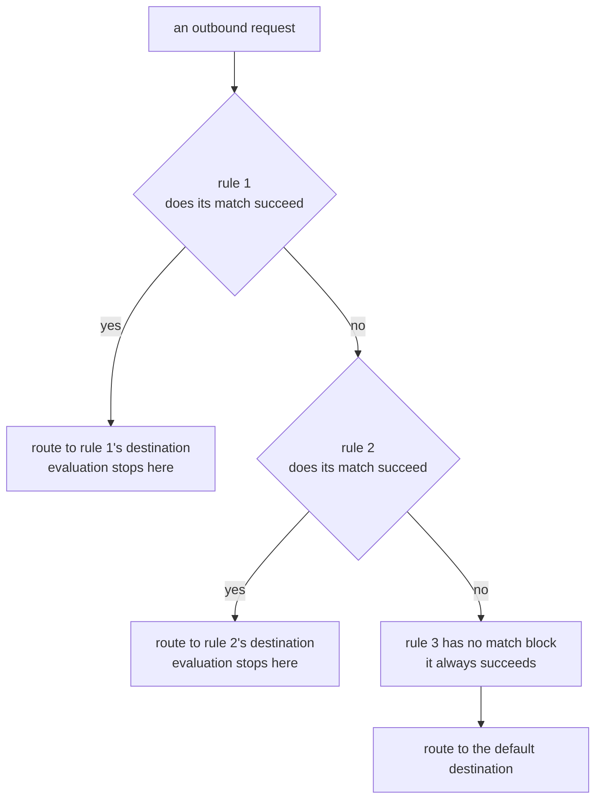
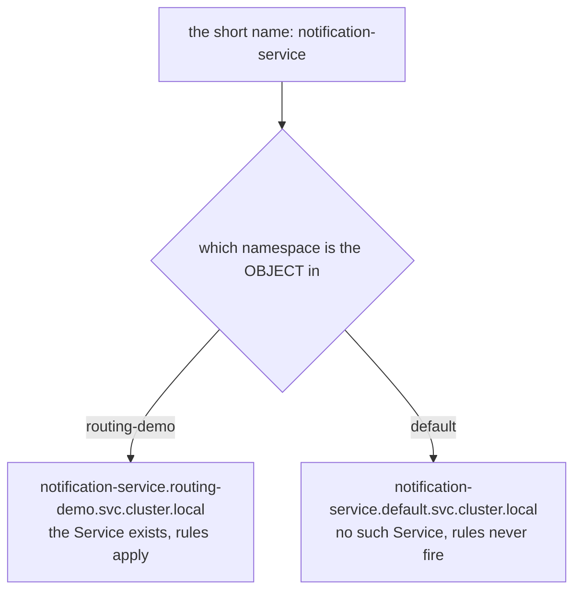

# Evaluation Order, Name Resolution And Proof

> Prerequisite: [Matching A Request](./course-02-matching-a-request.md). Next: [Rewriting, Redirecting And Headers](./course-04-rewriting-redirecting-and-headers.md).

You can now name destinations and describe requests. What remains is the part that decides behaviour when several rules could apply, the name-resolution rule that makes correct-looking objects do nothing, and the two commands that tell you whether the proxy ever received your work. Every failure mode in this module lands in one of those three.

## First match wins

Envoy walks the `http` list from the top and **stops at the first rule whose match succeeds**. There is no scoring, no "most specific rule", no merging.



There is one arrow out of every rule and no way back up. Whatever matches first is the answer, and nothing below it is consulted.

A rule with no `match` matches everything, so it can only ever be the **last** rule. Put it first and the rules below it are unreachable — and nothing tells you. The objects are valid, `istioctl analyze` is clean, the API server is happy, and every request quietly goes to the default. "My header rule does nothing" is, more often than not, this.

The complete configuration for this module's scenario — three specific rules, then the default:

```yaml
apiVersion: networking.istio.io/v1
kind: VirtualService
metadata:
  name: notification-service
  namespace: routing-demo
spec:
  hosts:
    - notification-service
  http:
    - match:
        - headers:
            testing:
              exact: "true"
      route:
        - destination:
            host: notification-service
            subset: v2
    - match:
        - uri:
            prefix: /notify/beta
      route:
        - destination:
            host: notification-service
            subset: v2
    - match:
        - queryParams:
            version:
              exact: "2"
      route:
        - destination:
            host: notification-service
            subset: v2
    - route:
        - destination:
            host: notification-service
            subset: v1
```

> [!TIP]
> **Try it — all four rules, then the same object with the default moved to the top**
>
> ```sh
> kubectl apply -f - <<'EOF'
> apiVersion: networking.istio.io/v1
> kind: VirtualService
> metadata:
>   name: notification-service
>   namespace: routing-demo
> spec:
>   hosts:
>     - notification-service
>   http:
>     - match:
>         - headers:
>             testing:
>               exact: "true"
>       route:
>         - destination: { host: notification-service, subset: v2 }
>     - match:
>         - uri:
>             prefix: /notify/beta
>       route:
>         - destination: { host: notification-service, subset: v2 }
>     - match:
>         - queryParams:
>             version:
>               exact: "2"
>       route:
>         - destination: { host: notification-service, subset: v2 }
>     - route:
>         - destination: { host: notification-service, subset: v1 }
> EOF
> echo "--- correct order ---"
> kubectl -n routing-demo exec deploy/tester -- sh -c \
>   'for i in $(seq 1 10); do curl -s -X POST http://notification-service/notify; echo; done' | sort -u
> kubectl -n routing-demo exec deploy/tester -- curl -s -X POST -H "testing: true" http://notification-service/notify
> kubectl -n routing-demo exec deploy/tester -- curl -s -X POST 'http://notification-service/notify?version=2'
> ```
>
> Expect something like:
>
> ```text
> --- correct order ---
> ["EMAIL"]
> ["EMAIL","SMS"]
> ["EMAIL","SMS"]
> ```
>
> Ten default requests collapse to one distinct answer, and each specific request reaches `v2`. Now move the last rule to the top of the `http` list, re-apply, and repeat: every line becomes `["EMAIL"]`. Same four rules, same matches, no error anywhere — and three of them are dead.

## Why there is no "most specific" rule

Coming from `Ingress`, or from most web frameworks, the instinct is that a longer or more specific path wins regardless of where it sits. Istio does not work that way, and the difference is deliberate: **you** express the priority, by ordering the list. The proxy does not infer it.

That gives you a rule of thumb that resolves almost every ordering question:

```text
  most specific rule   first
       ...
  least specific rule
  the default (no match)   last, always
```

The same principle explains a second trap. Two `VirtualService` objects for the same host do not sit in a defined order relative to each other — Istio merges them, and the merge order across objects is not something to build behaviour on. Keep **one `VirtualService` per host**, with your ordering expressed inside its `http` list where you can see it.

## Short host names resolve to the object's namespace

`spec.hosts` and every `destination.host` accept a short name, and a short name is expanded **relative to the namespace of the object it appears in** — not the namespace of the workload, and not the caller's namespace.



The caller's namespace and the workload's namespace play no part in it. Only the namespace of the object you wrote.

Create the object in the wrong namespace and the outcome is silence: `kubectl get virtualservice` shows it existing, the schema is valid, and no rule ever fires because the host it describes does not exist there. The fully qualified form `notification-service.routing-demo.svc.cluster.local` is unambiguous and is what to reach for whenever the object and the workload are not obviously together.

The same expansion applies to `DestinationRule.spec.host`. A `DestinationRule` in the wrong namespace defines subsets for a host nobody is calling, which surfaces as the 503 in the next section.

## The two failure signatures

Almost every broken routing task in this domain presents as one of two symptoms, and they point at different halves of the module:

| Symptom | Means | Look at |
| --- | --- | --- |
| **The wrong destination answers, no errors** | a rule matched that you did not expect | rule order; AND/OR nesting; whether a default sits above your rules |
| **HTTP 503, no useful log** | the route resolved to a cluster with no endpoints | subset name spelled differently from the `DestinationRule`; `DestinationRule` missing or in another namespace; subset labels matching no pod |

The access log separates those two cleanly, using the response flags from foundations: a rule that matched nothing leaves `NR`, while a cluster with no usable endpoints leaves `UH`. Both reach the caller as a bare 503, so reading the flag is what tells you which row of the table above you are in.

The 503 case is worth practising deliberately, because there is nothing in the response, the application log or the Kubernetes events that names the cause. `istioctl analyze` catches the common version of it — a subset no `DestinationRule` defines — by cross-referencing the two objects.

> [!TIP]
> **Try it — break the subset name on purpose**
>
> ```sh
> kubectl -n routing-demo patch virtualservice notification-service --type merge -p '
> spec:
>   http:
>     - route:
>         - destination:
>             host: notification-service
>             subset: v3'
> kubectl -n routing-demo exec deploy/tester -- \
>   curl -s -o /dev/null -w '%{http_code}\n' -X POST http://notification-service/notify
> istioctl analyze -n routing-demo
> ```
>
> Expect something like:
>
> ```text
> 503
> Error [IST0101] (VirtualService routing-demo/notification-service) Referenced host+subset in destinationrule not found: "notification-service+v3"
> ```
>
> A bare 503 from the call, and `IST0101` naming the exact problem. That error code is the reason to run `analyze` before declaring any task finished — it turns a symptom with no information into a sentence. Re-apply the correct four-rule object from the previous checkpoint before moving on.

## Proving the proxy has your rules

The control plane accepting an object and the sidecar acting on it are separate facts. When they disagree — a push that has not landed, a `Sidecar` resource scoping the host away, an object in the wrong namespace — the object looks perfect and the behaviour is wrong. `istioctl proxy-config` is how you tell.

Foundations covered the full `proxy-config` map and the order to work through it. For this module the relevant subcommand is `routes` — the RDS layer — because that is where a `VirtualService` lands. If the push itself is in doubt, `istioctl proxy-status` answers that first.

Two things to look for in the output. The rule you wrote should appear on the virtual host for your service, and the `VIRTUAL SERVICE` column should now **name your object**. An empty column there means no `VirtualService` is attached to that host at all — the route is still the one Istio generated from the Service — which usually means the namespace or the host name is wrong.

> [!TIP]
> **Try it — the routes as the client proxy holds them**
>
> ```sh
> istioctl proxy-config routes deploy/tester -n routing-demo | grep notification
> ```
>
> Expect something like:
>
> ```text
> 80     notification-service, notification-service.routing-demo + 1 more...     /notify/beta*
> 80     notification-service, notification-service.routing-demo + 1 more...     /*
> ```
>
> These are your rules, compiled into Envoy's route table and pushed to the `tester` pod. If a `VirtualService` exists in `kubectl` but its host does not appear here, the break is between the control plane and this proxy — not in your YAML's syntax, and no amount of re-reading the object will show it.

## Common pitfalls

> [!WARNING]
> **The default route placed first.** A rule with no `match` matches everything and evaluation stops at the first match, so every rule below it is dead code — with no error anywhere. Check order before anything else.
>
> **A subset no `DestinationRule` defines.** Bare 503, nothing in the logs. `istioctl analyze -n <namespace>` reports it as `IST0101` immediately.
>
> **A subset whose labels match no pod.** Not an error, not caught by `analyze`. It is a valid cluster with zero endpoints, and it also produces a 503. `istioctl proxy-config endpoints` is the only thing that shows it.
>
> **Unquoted YAML values that look like booleans or numbers.** `exact: true` is a boolean and is rejected; `exact: "true"` is the string you meant. Quote every header and query value.
>
> **The object in the wrong namespace.** Short host names resolve relative to the object's own namespace. The object exists, the rules never fire.
>
> **Matching a query string with `uri`.** The `uri` value stops at the `?`. Use `queryParams`.
>
> **Assuming `analyze` being clean means the configuration works.** It cross-checks references; it does not check that your labels select real pods, or that your rules are in a sensible order.

> *When behaviour and configuration disagree, `istioctl analyze` checks the objects against each other and `istioctl proxy-config` checks what the proxy was actually given — in that order.*

## Reference

- [VirtualService API](https://istio.io/latest/docs/reference/config/networking/virtual-service/) — the full object, including the `timeout`, `retries`, `fault` and `mirror` fields later sections add to these rules.
- [Istio analyzer message reference](https://istio.io/latest/docs/reference/config/analysis/) — every `IST####` code, including `IST0101`, with what triggers it.
- [Debugging Envoy and istiod](https://istio.io/latest/docs/ops/diagnostic-tools/proxy-cmd/) — the `proxy-config` and `proxy-status` workflow in full.
- `istioctl proxy-config routes --help` — `--name` and `-o json`, which are what make the output usable on a busy proxy.
