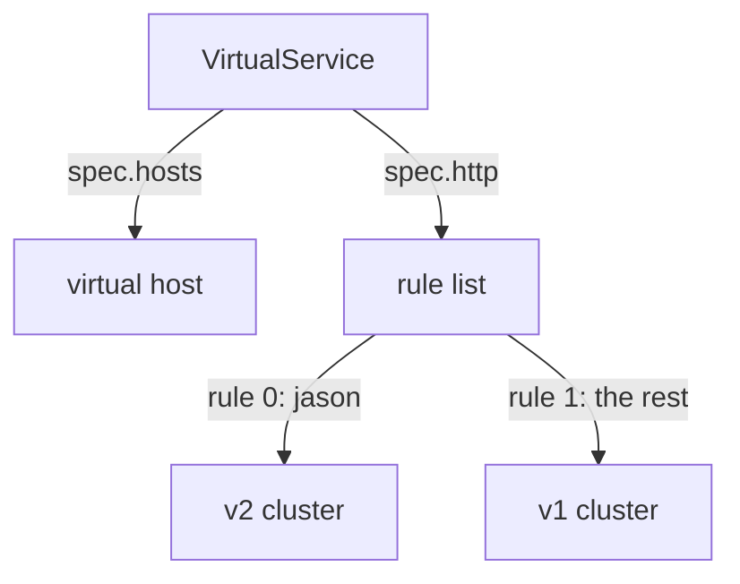

# Route Requests With A VirtualService

A `DestinationRule` gives the `scout` versions their names, but it does not send any request to them. That decision lives in a second object, the `VirtualService`. A **`VirtualService`** is an Istio object that sets how requests to a host are routed: it reads each request and picks the destination.

This part shows the object, the shape of one routing rule, and what a rule can read in a request. At the end, requests from the user `jason` go to their own version of `scout`.

The commands below need the `scout` `DestinationRule` with the subsets `v1`, `v2` and `v3` applied in your playground. They also use the `count_versions` helper, which sends 10 requests from the `shuttle` pod to `scout` and counts which version answered. Paste it into your terminal if it is not there yet:

<!-- astrona:playground:renew -->

```sh
count_versions() { for i in $(seq 1 10); do
  kubectl exec -n starfleet deploy/shuttle -- curl -s "$@" | grep -o 'scout-v[0-9]' || echo none
done | sort | uniq -c; }
SCOUT=http://scout:9080/reviews
```

## The `VirtualService` object

Start with the simplest `VirtualService` there is: send every request to `scout` to the `v1` subset.

Save this as `virtualservice-scout.yaml`:

```yaml
apiVersion: networking.istio.io/v1
kind: VirtualService
metadata:
  name: scout
  namespace: starfleet
spec:
  hosts:
  - scout              # requests TO this name follow this VirtualService
  http:
  - route:
    - destination:
        host: scout    # ...and this is where a matching request is SENT
        subset: v1
```

Apply it:

```sh
kubectl apply -f virtualservice-scout.yaml
```

Here is what each field does:

```text
 spec.hosts       WHO IS BEING CALLED. The name a client uses.
 spec.http        an ordered LIST of rules. The order matters: the first rule that fits wins.
 http[].match     WHICH requests this rule applies to. Optional: no match means "all".
 http[].route     WHERE they go. Required. Names a host, and optionally a subset.
```

**Keep the two host fields apart.** `spec.hosts` is the host name on the *incoming* request: the address the client used. `destination.host` is the Service the proxy sends the request to. Here both are `scout`, because the goal is to change where `scout` traffic goes without changing what clients call.

The two fields do not have to be equal. A `VirtualService` at the edge of the mesh, for example, can have `hosts: ["starfleet.example.com"]` and send requests to an internal Service.

Both fields accept short names. Istio fills both in from the namespace of the `VirtualService` itself, not from the namespace of the client. That only causes trouble when the two namespaces are different.

One more field is set for you. A `VirtualService` with no `gateways` field applies to the reserved value `mesh`, which means every sidecar proxy in the mesh. So the sidecar proxy of `shuttle` gets this configuration too, and applies it before each request leaves the pod.

### Check where the requests go

Then check the result. Send 10 requests and count the answers:

```sh
count_versions $SCOUT/0
```

```text
  10 scout-v1
```

The sidecar proxy of `shuttle` now sends every request to v1. Refresh the `bridge` page at `http://127.0.0.1:9080/productpage`: the star ratings are gone, because v1 shows none.

Change `subset: v1` to `subset: v3` in `virtualservice-scout.yaml` and run `kubectl apply -f virtualservice-scout.yaml` again. Every answer now comes from v3. That is how you switch versions with Istio, and how you switch back. You never touch the pods.

## The shape of one rule

Every `VirtualService` is built from the same small pieces. Once you can see them, any `VirtualService` is easy to read.

The `http` field is a list. Each item is one rule with two halves. This is only a piece of a `VirtualService`, so you do not apply it:

```yaml
http:
- match:                  # WHICH requests (optional)
  - headers:
      end-user:
        exact: jason
  route:                  # WHERE they go (required)
  - destination:
      host: scout
      subset: v2
```

`subset: v2` only works because the `scout` `DestinationRule` defines a subset called `v2`. `match` is optional. A rule without one matches every request, so it belongs at the end of the list.

`istiod` turns each rule into an Envoy **route entry**: a test, plus the cluster to send matching requests to. A cluster is Envoy's name for a destination with a list of endpoints. `istiod` groups the route entries for one `spec.hosts` name into a **virtual host**, and sends the whole route table to the proxy over RDS (Route Discovery Service), one of the xDS services it uses to push configuration.



The diagram shows a `VirtualService` with a rule for `jason` and a rule for everyone else. That gives two route entries in the `scout` virtual host: entry 0 sends `end-user = jason` to the v2 cluster, and entry 1 sends everything else to v1.

## What a match can look at

A rule only helps if it can tell requests apart. This section lists what a rule can read in a request, and the two traps that make a correct-looking rule never match.

A match condition says two things: **what** to compare, and **how** to compare it. First, the "what":

| What | Field | Note |
| --- | --- | --- |
| a request header | `headers: {end-user: {...}}` | header names ignore upper and lower case; values do not |
| the path | `uri: {...}` | the path only. The query string after `?` is *not* part of it |
| a URL parameter | `queryParams: {canary: {...}}` | the parameters after the `?` |
| the HTTP method | `method: {...}` | `GET`, `POST`, ... |
| the calling pod | `sourceLabels: {app: bridge}` | the labels of the workload that sends the request |

An HTTP **header** is a name and a value sent with a request, such as `end-user: jason`. When you log in on the `bridge` page as `jason`, `bridge` adds the header `end-user: jason` to the requests it sends to `scout`.

`headers` and `queryParams` are **maps**. You give the header or parameter name as the key, and the comparison as the value. If you list two headers under one `headers:` key, both must match.

Two of these fields have a catch. Each one can give a rule that looks right and never matches:

- **`uri` does not include the query string.** A request for `/reviews/0?canary=true` has a `uri` of `/reviews/0`. Use `queryParams` for the part after `?`. Paths are also case-sensitive: `/Reviews` is not `/reviews`.
- **Header names ignore case, header values do not.** The section on upper and lower case below shows this with real requests.

There are more match fields: `withoutHeaders`, `authority` (the `Host` header), `scheme` and `port`. The fields in the table are the ones you use most.

### Send jason to v2

Now give requests from `jason` their own version. Every other request stays on v1.

Save this as `virtualservice-scout.yaml`:

```yaml
apiVersion: networking.istio.io/v1
kind: VirtualService
metadata:
  name: scout
  namespace: starfleet
spec:
  hosts:
  - scout
  http:
  - match:
    - headers:
        end-user:
          exact: jason
    route:
    - destination:
        host: scout
        subset: v2
  - route:
    - destination:
        host: scout
        subset: v1
```

Apply it:

```sh
kubectl apply -f virtualservice-scout.yaml
```

### Check jason and everyone else

Then check the result. Send 10 requests with the `end-user: jason` header, then 10 without it:

```sh
count_versions -H "end-user: jason" $SCOUT/0
count_versions $SCOUT/0
```

```text
  10 scout-v2
  10 scout-v1
```

The requests with `end-user: jason` match the first rule, so the proxy sends them to v2. The requests without the header match no `match`, so they fall through to the last rule, the catch-all, and go to v1.

### Test upper and lower case

A header has two parts. In `end-user: jason`, the part before the colon is the header **name**, and the part after it is the **value**. Istio treats them differently.

The name ignores case. In HTTP, header names are not case-sensitive, so `end-user`, `End-User` and `END-USER` are the same header. Envoy turns every header name into lower case before it compares anything.

The value is compared exactly. `exact: jason` means these five letters, all in lower case. `Jason` with a capital J is a different value.

Send the same request twice, once with the name in mixed case and once with the value in mixed case:

```sh
count_versions -H "End-User: jason" $SCOUT/0
count_versions -H "end-user: Jason" $SCOUT/0
```

```text
  10 scout-v2
  10 scout-v1
```

The table sums up the three cases:

| The request carries | Name matches? | Value matches? | Goes to |
| --- | --- | --- | --- |
| `end-user: jason` | yes | yes | v2 |
| `End-User: jason` | yes, case is ignored | yes | v2 |
| `end-user: Jason` | yes | no, `J` is not `j` | v1 |

Two habits keep you safe here. First, write the header name in lower case in your YAML. The Istio API asks for header names in a `match` to be lower case, with `-` between the words, like `end-user`. Second, if the value must ignore case, use a regular expression: `regex: "(?i)jason"` matches `jason`, `Jason` and `JASON`. The `(?i)` at the start means "ignore case" for the rest of the pattern.

## What you know now

A `VirtualService` lists rules in order. Each rule has an optional `match` and a required `route`, and the proxy of the client turns them into route entries in a virtual host. A rule can match on headers, the path, query parameters, the method and the calling pod. Header names ignore case, but values do not. The open question is how to compare text more loosely than `exact`, and how to combine several conditions in one rule.

## Common pitfalls

> [!WARNING]
> - **Mixing up `spec.hosts` and `destination.host`.** The first is the host the client called. The second is the Service the proxy sends the request to.
> - **Matching a query string with `uri`.** The path stops at the `?`. Use `queryParams`.
> - **Expecting header values to ignore case.** Only header *names* do. `Jason` is not `jason`.
> - **Forgetting the catch-all rule.** Without a last rule that has no `match`, requests that match no rule have no route.
