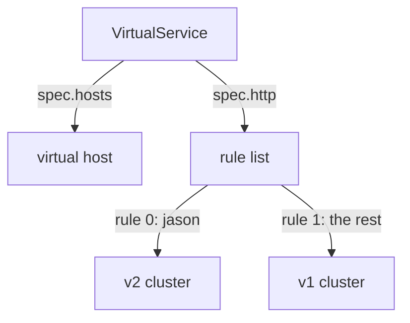

# Write A Flight Plan

Astronaut, you already named the scout ship classes. Now you decide which signals go to which class. That decision lives in a second object, the `VirtualService`: the **flight plan**. It reads each signal's labels before it chooses a destination.

This part shows the object, the shape of one routing rule, and what a rule can read on a signal. At the end, one astronaut, `jason`, gets his own ship class.

The commands below need the `scout` `DestinationRule` with the subsets `v1`, `v2` and `v3` applied in your playground, and the `count_versions` helper pasted into your terminal.

## The `VirtualService` object

Start with the simplest flight plan there is: send every scout signal to v1. Save this as `virtualservice-scout.yaml`:

```yaml
apiVersion: networking.istio.io/v1
kind: VirtualService
metadata:
  name: scout
  namespace: starfleet
spec:
  hosts:
  - scout              # requests TO this name follow this flight plan
  http:
  - route:
    - destination:
        host: scout    # ...and this is where a matching request is SENT
        subset: v1
```

Apply it:

```sh
kubectl apply -f virtualservice-scout.yaml
```

Line by line:

```text
 spec.hosts       WHO IS BEING CALLED. The name a client uses.
 spec.http        an ordered LIST of rules. The order matters: the first rule that fits wins.
 http[].match     WHICH requests this rule applies to. Optional: no match means "all".
 http[].route     WHERE they go. Required. Names a host, and optionally a subset.
```

**Keep the two host fields apart.** `spec.hosts` is the name on the *incoming* request: the address the caller used. `destination.host` is the name the proxy sends it on to. Here both are `scout`, because the module changes where `scout` traffic goes without changing what clients call. They do not have to match. A `VirtualService` at the edge of the mesh, for example, can have `hosts: ["starfleet.example.com"]` and send to an internal Service.

Both fields accept short names. Both are filled in from the namespace of the `VirtualService` itself, not from the namespace of the caller. That only causes trouble when the two are different.

One more field is set for you. A `VirtualService` with no `gateways` field applies to the reserved value `mesh`: every sidecar in the mesh gets the flight plan. So the shuttle's communications officer has it too, and applies it before each signal leaves the shuttle.

### Check where the signals go

Send 10 signals and count the answers:

```sh
count_versions $SCOUT/0
```

```text
  10 scout-v1
```

The `shuttle`'s communications officer now sends every signal to v1. Refresh the bridge page: the stars are gone. Change `subset: v1` to `subset: v3` in `virtualservice-scout.yaml`, run `kubectl apply -f virtualservice-scout.yaml` again, and every answer becomes v3. That is how you switch versions with Istio, and how you switch back. You never touch the pods.

## The shape of one rule

Every flight plan is built from the same small pieces. Once you can see them, any `VirtualService` is easy to read.

The `http` field is a list. Each item is one rule with two halves. This is only a piece of a `VirtualService`, so you do not apply it:

```yaml
http:
- match:                  # WHICH requests (optional)
  - headers:
      end-user:
        exact: jason
  route:                  # WHERE they go (required)
  - destination:
      host: scout
      subset: v2
```

`subset: v2` only works because the `scout` `DestinationRule` defines a subset called `v2`. `match` is optional. A rule without one matches everything, so it belongs at the end of the list.

Mission control turns each rule into an Envoy **route entry**: a test, plus the cluster to send matching signals to. The entries for one `spec.hosts` name are grouped into a **virtual host**, and the whole route table reaches the proxy over RDS, the route discovery channel.



For the jason flight plan, that gives two route entries in the `scout` virtual host: entry 0 sends `end-user = jason` to the v2 cluster, and entry 1 sends everything else to v1.

## What a match can look at

A rule only helps if it can tell signals apart. This section lists what a rule can read on a signal, and the two traps that make a correct-looking rule never fire.

A match condition says two things: **what** to compare, and **how** to compare it. First, the "what":

| What | Field | Note |
| --- | --- | --- |
| a request header | `headers: {end-user: {...}}` | header names ignore upper and lower case; values do not |
| the path | `uri: {...}` | the path only. The query string after `?` is *not* part of it |
| a URL parameter | `queryParams: {canary: {...}}` | the parameters after the `?` |
| the HTTP method | `method: {...}` | `GET`, `POST`, ... |
| the calling pod | `sourceLabels: {app: bridge}` | the labels of the workload that sends the request |

A **header** is a small label attached to a signal, like a tag painted on a crate before launch. The `end-user: jason` header is one of those labels.

`headers` and `queryParams` are **maps**. You name the header or parameter as the key, and give the comparison as the value. Two headers under one `headers:` key must both match.

Two of these have a catch, because each one can give a rule that looks right and never fires:

- **`uri` does not include the query string.** A request for `/reviews/0?canary=true` has a `uri` of `/reviews/0`. Use `queryParams` for the part after `?`. Paths also care about upper and lower case: `/Reviews` is not `/reviews`.
- **Header names ignore case, header values do not.** Envoy, the program inside the sidecar, turns all header names into lower case before it compares them. So `end-user`, `End-User` and `END-USER` all work as the *name*. But the *value* is compared exactly: `Jason` is not `jason`.

There are more match fields: `withoutHeaders`, `authority` (the `Host` header), `scheme` and `port`. The ones in the table above are the ones you use most.

### Send jason to v2

Give jason his own ship class. Every other astronaut stays on v1. Save this as `virtualservice-scout.yaml`:

```yaml
apiVersion: networking.istio.io/v1
kind: VirtualService
metadata:
  name: scout
  namespace: starfleet
spec:
  hosts:
  - scout
  http:
  - match:
    - headers:
        end-user:
          exact: jason
    route:
    - destination:
        host: scout
        subset: v2
  - route:
    - destination:
        host: scout
        subset: v1
```

Apply it:

```sh
kubectl apply -f virtualservice-scout.yaml
```

### Check jason and everyone else

Send 10 signals with jason's label, then 10 without any label:

```sh
count_versions -H "end-user: jason" $SCOUT/0
count_versions $SCOUT/0
```

```text
  10 scout-v2
  10 scout-v1
```

The signals with `end-user: jason` fit the first rule, so they fly to v2. The signals without the label fit no `match`, so they fall through to the last rule, the catch-all, and fly to v1.

### Test upper and lower case

A header has two parts. In `end-user: jason`, the part before the colon is the header **name** (the key), and the part after it is the **value**. Istio treats them differently:

- **The name ignores case.** By the rules of HTTP, header names are not case-sensitive, so `end-user`, `End-User` and `END-USER` are the same header. Envoy, the program inside the sidecar, turns every header name into lower case before it compares anything.
- **The value is compared exactly.** `exact: jason` means these five letters, all in lower case. `Jason` with a capital J is a different value.

Send the same signal twice: once with the name in mixed case, once with the value in mixed case:

```sh
count_versions -H "End-User: jason" $SCOUT/0
count_versions -H "end-user: Jason" $SCOUT/0
```

```text
  10 scout-v2
  10 scout-v1
```

| The signal carries | Name matches? | Value matches? | Flies to |
| --- | --- | --- | --- |
| `end-user: jason` | yes | yes | v2 |
| `End-User: jason` | yes, case is ignored | yes | v2 |
| `end-user: Jason` | yes | no, `J` is not `j` | v1 |

Two habits keep you safe here:

- **Write the header name in lower case in your YAML.** The Istio API asks for header names in a `match` to be lower case, with `-` between the words, like `end-user`. The signals arrive at Envoy with lower-case names anyway, so a lower-case key in your YAML always compares like with like.
- **If the value must ignore case, use a regex.** `regex: "(?i)jason"` matches `jason`, `Jason` and `JASON`. The `(?i)` at the start means "ignore case" for the rest of the pattern.

## Common pitfalls

> [!WARNING]
> - **Mixing up `spec.hosts` and `destination.host`.** The first is who was called, the second is where the signal goes.
> - **Matching a query string with `uri`.** The path stops at the `?`. Use `queryParams`.
> - **Expecting header values to ignore case.** Only header *names* do. `Jason` is not `jason`.
> - **Forgetting the catch-all rule.** Without a last rule that has no `match`, signals that fit no rule have nowhere to go.

> *A `VirtualService` is the flight plan: it reads each signal, then picks the ship class it flies to.*
