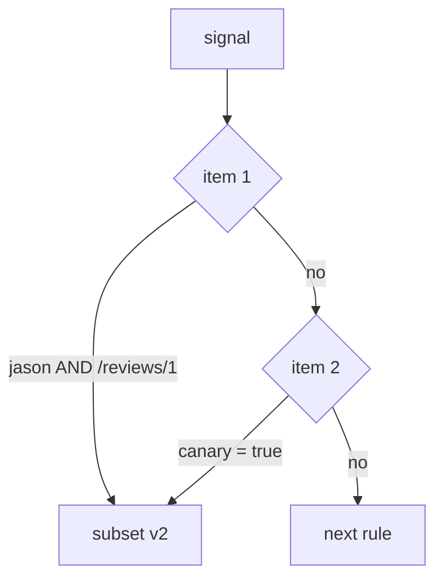

# Match Exactly What You Mean

Astronaut, a routing rule that looks right can still send signals the wrong way. Usually the cause is one of two things: the rule compares text differently from what you meant, or two conditions are combined differently from what you meant. This part settles both.

The commands below need the `scout` `DestinationRule` with the subsets `v1`, `v2` and `v3` applied in your playground, and the `count_versions` helper pasted into your terminal.

## The three ways to compare text

Every text comparison in a match uses one of three forms, called a **string match**. `headers`, `uri`, `queryParams` and `authority` all use them. Picking the right one is most of the work:

| Form | Matches | Example |
| --- | --- | --- |
| `exact: jason` | exactly `jason`, letter for letter | `jason`, but not `jasonx` or `Jason` |
| `prefix: ja` | anything that starts with `ja` | `jason`, `jane` |
| `regex: "jason\|jane"` | an RE2 pattern that must fit the **whole** value | `jason`, `jane`, but not `jasonx` |

A **regex** (regular expression) is a search pattern: `jason|jane` means "jason or jane". Istio uses the **RE2** style of patterns.

Three surprises hide in this table:

- **`prefix` ignores `/`.** It compares plain text. So `prefix: "/reviews"` matches `/reviews` and `/reviews/0`, but also `/reviewsXYZ`.
- **`regex` must fit the whole value.** It works as if the pattern started at the first letter and ended at the last. So `regex: "jason"` does not match `jasonx`. For "contains jason", write `.*jason.*`. This is not like `grep`, which finds a word anywhere in a line.
- **RE2 leaves some features out.** Look-ahead (`(?=`) and back-references (`\1`) are missing, because they can make a pattern run for a very long time. Istio rejects a pattern that uses them.

Which form to pick:

- **`exact`** cannot surprise you. Use it by default for a header or a query value.
- **`prefix`** fits a group of paths you own, or a group of astronauts whose names start the same way.
- **`regex`** is the last resort, for rules the other two cannot express. It is the hardest to read and the easiest to get slightly wrong.

`method` is written directly with the comparison: `method: { exact: POST }`.

### Prefix and regex side by side

<!-- astrona:playground:renew -->

First a prefix: every astronaut whose name starts with `ja` gets v2. Save this as `virtualservice-scout.yaml`:

```yaml
apiVersion: networking.istio.io/v1
kind: VirtualService
metadata:
  name: scout
  namespace: starfleet
spec:
  hosts:
  - scout
  http:
  - match:
    - headers:
        end-user:
          prefix: ja
    route:
    - destination:
        host: scout
        subset: v2
  - route:
    - destination:
        host: scout
        subset: v1
```

Apply it:

```sh
kubectl apply -f virtualservice-scout.yaml
```

Then check the result:

```sh
count_versions -H "end-user: jane" $SCOUT/0
count_versions -H "end-user: bob" $SCOUT/0
```

You should see:

```text
  10 scout-v2
  10 scout-v1
```

jane's name starts with `ja`, so her signals fly to v2. bob's does not, so his fall through to v1.

Now try a regex instead. Save this as `virtualservice-scout.yaml`, replacing the old file:

```yaml
apiVersion: networking.istio.io/v1
kind: VirtualService
metadata:
  name: scout
  namespace: starfleet
spec:
  hosts:
  - scout
  http:
  - match:
    - headers:
        end-user:
          regex: "jason|jane"
    route:
    - destination:
        host: scout
        subset: v2
  - route:
    - destination:
        host: scout
        subset: v1
```

Apply it:

```sh
kubectl apply -f virtualservice-scout.yaml
```

Then check the result:

```sh
count_versions -H "end-user: jane" $SCOUT/0
count_versions -H "end-user: jasonx" $SCOUT/0
```

You should see:

```text
  10 scout-v2
  10 scout-v1
```

`jane` still gets v2. `jasonx` gets v1: the pattern must fit the whole value, and the extra `x` does not fit.

## Quoting, and the YAML trap underneath it

Some values look like text to you but not to YAML. If you quote every value, this trap can never catch you.

`exact: true` and `exact: "true"` are different. Without quotes, YAML reads `true` as a yes/no value (a boolean), not as text. The field wants text, so Istio rejects the object. That is the good outcome: you find out straight away.

The same goes for numbers. `exact: 2` is a number, not the text `"2"`. Older YAML rules also read bare `yes`, `no`, `on` and `off` as yes/no values, and a version like `1.30` becomes the number `1.3`. Quote every header and query value, and none of this can reach you.

### Match a query parameter

Send every signal that asks for `?canary=true` to v3. Save this as `virtualservice-scout.yaml`:

```yaml
apiVersion: networking.istio.io/v1
kind: VirtualService
metadata:
  name: scout
  namespace: starfleet
spec:
  hosts:
  - scout
  http:
  - match:
    - queryParams:
        canary:
          exact: "true"
    route:
    - destination:
        host: scout
        subset: v3
  - route:
    - destination:
        host: scout
        subset: v1
```

Apply it:

```sh
kubectl apply -f virtualservice-scout.yaml
```

Then check the result:

```sh
count_versions "$SCOUT/0?canary=true"
count_versions $SCOUT/0
```

You should see:

```text
  10 scout-v3
  10 scout-v1
```

Signals that ask for `?canary=true` fly to v3; the others fly to v1. A query parameter is useful when the sender cannot add headers, for example a link someone clicks in a browser.

> [!TIP]
> Want to see the quoting trap for yourself? Remove the quotes around `"true"` in `virtualservice-scout.yaml` and apply it again. Istio rejects the object before it ever reaches a proxy.

## AND or OR: the rule that depends on one dash

This is the most misread part of the flight plan. Whether two conditions must both be true, or only one of them, is decided only by where an item sits in the list.

Think of `match` as a **list of choices**. Each choice is a bundle of conditions that must all be true. The rule fires if any one choice is fully true.



Item 1 holds two conditions: `end-user = jason` AND a path that starts with `/reviews/1`. Item 2 holds one: `canary = true`. If neither item is fully true, the proxy moves on to the next `http` rule.

In YAML, a new item starts with a new `-` at the `match` level. Another condition in the same item is another key lined up under the first one. Side by side (for reading only, not for applying):

```text
# AND: one item                      # OR: two items
- match:                             - match:
  - headers:                           - headers:
      end-user: {exact: jason}             end-user: {exact: jason}
    uri: {prefix: /reviews/1}          - uri: {prefix: /reviews/1}
```

The only difference is one `-` in front of `uri`. Inside one `-` item, conditions are combined with AND. Separate `-` items are combined with OR.

The mistake is quiet both ways. Squash three choices into one item, and the rule needs all three at once, so it almost never fires. Split one AND into separate items, and the rule fires on far more traffic than you meant. Neither is an error. Both are valid objects that behave differently from the sentence in your head.

Predict the next result before you run it.

### The same two conditions, AND then OR

First the AND version: jason **and** the path `/reviews/1`. Save this as `virtualservice-scout.yaml`:

```yaml
apiVersion: networking.istio.io/v1
kind: VirtualService
metadata:
  name: scout
  namespace: starfleet
spec:
  hosts:
  - scout
  http:
  - match:
    - headers:
        end-user:
          exact: jason
      uri:
        prefix: /reviews/1
    route:
    - destination:
        host: scout
        subset: v2
  - route:
    - destination:
        host: scout
        subset: v1
```

Apply it:

```sh
kubectl apply -f virtualservice-scout.yaml
```

Then check the result:

```sh
count_versions -H "end-user: jason" $SCOUT/0
count_versions -H "end-user: jason" $SCOUT/1
count_versions $SCOUT/1
```

You should see:

```text
  10 scout-v1
  10 scout-v2
  10 scout-v1
```

Only jason on `/reviews/1` gets v2: both conditions must hold.

Now the OR version. The only change is a `-` in front of `uri`. Save it in a second file, so you keep the AND version for later. Save this as `virtualservice-scout-or.yaml`:

```yaml
apiVersion: networking.istio.io/v1
kind: VirtualService
metadata:
  name: scout
  namespace: starfleet
spec:
  hosts:
  - scout
  http:
  - match:
    - headers:
        end-user:
          exact: jason
    - uri:
        prefix: /reviews/1
    route:
    - destination:
        host: scout
        subset: v2
  - route:
    - destination:
        host: scout
        subset: v1
```

Apply it:

```sh
kubectl apply -f virtualservice-scout-or.yaml
```

Then run the same three checks again:

```sh
count_versions -H "end-user: jason" $SCOUT/0
count_versions -H "end-user: jason" $SCOUT/1
count_versions $SCOUT/1
```

You should see:

```text
  10 scout-v2
  10 scout-v2
  10 scout-v2
```

Now jason gets v2 on any path, and anyone on `/reviews/1` gets v2. Only a signal without jason's label to `/reviews/0` would still fly to v1. Nothing changed but one dash.

## Reading a compiled match

Indentation is easy to misread. The proxy's own copy of the rule is not. Each match becomes an Envoy route entry, and you can print it: AND conditions sit side by side in one `match` object, while OR choices become separate entries in the `routes` list.

When a rule does not behave the way you read it, the compiled route is the judge. It is what actually runs.

### See the test as Envoy stores it

Put the AND version back, since it is still in `virtualservice-scout.yaml`:

```sh
kubectl apply -f virtualservice-scout.yaml
```

Then print the route table the shuttle holds, filtered to the match fields:

```sh
istioctl proxy-config routes deploy/shuttle -n starfleet --name 9080 -o json \
  | grep -E '"prefix"|"exact"|"name": "end-user"' | head -12
```

Look for the path prefix `/reviews/1` and the header name `end-user` with the `exact` value `jason` inside the **same** match object: that is the AND. Further down is a `"prefix": "/"`: that is the catch-all rule, which matches every path. The exact field names can change between Envoy versions; the structure is what matters.

## Common pitfalls

> [!WARNING]
> - **Expecting `prefix` to respect `/`.** It does not. `prefix: "/reviews"` also matches `/reviewsXYZ`.
> - **A `regex` that does not cover the whole value.** `regex: "jason"` does not match `jasonx`. Write `.*jason.*` for "contains".
> - **Leaving values unquoted.** `true`, `yes`, `off` and `1.30` are not text to a YAML parser. Quote every header and query value.
> - **Reading AND as OR, or OR as AND.** Conditions inside one `-` item must all hold. Separate `-` items are alternatives.

> *Conditions inside one `-` item are combined with AND. Separate `-` items are combined with OR. The only difference is one dash.*
