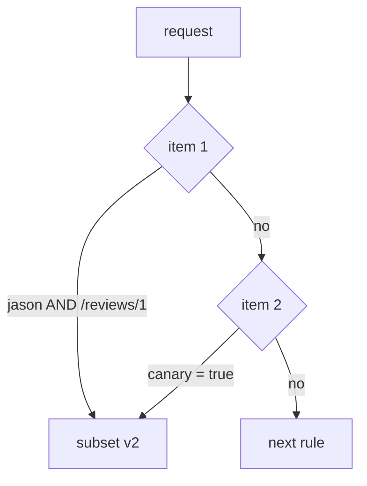

# Match Headers, URIs And Query Parameters

A routing rule that looks right can still send requests to the wrong place. Usually the cause is one of two things. Either the rule compares text in a different way than you meant, or two conditions are combined in a different way than you meant. This part settles both.

A **`VirtualService`** is the Istio object that sets where requests to a host go. Its `http` field is an ordered list of rules, and each rule can have a `match` that says which requests it applies to. The **sidecar proxy** (Envoy) of the client pod reads these rules and picks the destination before the request leaves the pod.

The commands below need the `scout` `DestinationRule` with the subsets `v1`, `v2` and `v3` applied in your playground. A subset is a named group of pods, picked by a pod label such as `version: v2`. The commands also use the `count_versions` helper, which sends 10 requests from the `shuttle` pod to `scout` and counts which version answered. `$SCOUT` holds `http://scout:9080/reviews`.

## The three ways to compare text

Every text comparison in a match uses one of three forms, called a **string match**. `headers`, `uri`, `queryParams` and `authority` all use them. Picking the right form is most of the work:

| Form | Matches | Example |
| --- | --- | --- |
| `exact: jason` | exactly `jason`, letter for letter | `jason`, but not `jasonx` or `Jason` |
| `prefix: ja` | anything that starts with `ja` | `jason`, `jane` |
| `regex: "jason\|jane"` | an RE2 pattern that must fit the **whole** value | `jason`, `jane`, but not `jasonx` |

A **regex** (regular expression) is a text pattern: `jason|jane` means "jason or jane". Istio uses the **RE2** syntax for regular expressions, which is the syntax Envoy supports.

Three surprises hide in this table:

- **`prefix` ignores `/`.** It compares plain text. So `prefix: "/reviews"` matches `/reviews` and `/reviews/0`, but also `/reviewsXYZ`.
- **`regex` must fit the whole value.** It works as if the pattern started at the first character and ended at the last. So `regex: "jason"` does not match `jasonx`. For "contains jason", write `.*jason.*`. This is not like `grep`, which finds a word anywhere in a line.
- **RE2 leaves some features out.** Look-ahead (`(?=`) and back-references (`\1`) are missing, because they can make a pattern run for a very long time. Istio rejects a pattern that uses them.

So which form should you pick? **`exact`** cannot surprise you, so use it by default for a header or a query value. **`prefix`** fits a group of paths you own, or a group of user names that start the same way. **`regex`** is the last choice, for rules the other two cannot express. It is the hardest to read and the easiest to get slightly wrong.

`method` uses the same forms: `method: { exact: POST }`.

### Prefix and regex side by side

Start with a prefix: every user whose name starts with `ja` gets v2.

<!-- astrona:playground:renew -->

Save this as `virtualservice-scout.yaml`:

```yaml
apiVersion: networking.istio.io/v1
kind: VirtualService
metadata:
  name: scout
  namespace: starfleet
spec:
  hosts:
  - scout
  http:
  - match:
    - headers:
        end-user:
          prefix: ja
    route:
    - destination:
        host: scout
        subset: v2
  - route:
    - destination:
        host: scout
        subset: v1
```

Apply it:

```sh
kubectl apply -f virtualservice-scout.yaml
```

Then check the result:

```sh
count_versions -H "end-user: jane" $SCOUT/0
count_versions -H "end-user: bob" $SCOUT/0
```

You should see:

```text
  10 scout-v2
  10 scout-v1
```

The value `jane` starts with `ja`, so the proxy sends those requests to v2. The value `bob` does not, so those requests fall through to v1.

Now try a regular expression instead. Save this as `virtualservice-scout.yaml`, replacing the old file:

```yaml
apiVersion: networking.istio.io/v1
kind: VirtualService
metadata:
  name: scout
  namespace: starfleet
spec:
  hosts:
  - scout
  http:
  - match:
    - headers:
        end-user:
          regex: "jason|jane"
    route:
    - destination:
        host: scout
        subset: v2
  - route:
    - destination:
        host: scout
        subset: v1
```

Apply it:

```sh
kubectl apply -f virtualservice-scout.yaml
```

Then check the result:

```sh
count_versions -H "end-user: jane" $SCOUT/0
count_versions -H "end-user: jasonx" $SCOUT/0
```

You should see:

```text
  10 scout-v2
  10 scout-v1
```

`jane` still gets v2. `jasonx` gets v1, because the pattern must fit the whole value and the extra `x` does not fit.

## Quoting, and the YAML trap underneath it

Some values look like text to you but not to YAML. If you quote every value, this trap can never catch you.

`exact: true` and `exact: "true"` are different. Without quotes, YAML reads `true` as a boolean (a yes or no value), not as text. The field expects text, so the Kubernetes API server rejects the object. That is the good outcome: you find out at once.

The same goes for numbers. `exact: 2` is a number, not the text `"2"`. Older YAML rules also read bare `yes`, `no`, `on` and `off` as booleans, and a version like `1.30` becomes the number `1.3`. Quote every header and query value, and none of this can happen.

### Match a query parameter

A **query parameter** is a name and a value after the `?` in a URL, such as `canary=true`. This rule sends every request with `?canary=true` to v3.

Save this as `virtualservice-scout.yaml`:

```yaml
apiVersion: networking.istio.io/v1
kind: VirtualService
metadata:
  name: scout
  namespace: starfleet
spec:
  hosts:
  - scout
  http:
  - match:
    - queryParams:
        canary:
          exact: "true"
    route:
    - destination:
        host: scout
        subset: v3
  - route:
    - destination:
        host: scout
        subset: v1
```

Apply it:

```sh
kubectl apply -f virtualservice-scout.yaml
```

Then check the result:

```sh
count_versions "$SCOUT/0?canary=true"
count_versions $SCOUT/0
```

You should see:

```text
  10 scout-v3
  10 scout-v1
```

Requests with `?canary=true` go to v3, and the others go to v1. A query parameter is useful when the client cannot add headers, for example a link someone clicks in a browser.

To see the quoting trap for yourself, remove the quotes around `"true"` in `virtualservice-scout.yaml` and apply it again. The API server rejects the object, so it never reaches a proxy.

## AND or OR: the rule that depends on one dash

This is the most misread part of a `VirtualService`. Whether two conditions must both be true, or only one of them, depends only on where an item sits in the list.

The `match` field is a **list of items**. Each item holds one or more conditions, and all of them must be true. The rule matches if any one item is fully true.



The diagram shows a rule with two items. Item 1 holds two conditions: `end-user = jason` AND a path that starts with `/reviews/1`. Item 2 holds one: `canary = true`. If neither item is fully true, the proxy moves on to the next `http` rule.

In YAML, a new item starts with a new `-` at the `match` level. Another condition in the same item is another key lined up under the first one. Here are both forms side by side, for reading only:

```text
# AND: one item                      # OR: two items
- match:                             - match:
  - headers:                           - headers:
      end-user: {exact: jason}             end-user: {exact: jason}
    uri: {prefix: /reviews/1}          - uri: {prefix: /reviews/1}
```

The only difference is one `-` in front of `uri`. Inside one `-` item, conditions are combined with AND. Separate `-` items are combined with OR.

The mistake gives no error in either direction. Put three alternatives into one item, and the rule needs all three at once, so it almost never matches. Split one AND into separate items, and the rule matches far more traffic than you meant. Both are valid objects. They just do something different from what you intended.

### The same two conditions, AND then OR

Predict each result before you run it. First the AND version: `jason` **and** the path `/reviews/1`.

Save this as `virtualservice-scout.yaml`:

```yaml
apiVersion: networking.istio.io/v1
kind: VirtualService
metadata:
  name: scout
  namespace: starfleet
spec:
  hosts:
  - scout
  http:
  - match:
    - headers:
        end-user:
          exact: jason
      uri:
        prefix: /reviews/1
    route:
    - destination:
        host: scout
        subset: v2
  - route:
    - destination:
        host: scout
        subset: v1
```

Apply it:

```sh
kubectl apply -f virtualservice-scout.yaml
```

Then check the result:

```sh
count_versions -H "end-user: jason" $SCOUT/0
count_versions -H "end-user: jason" $SCOUT/1
count_versions $SCOUT/1
```

You should see:

```text
  10 scout-v1
  10 scout-v2
  10 scout-v1
```

Only requests from `jason` to `/reviews/1` get v2, because both conditions must hold.

Now the OR version. The only change is a `-` in front of `uri`. Save it in a second file, so you keep the AND version for later.

Save this as `virtualservice-scout-or.yaml`:

```yaml
apiVersion: networking.istio.io/v1
kind: VirtualService
metadata:
  name: scout
  namespace: starfleet
spec:
  hosts:
  - scout
  http:
  - match:
    - headers:
        end-user:
          exact: jason
    - uri:
        prefix: /reviews/1
    route:
    - destination:
        host: scout
        subset: v2
  - route:
    - destination:
        host: scout
        subset: v1
```

Apply it:

```sh
kubectl apply -f virtualservice-scout-or.yaml
```

Then run the same three checks again:

```sh
count_versions -H "end-user: jason" $SCOUT/0
count_versions -H "end-user: jason" $SCOUT/1
count_versions $SCOUT/1
```

You should see:

```text
  10 scout-v2
  10 scout-v2
  10 scout-v2
```

Now requests from `jason` get v2 on any path, and any request to `/reviews/1` gets v2. Only a request without the `end-user: jason` header to `/reviews/0` would still go to v1. Nothing changed but one dash.

## Reading a compiled match

Indentation is easy to misread, but the proxy's own copy of your rules is not. `istiod`, Istio's control plane, turns every rule into one or more **route entries** and sends them to each proxy. You can list them with `istioctl proxy-config routes`. When a rule does not behave the way you read it, this list is the final answer, because it is what the proxy actually runs.

### Count the route entries

Apply the AND version again first. It is still in `virtualservice-scout.yaml`:

```sh
kubectl apply -f virtualservice-scout.yaml
```

Then list the route entries the proxy of `shuttle` holds for port 9080:

```sh
istioctl proxy-config routes deploy/shuttle -n starfleet --name 9080
```

You should see this (shortened to the `scout` rows):

```text
NAME     VHOST NAME                                  DOMAINS                                                     MATCH           VIRTUAL SERVICE
9080     scout.starfleet.svc.cluster.local:9080      scout.starfleet.svc.cluster.local., scout + 2 more...       /reviews/1*     scout.starfleet
9080     scout.starfleet.svc.cluster.local:9080      scout.starfleet.svc.cluster.local., scout + 2 more...       /*              scout.starfleet
```

Each row is one route entry, and the proxy checks them from the top. Two rules in your YAML give two rows. Row 1 is the `jason` rule: the `MATCH` column only shows the path, `/reviews/1*`, but the header test is there too. Row 2 is the catch-all, and `/*` means "every path".

Now apply the OR version:

```sh
kubectl apply -f virtualservice-scout-or.yaml
```

Then list the route entries again:

```sh
istioctl proxy-config routes deploy/shuttle -n starfleet --name 9080
```

You should see this (shortened to the `scout` rows):

```text
NAME     VHOST NAME                                  DOMAINS                                                     MATCH           VIRTUAL SERVICE
9080     scout.starfleet.svc.cluster.local:9080      scout.starfleet.svc.cluster.local., scout + 2 more...       /*              scout.starfleet
9080     scout.starfleet.svc.cluster.local:9080      scout.starfleet.svc.cluster.local., scout + 2 more...       /reviews/1*     scout.starfleet
9080     scout.starfleet.svc.cluster.local:9080      scout.starfleet.svc.cluster.local., scout + 2 more...       /*              scout.starfleet
```

There are three rows now, from the same two rules. `istiod` turned the OR rule into **two** route entries, one per `-` item. The first is "`jason` on any path" (`/*` plus the header test), and the second is "any request to `/reviews/1`". Both send to v2. The last row is still the catch-all.

So the count tells you how the proxy read your `match`. One entry for the rule means AND. One entry per `-` item means OR.

### Look inside one entry

The table hides the header test. To see it, print the same route table as JSON. Apply the AND version again first:

```sh
kubectl apply -f virtualservice-scout.yaml
```

Then print the route table as JSON:

```sh
istioctl proxy-config routes deploy/shuttle -n starfleet --name 9080 -o json
```

The output is long. These are the two `scout` entries in it, shortened to the parts that matter:

```text
{
  "match": {
    "prefix": "/reviews/1",
    "caseSensitive": true,
    "headers": [
      {
        "name": "end-user",
        "stringMatch": {
          "exact": "jason"
        }
      }
    ]
  },
  "cluster": "outbound|9080|v2|scout.starfleet.svc.cluster.local"
}
{
  "match": {
    "prefix": "/"
  },
  "cluster": "outbound|9080|v1|scout.starfleet.svc.cluster.local"
}
```

The first entry has the path `/reviews/1` **and** the header `end-user` with the exact value `jason` inside **one** `match`, so both must fit. It sends to the v2 cluster. A cluster is Envoy's name for a destination with its list of pod addresses. The second entry is the catch-all to the v1 cluster. The exact field names can change between Envoy versions, but this shape stays the same.

## What you know now

A string match is `exact`, `prefix` or `regex`. `prefix` ignores `/`, and `regex` must fit the whole value. Quote every value so YAML keeps it as text. Conditions inside one `-` item are combined with AND, and separate `-` items are combined with OR. The route table of the client's proxy shows which one you wrote. The open question is what happens when more than one rule matches the same request.

## Common pitfalls

> [!WARNING]
> - **Expecting `prefix` to respect `/`.** It does not. `prefix: "/reviews"` also matches `/reviewsXYZ`.
> - **A `regex` that does not cover the whole value.** `regex: "jason"` does not match `jasonx`. Write `.*jason.*` for "contains".
> - **Leaving values unquoted.** `true`, `yes`, `off` and `1.30` are not text to a YAML parser. Quote every header and query value.
> - **Reading AND as OR, or OR as AND.** Conditions inside one `-` item must all hold. Separate `-` items are alternatives.
