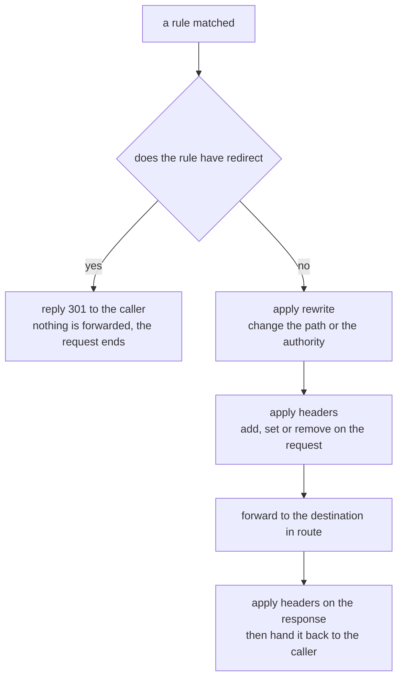

# Rewriting, Redirecting And Headers

> Prerequisite: [Evaluation Order, Name Resolution And Proof](./course-03-evaluation-order-and-proof.md). Next: [Routing Non-HTTP Traffic](./course-05-routing-non-http-traffic.md).

So far a matched rule has done exactly one thing: chosen a destination. That is the most common thing a rule does and it is not the only one. A rule can also answer the request itself with a redirect, change the path before forwarding it, add or strip headers in either direction, and handle browser CORS preflights without the application knowing CORS exists.

These are separate fields on the same `http` entry you have been writing since Part 2. Nothing new is introduced — the object, the matching and the ordering all work exactly as before.

## What a matched rule can do

Once a rule matches, its fields are applied in a fixed order, and the first thing to know is that one of them ends the request immediately:



Take from this that `redirect` and `route` are alternatives, not companions: a rule that redirects never reaches a destination, and Istio rejects an object that tries to do both.

The fields available on one `http` entry, and where each is taught:

| Field | Does | Covered |
| --- | --- | --- |
| `route` | choose a destination | Part 2 |
| `redirect` | answer the caller with a 3xx instead of forwarding | here |
| `rewrite` | change the path or `Host` before forwarding | here |
| `headers` | add / set / remove request and response headers | here |
| `corsPolicy` | answer preflights and add CORS response headers | here |
| `timeout`, `retries` | give up, or try again | section 040 |
| `fault` | inject a delay or an error on purpose | section 050 |
| `mirror` | send a copy elsewhere | section 020 |

That last group is worth noticing now: they are fields on the object you already know. Most of the rest of this course is this table filling up.

## `redirect` — answer instead of forwarding

```yaml
- match:
    - uri:
        prefix: /old
  redirect:
    uri: /notify
    redirectCode: 301
```

The proxy replies to the caller with a `301` and a `Location` header. Nothing reaches any pod. `redirectCode` defaults to `301` — set it to `302` for a temporary move, and prefer `308` when the method must be preserved, because a `301` allows a client to turn a `POST` into a `GET`.

`redirect.authority` rewrites the host in the `Location` header as well, which is how you move a path to a different hostname.

> [!TIP]
> **Try it — a rule that never reaches a pod**
>
> ```sh
> kubectl apply -f - <<'EOF'
> apiVersion: networking.istio.io/v1
> kind: VirtualService
> metadata:
>   name: notification-service
>   namespace: routing-demo
> spec:
>   hosts:
>     - notification-service
>   http:
>     - match:
>         - uri:
>             prefix: /old
>       redirect:
>         uri: /notify
>     - route:
>         - destination:
>             host: notification-service
> EOF
> kubectl -n routing-demo exec deploy/tester -- \
>   curl -s -o /dev/null -w 'status=%{http_code} location=%{redirect_url}\n' http://notification-service/old
> ```
>
> Expect something like:
>
> ```text
> status=301 location=http://notification-service/notify
> ```
>
> The proxy produced that response itself. No pod was involved, nothing appears in either application's log, and the caller now has to make a second request.

## `rewrite` — change the path before forwarding

Where `redirect` tells the caller to go somewhere else, `rewrite` quietly changes the request on its way to the destination. The caller never learns that the path it asked for is not the path the application received.

```yaml
- match:
    - uri:
        prefix: /beta
  rewrite:
    uri: /
  route:
    - destination:
        host: notification-service
        subset: v2
```

The semantics depend on how the rule matched, and this is the part that surprises people:

- If the match was a **`prefix`**, `rewrite.uri` replaces **just the matched prefix**. `/beta/notify` matched on prefix `/beta` and rewritten to `/` becomes `/notify`.
- If the match was **`exact`**, the whole path is replaced.

`rewrite.authority` does the same job for the `Host` header, which matters when the destination serves several virtual hosts and expects its own name.

Proving a rewrite needs care, because the caller cannot see it — the response looks identical either way. The evidence is on the receiving side: the destination's own proxy logs the path it was actually given.

> [!TIP]
> **Try it — the path the application really received**
>
> ```sh
> kubectl -n routing-demo patch virtualservice notification-service --type merge -p '
> spec:
>   http:
>     - match:
>         - uri:
>             prefix: /beta
>       rewrite:
>         uri: /
>       route:
>         - destination:
>             host: notification-service
>     - route:
>         - destination:
>             host: notification-service'
> sleep 2
> kubectl -n routing-demo exec deploy/tester -- curl -s -o /dev/null http://notification-service/beta/notify
> kubectl -n routing-demo logs -l app=notification-service -c istio-proxy --tail=1 --prefix
> ```
>
> Expect something like:
>
> ```text
> [pod/notification-service-v1-.../istio-proxy] [2026-09-29T11:04:18.220Z] "GET /notify HTTP/1.1" 200 …
> ```
>
> The caller asked for `/beta/notify`; the application was handed `/notify`. Only the matched prefix was replaced — the rest of the path came along unchanged.

## `headers` — two scopes, three operations

Header manipulation exists at two levels, and choosing the wrong one is the usual mistake:

```yaml
http:
  - route:
      - destination:
          host: notification-service
          subset: v2
        headers:                  # ← per DESTINATION: only requests sent to v2
          request:
            set:
              x-served-by: v2
    headers:                      # ← per RULE: every request this rule handles
      response:
        add:
          x-routed-by: istio
```

The indentation tells you the scope. A `headers` block aligned with `route` applies to everything the rule handles; a `headers` block inside a `route[]` entry applies only to the requests actually sent to that destination — which is what you want when two destinations need to be told apart, as in the weighted routing of section 020.

Each scope takes `request` and `response`, and each of those takes three operations:

| Operation | Effect |
| --- | --- |
| `set` | replace the header, creating it if absent |
| `add` | append a value, keeping any existing one |
| `remove` | drop the named headers — a list of names, not a map |

`remove` is the odd one out in shape: it is a plain list (`remove: ["x-internal-token"]`), because there is no value to give.

> [!TIP]
> **Try it — a header the application never sent**
>
> ```sh
> kubectl -n routing-demo patch virtualservice notification-service --type merge -p '
> spec:
>   http:
>     - headers:
>         response:
>           set:
>             x-routed-by: istio
>       route:
>         - destination:
>             host: notification-service'
> sleep 2
> kubectl -n routing-demo exec deploy/tester -- \
>   curl -s -D - -o /dev/null http://notification-service/notify | grep -i 'x-routed-by\|^HTTP'
> ```
>
> Expect something like:
>
> ```text
> HTTP/1.1 200 OK
> x-routed-by: istio
> ```
>
> nginx has no idea that header exists. The caller's proxy added it on the way back, which is the same mechanism that lets you stamp a version, strip an internal token, or force a `Host` without redeploying anything.

## `corsPolicy` — preflights handled by the proxy

A browser calling an API on another origin first sends an `OPTIONS` **preflight** request and refuses to proceed unless the answer carries the right `access-control-allow-*` headers. Implementing that correctly in every service is exactly the kind of cross-cutting work a mesh is meant to absorb.

```yaml
- corsPolicy:
    allowOrigins:
      - exact: https://shop.example.com
    allowMethods: ["GET", "POST"]
    allowHeaders: ["content-type"]
    maxAge: "24h"
  route:
    - destination:
        host: notification-service
```

`allowOrigins` takes the same string-match forms as everything else in Part 2 — `exact`, `prefix` or `regex` — so a wildcard is `regex: ".*"` rather than a literal `*`. The proxy answers preflights itself and adds the response headers to ordinary cross-origin requests.

The important limit: **CORS is not a security control.** It is a browser convention, enforced by the browser. A `corsPolicy` will not stop `curl`, a script, or any non-browser client from calling the service — that is what authorization policy is for.

> [!TIP]
> **Try it — the headers a browser would look for**
>
> ```sh
> kubectl -n routing-demo patch virtualservice notification-service --type merge -p '
> spec:
>   http:
>     - corsPolicy:
>         allowOrigins:
>           - exact: https://shop.example.com
>         allowMethods: ["GET", "POST"]
>       route:
>         - destination:
>             host: notification-service'
> sleep 2
> kubectl -n routing-demo exec deploy/tester -- \
>   curl -s -D - -o /dev/null -H "Origin: https://shop.example.com" http://notification-service/notify \
>   | grep -i 'access-control\|^HTTP'
> ```
>
> Expect something like:
>
> ```text
> HTTP/1.1 200 OK
> access-control-allow-origin: https://shop.example.com
> ```
>
> Send the same request with a different `Origin` and the header is absent — the request still succeeds, because it is the browser, not the proxy, that would refuse to use the response.

Restore the module's four-rule object from Part 3 before moving on; the patches above replaced it.

## Common pitfalls

> [!WARNING]
> **Putting `redirect` and `route` on the same rule.** They are alternatives. Istio rejects the object rather than guessing.
>
> **Expecting `rewrite` to replace the whole path after a `prefix` match.** It replaces only the matched prefix. `/beta/notify` with `prefix: /beta` and `rewrite.uri: /` becomes `/notify`, not `/`.
>
> **Looking for a rewrite in the caller's log.** The caller logs what it sent. The rewritten path appears in the *destination's* access log.
>
> **Putting `headers` at the wrong level.** Aligned with `route` it applies to the whole rule; inside a `route[]` entry it applies to that destination only.
>
> **Writing `remove` as a map.** It is a list of header names.
>
> **Using `allowOrigins: ["*"]`.** The field takes string matches, not literals. A wildcard is `regex: ".*"`.
>
> **Treating `corsPolicy` as access control.** It only shapes what a browser is willing to do. Non-browser clients ignore it entirely.

> *`redirect` ends the request, `rewrite` changes it on the way, `headers` annotates it in either direction — all of them fields on the same rule that already chose the destination.*

## Reference

- [HTTPRedirect API](https://istio.io/latest/docs/reference/config/networking/virtual-service/#HTTPRedirect) — `uri`, `authority`, `redirectCode` and the port/scheme fields.
- [HTTPRewrite API](https://istio.io/latest/docs/reference/config/networking/virtual-service/#HTTPRewrite) — the prefix-replacement semantics, stated upstream.
- [Headers API](https://istio.io/latest/docs/reference/config/networking/virtual-service/#Headers) — the request/response and set/add/remove matrix, at both scopes.
- [CorsPolicy API](https://istio.io/latest/docs/reference/config/networking/virtual-service/#CorsPolicy) — every field, including `exposeHeaders`, `maxAge` and `allowCredentials`.
