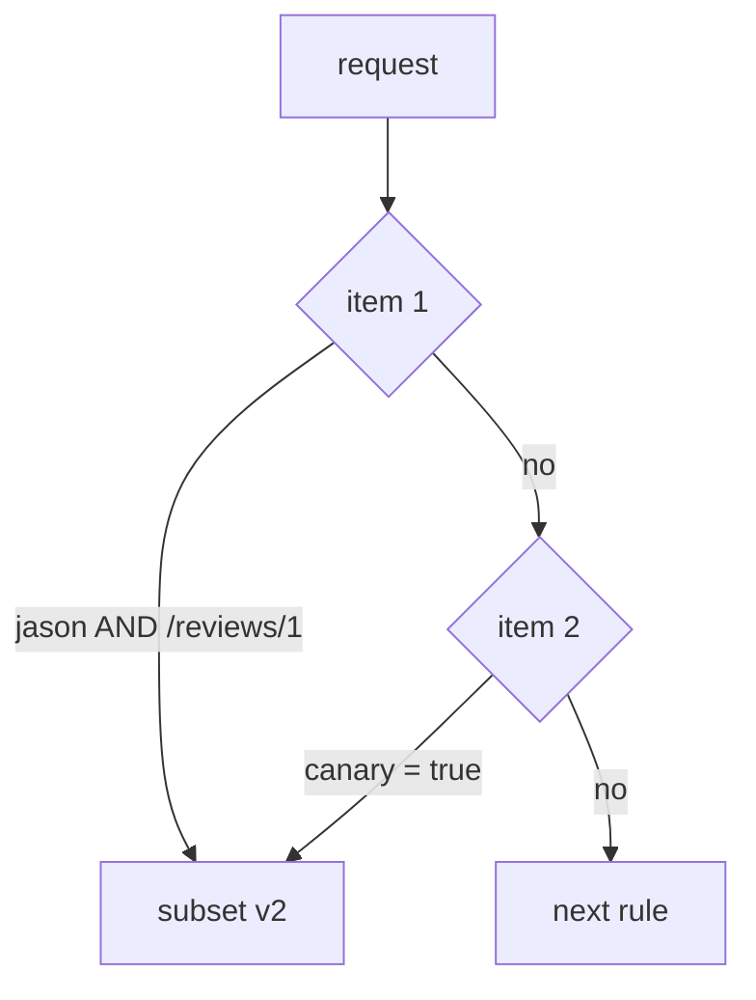

# Combine Match Conditions With AND Or OR

A `match` can test more than one thing, for example a header and a path. The YAML for "both must be true" and the YAML for "one is enough" differ by a single dash, and Istio accepts both. This part shows the two forms side by side and runs both, so you can see the difference in real requests.

A **`VirtualService`** is the Istio object that sets where requests to a host go. Its `http` field is an ordered list of rules, and each rule can have a `match` that says which requests it applies to. The **sidecar proxy** (Envoy) of the client pod reads these rules and picks the destination before the request leaves the pod.

The commands below need the `scout` `DestinationRule` with the subsets `v1`, `v2` and `v3` applied in your playground. A subset is a named group of pods, picked by a pod label such as `version: v2`. Each condition in a match uses a **string match**: `exact` (the whole value, letter for letter), `prefix` (the value starts with this text) or `regex` (a pattern that must fit the whole value).

## AND or OR: the rule that depends on one dash

This is the most misread part of a `VirtualService`. Whether two conditions must both be true, or only one of them, depends only on where an item sits in the list.

The `match` field is a **list of items**. Each item holds one or more conditions, and all of them must be true. The rule matches if any one item is fully true.



The diagram shows a rule with two items. Item 1 holds two conditions: `end-user = jason` AND a path that starts with `/reviews/1`. Item 2 holds one: `canary = true`. If neither item is fully true, the proxy moves on to the next `http` rule.

In YAML, a new item starts with a new `-` at the `match` level. Another condition in the same item is another key lined up under the first one. Here are both forms side by side, for reading only:

```text
# AND: one item                      # OR: two items
- match:                             - match:
  - headers:                           - headers:
      end-user: {exact: jason}             end-user: {exact: jason}
    uri: {prefix: /reviews/1}          - uri: {prefix: /reviews/1}
```

The only difference is one `-` in front of `uri`. Inside one `-` item, conditions are combined with AND. Separate `-` items are combined with OR.

The mistake gives no error in either direction. Put three alternatives into one item, and the rule needs all three at once, so it almost never matches. Split one AND into separate items, and the rule matches far more traffic than you meant. Both are valid objects. They just do something different from what you intended.

## The same two conditions, AND then OR

The best way to learn the difference is to run both forms against the same requests. The commands use the `count_versions` helper, which sends 10 requests from the `shuttle` pod to `scout` and counts which version answered. `$SCOUT` holds `http://scout:9080/reviews`. Paste it into your terminal if it is not there yet:

<!-- astrona:playground:renew -->

```sh
count_versions() { for i in $(seq 1 10); do
  kubectl exec -n starfleet deploy/shuttle -- curl -s "$@" | grep -o 'scout-v[0-9]' || echo none
done | sort | uniq -c; }
SCOUT=http://scout:9080/reviews
```

Predict each result before you run it. First the AND version: `jason` **and** the path `/reviews/1`.

Save this as `virtualservice-scout.yaml`:

```yaml
apiVersion: networking.istio.io/v1
kind: VirtualService
metadata:
  name: scout
  namespace: starfleet
spec:
  hosts:
  - scout
  http:
  - match:
    - headers:
        end-user:
          exact: jason
      uri:
        prefix: /reviews/1
    route:
    - destination:
        host: scout
        subset: v2
  - route:
    - destination:
        host: scout
        subset: v1
```

Apply it:

```sh
kubectl apply -f virtualservice-scout.yaml
```

Then check the result:

```sh
count_versions -H "end-user: jason" $SCOUT/0
count_versions -H "end-user: jason" $SCOUT/1
count_versions $SCOUT/1
```

You should see:

```text
  10 scout-v1
  10 scout-v2
  10 scout-v1
```

Only requests from `jason` to `/reviews/1` get v2, because both conditions must hold.

Now the OR version. The only change is a `-` in front of `uri`. Save it in a second file, so you keep the AND version for later.

Save this as `virtualservice-scout-or.yaml`:

```yaml
apiVersion: networking.istio.io/v1
kind: VirtualService
metadata:
  name: scout
  namespace: starfleet
spec:
  hosts:
  - scout
  http:
  - match:
    - headers:
        end-user:
          exact: jason
    - uri:
        prefix: /reviews/1
    route:
    - destination:
        host: scout
        subset: v2
  - route:
    - destination:
        host: scout
        subset: v1
```

Apply it:

```sh
kubectl apply -f virtualservice-scout-or.yaml
```

Then run the same three checks again:

```sh
count_versions -H "end-user: jason" $SCOUT/0
count_versions -H "end-user: jason" $SCOUT/1
count_versions $SCOUT/1
```

You should see:

```text
  10 scout-v2
  10 scout-v2
  10 scout-v2
```

Now requests from `jason` get v2 on any path, and any request to `/reviews/1` gets v2. Only a request without the `end-user: jason` header to `/reviews/0` would still go to v1. Nothing changed but one dash.

## What you know now

Conditions inside one `-` item are combined with AND, and separate `-` items are combined with OR. A misplaced dash gives no error: the object is valid and simply matches more or less traffic than you meant. The open question is how to check which form you wrote when the indentation is hard to read.

## Common pitfalls

> [!WARNING]
> - **Reading AND as OR, or OR as AND.** Conditions inside one `-` item must all hold. Separate `-` items are alternatives.
> - **Putting alternatives into one item.** Three alternatives in one `-` item mean all three at once, so the rule almost never matches.
> - **Splitting one AND into separate items.** The rule then matches every request that fits any one condition, which is far more traffic than you meant.
