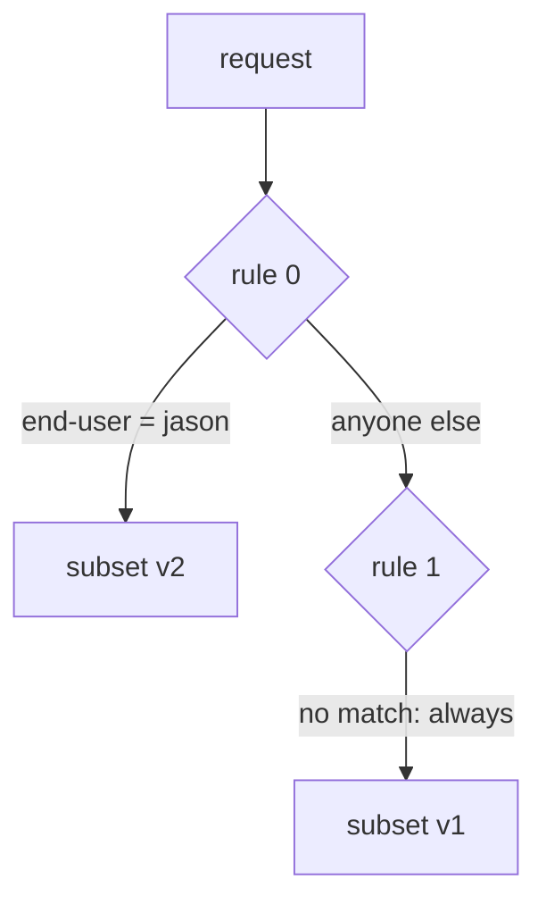

# Order Routing Rules And Add A Catch-All

When a `VirtualService` has several rules, more than one rule can match the same request. Only one of them is used. Which one is used decides more routing results than any other fact about a `VirtualService`.

A **`VirtualService`** is the Istio object that sets where requests to a host go. The **sidecar proxy** (Envoy) of the client pod reads its rules and picks the destination before the request leaves the pod.

The commands below need the `scout` `DestinationRule` with the subsets `v1`, `v2` and `v3` applied in your playground. A subset is a named group of pods, picked by a pod label such as `version: v2`. The commands also use the `count_versions` helper, which sends 10 requests from the `shuttle` pod to `scout` and counts which version answered. `$SCOUT` holds `http://scout:9080/reviews`.

## First match wins

The `http` field of a `VirtualService` is a list of rules. For each request, the proxy reads that list **from the top** and **stops at the first rule that matches**. It does not look further down, it does not score the rules, and it does not combine them.



The diagram shows the order of checks. Rule 0 asks one question: is the `end-user` header equal to `jason`? If yes, the proxy sends the request to v2 and stops checking. If not, it moves on to rule 1. Rule 1 has no `match`, so it matches every request that reaches it and sends it to v1.

Rules are counted from 0, the same way `istioctl` counts them.

## Order your rules from specific to general

Many web servers pick the most specific rule for you, wherever it sits in the file. Istio does not. **You** set the priority with the order of the list. Istio never sorts the rules.

So write them like this:

```text
  most specific rule       first
       ...
  least specific rule
  the catch-all            last, always
```

The **catch-all** is a rule without `match`. It matches every request, so it handles "everyone else". Put it anywhere but last, and no rule below it can ever be reached.

### Try the right order

Start with the rule for `jason` first and the catch-all last.

<!-- astrona:playground:renew -->

Save this as `virtualservice-scout.yaml`:

```yaml
apiVersion: networking.istio.io/v1
kind: VirtualService
metadata:
  name: scout
  namespace: starfleet
spec:
  hosts:
  - scout
  http:
  - match:
    - headers:
        end-user:
          exact: jason
    route:
    - destination:
        host: scout
        subset: v2
  - route:
    - destination:
        host: scout
        subset: v1
```

Apply it:

```sh
kubectl apply -f virtualservice-scout.yaml
```

Then check the result. Send 10 requests with the `end-user: jason` header:

```sh
count_versions -H "end-user: jason" $SCOUT/0
```

You should see:

```text
  10 scout-v2
```

The requests match rule 0, so the proxy sends them to v2.

### Swap the order

Now put the catch-all first. Save it in its own file, so you can switch back easily.

Save this as `virtualservice-scout-wrong-order.yaml`:

```yaml
apiVersion: networking.istio.io/v1
kind: VirtualService
metadata:
  name: scout
  namespace: starfleet
spec:
  hosts:
  - scout
  http:
  - route:
    - destination:
        host: scout
        subset: v1
  - match:
    - headers:
        end-user:
          exact: jason
    route:
    - destination:
        host: scout
        subset: v2
```

Apply it:

```sh
kubectl apply -f virtualservice-scout-wrong-order.yaml
```

Then check the result. Send the `jason` requests again, and run `istioctl analyze`, the command that runs Istio's own checks over the objects in a namespace:

```sh
count_versions -H "end-user: jason" $SCOUT/0
istioctl analyze -n starfleet
```

You should see:

```text
  10 scout-v1
Warning [IST0130] (VirtualService starfleet/scout) VirtualService rule #1 not used
(route without matches defined before).
```

Requests from `jason` now go to v1, like everyone else's. The catch-all matches them first, so the proxy stops before it reaches the `jason` rule. `istioctl analyze` warns that rule `#1`, the `jason` rule, is never used. `kubectl apply` prints the same warning.

Put the right order back:

```sh
kubectl apply -f virtualservice-scout.yaml
```

## Always end with a catch-all

The opposite mistake is to leave the catch-all out. Once a `VirtualService` exists for `scout`, the proxy only knows the rules inside it. A request that matches none of them has no route at all, and the proxy itself answers it with **`404`** (Not Found).

`istioctl analyze` gives no warning here, because a `VirtualService` without a catch-all is valid. You may have meant it. So always ask yourself one question: what happens to requests that match no rule?

### Remove the catch-all

Keep only the `jason` rule.

Save this as `virtualservice-scout-no-catch-all.yaml`:

```yaml
apiVersion: networking.istio.io/v1
kind: VirtualService
metadata:
  name: scout
  namespace: starfleet
spec:
  hosts:
  - scout
  http:
  - match:
    - headers:
        end-user:
          exact: jason
    route:
    - destination:
        host: scout
        subset: v2
```

Apply it:

```sh
kubectl apply -f virtualservice-scout-no-catch-all.yaml
```

Then check the result. Send one request without the header and one with it, read the access log of the `shuttle` proxy, and run `istioctl analyze`. The **access log** is one line per request that the proxy writes to the log of its `istio-proxy` container:

```sh
kubectl exec -n starfleet deploy/shuttle -- curl -s -o /dev/null -w "%{http_code}\n" $SCOUT/0
kubectl exec -n starfleet deploy/shuttle -- curl -s -o /dev/null -w "%{http_code}\n" -H "end-user: jason" $SCOUT/0
kubectl logs -n starfleet deploy/shuttle -c istio-proxy --tail=2
istioctl analyze -n starfleet
```

You should see this (the log line is shortened):

```text
404
200
"GET /reviews/0 HTTP/1.1" 404 NR route_not_found ...
✔ No validation issues found
```

The request without the header gets `404`. The access log marks it with the response flag **`NR`**, short for "no route". The request from `jason` still gets `200`. And `istioctl analyze` finds nothing wrong.

Put the full `VirtualService` back:

```sh
kubectl apply -f virtualservice-scout.yaml
```

## One VirtualService per host

All of this assumes one `VirtualService` per host. If you write two `VirtualService` objects for the same host, there is no fixed order between their rules. Istio only merges them in some cases, and the result is hard to predict. Keep **one `VirtualService` per host**, with every rule in one `http` list, where you can see the order.

## What you know now

The proxy reads the `http` rules from the top and uses the first rule that matches. Put the most specific rule first and the catch-all last. A catch-all placed first makes the rules below it unreachable, and `istioctl analyze` warns with `IST0130`. A missing catch-all gives `404 NR` to every request that matches no rule, with no warning. The open question is which namespace Istio uses when a rule names a host by its short name.

## Common pitfalls

> [!WARNING]
> - **The catch-all placed first.** It matches every request, so every rule below it is unreachable. `istioctl analyze` warns with `IST0130`.
> - **No catch-all at all.** Requests that match no rule get `404 NR`, and `analyze` gives no warning.
> - **Expecting the most specific rule to win.** Only the order of the list counts.
> - **Two `VirtualService` objects for one host.** There is no fixed order between them. Keep one per host.

## Your mission: Route Requests By Header, URI And Query Parameter

You can now write `VirtualService` rules that match headers, paths and query parameters, and put them in an order where every rule can match. The graded lab asks you to send three kinds of requests to v2 and every other request to v1, with every rule reachable.

The lab runs in its own cluster, so first pause your playground. Nothing in it is lost:

```sh
astrona stop ats-014-playground-010-01
```

Then start the lab:

```sh
astrona run --git git@github.com:astrona-io/ATS014.git -c sections/section-010/module-01/labs/lab-01
```

The task is on the next page. Solve it on your own first. When you think you are done, send it for grading:

```sh
astrona submit -c sections/section-010/module-01/labs/lab-01
```

When the lab is done, remove it and start your playground again:

```sh
astrona destroy ats-014-lab-010-01
astrona start ats-014-playground-010-01
```
