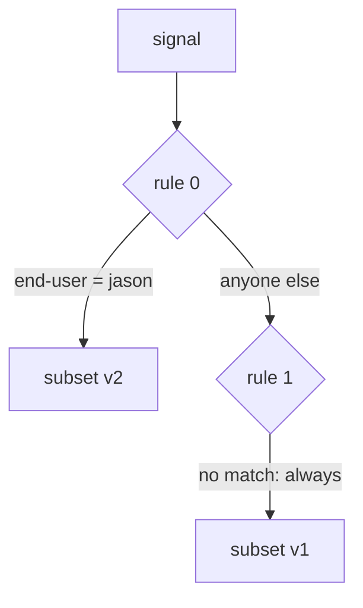

# Put Your Rules In Order

Astronaut, a flight plan with several rules raises one question: when more than one rule could fit a signal, which one wins? The answer is simple, and it decides more routing results than any other fact in this module. This part shows it, and the two mistakes it leads to.

The commands below need the `scout` `DestinationRule` with the subsets `v1`, `v2` and `v3` applied in your playground, and the `count_versions` helper pasted into your terminal.

## First match wins

The `http` field is a list of rules. For each signal, the proxy reads the list **from the top** and **stops at the first rule whose `match` fits**. There is no scoring, no "most specific rule wins", and no merging. Think of it as the flight plan's checklist: the crew reads it top to bottom and uses the first line that fits.



Rule 0 asks "is `end-user` equal to `jason`?". If yes, the signal flies to subset v2 and the checking stops. Rule 1 has no `match`, so it fits every signal that gets that far, and sends it to v1. The order in your file is the order of the checks. Istio does not sort the rules for you.

A rule without `match` fits every signal. This is the **catch-all** rule: the "everyone else" line at the bottom of the checklist. It is only useful as the **last** rule. Put it first, and every rule below it is dead.

<!-- astrona:playground:renew -->

### The right order

Start with jason's rule first and the catch-all last. Save this as `virtualservice-scout.yaml`:

```yaml
apiVersion: networking.istio.io/v1
kind: VirtualService
metadata:
  name: scout
  namespace: starfleet
spec:
  hosts:
  - scout
  http:
  - match:
    - headers:
        end-user:
          exact: jason
    route:
    - destination:
        host: scout
        subset: v2
  - route:
    - destination:
        host: scout
        subset: v1
```

Apply it:

```sh
kubectl apply -f virtualservice-scout.yaml
```

Then check the result:

```sh
count_versions -H "end-user: jason" $SCOUT/0
```

You should see:

```text
  10 scout-v2
```

jason's signals fit rule 0 and fly to v2.

### The wrong order

Now swap the two rules, so the catch-all comes first. Save it in its own file, so you can switch back easily. Save this as `virtualservice-scout-wrong-order.yaml`:

```yaml
apiVersion: networking.istio.io/v1
kind: VirtualService
metadata:
  name: scout
  namespace: starfleet
spec:
  hosts:
  - scout
  http:
  - route:
    - destination:
        host: scout
        subset: v1
  - match:
    - headers:
        end-user:
          exact: jason
    route:
    - destination:
        host: scout
        subset: v2
```

Apply it:

```sh
kubectl apply -f virtualservice-scout-wrong-order.yaml
```

Then check the result:

```sh
count_versions -H "end-user: jason" $SCOUT/0
istioctl analyze -n starfleet
```

You should see:

```text
  10 scout-v1
Warning [IST0130] (VirtualService starfleet/scout) VirtualService rule #1 not used
(route without matches defined before).
```

jason now flies to v1 like everyone else. The catch-all fits his signals first, so the checking stops before it ever reaches his rule. `istioctl analyze` warns about it: rule `#1` is the jason rule, because rules are counted from 0. `kubectl apply` prints the same warning.

Put the right order back:

```sh
kubectl apply -f virtualservice-scout.yaml
```

## Why there is no "most specific" rule

Many web servers pick the longest, most specific path, wherever it sits in the file. Istio does not, on purpose. **You** set the priority by ordering the list. The proxy does not guess it.

That gives a rule of thumb that answers almost every ordering question:

```text
  most specific rule       first
       ...
  least specific rule
  the catch-all (no match) last, always
```

The same idea explains a second trap. Two `VirtualService` objects for the same host have no set order between them. Istio only combines them in some cases, and you should not build on the result. Keep **one `VirtualService` per host**, with your order written inside its `http` list where you can see it.

## No catch-all: `404 NR`

Leaving out the catch-all is a different mistake. Once a `VirtualService` exists for `scout`, the proxy only knows the routes inside it. A signal that fits no rule has no route at all, and the proxy answers with **`404`** ("not found") by itself.

This is valid configuration. Maybe you really wanted it. So `istioctl analyze` stays quiet. Always ask yourself: "What happens to signals that fit no rule?"

### Only jason, nothing for everyone else

Save this as `virtualservice-scout-no-catch-all.yaml`:

```yaml
apiVersion: networking.istio.io/v1
kind: VirtualService
metadata:
  name: scout
  namespace: starfleet
spec:
  hosts:
  - scout
  http:
  - match:
    - headers:
        end-user:
          exact: jason
    route:
    - destination:
        host: scout
        subset: v2
```

Apply it:

```sh
kubectl apply -f virtualservice-scout-no-catch-all.yaml
```

Then check the result:

```sh
kubectl exec -n starfleet deploy/shuttle -- curl -s -o /dev/null -w "%{http_code}\n" $SCOUT/0
kubectl exec -n starfleet deploy/shuttle -- curl -s -o /dev/null -w "%{http_code}\n" -H "end-user: jason" $SCOUT/0
kubectl logs -n starfleet deploy/shuttle -c istio-proxy --tail=2
istioctl analyze -n starfleet
```

You should see (log line trimmed):

```text
404
200
"GET /reviews/0 HTTP/1.1" 404 NR route_not_found ...
✔ No validation issues found
```

The signal without jason's label gets `404`. The shuttle's flight log marks it with **`NR`**, "no route". jason's signal still gets `200`. And `istioctl analyze` does **not** catch this mistake.

Put the full flight plan back:

```sh
kubectl apply -f virtualservice-scout.yaml
```

## Common pitfalls

> [!WARNING]
> - **The catch-all placed first.** It fits every signal, and checking stops at the first fit. Every rule below it is dead. `istioctl analyze` warns with `IST0130`.
> - **No catch-all at all.** Signals that fit no rule get `404 NR`. `analyze` does not warn.
> - **Expecting the most specific rule to win.** Only the order of the list counts.
> - **Two `VirtualService` objects for one host.** There is no set order between them. Keep one per host.

> *The proxy reads the flight plan from the top and uses the first rule that fits. Put the most specific rule first and the catch-all last.*
