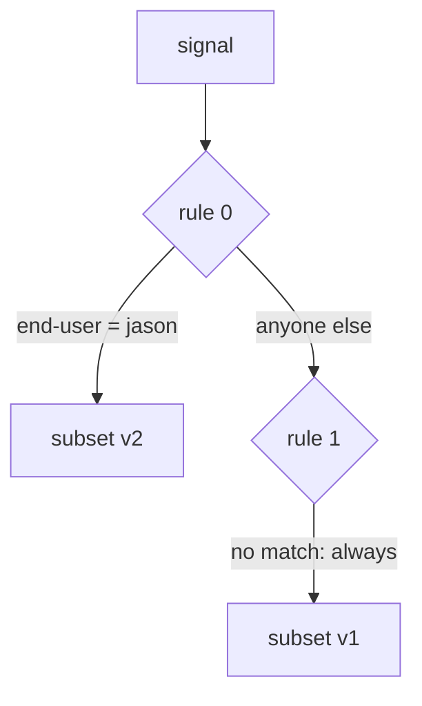

# Put Your Rules In Order

Astronaut, when a flight plan has several rules, more than one rule can fit the same signal. Only one of them is used. Which one decides more routing results than any other fact in this module.

The commands below need the `scout` `DestinationRule` with the subsets `v1`, `v2` and `v3` applied in your playground, and the `count_versions` helper pasted into your terminal.

## First match wins

The `http` field of a `VirtualService` is a list of rules. For each signal, the proxy reads that list **from the top** and **stops at the first rule that fits**. It does not look further down, it does not score the rules, and it does not combine them.

Think of the flight plan as a checklist. The crew reads it from the top and uses the first line that fits. Every line below that one is ignored for this signal.



Rule 0 asks one question: is `end-user` equal to `jason`? If yes, the signal flies to v2 and the checking stops. If not, the proxy moves on to rule 1. Rule 1 has no `match`, so it fits every signal that reaches it, and sends it to v1. Rules are counted from 0, the same way `istioctl` counts them.

## Order your rules from specific to general

Many web servers pick the most specific rule for you, wherever it sits in the file. Istio does not. **You** decide the priority, by the order of the list. Istio never sorts the rules.

So write them like this:

```text
  most specific rule       first
       ...
  least specific rule
  the catch-all            last, always
```

The **catch-all** is a rule without `match`. It fits every signal, so it is the "everyone else" line at the bottom of the checklist. Put it anywhere else, and every rule below it can never be reached.

<!-- astrona:playground:renew -->

### Try the right order

jason's rule first, the catch-all last. Save this as `virtualservice-scout.yaml`:

```yaml
apiVersion: networking.istio.io/v1
kind: VirtualService
metadata:
  name: scout
  namespace: starfleet
spec:
  hosts:
  - scout
  http:
  - match:
    - headers:
        end-user:
          exact: jason
    route:
    - destination:
        host: scout
        subset: v2
  - route:
    - destination:
        host: scout
        subset: v1
```

Apply it:

```sh
kubectl apply -f virtualservice-scout.yaml
```

Then send 10 signals as jason:

```sh
count_versions -H "end-user: jason" $SCOUT/0
```

You should see:

```text
  10 scout-v2
```

jason's signals fit rule 0, so they fly to v2.

### Swap the order

Now put the catch-all first. Save it in its own file, so you can switch back easily. Save this as `virtualservice-scout-wrong-order.yaml`:

```yaml
apiVersion: networking.istio.io/v1
kind: VirtualService
metadata:
  name: scout
  namespace: starfleet
spec:
  hosts:
  - scout
  http:
  - route:
    - destination:
        host: scout
        subset: v1
  - match:
    - headers:
        end-user:
          exact: jason
    route:
    - destination:
        host: scout
        subset: v2
```

Apply it:

```sh
kubectl apply -f virtualservice-scout-wrong-order.yaml
```

Then send jason's signals again, and ask `istioctl analyze` what it thinks:

```sh
count_versions -H "end-user: jason" $SCOUT/0
istioctl analyze -n starfleet
```

You should see:

```text
  10 scout-v1
Warning [IST0130] (VirtualService starfleet/scout) VirtualService rule #1 not used
(route without matches defined before).
```

jason now flies to v1, like everyone else. The catch-all fits his signals first, so the proxy stops before it ever reaches his rule. `istioctl analyze` warns that rule `#1`, the jason rule, is never used. `kubectl apply` prints the same warning.

Put the right order back:

```sh
kubectl apply -f virtualservice-scout.yaml
```

## Always end with a catch-all

The opposite mistake is to leave the catch-all out. Once a `VirtualService` exists for `scout`, the proxy only knows the rules inside it. A signal that fits none of them has no route at all, and the proxy answers it with **`404`** ("not found") by itself.

`istioctl analyze` stays quiet here, because a flight plan without a catch-all is valid. Maybe you meant it. So always ask yourself one question: what happens to signals that fit no rule?

### Remove the catch-all

Keep only jason's rule. Save this as `virtualservice-scout-no-catch-all.yaml`:

```yaml
apiVersion: networking.istio.io/v1
kind: VirtualService
metadata:
  name: scout
  namespace: starfleet
spec:
  hosts:
  - scout
  http:
  - match:
    - headers:
        end-user:
          exact: jason
    route:
    - destination:
        host: scout
        subset: v2
```

Apply it:

```sh
kubectl apply -f virtualservice-scout-no-catch-all.yaml
```

Then send one signal without a label and one as jason, read the shuttle's flight log, and run `istioctl analyze`:

```sh
kubectl exec -n starfleet deploy/shuttle -- curl -s -o /dev/null -w "%{http_code}\n" $SCOUT/0
kubectl exec -n starfleet deploy/shuttle -- curl -s -o /dev/null -w "%{http_code}\n" -H "end-user: jason" $SCOUT/0
kubectl logs -n starfleet deploy/shuttle -c istio-proxy --tail=2
istioctl analyze -n starfleet
```

You should see (log line trimmed):

```text
404
200
"GET /reviews/0 HTTP/1.1" 404 NR route_not_found ...
✔ No validation issues found
```

The signal without a label gets `404`. The flight log marks it with **`NR`**, short for "no route". jason's signal still gets `200`. And `istioctl analyze` finds nothing wrong.

Put the full flight plan back:

```sh
kubectl apply -f virtualservice-scout.yaml
```

## One flight plan per beacon

All of this assumes one `VirtualService` per host. If you write two `VirtualService` objects for the same host, there is no set order between them. Istio only combines them in some cases, and the result is hard to predict. Keep **one flight plan per beacon**, with every rule in one `http` list, where you can see the order.

## Common pitfalls

> [!WARNING]
> - **The catch-all placed first.** It fits every signal, so every rule below it is dead. `istioctl analyze` warns with `IST0130`.
> - **No catch-all at all.** Signals that fit no rule get `404 NR`, and `analyze` does not warn.
> - **Expecting the most specific rule to win.** Only the order of the list counts.
> - **Two `VirtualService` objects for one host.** There is no set order between them. Keep one per host.

> *The proxy reads the flight plan from the top and uses the first rule that fits. Put the most specific rule first and the catch-all last.*
