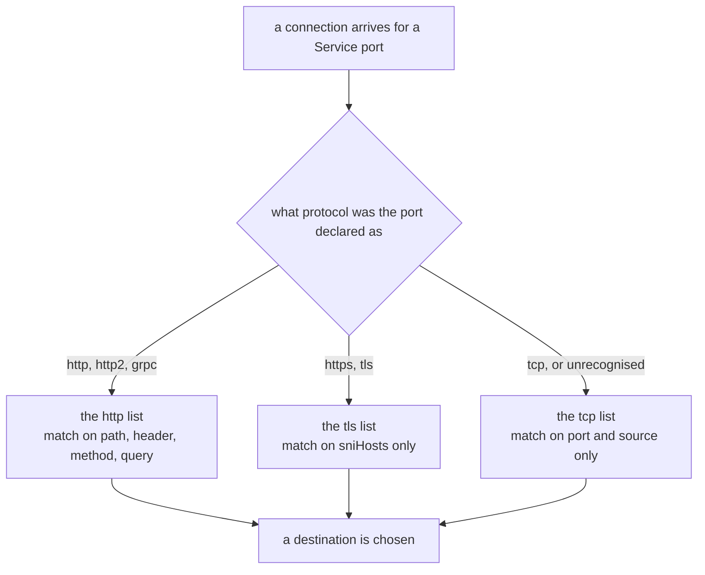

# Routing Non-HTTP Traffic

> Prerequisite: [Rewriting, Redirecting And Headers](./course-04-rewriting-redirecting-and-headers.md). Next: [the module landing page](./course.md).

Everything so far matched on something inside the request: a header, a path, a query parameter. That only works if the proxy can read the request, and it can only read the request if it knows the connection is carrying HTTP.

Plenty of traffic is not. A database connection, a Redis client, a gRPC stream over TLS the proxy is not terminating — for all of these the proxy sees an opaque stream of bytes. Istio can still route it, with much less to go on. This part is about that: how Istio decides which kind of traffic a port carries, what you can match on when there is no request to read, and what you give up.

It is also the answer to a failure that looks like nothing else in this course: **all your HTTP rules silently stop applying**, with no error, because one string in a Service definition was wrong.

## How Istio decides a port's protocol

Istio does not sniff every connection to work out what it is. It decides per **Service port**, from its declaration, before any traffic flows:

1. The port's **`appProtocol`** field, if set — `appProtocol: http`.
2. Otherwise the port's **`name`**, which must be the protocol or start with the protocol and a dash: `http`, `http-web`, `grpc`, `tcp-mysql`.
3. If neither identifies a protocol, the port is treated as **plain TCP**.

The recognised names are worth knowing because the fallback is silent:

| Name (or prefix) | Treated as | What you get |
| --- | --- | --- |
| `http`, `http2`, `grpc` | HTTP | everything in Parts 2 to 4: paths, headers, retries, timeouts |
| `https`, `tls` | TLS passthrough | routing by SNI only; the proxy does not decrypt |
| `tcp` | opaque TCP | routing by port and source only |
| `mongo`, `mysql`, `redis` | protocol-aware TCP | TCP routing, plus protocol-specific telemetry |
| anything else, or unnamed | opaque TCP | the silent fallback |

That last row is the trap. A port named `web`, `api`, or `svc-port` is not an error, does not warn, and quietly turns off every HTTP feature for that Service. The Service works — connections still get through — and every `VirtualService` rule you wrote for it does nothing.

Prove it on the playground's own Service, which is named `http` today.

> [!TIP]
> **Try it — turn off HTTP routing with one string**
>
> ```sh
> istioctl proxy-config listener deploy/tester -n routing-demo --port 80
> kubectl -n routing-demo patch svc notification-service --type merge \
>   -p '{"spec":{"ports":[{"name":"tcp","port":80,"targetPort":8084}]}}'
> sleep 3
> istioctl proxy-config listener deploy/tester -n routing-demo --port 80
> istioctl proxy-config routes deploy/tester -n routing-demo --name 80 | head -3
> ```
>
> Expect something like:
>
> ```text
> ADDRESS   PORT  MATCH                        DESTINATION
> 0.0.0.0   80    Trans: raw_buffer; App: HTTP Route: 80
> ADDRESS   PORT  MATCH        DESTINATION
> 0.0.0.0   80    ALL          Cluster: outbound|80||notification-service.routing-demo.svc.cluster.local
> NAME     VHOST NAME     DOMAINS     MATCH     VIRTUAL SERVICE
> ```
>
> The listener stopped handing traffic to a route table and started sending the whole connection straight to a cluster. The route listing is empty — there is no HTTP layer left for a `VirtualService` to attach to. Nothing errored, and `istioctl analyze` stays clean.

Leave the Service on `tcp` for the next section; the last checkpoint in this part restores it.

## The three route blocks

A `VirtualService` has three lists, and the protocol decision above chooses which one is ever consulted:



Rules in the wrong list are not an error and are simply never evaluated — which is the other half of the failure above. The port went opaque, the `http` list stopped being consulted, and the object still exists and still validates.

## `tcp:` — routing with no request to read

A `tcp` rule can match on the connection and nothing else:

```yaml
spec:
  hosts:
    - notification-service
  tcp:
    - match:
        - port: 80
      route:
        - destination:
            host: notification-service
            subset: v2
```

The available match keys are `port`, `sourceLabels` (which workload opened the connection), `sourceSubnet`, `destinationSubnets` and `gateways`. There is no path, no header, no method — none of that exists yet at the point the decision is made.

What still works is the destination half. Subsets, weights and `DestinationRule` traffic policy all apply, because those are decisions about *where to send bytes*, not about what the bytes say.

> [!TIP]
> **Try it — pinning an opaque port to one subset**
>
> ```sh
> kubectl apply -f - <<'EOF'
> apiVersion: networking.istio.io/v1
> kind: VirtualService
> metadata:
>   name: notification-service
>   namespace: routing-demo
> spec:
>   hosts:
>     - notification-service
>   tcp:
>     - match:
>         - port: 80
>       route:
>         - destination:
>             host: notification-service
>             subset: v2
> EOF
> sleep 2
> kubectl -n routing-demo exec deploy/tester -- sh -c \
>   'for i in $(seq 1 10); do curl -s -X POST http://notification-service/notify; echo; done' | sort | uniq -c
> ```
>
> Expect something like:
>
> ```text
>   10 ["EMAIL","SMS"]
> ```
>
> Every response is `v2`. The traffic is still HTTP as far as `curl` and nginx are concerned — the proxy simply never looked, and routed the connection on port alone.

## `tls:` — routing by SNI

When a port carries TLS the proxy is not terminating, the payload is encrypted and there is nothing to match on inside it. One thing is still readable: the **SNI** field in the TLS handshake, where the client states the hostname it means to reach, in the clear, before encryption starts.

```yaml
  tls:
    - match:
        - port: 443
          sniHosts:
            - api.example.com
      route:
        - destination:
            host: api.example.com
            port:
              number: 443
```

`sniHosts` is required in a `tls` match — it is the only thing that makes one TLS connection distinguishable from another. It accepts exact names and a leading wildcard (`*.example.com`).

This playground has no TLS workload, so there is nothing honest to run here. You will use `tls` routing for real in section 060 (a gateway passing TLS through untouched) and section 080 (an egress gateway selecting an external destination by SNI), both of which have the certificates to make it work.

## What non-HTTP routing costs you

Worth being explicit, because the loss is larger than it first appears:

```text
  available for tcp and tls        port, source, SNI, destination subnet
                                   subsets, weights, DestinationRule policy

  NOT available                    path / header / method / query matching
                                   rewrite, redirect, header manipulation, CORS
                                   HTTP retries, per-route timeouts, fault injection
                                   per-request load balancing — the connection is
                                     balanced once, at the start, and stays put
```

That last line is the one that catches people in production. HTTP load balancing is per request; TCP load balancing is per connection. A client that opens one long-lived connection gets one endpoint for its lifetime, no matter what load balancer policy you configure.

> [!TIP]
> **Try it — put the port back**
>
> ```sh
> kubectl -n routing-demo delete virtualservice notification-service
> kubectl -n routing-demo patch svc notification-service --type merge \
>   -p '{"spec":{"ports":[{"name":"http","port":80,"targetPort":8084}]}}'
> sleep 3
> istioctl proxy-config listener deploy/tester -n routing-demo --port 80
> ```
>
> Expect something like:
>
> ```text
> ADDRESS   PORT  MATCH                        DESTINATION
> 0.0.0.0   80    Trans: raw_buffer; App: HTTP Route: 80
> ```
>
> `Route: 80` is back, which means the HTTP layer is back and a `VirtualService` `http` list will be consulted again. Re-apply the four-rule object from Part 3 if you want the module's scenario running.

## Common pitfalls

> [!WARNING]
> **A Service port named anything unrecognised.** `web`, `api`, `port-80` all fall back to plain TCP, silently disabling every HTTP feature for that Service. Name it `http`, or set `appProtocol`.
>
> **Writing `http` rules for a TCP port.** The list is never consulted. No error, no warning, no effect.
>
> **Expecting a `tcp` match to see a path or header.** The decision is made before any request is parsed. Only the connection is visible.
>
> **Omitting `sniHosts` from a `tls` match.** It is what makes the match meaningful, and Istio requires it.
>
> **Assuming load balancer policy behaves the same for TCP.** HTTP balances per request; TCP balances per connection. A long-lived connection never moves.
>
> **Diagnosing this from `analyze`.** A misnamed port is valid Kubernetes and valid Istio. The listener dump is what shows it.

> *Istio decides a port's protocol from its name before any traffic flows — and that one string decides whether you are routing requests or bytes.*

## Reference

- [Protocol selection](https://istio.io/latest/docs/ops/configuration/traffic-management/protocol-selection/) — the naming rules and `appProtocol`, stated upstream.
- [TCPRoute API](https://istio.io/latest/docs/reference/config/networking/virtual-service/#TCPRoute) — the `tcp` list and its match keys.
- [TLSRoute API](https://istio.io/latest/docs/reference/config/networking/virtual-service/#TLSRoute) — the `tls` list and `sniHosts`.
- [L4Match and L4MatchAttributes](https://istio.io/latest/docs/reference/config/networking/virtual-service/#L4MatchAttributes) — everything a connection-level match can see.
