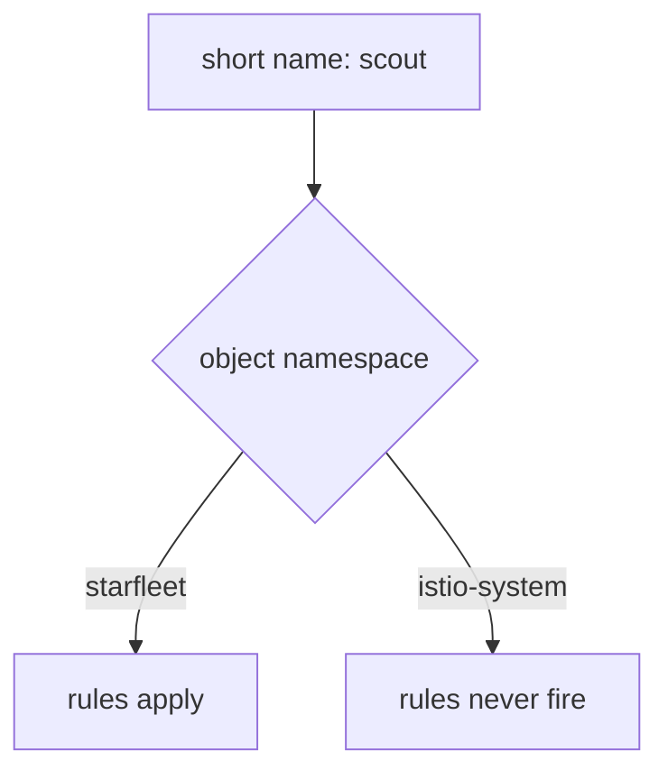

# Find Out Why A Rule Does Nothing

Astronaut, sooner or later you will apply a flight plan, see `kubectl` accept it, and watch the signals ignore it. The object looks perfect. Something else is wrong. This part gives you the three checks that find it: the namespace a short name is filled in from, the short code in the flight log, and the route table the proxy really holds.

The commands below need the `scout` `DestinationRule` with the subsets `v1`, `v2` and `v3` applied in your playground, and the `count_versions` helper pasted into your terminal.

## Short host names are filled in from the object's namespace

`spec.hosts` and every `destination.host` accept a short name like `scout`. A short name works like a beacon's call sign without its planet. Istio fills in the planet for you: the **namespace of the object the name appears in**. Not the workload's namespace, and not the caller's.



The question is which namespace the **object** lives in. In `starfleet`, the short name becomes `scout.starfleet.svc.cluster.local`, a Service that exists, so the rules apply. In `istio-system`, it becomes `scout.istio-system.svc.cluster.local`, which does not exist, so the rules never fire.

Create the object in the wrong namespace and nothing happens. `kubectl get virtualservice` shows it. It is valid. And no rule ever fires, because the host it describes does not exist there.

The full name, `scout.starfleet.svc.cluster.local`, is the complete address: call sign, planet and solar system. It is also called the **FQDN** (Fully Qualified Domain Name), and it cannot be misread. Use it whenever the object and the service do not live in the same namespace, and in the exam whenever you are unsure.

The same rule applies to `DestinationRule.spec.host`. A `DestinationRule` in the wrong namespace defines subsets for a host nobody calls.

<!-- astrona:playground:renew -->

### The same rule with full names

Write a flight plan that sends every signal to v1, using full names on both sides. Save this as `virtualservice-scout-fqdn.yaml`:

```yaml
apiVersion: networking.istio.io/v1
kind: VirtualService
metadata:
  name: scout
  namespace: starfleet
spec:
  hosts:
  - scout.starfleet.svc.cluster.local
  http:
  - route:
    - destination:
        host: scout.starfleet.svc.cluster.local
        subset: v1
```

Apply it:

```sh
kubectl apply -f virtualservice-scout-fqdn.yaml
```

Then check the result:

```sh
count_versions $SCOUT/0
```

You should see:

```text
  10 scout-v1
```

Here the short name and the full name mean the same Service, because the object lives in `starfleet`. The object is also called `scout`, so it replaces any earlier `scout` flight plan.

## The failure signatures

Most broken routing shows one of a few symptoms, and each one points at a different part of your setup. The access log's **response flag**, the short code in the flight log for what went wrong, tells them apart. You find it in the log line, right after the status code.

| Symptom | Flag | Means | Look at |
| --- | --- | --- | --- |
| **The wrong version answers, no error** | none | a rule fitted that you did not expect | rule order; AND or OR; a catch-all above your rules |
| **`404`** | `NR` | no rule fitted, and there is no catch-all | add a catch-all as the last rule |
| **`503`** | `NC` | the route names a subset that has no cluster | subset name spelled wrong; `DestinationRule` missing, in another namespace, or not pushed yet |
| **`503`** | `UH` | the cluster exists but has no pods | subset labels match no pod; pods not running or not ready |

`NC` and `UH` look the same to the sender: a bare `503`, with nothing in the response or the app's logs. Only the flag tells you which row you are in. `istioctl analyze` catches the common `NC` case, a subset that no `DestinationRule` defines, by checking the two objects against each other.

### A typo in the subset name (`503 NC`)

Ask for a subset that does not exist. Save this as `virtualservice-scout-typo.yaml`:

```yaml
apiVersion: networking.istio.io/v1
kind: VirtualService
metadata:
  name: scout
  namespace: starfleet
spec:
  hosts:
  - scout
  http:
  - route:
    - destination:
        host: scout
        subset: v4
```

Apply it:

```sh
kubectl apply -f virtualservice-scout-typo.yaml
```

Then check the result:

```sh
kubectl exec -n starfleet deploy/shuttle -- curl -s -o /dev/null -w "%{http_code}\n" $SCOUT/0
kubectl logs -n starfleet deploy/shuttle -c istio-proxy --tail=1
istioctl analyze -n starfleet
```

You should see (log line trimmed):

```text
503
"GET /reviews/0 HTTP/1.1" 503 NC cluster_not_found ...
Error [IST0101] (VirtualService starfleet/scout) Referenced host+subset in destinationrule not found: "scout+v4"
```

Mission control builds one cluster per subset in the `DestinationRule`. There is no `v4` subset, so there is no `v4` cluster. The route points at nothing, and the signal never leaves the shuttle.

> [!TIP]
> If the log line is an older one, the flight log has not been written yet. Run the `kubectl logs` line again.

You get the same `NC` for a short time if you apply a `VirtualService` *before* the `DestinationRule` it uses. The safe order is called "make before break": apply the `DestinationRule` first, wait a moment, then apply the `VirtualService` that uses it.

Put the working flight plan back:

```sh
kubectl apply -f virtualservice-scout-fqdn.yaml
```

## Proving the proxy has your rules

Istio accepting an object and the communications officer acting on it are two different facts. When they disagree, the object looks perfect and the behaviour is wrong. That can happen when mission control's push has not landed yet, when the proxy was told to ignore that host, or when the object is in the wrong namespace. `istioctl proxy-config` shows which.

For routing, the useful subcommand is `routes`: the route table, where a `VirtualService` lands. If you doubt the push itself, `istioctl proxy-status` answers that first: every proxy should show `SYNCED`.

An easy way to remember the split: the **route** picks a cluster, and the **cluster** holds the pods. That is the same split as `VirtualService` and `DestinationRule`.

### See where the route points

With the full-name flight plan applied, print the cluster the route uses, and the clusters the shuttle holds:

```sh
istioctl proxy-config routes deploy/shuttle -n starfleet --name 9080 -o json | grep '"cluster".*scout'
istioctl proxy-config clusters deploy/shuttle -n starfleet | grep scout
```

You should see something like:

```text
"cluster": "outbound|9080|v1|scout.starfleet.svc.cluster.local"
scout.starfleet.svc.cluster.local   9080   -    outbound   EDS   scout.starfleet
scout.starfleet.svc.cluster.local   9080   v1   outbound   EDS   scout.starfleet
scout.starfleet.svc.cluster.local   9080   v2   outbound   EDS   scout.starfleet
scout.starfleet.svc.cluster.local   9080   v3   outbound   EDS   scout.starfleet
```

There is one cluster per subset, plus `-` for the whole Service, and the route uses the v1 cluster. If a `VirtualService` exists in `kubectl` but its cluster never shows up here, the break is between mission control and this proxy, not in your YAML.

## Common pitfalls

> [!WARNING]
> - **The object in the wrong namespace.** Short names are filled in from the object's own namespace. The object exists, and the rules never fire. Use full names.
> - **A subset no `DestinationRule` defines.** `503 NC`. `analyze` reports `IST0101`.
> - **A subset whose labels match no pod.** `503 UH`. `analyze` reports `IST0173`, and `proxy-config endpoints` shows the empty list.
> - **Reading only the status code.** `NC` and `UH` are both a bare `503`. Read the flag.
> - **Trusting a clean `analyze`.** It checks objects against each other. It does not prove your rules are in a sensible order, or that signals take the path you expect.

> *When behaviour and configuration disagree, `istioctl analyze` checks the objects against each other, and `istioctl proxy-config` checks what the proxy was actually given. Use them in that order.*
