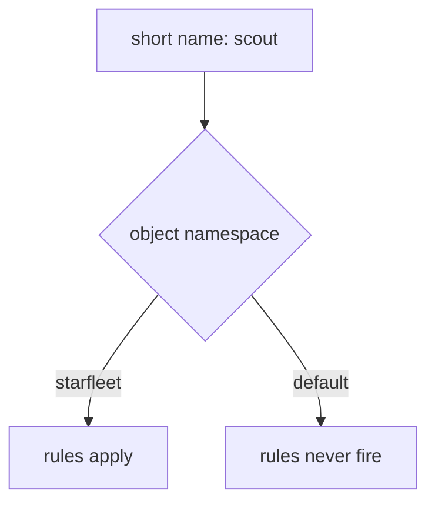

# Put The Flight Plan On The Right Planet

Astronaut, sooner or later you will apply a flight plan, see `kubectl` accept it, and watch the signals ignore it. The most common reason is also the quietest: the flight plan sits on the wrong planet. A short host name is filled in from the namespace of the object, so in the wrong namespace the rule describes a beacon that does not exist.

This part shows that mistake, how to find it, and the habit that prevents it.

The commands below need the `scout` `DestinationRule` with the subsets `v1`, `v2` and `v3` applied in your playground, and the `count_versions` helper pasted into your terminal.

## Short names are filled in from the object's planet

`spec.hosts` and every `destination.host` accept a short name like `scout`. A short name is a beacon's call sign without its planet. Istio fills in the planet for you, and it always uses the **namespace of the object the name appears in**. Not the namespace of the sending ship, and not the namespace of the receiving ship.



In `starfleet`, the short name becomes `scout.starfleet.svc.cluster.local`: a Service that exists, so the rules apply. In `default`, it becomes `scout.default.svc.cluster.local`: a Service that does not exist, so the rules never fire for anybody.

The full name, `scout.starfleet.svc.cluster.local`, is the complete address: call sign, planet and solar system. It is also called the **FQDN** (Fully Qualified Domain Name). It means the same thing in every namespace, so it cannot be misread.

The same rule applies to `DestinationRule.spec.host`. A `DestinationRule` with a short name in the wrong namespace defines ship classes for a beacon nobody calls.

<!-- astrona:playground:renew -->

### Put the flight plan on the wrong planet

Write a flight plan that sends every signal to v1, but put it in the namespace `default` by mistake. Save this as `virtualservice-scout-wrong-planet.yaml`:

```yaml
apiVersion: networking.istio.io/v1
kind: VirtualService
metadata:
  name: scout
  namespace: default
spec:
  hosts:
  - scout
  http:
  - route:
    - destination:
        host: scout
        subset: v1
```

Apply it:

```sh
kubectl apply -f virtualservice-scout-wrong-planet.yaml
```

```text
virtualservice.networking.istio.io/scout created
```

`kubectl` accepts it without a word. Now send 10 signals:

```sh
count_versions $SCOUT/0
```

You should see a mix, for example:

```text
   1 scout-v1
   5 scout-v2
   4 scout-v3
```

The flight plan says "everything to v1", but the signals still go to all three versions. The rule describes `scout.default.svc.cluster.local`, and the shuttle never calls that beacon.

### Find the flight plan that does nothing

First, list every `VirtualService` on every planet:

```sh
kubectl get virtualservice -A
```

```text
NAMESPACE   NAME    GATEWAYS   HOSTS       AGE
default     scout              ["scout"]   9s
```

The `NAMESPACE` column gives it away: the flight plan lives in `default`, but the beacon lives in `starfleet`.

`istioctl analyze` can tell you too, but only if you point it at the right namespace. `istioctl analyze -n starfleet` looks only at `starfleet`, where nothing is wrong. Check the namespace the object is in instead:

```sh
istioctl analyze -n default
```

You should see (trimmed to the two errors):

```text
Error [IST0101] (VirtualService default/scout) Referenced host not found: "scout"
Error [IST0101] (VirtualService default/scout) Referenced host+subset in destinationrule not found: "scout+v1"
```

`Referenced host not found` is the wrong-planet signature: Istio looked for `scout` in `default` and found no such Service. When you are not sure where an object is, run `istioctl analyze -A` to check every namespace at once.

### Fix it with full names

Full names work from any planet. Keep the flight plan in `default`, but write the full name on both sides. Save this as `virtualservice-scout-wrong-planet.yaml`, replacing the old file:

```yaml
apiVersion: networking.istio.io/v1
kind: VirtualService
metadata:
  name: scout
  namespace: default
spec:
  hosts:
  - scout.starfleet.svc.cluster.local
  http:
  - route:
    - destination:
        host: scout.starfleet.svc.cluster.local
        subset: v1
```

Apply it:

```sh
kubectl apply -f virtualservice-scout-wrong-planet.yaml
```

Then send 10 signals again:

```sh
count_versions $SCOUT/0
```

You should see:

```text
  10 scout-v1
```

Now every signal flies to v1, even though the flight plan still lives in `default`. The full name points at the real beacon in `starfleet`, wherever the object is.

Keeping flight plans next to the service they describe is still the easiest setup to read. Remove the one in `default`:

```sh
kubectl delete -f virtualservice-scout-wrong-planet.yaml
```

```text
virtualservice.networking.istio.io "scout" deleted from default namespace
```

And put the same flight plan on the right planet. Save this as `virtualservice-scout-fqdn.yaml`:

```yaml
apiVersion: networking.istio.io/v1
kind: VirtualService
metadata:
  name: scout
  namespace: starfleet
spec:
  hosts:
  - scout.starfleet.svc.cluster.local
  http:
  - route:
    - destination:
        host: scout.starfleet.svc.cluster.local
        subset: v1
```

Apply it:

```sh
kubectl apply -f virtualservice-scout-fqdn.yaml
```

> [!TIP]
> In the exam, write full names whenever the object and the service might not share a namespace. A full name can never be filled in the wrong way.

## Common pitfalls

> [!WARNING]
> - **The object in the wrong namespace.** Short names are filled in from the object's own namespace. The object exists, and the rules never fire. Use full names, or put the object next to its Service.
> - **Running `istioctl analyze` on the wrong namespace.** It only checks the namespace you name. Use `-A` when you are not sure.
> - **A `DestinationRule` with a short host in the wrong namespace.** It defines ship classes for a beacon nobody calls.

> *A short name is filled in from the planet the flight plan sits on. Put the flight plan next to its beacon, or write the full name.*
