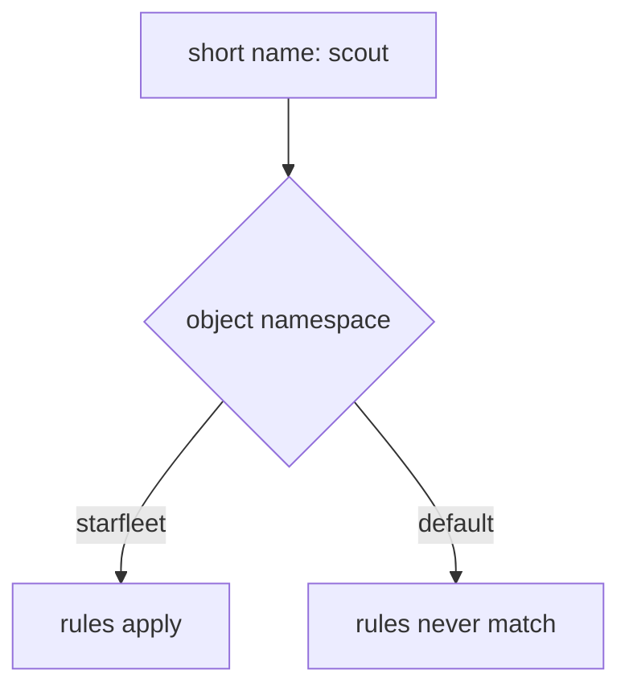

# Resolve Short Host Names To The Right Namespace

Sooner or later you will apply a `VirtualService`, see `kubectl` accept it, and watch the requests ignore it. The most common reason is also the quietest: the object sits in the wrong namespace. Istio fills in a short host name from the namespace of the object. In the wrong namespace, the rule describes a Service that does not exist.

A **`VirtualService`** is the Istio object that sets where requests to a host go. This part shows the wrong-namespace mistake, how to find it, and the habit that prevents it.

The commands below need the `scout` `DestinationRule` with the subsets `v1`, `v2` and `v3` applied in your playground. A `DestinationRule` defines subsets, which are named groups of pods picked by a pod label such as `version: v1`. The commands also use the `count_versions` helper, which sends 10 requests from the `shuttle` pod to `scout` and counts which version answered. `$SCOUT` holds `http://scout:9080/reviews`.

## Short names are filled in from the object's namespace

`spec.hosts` and every `destination.host` accept a short name like `scout`. A short name is a Service name without its namespace. Istio fills in the namespace for you, and it always uses the **namespace of the object the name appears in**. It does not use the namespace of the client pod, and it does not use the namespace of the server pod.



The diagram shows the two results. In `starfleet`, the short name becomes `scout.starfleet.svc.cluster.local`, a Service that exists, so the rules apply. In `default`, it becomes `scout.default.svc.cluster.local`, a Service that does not exist, so the rules never apply to any request.

The full name, `scout.starfleet.svc.cluster.local`, is the **FQDN** (Fully Qualified Domain Name): the complete DNS name with Service, namespace and cluster domain. It means the same thing in every namespace, so Istio cannot fill it in the wrong way.

The same rule applies to `DestinationRule.spec.host`. A `DestinationRule` with a short name in the wrong namespace defines subsets for a Service that no client calls.

### Put the VirtualService in the wrong namespace

Write a `VirtualService` that sends every request to v1, but put it in the namespace `default` by mistake.

<!-- astrona:playground:renew -->

Save this as `virtualservice-scout-wrong-planet.yaml`:

```yaml
apiVersion: networking.istio.io/v1
kind: VirtualService
metadata:
  name: scout
  namespace: default
spec:
  hosts:
  - scout
  http:
  - route:
    - destination:
        host: scout
        subset: v1
```

Apply it:

```sh
kubectl apply -f virtualservice-scout-wrong-planet.yaml
```

```text
virtualservice.networking.istio.io/scout created
```

`kubectl` accepts it with no warning. Then check the result. Send 10 requests:

```sh
count_versions $SCOUT/0
```

You should see a mix, for example:

```text
   1 scout-v1
   5 scout-v2
   4 scout-v3
```

The `VirtualService` says "everything to v1", but the requests still go to all three versions. The rule describes `scout.default.svc.cluster.local`, and `shuttle` never calls that host.

### Find the VirtualService that does nothing

First, list every `VirtualService` in every namespace:

```sh
kubectl get virtualservice -A
```

```text
NAMESPACE   NAME    GATEWAYS   HOSTS       AGE
default     scout              ["scout"]   9s
```

The `NAMESPACE` column shows the problem: the `VirtualService` lives in `default`, but the `scout` Service lives in `starfleet`.

`istioctl analyze`, the command that runs Istio's own checks over the objects in a namespace, can find it too. But it only checks the namespace you name. `istioctl analyze -n starfleet` looks only at `starfleet`, where nothing is wrong. Check the namespace the object is in instead:

```sh
istioctl analyze -n default
```

You should see this (shortened to the two errors):

```text
Error [IST0101] (VirtualService default/scout) Referenced host not found: "scout"
Error [IST0101] (VirtualService default/scout) Referenced host+subset in destinationrule not found: "scout+v1"
```

`Referenced host not found` is the sign of the wrong namespace: Istio looked for `scout` in `default` and found no such Service. When you are not sure where an object is, run `istioctl analyze -A` to check every namespace at once.

### Fix it with full names

Full names work from any namespace. Keep the `VirtualService` in `default`, but write the full name in both host fields.

Save this as `virtualservice-scout-wrong-planet.yaml`, replacing the old file:

```yaml
apiVersion: networking.istio.io/v1
kind: VirtualService
metadata:
  name: scout
  namespace: default
spec:
  hosts:
  - scout.starfleet.svc.cluster.local
  http:
  - route:
    - destination:
        host: scout.starfleet.svc.cluster.local
        subset: v1
```

Apply it:

```sh
kubectl apply -f virtualservice-scout-wrong-planet.yaml
```

Then check the result. Send 10 requests again:

```sh
count_versions $SCOUT/0
```

You should see:

```text
  10 scout-v1
```

Now every request goes to v1, even though the `VirtualService` still lives in `default`. The full name points at the real `scout` Service in `starfleet`, wherever the object is.

Keeping a `VirtualService` next to the Service it describes is still the easiest setup to read. Remove the one in `default`:

```sh
kubectl delete -f virtualservice-scout-wrong-planet.yaml
```

```text
virtualservice.networking.istio.io "scout" deleted from default namespace
```

Then create the same `VirtualService` in the right namespace.

Save this as `virtualservice-scout-fqdn.yaml`:

```yaml
apiVersion: networking.istio.io/v1
kind: VirtualService
metadata:
  name: scout
  namespace: starfleet
spec:
  hosts:
  - scout.starfleet.svc.cluster.local
  http:
  - route:
    - destination:
        host: scout.starfleet.svc.cluster.local
        subset: v1
```

Apply it:

```sh
kubectl apply -f virtualservice-scout-fqdn.yaml
```

> [!TIP]
> In the exam, write full names whenever the object and the Service might not share a namespace. Istio cannot fill in a full name the wrong way.

## What you know now

Istio fills in a short host name from the namespace of the object that holds it. A `VirtualService` in the wrong namespace is valid, but it describes a Service that does not exist, so it never matches. `kubectl get virtualservice -A` and `istioctl analyze -A` find it, and the error is `IST0101 Referenced host not found`. Full names, or objects placed next to their Service, prevent it. The open question is how to prove what the proxy really does with a request when a rule still seems to do nothing.

## Common pitfalls

> [!WARNING]
> - **The object in the wrong namespace.** Short names are filled in from the object's own namespace. The object exists, and the rules never match. Use full names, or put the object next to its Service.
> - **Running `istioctl analyze` on the wrong namespace.** It only checks the namespace you name. Use `-A` when you are not sure.
> - **A `DestinationRule` with a short host in the wrong namespace.** It defines subsets for a Service that no client calls.
