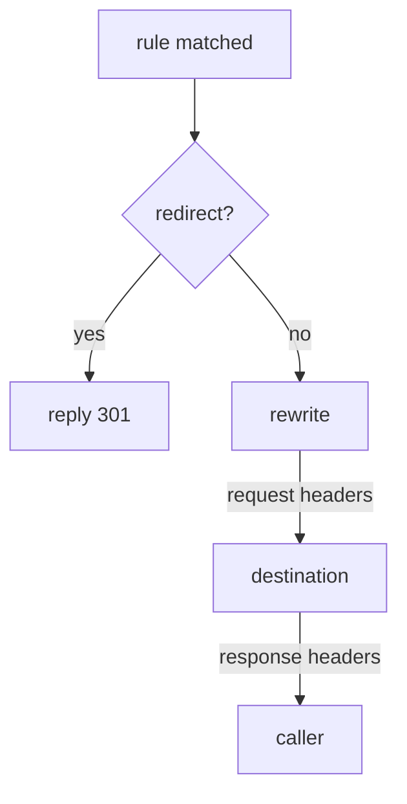

# Rewriting, Redirecting And Headers

So far a matched rule has done one thing: chosen a destination. That is the most common job of a rule, but not the only one. Astronaut, a communications officer can do more than point a signal somewhere. A rule can also answer the signal itself with a redirect. It can change the path before sending the request on. It can add or remove headers in both directions. And it can handle browser CORS checks without the app knowing CORS exists.

These are extra fields on the same `http` rule you already use to route signals. The object, the matching and the order all work exactly as before.

This part uses **`probe`** instead of `scout`. `probe` is a test app in the playground (port `8000`) that echoes back what it receives: `/headers` shows the request headers, and `/anything` shows the path and headers it got. That makes the proxy's changes visible. The rules below send to the `probe` Service without a subset, so they need no `DestinationRule`.

## What a matched rule can do

Once a rule matches, its fields are applied in a fixed order. The first thing to know is that one of them ends the request at once.



Once a rule matches, the proxy first checks for `redirect`. If it is there, the proxy replies `301` to the caller itself, nothing is sent on, and the request ends. If not, it applies `rewrite` (the path or the authority), then the request `headers`, sends the request to the route's destination, and finally applies the response `headers` before handing the answer back. `redirect` and `route` are alternatives, not partners. A rule that redirects never reaches a destination, and Istio rejects an object that tries to do both.

The fields on one `http` rule, and which of them this part teaches:

| Field | Does | In this part |
| --- | --- | --- |
| `route` | choose a destination | you already use it |
| `redirect` | answer the caller with a 3xx instead of sending the request on | yes |
| `rewrite` | change the path or `Host` before sending the request on | yes |
| `headers` | add, set or remove request and response headers | yes |
| `corsPolicy` | answer browser preflight checks and add CORS response headers | yes |
| `timeout`, `retries` | give up, or try again | no |
| `fault` | inject a delay or an error on purpose | no |
| `mirror` | send a copy elsewhere | not in this module |

The last group are fields on the object you already know. Most of the rest of this course is this table filling up.

## `redirect`: answer instead of sending on

```yaml
- match:
  - uri:
      prefix: /old
  redirect:
    uri: /get
    redirectCode: 301
```

The proxy replies to the caller with a `301` and a `Location` header. Nothing reaches any pod. It is like a spaceport gate that tells an arriving ship "wrong gate, go to gate 7" without letting it dock.

`redirectCode` defaults to `301`. Set it to `302` for a temporary move. Prefer `308` when the method must stay the same, because a `301` allows a client to turn a `POST` into a `GET`. `redirect.authority` also changes the host in the `Location` header, which is how you move a path to a different host name.

<!-- astrona:playground:renew -->

> [!TIP]
> **Try it: a rule that never reaches a pod**
>
> Save this as `virtualservice-probe-redirect.yaml`:
>
> ```yaml
> apiVersion: networking.istio.io/v1
> kind: VirtualService
> metadata:
>   name: probe
>   namespace: starfleet
> spec:
>   hosts:
>   - probe
>   http:
>   - match:
>     - uri:
>         prefix: /old
>     redirect:
>       uri: /get
>   - route:
>     - destination:
>         host: probe
> ```
>
> Apply it:
>
> ```sh
> kubectl apply -f virtualservice-probe-redirect.yaml
> ```
>
> Then check the result:
>
> ```sh
> kubectl exec -n starfleet deploy/shuttle -- \
>   curl -s -o /dev/null -w 'status=%{http_code} location=%{redirect_url}\n' http://probe:8000/old
> ```
>
> You should see `status=301` and a location that ends in `/get`. The proxy made that answer itself. No `probe` pod was involved, and the caller now has to make a second request.

## `rewrite`: change the path before sending on

`redirect` tells the caller to go somewhere else. `rewrite` quietly re-addresses the signal in flight, on its way to the destination. The caller never learns that the app received a different path.

```yaml
- match:
  - uri:
      prefix: /beta
  rewrite:
    uri: /anything
  route:
  - destination:
      host: probe
```

How much is replaced depends on how the rule matched. This is the part that surprises people:

- After a **`prefix`** match, `rewrite.uri` replaces **only the matched prefix**. `/beta/test`, matched on prefix `/beta` and rewritten to `/anything`, becomes `/anything/test`.
- After an **`exact`** match, the whole path is replaced.

`rewrite.authority` does the same job for the `Host` header. That matters when the destination serves several host names and expects its own.

Proving a rewrite needs care, because the obvious place to look misleads you. The caller sees nothing. You might then read the access log, but Istio's default log format records the path in `x-envoy-original-path` when it exists, and Envoy sets that header when it rewrites. **So a working rewrite logs the path the caller asked for, at both ends.** Reading that as "my rewrite is broken" is the trap.

Two things do prove it. The compiled route shows the rewrite as a field called `prefixRewrite`. And an echo app like `probe` shows the path it actually received.

> [!TIP]
> **Try it: the rewrite, seen from both sides**
>
> Save this as `virtualservice-probe-rewrite.yaml`:
>
> ```yaml
> apiVersion: networking.istio.io/v1
> kind: VirtualService
> metadata:
>   name: probe
>   namespace: starfleet
> spec:
>   hosts:
>   - probe
>   http:
>   - match:
>     - uri:
>         prefix: /beta
>     rewrite:
>       uri: /anything
>     route:
>     - destination:
>         host: probe
>   - route:
>     - destination:
>         host: probe
> ```
>
> Apply it:
>
> ```sh
> kubectl apply -f virtualservice-probe-rewrite.yaml
> ```
>
> Then check the result:
>
> ```sh
> istioctl proxy-config routes deploy/shuttle -n starfleet --name 8000 -o json \
>   | grep -E '"/beta"|prefixRewrite'
> kubectl exec -n starfleet deploy/shuttle -- curl -s http://probe:8000/beta/test | grep '"url"'
> ```
>
> In the route dump, look for `"prefix": "/beta"` and `"prefixRewrite": "/anything"` on the same route entry. In the `probe` answer, the `url` field ends in `/anything/test`: only the matched prefix was replaced, and the rest of the path came along.

## `headers`: two scopes, three operations

Header changes can apply at two levels. Choosing the wrong one is the usual mistake.

```yaml
http:
- route:
  - destination:
      host: probe
    headers:                  # ← per DESTINATION: only requests sent here
      request:
        set:
          x-served-by: probe
  headers:                    # ← per RULE: every request this rule handles
    response:
      add:
        x-routed-by: istio
```

The indentation tells you the scope. A `headers` block lined up with `route` applies to everything the rule handles. A `headers` block inside a `route` item applies only to requests sent to that destination. You want the second when two destinations must be told apart, for example when a weighted route splits traffic between two versions.

Each scope takes `request` and `response`, and each of those takes three operations:

| Operation | Effect |
| --- | --- |
| `set` | replace the header, creating it if it is missing |
| `add` | add a value, keeping any value already there |
| `remove` | drop the named headers. A list of names, not a map |

`remove` has a different shape from the others: it is a plain list (`remove: ["x-internal-token"]`), because there is no value to give.

> [!TIP]
> **Try it: headers the app never sent, and one it never sees**
>
> Save this as `virtualservice-probe-headers.yaml`:
>
> ```yaml
> apiVersion: networking.istio.io/v1
> kind: VirtualService
> metadata:
>   name: probe
>   namespace: starfleet
> spec:
>   hosts:
>   - probe
>   http:
>   - headers:
>       request:
>         set:
>           x-flight-plan: istio
>         remove:
>         - x-internal-token
>       response:
>         set:
>           x-routed-by: istio
>     route:
>     - destination:
>         host: probe
> ```
>
> Apply it:
>
> ```sh
> kubectl apply -f virtualservice-probe-headers.yaml
> ```
>
> Then check the result:
>
> ```sh
> kubectl exec -n starfleet deploy/shuttle -- \
>   curl -s -H "x-internal-token: secret" http://probe:8000/headers
> kubectl exec -n starfleet deploy/shuttle -- \
>   curl -s -D - -o /dev/null http://probe:8000/get | grep -i 'x-routed-by'
> ```
>
> In the echoed request headers, `X-Flight-Plan: istio` is there and `X-Internal-Token` is gone. The `shuttle` pod's proxy changed the request on the way out. The second command shows `x-routed-by: istio` on the response, added on the way back. `probe` knows nothing about either change.

## `corsPolicy`: browser checks handled by the proxy

A browser that calls an API on another site first sends an `OPTIONS` request, called a **preflight**. It only goes ahead if the answer carries the right `access-control-allow-*` headers. Building that correctly into every service is the kind of shared work a mesh is meant to take over.

```yaml
- corsPolicy:
    allowOrigins:
    - exact: https://shop.example.com
    allowMethods: ["GET", "POST"]
    allowHeaders: ["content-type"]
    maxAge: "24h"
  route:
  - destination:
      host: probe
```

`allowOrigins` takes the same string match forms as a header match: `exact`, `prefix` or `regex`. So a wildcard is `regex: ".*"`, not a plain `*`. The proxy answers preflights itself and adds the response headers to normal cross-site requests.

The important limit: **CORS is not a security control.** It is a browser rule, enforced by the browser. A `corsPolicy` does not stop `curl`, a script or any other non-browser client. That is what authorization policy is for.

> [!TIP]
> **Try it: the header a browser looks for**
>
> Save this as `virtualservice-probe-cors.yaml`:
>
> ```yaml
> apiVersion: networking.istio.io/v1
> kind: VirtualService
> metadata:
>   name: probe
>   namespace: starfleet
> spec:
>   hosts:
>   - probe
>   http:
>   - corsPolicy:
>       allowOrigins:
>       - exact: https://shop.example.com
>       allowMethods: ["GET", "POST"]
>     route:
>     - destination:
>         host: probe
> ```
>
> Apply it:
>
> ```sh
> kubectl apply -f virtualservice-probe-cors.yaml
> ```
>
> Then check the result:
>
> ```sh
> kubectl exec -n starfleet deploy/shuttle -- \
>   curl -s -D - -o /dev/null -H "Origin: https://shop.example.com" http://probe:8000/get \
>   | grep -i 'access-control'
> ```
>
> You should see `access-control-allow-origin: https://shop.example.com`. Send the same request with a different `Origin` and the header is missing. The request still succeeds: it is the browser, not the proxy, that would refuse to use the answer.

When you are done, remove the test rule with `kubectl delete virtualservice probe -n starfleet`.

## Common pitfalls

> [!WARNING]
> - **`redirect` and `route` on the same rule.** They are alternatives. Istio rejects the object.
> - **Expecting `rewrite` to replace the whole path after a `prefix` match.** It replaces only the matched prefix.
> - **Looking for a rewrite in the access log.** A *working* rewrite logs the original path at both ends. Check `prefixRewrite` in the compiled route, or use an echo app.
> - **`headers` at the wrong level.** Lined up with `route`, it applies to the whole rule. Inside a `route` item, it applies to that destination only.
> - **Writing `remove` as a map.** It is a list of header names.
> - **`allowOrigins: ["*"]`.** The field takes string matches. A wildcard is `regex: ".*"`.
> - **Treating `corsPolicy` as access control.** It only shapes what a browser is willing to do.

> *`redirect` ends the request, `rewrite` changes it on the way, and `headers` changes it in either direction. All of them are fields on the same rule that already chose the destination.*
