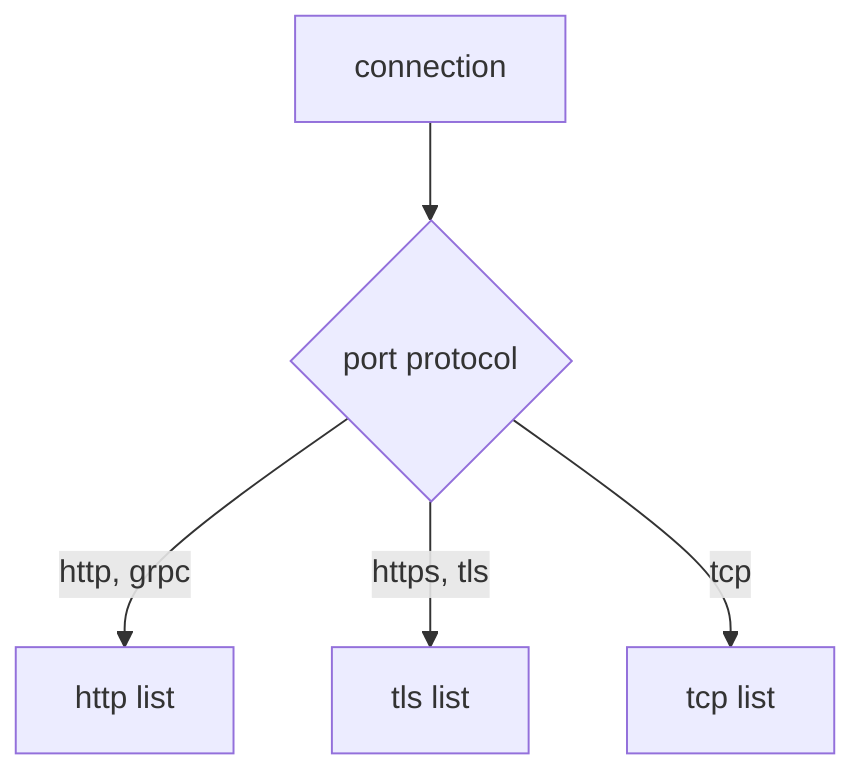

# Routing Non-HTTP Traffic

Everything so far matched on something inside the signal: a header, a path, a query parameter. That only works if the communications officer can read the signal. And it can only read the request if it knows the connection carries HTTP.

Plenty of traffic does not. A database connection, a Redis client, or TLS traffic the proxy does not decrypt: for all of these the proxy sees a sealed stream of bytes, like a coded transmission it cannot decode. Istio can still route it, with much less to go on. This part covers how Istio decides what kind of traffic a port carries, what you can match on when there is no request to read, and what you give up.

It is also the answer to a failure unlike any other in this course: **all your HTTP rules silently stop working**, with no error, because of one word in a Service definition.

This part uses the playground's **`probe`** Service (port `8000`, two versions `v1` and `v2`). Its `/hostname` path answers with the name of the pod that served it, so you can see which version answered. Changing its port is safe: nothing else in the playground calls it.

## How Istio decides a port's protocol

Istio decides per **Service port** (think of each port as a radio channel), in this order:

1. The port's **`appProtocol`** field, if set. For example `appProtocol: http`.
2. Otherwise the port's **`name`**, if it is a known protocol or starts with one and a dash: `http`, `http-web`, `grpc`, `tcp`, `tcp-mysql`.
3. Otherwise Istio tries to **detect the protocol** by looking at the first bytes of each connection. This is called **protocol sniffing**. It can spot HTTP/1.1 and HTTP/2, and treats everything else as plain TCP.

| Name (or prefix) | Treated as | What you get |
| --- | --- | --- |
| `http`, `http2`, `grpc` | HTTP | every HTTP feature: paths, headers, retries, timeouts |
| `https`, `tls` | TLS passthrough | routing by SNI only. The proxy does not decrypt |
| `tcp` | plain TCP | routing by port and source only |
| `mongo`, `mysql`, `redis` | TCP that Istio understands | TCP routing, plus extra metrics for that protocol |
| no name, or a name Istio does not know | detected per connection | HTTP if sniffing spots it, otherwise TCP |

Two traps follow from this table:

- **A port declared as the wrong protocol.** Name an HTTP port `tcp` (or give it `appProtocol: tcp`) and Istio believes you. Every HTTP feature turns off for that Service. Connections still work, so nothing looks broken. Every `VirtualService` `http` rule you wrote for it just does nothing.
- **Relying on sniffing.** Detection works for common HTTP clients, but it is a guess made per connection. Protocols where the server speaks first (like MySQL) cannot be detected. Istio's own advice is to declare the protocol, so you never depend on the guess.

Prove the first trap on `probe`, whose port is named `http` today.

<!-- astrona:playground:renew -->

> [!TIP]
> **Try it: turn off HTTP routing with one word**
>
> ```sh
> istioctl proxy-config routes deploy/shuttle -n starfleet --name 8000 | grep probe
> kubectl patch svc probe -n starfleet --type merge \
>   -p '{"spec":{"ports":[{"name":"tcp","port":8000,"targetPort":8080}]}}'
> sleep 3
> istioctl proxy-config routes deploy/shuttle -n starfleet --name 8000 | grep probe
> istioctl proxy-config listener deploy/shuttle -n starfleet --port 8000
> ```
>
> Before the patch, `probe` appears in the route table for port `8000`. After it, the second command prints nothing: **`probe` has gone from the route table**. There is no HTTP layer left for a `VirtualService` to attach to. The listener dump now shows a listener for the `probe` Service's own IP address, matching `ALL` and sending the whole connection straight to a cluster. That is what a plain TCP port looks like. Nothing errored, and `istioctl analyze` stays clean.

Leave the port as `tcp` for the next section. The last checkpoint in this part puts it back.

## The three route blocks

A `VirtualService` has three lists. The protocol decision above chooses which one is ever read.



The protocol of the Service port decides which list the proxy reads. The `http` list can match on path, header, method and query. The `tls` list can match only on `sniHosts`. The `tcp` list can match only on port and source. Whichever list it reads, the result is a chosen destination. Rules in the wrong list are not an error. They are simply never read. That is the other half of the failure above: the port became TCP, the `http` list stopped being read, and the object still exists and still validates.

## `tcp:`: routing with no request to read

A `tcp` rule can only match on the connection:

```yaml
spec:
  hosts:
  - probe
  tcp:
  - match:
    - port: 8000
    route:
    - destination:
        host: probe
        subset: v2
```

The match fields are `port`, `sourceLabels` (which workload opened the connection), `sourceSubnet`, `destinationSubnets` and `gateways`. There is no path, header or method. None of that exists yet when the decision is made.

What still works is the destination half. Subsets, weights and `DestinationRule` policy all apply, because those decide *where to send bytes*, not what the bytes say.

> [!TIP]
> **Try it: pin a TCP port to one subset**
>
> Save this as `destinationrule-probe.yaml`:
>
> ```yaml
> apiVersion: networking.istio.io/v1
> kind: DestinationRule
> metadata:
>   name: probe
>   namespace: starfleet
> spec:
>   host: probe
>   subsets:
>   - name: v1
>     labels:
>       version: v1
>   - name: v2
>     labels:
>       version: v2
> ```
>
> Save this as `virtualservice-probe-tcp.yaml`:
>
> ```yaml
> apiVersion: networking.istio.io/v1
> kind: VirtualService
> metadata:
>   name: probe
>   namespace: starfleet
> spec:
>   hosts:
>   - probe
>   tcp:
>   - match:
>     - port: 8000
>     route:
>     - destination:
>         host: probe
>         subset: v2
> ```
>
> Apply it:
>
> ```sh
> kubectl apply -f destinationrule-probe.yaml
> kubectl apply -f virtualservice-probe-tcp.yaml
> ```
>
> Then check the result:
>
> ```sh
> sleep 2
> for i in $(seq 1 10); do
>   kubectl exec -n starfleet deploy/shuttle -- curl -s http://probe:8000/hostname | grep -o 'probe-v[0-9]'
> done | sort | uniq -c
> ```
>
> If every `curl` fails with exit code `56` and the flight log shows `UH`, Kubernetes has not yet updated the probe's endpoint list to the new port name. Wait a few seconds and run the loop again.
>
> Every answer should come from `probe-v2`. The traffic is still HTTP as far as the `shuttle` and the `probe` know. The proxy simply never looked inside, and routed the connection on its port alone.

## `tls:`: routing by SNI

When a port carries TLS that the proxy does not decrypt, there is nothing readable inside. One thing is still visible: the **SNI** field in the TLS handshake. SNI (Server Name Indication) is where the client states, in plain text, the host name it wants, before encryption starts. Think of it as the destination painted on the outside of a sealed cargo crate.

```yaml
  tls:
  - match:
    - port: 443
      sniHosts:
      - api.example.com
    route:
    - destination:
        host: api.example.com
        port:
          number: 443
```

`sniHosts` is required in a `tls` match. It is the only thing that tells one TLS connection from another. It accepts exact names and a leading wildcard (`*.example.com`).

This playground has no TLS workload, so there is nothing honest to run here. In real systems you meet `tls` routing at the edge of the mesh: a gateway that passes encrypted traffic through untouched, or picks an outside destination by its SNI name.

## What non-HTTP routing costs you

The loss is bigger than it first looks:

```text
  available for tcp and tls        port, source, SNI, destination subnet
                                   subsets, weights, DestinationRule policy

  NOT available                    path / header / method / query matching
                                   rewrite, redirect, header changes, CORS
                                   HTTP retries, per-route timeouts, fault injection
                                   per-request load balancing: the connection is
                                     balanced once, at the start, and stays put
```

The last line catches people in production. HTTP load balancing happens per request. TCP load balancing happens per connection. A client that opens one long-lived connection gets one pod for its whole life, whatever load balancer policy you set.

> [!TIP]
> **Try it: put the port back**
>
> ```sh
> kubectl delete virtualservice probe -n starfleet
> kubectl delete destinationrule probe -n starfleet
> kubectl patch svc probe -n starfleet --type merge \
>   -p '{"spec":{"ports":[{"name":"http","port":8000,"targetPort":8080}]}}'
> sleep 3
> istioctl proxy-config routes deploy/shuttle -n starfleet --name 8000 | grep probe
> ```
>
> `probe` is back in the route table for port `8000`. The HTTP layer is back, and a `VirtualService` `http` list will be read again.

## Common pitfalls

> [!WARNING]
> - **An HTTP port declared as `tcp`.** Istio believes the declaration and turns off every HTTP feature for that Service. Name it `http`, or set `appProtocol: http`.
> - **Leaving the port name to chance.** With no name, or a name Istio does not know, Istio guesses the protocol per connection. Declare it instead.
> - **Writing `http` rules for a TCP port.** The list is never read. No error, no warning, no effect.
> - **Expecting a `tcp` match to see a path or header.** The decision is made before any request is read.
> - **Leaving `sniHosts` out of a `tls` match.** Istio requires it.
> - **Expecting load balancer policy to act the same for TCP.** HTTP balances per request, TCP per connection.
> - **Looking for this in `analyze`.** A wrongly declared port is valid Kubernetes and valid Istio. The route table and the listener dump show it.

> *Istio decides a port's protocol from its declaration before any traffic flows. That one word decides whether you are routing requests or bytes.*
