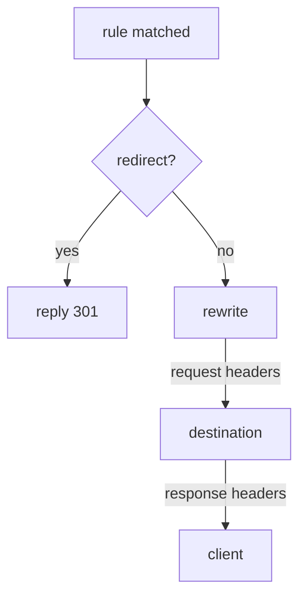

# Redirect, Rewrite, Headers And CORS

A routing rule usually does one job: choose where a request goes. But the sidecar proxy can do more on the same rule. It can answer the request itself, change the path, add or remove headers in both directions, and answer a browser's cross-origin check. The application behind it never has to know.

A **`VirtualService`** is the Istio object that sets where requests to a host go. The **sidecar proxy** (Envoy) is the proxy container Istio adds to each pod; all traffic in and out of the pod passes through it. This part shows four extra fields on an `http` rule of a `VirtualService`: `redirect`, `rewrite`, `headers` and `corsPolicy`.

## The probe echo server

These fields change what a request looks like, so you need a server that shows you what it received. That is the `probe` Service in your playground, on port `8000`. It is an HTTP echo server: it sends back what reached it.

- `/headers` shows the request headers that arrived.
- `/anything` shows the path and headers that arrived.
- `/get` answers with a normal `200`.

The rules in this part send requests to the `probe` Service without a subset, so they need no `DestinationRule`.

## What a matched rule can do

Once a rule matches a request, the client's proxy applies the rule's fields in a fixed order. One of them ends the request at once.



The diagram shows the order. First the proxy checks for `redirect`. If the rule has one, the proxy answers the client itself and sends nothing on. If not, it applies `rewrite` and then the request `headers`, sends the request to the destination, and finally applies the response `headers` to the response on its way back.

`redirect` and `route` are alternatives. A rule has one or the other, never both, and Istio rejects an object that has both.

| Field | Does | In this part |
| --- | --- | --- |
| `route` | choose a destination | already known |
| `redirect` | answer the client with a 3xx instead of sending the request on | yes |
| `rewrite` | change the path or `Host` before sending the request on | yes |
| `headers` | add, set or remove request and response headers | yes |
| `corsPolicy` | answer browser preflight requests and add CORS headers | yes |
| `timeout`, `retries`, `fault`, `mirror` | give up, try again, inject faults, copy traffic | no |

## `redirect`: answer instead of sending on

A `redirect` makes the client's proxy answer the client with a `301` status code and a `Location` header that says where to go instead. The request reaches no server.

Three details are worth knowing:

- `redirectCode` sets the status code. It is `301` (Moved Permanently) if you leave it out. Use `302` for a temporary move.
- Use `308` when the method must stay the same. After a `301`, a client is allowed to turn a `POST` into a `GET`.
- `redirect.authority` also changes the host name in the `Location` header, so you can send a path to a different host.

### A rule that never reaches a server

This rule redirects requests for `/old` to `/get`, and routes every other request to `probe`.

<!-- astrona:playground:renew -->

Save this as `virtualservice-probe-redirect.yaml`:

```yaml
apiVersion: networking.istio.io/v1
kind: VirtualService
metadata:
  name: probe
  namespace: starfleet
spec:
  hosts:
  - probe
  http:
  - match:
    - uri:
        prefix: /old
    redirect:
      uri: /get
  - route:
    - destination:
        host: probe
```

Apply it:

```sh
kubectl apply -f virtualservice-probe-redirect.yaml
```

Then check the result. Request `/old` from the `shuttle` pod, and print the status code and the address in the `Location` header:

```sh
kubectl exec -n starfleet deploy/shuttle -- \
  curl -s -o /dev/null -w 'status=%{http_code} location=%{redirect_url}\n' http://probe:8000/old
```

You should see:

```text
status=301 location=http://probe:8000/get
```

The sidecar proxy of `shuttle` made that response. No `probe` pod was involved, and the client now has to send a second request to `/get`.

## `rewrite`: change the path before sending on

`redirect` tells the client to go somewhere else. `rewrite` changes the path of the request on its way to the destination, and the client never learns about it. The server receives a different path from the one the client sent.

How much of the path is replaced depends on how the rule matched:

- After a **`prefix`** match, `rewrite.uri` replaces **only the matched prefix**. `/beta/test`, matched on prefix `/beta` and rewritten to `/anything`, becomes `/anything/test`.
- After an **`exact`** match, the whole path is replaced.

`rewrite.authority` does the same job for the `Host` header. That matters when the destination serves several host names and expects its own.

### See the path the probe receives

This rule rewrites every path that starts with `/beta` to start with `/anything`.

Save this as `virtualservice-probe-rewrite.yaml`:

```yaml
apiVersion: networking.istio.io/v1
kind: VirtualService
metadata:
  name: probe
  namespace: starfleet
spec:
  hosts:
  - probe
  http:
  - match:
    - uri:
        prefix: /beta
    rewrite:
      uri: /anything
    route:
    - destination:
        host: probe
  - route:
    - destination:
        host: probe
```

Apply it:

```sh
kubectl apply -f virtualservice-probe-rewrite.yaml
```

Then check the result. Look at the rule in the route table of the `shuttle` proxy, and ask `probe` which path it received:

```sh
istioctl proxy-config routes deploy/shuttle -n starfleet --name 8000 -o json \
  | grep -E '"/beta"|prefixRewrite'
kubectl exec -n starfleet deploy/shuttle -- curl -s http://probe:8000/beta/test | grep '"url"'
```

You should see:

```text
                            "prefix": "/beta",
                            "prefixRewrite": "/anything",
  "url": "http://probe:8000/anything/test",
```

The route entry holds the match (`/beta`) and the rewrite (`/anything`) together. The `probe` pod received `/anything/test`: only the matched prefix was replaced, and the rest of the path stayed.

> [!TIP]
> Do not look for a rewrite in the access log. Istio logs the path the client *asked for*, so a working rewrite looks unchanged there, on both sides. Check the route table or an echo server instead.

## `headers`: two scopes, three operations

A header change can apply to every request a rule handles, or only to requests sent to one destination. The indentation decides which. This piece of a `VirtualService` shows both, and you do not apply it:

```yaml
http:
- route:
  - destination:
      host: probe
    headers:                  # ← per DESTINATION: only requests sent here
      request:
        set:
          x-served-by: probe
  headers:                    # ← per RULE: every request this rule handles
    response:
      add:
        x-routed-by: istio
```

A `headers` block at the same level as `route` applies to the whole rule. A `headers` block inside a `route` item applies only to requests sent to that destination. You need the second form when one rule splits requests between two destinations and each must get different headers.

Each scope has `request` (on the way to the server) and `response` (on the way back). Each takes three operations:

| Operation | Effect | Shape |
| --- | --- | --- |
| `set` | replace the header, or create it if it is missing | `name: value` |
| `add` | add a value, keeping any value already there | `name: value` |
| `remove` | drop the named headers | a list of names: `- x-internal-token` |

### Add a header, remove a header

This rule sets the header `x-flight-plan: istio` on every request, removes the secret `x-internal-token` header before the request leaves `shuttle`, and sets `x-routed-by: istio` on every response.

Save this as `virtualservice-probe-headers.yaml`:

```yaml
apiVersion: networking.istio.io/v1
kind: VirtualService
metadata:
  name: probe
  namespace: starfleet
spec:
  hosts:
  - probe
  http:
  - headers:
      request:
        set:
          x-flight-plan: istio
        remove:
        - x-internal-token
      response:
        set:
          x-routed-by: istio
    route:
    - destination:
        host: probe
```

Apply it:

```sh
kubectl apply -f virtualservice-probe-headers.yaml
```

Then check the result. Send a request with the secret header, and ask `probe` which headers arrived:

```sh
kubectl exec -n starfleet deploy/shuttle -- \
  curl -s -H "x-internal-token: secret" http://probe:8000/headers
```

You should see this (shortened to the headers that matter):

```text
{
  "headers": {
    "Host": [
      "probe:8000"
    ],
    "User-Agent": [
      "curl/8.11.1"
    ],
    "X-Flight-Plan": [
      "istio"
    ],
    ...
  }
}
```

`X-Flight-Plan: istio` arrived, although `curl` never sent it. `X-Internal-Token` is gone, although `curl` did send it. The sidecar proxy of `shuttle` changed the request on its way out.

Now look at the response headers:

```sh
kubectl exec -n starfleet deploy/shuttle -- \
  curl -s -D - -o /dev/null http://probe:8000/get | grep -i 'x-routed-by'
```

```text
x-routed-by: istio
```

The `probe` application knows nothing about either change. The proxy made both.

## `corsPolicy`: browser checks handled by the proxy

A web page in a browser may only call a server on another origin if that server agrees. An **origin** is the scheme, host and port of a web page, such as `https://shop.example.com`. Before the real request, the browser sends a **preflight request**: an `OPTIONS` request that asks "may this origin call you, and with which methods?".

This check is called **CORS** (Cross-Origin Resource Sharing). A `corsPolicy` lets the proxy answer the preflight itself, so each application does not need its own CORS code.

`allowOrigins` takes the same string match forms as a header match: `exact`, `prefix` or `regex`. So "any origin" is `regex: ".*"`, not a plain `*`.

One limit matters more than any field: **CORS is not a security control.** It is a browser rule, and the browser enforces it. A `corsPolicy` does not stop `curl`, a script or any other client that is not a browser.

### Watch the proxy answer a preflight

This rule allows one origin, `https://shop.example.com`, to call `probe` with `GET` and `POST`.

Save this as `virtualservice-probe-cors.yaml`:

```yaml
apiVersion: networking.istio.io/v1
kind: VirtualService
metadata:
  name: probe
  namespace: starfleet
spec:
  hosts:
  - probe
  http:
  - corsPolicy:
      allowOrigins:
      - exact: https://shop.example.com
      allowMethods: ["GET", "POST"]
    route:
    - destination:
        host: probe
```

Apply it:

```sh
kubectl apply -f virtualservice-probe-cors.yaml
```

Then check the result. Send a preflight request the way a browser would, from the allowed origin:

```sh
kubectl exec -n starfleet deploy/shuttle -- \
  curl -s -D - -o /dev/null -X OPTIONS \
  -H "Origin: https://shop.example.com" -H "Access-Control-Request-Method: POST" \
  http://probe:8000/get | grep -iE '^HTTP|access-control'
```

You should see:

```text
HTTP/1.1 200 OK
access-control-allow-origin: https://shop.example.com
access-control-allow-methods: GET,POST
```

These are exactly the methods from your `corsPolicy`. The proxy answered the preflight itself.

Now send the same preflight from an origin that is not on the list:

```sh
kubectl exec -n starfleet deploy/shuttle -- \
  curl -s -D - -o /dev/null -X OPTIONS \
  -H "Origin: https://other.example.com" -H "Access-Control-Request-Method: POST" \
  http://probe:8000/get | grep -iE '^HTTP|access-control'
```

You should see:

```text
HTTP/1.1 200 OK
access-control-allow-credentials: true
access-control-allow-methods: GET, POST, HEAD, PUT, DELETE, PATCH, OPTIONS
access-control-allow-origin: https://other.example.com
access-control-max-age: 3600
```

This response is different, with a much longer list of methods. This time the proxy did not answer, because the origin is not allowed. It passed the preflight on to `probe`, and the `probe` application has its own, very open CORS response built in. So the preflight shows you *which component* answered: the proxy follows your `corsPolicy`, and the application does whatever it was built to do.

### Clean up

Delete the test `VirtualService`, so `probe` is back to plain routing:

```sh
kubectl delete virtualservice probe -n starfleet
```

```text
virtualservice.networking.istio.io "probe" deleted from starfleet namespace
```

## What you know now

A matched rule can do more than choose a destination. `redirect` ends the request with a 3xx response from the client's proxy. `rewrite` changes the path or `Host` on the way to the server. `headers` sets, adds or removes headers on the request and on the response, per rule or per destination. `corsPolicy` lets the proxy answer browser preflight requests. All of this needs HTTP, and the open question is what happens when the proxy does not treat a port as HTTP at all.

## Common pitfalls

> [!WARNING]
> - **`redirect` and `route` on the same rule.** They are alternatives. Istio rejects the object.
> - **Expecting `rewrite` to replace the whole path after a `prefix` match.** It replaces only the matched prefix.
> - **Looking for a rewrite in the access log.** A working rewrite logs the original path on both sides. Check `prefixRewrite` in the route table, or use an echo server.
> - **`headers` at the wrong level.** At the same level as `route`, it applies to the whole rule. Inside a `route` item, it applies to that destination only.
> - **Writing `remove` as a map.** It is a list of header names.
> - **`allowOrigins: ["*"]`.** The field takes string matches. "Any origin" is `regex: ".*"`.
> - **Testing CORS with a normal request.** The application may add its own CORS headers. Send a preflight (`OPTIONS`) and compare it with your `corsPolicy`.
> - **Treating `corsPolicy` as access control.** It only controls what a browser is willing to do.

## Your mission: Redirect, Rewrite And Change Headers Of A Request

You can now redirect and rewrite requests, change their headers, and let the proxy answer browser preflight requests. The graded lab asks you to move a service to new paths without changing the application behind it.

The lab runs in its own cluster, so first pause your playground. Nothing in it is lost:

```sh
astrona stop ats-014-playground-010-01
```

Then start the lab:

```sh
astrona run --git git@github.com:astrona-io/ATS014.git -c sections/section-010/module-01/labs/lab-02
```

The task is on the next page. Solve it on your own first. When you think you are done, send it for grading:

```sh
astrona submit -c sections/section-010/module-01/labs/lab-02
```

When the lab is done, remove it and start your playground again:

```sh
astrona destroy ats-014-lab-010-01-02
astrona start ats-014-playground-010-01
```
