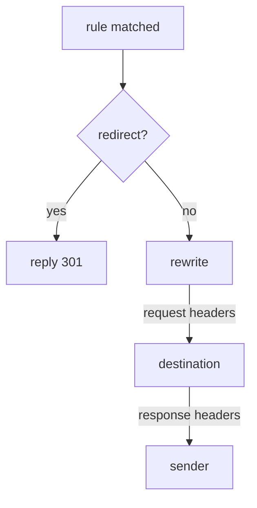

# Rewriting, Redirecting And Headers

Astronaut, so far every rule you wrote did one job: choose where a signal flies. A communications officer can do more than that. On the same rule, it can answer a signal itself, change the address on it, add or remove labels in both directions, and answer a browser's safety check. The app behind it never has to know.

This part shows four extra fields on the `http` rule you already know: `redirect`, `rewrite`, `headers` and `corsPolicy`.

## The echo probe

These fields change what a signal looks like, so you need a ship that shows you what it received. That is the **probe** in your playground (port `8000`). It sends back exactly what reached it:

- `/headers` shows the request headers that arrived.
- `/anything` shows the path and headers that arrived.
- `/get` answers with a normal `200`.

The rules in this part send to the `probe` Service without a subset, so they need no `DestinationRule`.

## What a matched rule can do

Once a rule fits a signal, the proxy applies its fields in a fixed order. One of them ends the signal's journey straight away.



First the proxy checks for `redirect`. If the rule has one, the proxy answers the sender itself and nothing is sent on. If not, it applies `rewrite`, then the request `headers`, sends the signal to the destination, and finally applies the response `headers` to the answer on its way back. `redirect` and `route` are alternatives: a rule has one or the other, never both, and Istio rejects an object that tries.

| Field | Does | In this part |
| --- | --- | --- |
| `route` | choose a destination | you already use it |
| `redirect` | answer the sender with a 3xx instead of sending the signal on | yes |
| `rewrite` | change the path or `Host` before sending the signal on | yes |
| `headers` | add, set or remove request and response headers | yes |
| `corsPolicy` | answer browser safety checks and add CORS headers | yes |
| `timeout`, `retries`, `fault`, `mirror` | give up, try again, break on purpose, copy | no |

## `redirect`: answer instead of sending on

A `redirect` makes the proxy answer the sender with a `301` and a `Location` header that says where to go instead. Nothing reaches any ship. It is like a spaceport gate that tells an arriving ship "wrong gate, go to gate 7" without letting it dock.

Three details are worth knowing:

- `redirectCode` sets the status code. It is `301` ("moved for good") if you leave it out. Use `302` for a temporary move.
- Use `308` when the method must stay the same. After a `301`, a client is allowed to turn a `POST` into a `GET`.
- `redirect.authority` also changes the host name in the `Location` header, so you can send a path to a different host.

<!-- astrona:playground:renew -->

### A rule that never reaches a ship

Send signals for `/old` to `/get`, and everything else to the probe. Save this as `virtualservice-probe-redirect.yaml`:

```yaml
apiVersion: networking.istio.io/v1
kind: VirtualService
metadata:
  name: probe
  namespace: starfleet
spec:
  hosts:
  - probe
  http:
  - match:
    - uri:
        prefix: /old
    redirect:
      uri: /get
  - route:
    - destination:
        host: probe
```

Apply it:

```sh
kubectl apply -f virtualservice-probe-redirect.yaml
```

Then ask for `/old`, and print the status code and the address the answer points to:

```sh
kubectl exec -n starfleet deploy/shuttle -- \
  curl -s -o /dev/null -w 'status=%{http_code} location=%{redirect_url}\n' http://probe:8000/old
```

You should see:

```text
status=301 location=http://probe:8000/get
```

The shuttle's own communications officer made that answer. No probe ship was involved, and the sender now has to send a second signal to `/get`.

## `rewrite`: change the path before sending on

`redirect` tells the sender to go somewhere else. `rewrite` quietly changes the address on the signal in flight, on its way to the destination. The sender never learns that the ship received a different path.

How much of the path is replaced depends on how the rule matched:

- After a **`prefix`** match, `rewrite.uri` replaces **only the matched prefix**. `/beta/test`, matched on prefix `/beta` and rewritten to `/anything`, becomes `/anything/test`.
- After an **`exact`** match, the whole path is replaced.

`rewrite.authority` does the same job for the `Host` header. That matters when the destination serves several host names and expects its own.

### See the path the probe receives

Rewrite every path that starts with `/beta` to `/anything`. Save this as `virtualservice-probe-rewrite.yaml`:

```yaml
apiVersion: networking.istio.io/v1
kind: VirtualService
metadata:
  name: probe
  namespace: starfleet
spec:
  hosts:
  - probe
  http:
  - match:
    - uri:
        prefix: /beta
    rewrite:
      uri: /anything
    route:
    - destination:
        host: probe
  - route:
    - destination:
        host: probe
```

Apply it:

```sh
kubectl apply -f virtualservice-probe-rewrite.yaml
```

Then look at the rule in the shuttle's route table, and ask the probe which path it received:

```sh
istioctl proxy-config routes deploy/shuttle -n starfleet --name 8000 -o json \
  | grep -E '"/beta"|prefixRewrite'
kubectl exec -n starfleet deploy/shuttle -- curl -s http://probe:8000/beta/test | grep '"url"'
```

You should see:

```text
                            "prefix": "/beta",
                            "prefixRewrite": "/anything",
  "url": "http://probe:8000/anything/test",
```

The route entry holds the match (`/beta`) and the rewrite (`/anything`) together. The probe received `/anything/test`: only the matched prefix was replaced, and the rest of the path came along.

> [!TIP]
> Do not look for a rewrite in the access log. Istio logs the path the sender *asked for*, so a working rewrite looks unchanged there, at both ends. Check the route table or an echo app instead.

## `headers`: two scopes, three operations

A header change can apply to everything a rule handles, or only to signals sent to one destination. The indentation decides which. This piece of a `VirtualService` shows both (you do not apply it):

```yaml
http:
- route:
  - destination:
      host: probe
    headers:                  # ← per DESTINATION: only signals sent here
      request:
        set:
          x-served-by: probe
  headers:                    # ← per RULE: every signal this rule handles
    response:
      add:
        x-routed-by: istio
```

A `headers` block lined up with `route` applies to the whole rule. A `headers` block inside a `route` item applies only to signals sent to that destination. You need the second when one rule splits signals between two destinations and each must be labelled differently.

Each scope has `request` (on the way to the ship) and `response` (on the way back), and each takes three operations:

| Operation | Effect | Shape |
| --- | --- | --- |
| `set` | replace the header, or create it if it is missing | `name: value` |
| `add` | add a value, keeping any value already there | `name: value` |
| `remove` | drop the named headers | a list of names: `- x-internal-token` |

### Add a header, remove a header

Label every signal with `x-flight-plan: istio`, strip the secret `x-internal-token` before it leaves the shuttle, and label every answer with `x-routed-by: istio`. Save this as `virtualservice-probe-headers.yaml`:

```yaml
apiVersion: networking.istio.io/v1
kind: VirtualService
metadata:
  name: probe
  namespace: starfleet
spec:
  hosts:
  - probe
  http:
  - headers:
      request:
        set:
          x-flight-plan: istio
        remove:
        - x-internal-token
      response:
        set:
          x-routed-by: istio
    route:
    - destination:
        host: probe
```

Apply it:

```sh
kubectl apply -f virtualservice-probe-headers.yaml
```

Then send a signal that carries the secret header, and ask the probe which headers arrived:

```sh
kubectl exec -n starfleet deploy/shuttle -- \
  curl -s -H "x-internal-token: secret" http://probe:8000/headers
```

You should see (trimmed to the headers that matter):

```text
{
  "headers": {
    "Host": [
      "probe:8000"
    ],
    "User-Agent": [
      "curl/8.11.1"
    ],
    "X-Flight-Plan": [
      "istio"
    ],
    ...
  }
}
```

`X-Flight-Plan: istio` arrived, although the shuttle never sent it. `X-Internal-Token` is gone, although the shuttle did send it. The shuttle's communications officer changed the signal on its way out.

Now look at the answer on its way back:

```sh
kubectl exec -n starfleet deploy/shuttle -- \
  curl -s -D - -o /dev/null http://probe:8000/get | grep -i 'x-routed-by'
```

```text
x-routed-by: istio
```

The probe knows nothing about either change. Both were made by the proxy.

## `corsPolicy`: browser checks handled by the proxy

A web page in a browser is only allowed to call a service on another site if that service agrees. Before the real request, the browser sends a **preflight**: an `OPTIONS` request that asks "may this site call you, and with which methods?". This check is called **CORS**. A `corsPolicy` lets the proxy answer the preflight itself, so every app does not have to build it in.

`allowOrigins` takes the same string match forms as a header match: `exact`, `prefix` or `regex`. So "any site" is `regex: ".*"`, not a plain `*`.

One limit matters more than any field: **CORS is not a security control.** It is a browser rule, enforced by the browser. A `corsPolicy` does not stop `curl`, a script or any other client that is not a browser.

### Watch the proxy answer a preflight

Allow one site, `https://shop.example.com`, to call the probe with `GET` and `POST`. Save this as `virtualservice-probe-cors.yaml`:

```yaml
apiVersion: networking.istio.io/v1
kind: VirtualService
metadata:
  name: probe
  namespace: starfleet
spec:
  hosts:
  - probe
  http:
  - corsPolicy:
      allowOrigins:
      - exact: https://shop.example.com
      allowMethods: ["GET", "POST"]
    route:
    - destination:
        host: probe
```

Apply it:

```sh
kubectl apply -f virtualservice-probe-cors.yaml
```

Then send a preflight the way a browser would, from the allowed site:

```sh
kubectl exec -n starfleet deploy/shuttle -- \
  curl -s -D - -o /dev/null -X OPTIONS \
  -H "Origin: https://shop.example.com" -H "Access-Control-Request-Method: POST" \
  http://probe:8000/get | grep -iE '^HTTP|access-control'
```

You should see:

```text
HTTP/1.1 200 OK
access-control-allow-origin: https://shop.example.com
access-control-allow-methods: GET,POST
```

These are exactly the methods from your `corsPolicy`. The proxy answered the preflight itself.

Now send the same preflight from a site that is not on the list:

```sh
kubectl exec -n starfleet deploy/shuttle -- \
  curl -s -D - -o /dev/null -X OPTIONS \
  -H "Origin: https://other.example.com" -H "Access-Control-Request-Method: POST" \
  http://probe:8000/get | grep -iE '^HTTP|access-control'
```

You should see:

```text
HTTP/1.1 200 OK
access-control-allow-credentials: true
access-control-allow-methods: GET, POST, HEAD, PUT, DELETE, PATCH, OPTIONS
access-control-allow-origin: https://other.example.com
access-control-max-age: 3600
```

A different answer, with a much longer list of methods. This time the proxy did not answer, because the site is not allowed. It passed the preflight on to the probe, and the probe app has its own, very open CORS answer built in. So the preflight shows you *who* answered: the proxy follows your `corsPolicy`, the app does whatever it was built to do.

### Clean up

Remove the test flight plan, so the probe is back to plain routing:

```sh
kubectl delete virtualservice probe -n starfleet
```

```text
virtualservice.networking.istio.io "probe" deleted from starfleet namespace
```

## Common pitfalls

> [!WARNING]
> - **`redirect` and `route` on the same rule.** They are alternatives. Istio rejects the object.
> - **Expecting `rewrite` to replace the whole path after a `prefix` match.** It replaces only the matched prefix.
> - **Looking for a rewrite in the access log.** A working rewrite logs the original path at both ends. Check `prefixRewrite` in the route table, or use an echo app.
> - **`headers` at the wrong level.** Lined up with `route`, it applies to the whole rule. Inside a `route` item, it applies to that destination only.
> - **Writing `remove` as a map.** It is a list of header names.
> - **`allowOrigins: ["*"]`.** The field takes string matches. "Any site" is `regex: ".*"`.
> - **Testing CORS with a normal request.** The app may add its own CORS headers. Send a preflight (`OPTIONS`) and compare it with your `corsPolicy`.
> - **Treating `corsPolicy` as access control.** It only shapes what a browser is willing to do.

> *`redirect` ends the signal's journey, `rewrite` changes its address on the way, and `headers` changes its labels in either direction. All of them sit on the same rule that already chose the destination.*

## Your mission: Reshape A Request

You can now redirect, rewrite and relabel signals, and let the proxy answer browser checks. Now prove it in a graded mission: move a service to new paths without touching the app behind it.

The mission runs in its own training solar system, so first pause your playground. Nothing in it is lost:

```sh
astrona stop ats-014-playground-010-01
```

Then start the mission:

```sh
astrona run --git git@github.com:astrona-io/ATS014.git -c sections/section-010/module-01/labs/lab-02
```

Read the task in [`question.md`](./labs/lab-02/question.md) and solve it on your own first. When you think you are done, send it for grading:

```sh
astrona submit -c sections/section-010/module-01/labs/lab-02
```

When the mission is done, remove it and wake your playground up again:

```sh
astrona destroy ats-014-lab-010-02
astrona start ats-014-playground-010-01
```
