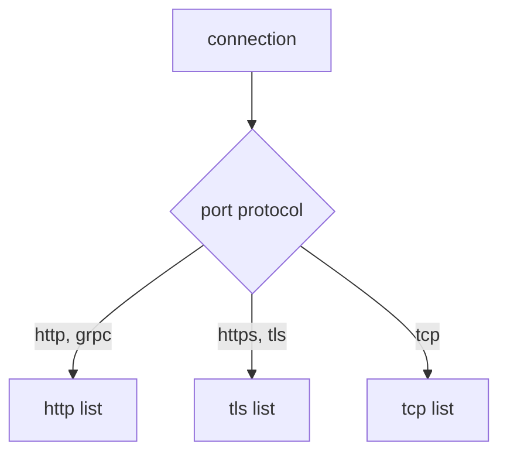

# Protocol Selection And Non-HTTP Routing

Every routing rule so far read something inside the request: a header, a path, a query parameter. That only works if the sidecar proxy can read the request, and it can only do that when it knows the connection carries HTTP. The **sidecar proxy** (Envoy) is the proxy container Istio adds to each pod; all traffic in and out of the pod passes through it.

Plenty of traffic is not HTTP. A database connection, a cache client, or encrypted traffic the proxy does not decrypt: for all of these the proxy sees only a stream of bytes. Istio can still route it, but with much less information.

This part answers three questions. How does Istio decide which protocol a port carries? What can a rule match on when there is no request to read? And what do you give up? On the way, you meet a failure that gives no error at all: **every HTTP rule for a Service stops working**, because of one word in the Service.

## The probe and its port

This part uses the `probe` Service in your playground. It listens on port `8000` and has two versions, `v1` and `v2`. Its `/hostname` path answers with the name of the pod that served the request, so you can see which version answered.

You will rename the port of `probe` during this part. That is safe: nothing else in the playground calls `probe`, and the last step puts the port back.

## How Istio decides a port's protocol

Istio decides the protocol for each **Service port**. This is called **protocol selection**. Istio checks, in this order:

1. The port's **`appProtocol`** field, if it is set. For example `appProtocol: http`.
2. Otherwise the port's **`name`**, if it is a known protocol, or starts with one followed by a dash: `http`, `http-web`, `grpc`, `tcp`, `tcp-mysql`.
3. Otherwise the proxy **guesses** by reading the first bytes of each connection. This is called **protocol sniffing**. It can detect HTTP/1.1 and HTTP/2, and treats everything else as plain TCP.

| Name (or prefix) | Treated as | What you get |
| --- | --- | --- |
| `http`, `http2`, `grpc` | HTTP | every HTTP feature: paths, headers, retries, timeouts |
| `https`, `tls` | TLS passthrough | routing by SNI only. The proxy does not decrypt |
| `tcp` | plain TCP | routing by port and source only |
| `mongo`, `mysql`, `redis` | TCP that Istio understands | TCP routing, plus extra metrics for that protocol |
| no name, or a name Istio does not know | guessed per connection | HTTP if sniffing detects it, otherwise TCP |

Two traps follow from this table. First, a port declared as the wrong protocol. Name an HTTP port `tcp`, or give it `appProtocol: tcp`, and Istio believes you. Every HTTP feature turns off for that Service. Connections still work, so nothing looks broken, but every `http` rule you wrote for it does nothing.

Second, leaving the protocol to the guess. Sniffing works for common HTTP clients, but it is a guess made per connection. Protocols where the server sends the first bytes, like MySQL, cannot be detected. Declare the protocol, so you never depend on a guess.

### Turn off HTTP routing with one word

First, look at `probe` in the route table of the `shuttle` proxy for port `8000`. The `shuttle` pod is the test client in the mesh:

<!-- astrona:playground:renew -->

```sh
istioctl proxy-config routes deploy/shuttle -n starfleet --name 8000
```

You should see this (shortened to the `probe` row):

```text
NAME     VHOST NAME                                 DOMAINS                                                   MATCH     VIRTUAL SERVICE
8000     probe.starfleet.svc.cluster.local:8000     probe.starfleet.svc.cluster.local., probe + 2 more...     /*
```

`probe` has an HTTP route entry, so an `http` rule of a `VirtualService` could attach to it. A **`VirtualService`** is the Istio object that sets where requests to a host go. Now rename the port from `http` to `tcp`. This is one change to the Service, so a short `kubectl patch` is enough:

```sh
kubectl patch svc probe -n starfleet --type merge \
  -p '{"spec":{"ports":[{"name":"tcp","port":8000,"targetPort":8080}]}}'
```

```text
service/probe patched
```

Wait a few seconds, then look at the route table again:

```sh
istioctl proxy-config routes deploy/shuttle -n starfleet --name 8000
```

```text
NAME     VHOST NAME     DOMAINS     MATCH     VIRTUAL SERVICE
```

`probe` is gone from the route table. There is no HTTP layer left for a `VirtualService` to attach to. Now look at what replaced it, the listener for port `8000`. A **listener** is the part of Envoy that accepts connections on an address and port:

```sh
istioctl proxy-config listener deploy/shuttle -n starfleet --port 8000
```

```text
ADDRESSES    PORT MATCH DESTINATION
10.96.178.71 8000 ALL   Cluster: outbound|8000||probe.starfleet.svc.cluster.local
```

That is what a plain TCP port looks like. There is one listener for the cluster IP of the `probe` Service. It matches `ALL` connections and sends each one straight to the `probe` cluster, Envoy's name for the destination and its endpoints. Nothing reads the request on the way.

And Istio sees nothing wrong:

```sh
istioctl analyze -n starfleet
```

```text
✔ No validation issues found when analyzing namespace: starfleet.
```

A port declared as `tcp` is valid Kubernetes and valid Istio. Only the route table and the listener show the change. Leave the port as `tcp` for the next section.

## The three route blocks

A `VirtualService` has three lists of rules: `http`, `tls` and `tcp`. The protocol of the Service port decides which list the proxy reads.



The diagram shows how the port protocol picks the list. Each list can match on different things. The `http` list can match on path, header, method and query. The `tls` list can match only on `sniHosts`. The `tcp` list can match only on port and source. Whichever list the proxy reads, the result is a chosen destination.

Rules in the wrong list are not an error. The proxy simply never reads them. That explains the failure you just saw: the port became TCP, so the proxy stopped reading the `http` list, while the object still exists and still validates.

## `tcp:` routing with no request to read

A `tcp` rule can only match on the connection itself: `port`, `sourceLabels` (the labels of the workload that opened the connection), `sourceSubnet`, `destinationSubnets` and `gateways`. There is no path, header or method, because the proxy has not read any of that when it makes the decision.

What still works is the destination side. Subsets, weights and `DestinationRule` settings all apply, because they decide *where to send the bytes*, not what the bytes contain.

### Send every TCP connection to v2

First you need subsets for `probe`. A **`DestinationRule`** is the Istio object that defines subsets, which are named groups of pods picked by pod labels.

Save this as `destinationrule-probe.yaml`:

```yaml
apiVersion: networking.istio.io/v1
kind: DestinationRule
metadata:
  name: probe
  namespace: starfleet
spec:
  host: probe
  subsets:
  - name: v1
    labels:
      version: v1
  - name: v2
    labels:
      version: v2
```

Apply it:

```sh
kubectl apply -f destinationrule-probe.yaml
```

Now write a `VirtualService` with a `tcp` list that sends every connection on port `8000` to v2.

Save this as `virtualservice-probe-tcp.yaml`:

```yaml
apiVersion: networking.istio.io/v1
kind: VirtualService
metadata:
  name: probe
  namespace: starfleet
spec:
  hosts:
  - probe
  tcp:
  - match:
    - port: 8000
    route:
    - destination:
        host: probe
        subset: v2
```

Apply it:

```sh
kubectl apply -f virtualservice-probe-tcp.yaml
```

Then check the result. Send 10 requests and count which version answered:

```sh
for i in $(seq 1 10); do
  kubectl exec -n starfleet deploy/shuttle -- curl -s http://probe:8000/hostname | grep -o 'probe-v[0-9]'
done | sort | uniq -c
```

You should see:

```text
  10 probe-v2
```

Every answer came from v2. For `curl` and the `probe` application, the traffic is still HTTP. The proxy simply never read it, and routed each connection by its port alone.

If every `curl` fails with exit code `56` and the access log shows `UH`, Kubernetes has not yet updated the `probe` endpoints to the new port name. Wait a few seconds and run the loop again.

## `tls:` routing by SNI

When a port carries encrypted TLS (Transport Layer Security) traffic that the proxy does not decrypt, the proxy cannot read the request. One field is still visible: the **SNI** (Server Name Indication) in the TLS handshake. In this field the client sends, in plain text, the host name it wants, before encryption starts.

This piece of a `VirtualService` shows a `tls` rule, and you do not apply it:

```yaml
  tls:
  - match:
    - port: 443
      sniHosts:
      - api.example.com
    route:
    - destination:
        host: api.example.com
        port:
          number: 443
```

`sniHosts` is required in a `tls` match, because it is the only field that tells one TLS connection from another. It accepts exact names and a leading wildcard, like `*.example.com`.

Your playground has no TLS workload, so there is nothing to run here. You use `tls` routing mainly at the edge of the mesh: on a gateway that passes encrypted traffic through without decrypting it, or that picks an outside destination by its SNI name.

## What non-HTTP routing costs you

The loss is bigger than it first looks:

```text
  available for tcp and tls        port, source, SNI, destination subnet
                                   subsets, weights, DestinationRule policy

  NOT available                    path, header, method and query matching
                                   rewrite, redirect, header changes, CORS
                                   HTTP retries, per-route timeouts, fault injection
                                   per-request load balancing
```

The last line often causes problems in production. HTTP load balancing happens **per request**: every request can go to a different pod. TCP load balancing happens **per connection**: the proxy chooses the pod once, when the connection opens. A client that keeps one long-lived connection open talks to the same pod the whole time, whatever load balancing policy you set.

### Put the port back

Delete the test objects and give the port its `http` name again:

```sh
kubectl delete virtualservice probe -n starfleet
kubectl delete destinationrule probe -n starfleet
kubectl patch svc probe -n starfleet --type merge \
  -p '{"spec":{"ports":[{"name":"http","port":8000,"targetPort":8080}]}}'
```

```text
virtualservice.networking.istio.io "probe" deleted from starfleet namespace
destinationrule.networking.istio.io "probe" deleted from starfleet namespace
service/probe patched
```

Wait a few seconds, then check the route table:

```sh
istioctl proxy-config routes deploy/shuttle -n starfleet --name 8000
```

You should see this (shortened to the `probe` row):

```text
NAME     VHOST NAME                                 DOMAINS                                                   MATCH     VIRTUAL SERVICE
8000     probe.starfleet.svc.cluster.local:8000     probe.starfleet.svc.cluster.local., probe + 2 more...     /*
```

`probe` is back in the route table, and the proxy reads `http` rules for it again.

## What you know now

Istio decides a port's protocol from `appProtocol`, then from the port name, and only then by sniffing. A port declared as `tcp` removes the Service from the route table, so every `http` rule for it stops working with no error. A `tcp` rule can match only on port and source, a `tls` rule only on SNI, and both lose every HTTP feature, including per-request load balancing. The fix for a wrongly declared port is always the same: name it `http` or set `appProtocol: http`.

## Common pitfalls

> [!WARNING]
> - **An HTTP port declared as `tcp`.** Istio believes the declaration and turns off every HTTP feature for that Service. Name it `http`, or set `appProtocol: http`.
> - **Leaving the port name to chance.** With no name, or a name Istio does not know, the proxy guesses the protocol per connection. Declare it instead.
> - **Writing `http` rules for a TCP port.** The proxy never reads the list. No error, no warning, no effect.
> - **Expecting a `tcp` match to see a path or header.** The proxy makes the decision before it reads any request.
> - **Leaving `sniHosts` out of a `tls` match.** Istio requires it.
> - **Expecting load balancing to act the same for TCP.** HTTP balances per request, TCP per connection.
> - **Looking for this in `istioctl analyze`.** A wrongly declared port is valid. The route table and the listener show it.

## Your mission: Declare A Service Port As HTTP

You can now tell how Istio decides a port's protocol, and what that decision turns on or off. The graded lab gives you a Service whose port declaration has switched off a working `VirtualService`, and asks you to declare the port as HTTP again.

The lab runs in its own cluster, so first pause your playground. Nothing in it is lost:

```sh
astrona stop ats-014-playground-010-01
```

Then start the lab:

```sh
astrona run --git git@github.com:astrona-io/ATS014.git -c sections/section-010/module-01/labs/lab-05
```

The task is on the next page. Solve it on your own first. When you think you are done, send it for grading:

```sh
astrona submit -c sections/section-010/module-01/labs/lab-05
```

When the lab is done, remove it and start your playground again:

```sh
astrona destroy ats-014-lab-010-01-05
astrona start ats-014-playground-010-01
```
