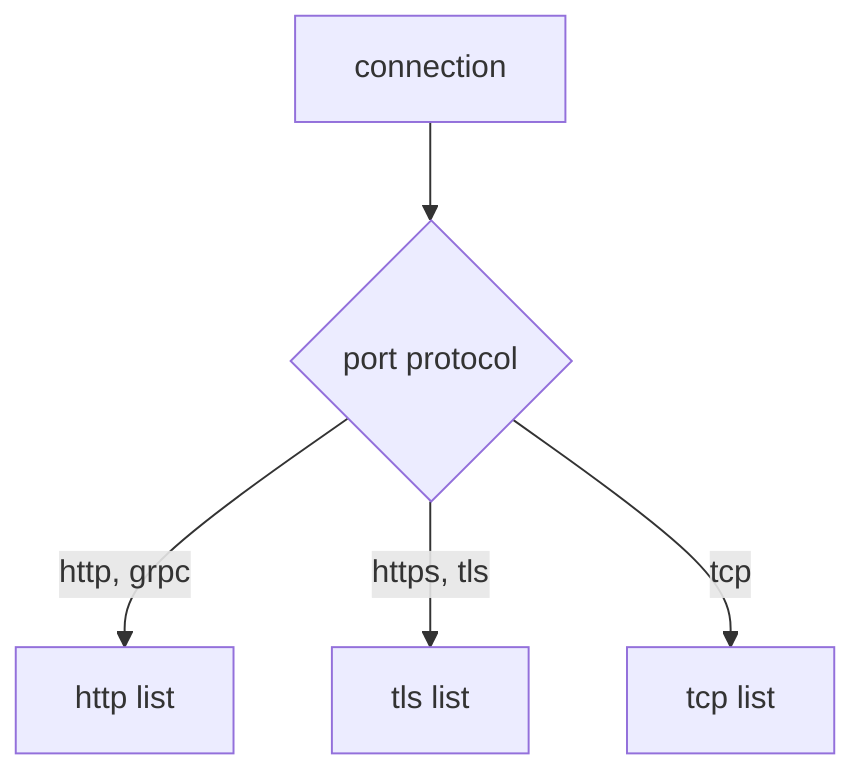

# Routing Non-HTTP Traffic

Astronaut, every rule so far read something inside the signal: a header, a path, a query parameter. That only works if the communications officer can read the signal, and it can only do that when it knows the connection carries HTTP.

Plenty of traffic is not HTTP. A database connection, a cache client, or encrypted traffic the proxy does not open: for all of these the proxy sees a sealed stream of bytes, like a coded transmission it cannot decode. Istio can still route it, with much less to go on.

This part answers three questions. How does Istio decide what a port carries? What can a rule match on when there is nothing to read? And what do you give up? On the way, you meet a failure unlike any other in this module: **every HTTP rule for a Service silently stops working**, because of one word in the Service.

## The probe and its port

This part uses the **probe** in your playground. Its Service listens on port `8000` and has two versions, `v1` and `v2`. Its `/hostname` path answers with the name of the pod that served the signal, so you can see which version answered.

You will rename the probe's port during this part. That is safe: nothing else in the playground calls the probe, and the last step puts the port back.

## How Istio decides a port's protocol

Istio decides the protocol per **Service port** (think of each port as a radio channel). It checks, in this order:

1. The port's **`appProtocol`** field, if set. For example `appProtocol: http`.
2. Otherwise the port's **`name`**, if it is a known protocol, or starts with one followed by a dash: `http`, `http-web`, `grpc`, `tcp`, `tcp-mysql`.
3. Otherwise Istio **guesses** by looking at the first bytes of each connection. This is called **protocol sniffing**. It can spot HTTP/1.1 and HTTP/2, and treats everything else as plain TCP.

| Name (or prefix) | Treated as | What you get |
| --- | --- | --- |
| `http`, `http2`, `grpc` | HTTP | every HTTP feature: paths, headers, retries, timeouts |
| `https`, `tls` | TLS passthrough | routing by SNI only. The proxy does not decrypt |
| `tcp` | plain TCP | routing by port and source only |
| `mongo`, `mysql`, `redis` | TCP that Istio understands | TCP routing, plus extra metrics for that protocol |
| no name, or a name Istio does not know | guessed per connection | HTTP if sniffing spots it, otherwise TCP |

Two traps follow from this table:

- **A port declared as the wrong protocol.** Name an HTTP port `tcp`, or give it `appProtocol: tcp`, and Istio believes you. Every HTTP feature turns off for that Service. Connections still work, so nothing looks broken, but every `http` rule you wrote for it does nothing.
- **Leaving it to the guess.** Sniffing works for common HTTP clients, but it is a guess made per connection. Protocols where the server speaks first, like MySQL, cannot be guessed. Declare the protocol, so you never depend on it.

<!-- astrona:playground:renew -->

### Turn off HTTP routing with one word

First, look at the probe in the shuttle's route table for port `8000`:

```sh
istioctl proxy-config routes deploy/shuttle -n starfleet --name 8000
```

You should see (trimmed to the `probe` row):

```text
NAME     VHOST NAME                                 DOMAINS                                                   MATCH     VIRTUAL SERVICE
8000     probe.starfleet.svc.cluster.local:8000     probe.starfleet.svc.cluster.local., probe + 2 more...     /*
```

The probe has an HTTP route entry, so a `VirtualService` `http` rule could attach to it. Now rename the port from `http` to `tcp`. This is one change to the Service, so a short `kubectl patch` is enough:

```sh
kubectl patch svc probe -n starfleet --type merge \
  -p '{"spec":{"ports":[{"name":"tcp","port":8000,"targetPort":8080}]}}'
```

```text
service/probe patched
```

Wait a few seconds, then look at the route table again:

```sh
istioctl proxy-config routes deploy/shuttle -n starfleet --name 8000
```

```text
NAME     VHOST NAME     DOMAINS     MATCH     VIRTUAL SERVICE
```

The probe is gone from the route table. There is no HTTP layer left for a `VirtualService` to attach to. Now look at what took its place, the listener for port `8000`:

```sh
istioctl proxy-config listener deploy/shuttle -n starfleet --port 8000
```

```text
ADDRESSES    PORT MATCH DESTINATION
10.96.178.71 8000 ALL   Cluster: outbound|8000||probe.starfleet.svc.cluster.local
```

That is what a plain TCP port looks like: one listener for the probe Service's own address, matching `ALL` connections and sending each one straight to the probe cluster. Nothing reads the signal on the way.

And Istio sees nothing wrong:

```sh
istioctl analyze -n starfleet
```

```text
✔ No validation issues found when analyzing namespace: starfleet.
```

A port declared as `tcp` is valid Kubernetes and valid Istio. Only the route table and the listener show the change. Leave the port as `tcp` for the next section.

## The three route blocks

A `VirtualService` has three lists of rules. The protocol of the Service port decides which one the proxy ever reads.



Each list can match on different things. The `http` list can match on path, header, method and query. The `tls` list can match only on `sniHosts`. The `tcp` list can match only on port and source. Whichever list it reads, the result is a chosen destination.

Rules in the wrong list are not an error. They are simply never read. That is the other half of the failure you just saw: the port became TCP, so the `http` list stopped being read, while the object still exists and still validates.

## `tcp:` routing with no request to read

A `tcp` rule can only match on the connection itself: `port`, `sourceLabels` (which workload opened the connection), `sourceSubnet`, `destinationSubnets` and `gateways`. There is no path, header or method, because none of that has been read when the decision is made.

What still works is the destination half. Subsets, weights and `DestinationRule` policy all apply, because they decide *where to send the bytes*, not what the bytes say.

### Send every TCP connection to v2

You need ship classes for the probe first. Save this as `destinationrule-probe.yaml`:

```yaml
apiVersion: networking.istio.io/v1
kind: DestinationRule
metadata:
  name: probe
  namespace: starfleet
spec:
  host: probe
  subsets:
  - name: v1
    labels:
      version: v1
  - name: v2
    labels:
      version: v2
```

Apply it:

```sh
kubectl apply -f destinationrule-probe.yaml
```

Now a flight plan with a `tcp` list that sends every connection on port `8000` to v2. Save this as `virtualservice-probe-tcp.yaml`:

```yaml
apiVersion: networking.istio.io/v1
kind: VirtualService
metadata:
  name: probe
  namespace: starfleet
spec:
  hosts:
  - probe
  tcp:
  - match:
    - port: 8000
    route:
    - destination:
        host: probe
        subset: v2
```

Apply it:

```sh
kubectl apply -f virtualservice-probe-tcp.yaml
```

Then send 10 signals and count which version answered:

```sh
for i in $(seq 1 10); do
  kubectl exec -n starfleet deploy/shuttle -- curl -s http://probe:8000/hostname | grep -o 'probe-v[0-9]'
done | sort | uniq -c
```

You should see:

```text
  10 probe-v2
```

Every answer came from v2. To the shuttle and the probe, the traffic is still HTTP. The proxy simply never looked inside, and routed each connection on its port alone.

If every `curl` fails with exit code `56` and the flight log shows `UH`, Kubernetes has not yet updated the probe's endpoint list to the new port name. Wait a few seconds and run the loop again.

## `tls:` routing by SNI

When a port carries encrypted TLS traffic that the proxy does not decrypt, there is nothing readable inside. One thing is still visible: the **SNI** field in the TLS handshake. It is where the client states, in plain text, the host name it wants, before encryption starts. Think of it as the destination painted on the outside of a sealed cargo crate.

This piece of a `VirtualService` shows a `tls` rule (you do not apply it):

```yaml
  tls:
  - match:
    - port: 443
      sniHosts:
      - api.example.com
    route:
    - destination:
        host: api.example.com
        port:
          number: 443
```

`sniHosts` is required in a `tls` match, because it is the only thing that tells one TLS connection from another. It accepts exact names and a leading wildcard, like `*.example.com`.

Your playground has no TLS workload, so there is nothing to run here. You meet `tls` routing at the edge of the mesh: a gateway that passes encrypted traffic through untouched, or picks an outside destination by its SNI name.

## What non-HTTP routing costs you

The loss is bigger than it first looks:

```text
  available for tcp and tls        port, source, SNI, destination subnet
                                   subsets, weights, DestinationRule policy

  NOT available                    path, header, method and query matching
                                   rewrite, redirect, header changes, CORS
                                   HTTP retries, per-route timeouts, fault injection
                                   per-request load balancing
```

The last line catches people in production. HTTP load balancing happens **per request**: every request can go to a different ship. TCP load balancing happens **per connection**: the ship is chosen once, when the connection opens. A client that keeps one long-lived connection open talks to the same ship for its whole life, whatever load balancing policy you set.

### Put the port back

Remove the test objects and give the port its `http` name again:

```sh
kubectl delete virtualservice probe -n starfleet
kubectl delete destinationrule probe -n starfleet
kubectl patch svc probe -n starfleet --type merge \
  -p '{"spec":{"ports":[{"name":"http","port":8000,"targetPort":8080}]}}'
```

```text
virtualservice.networking.istio.io "probe" deleted from starfleet namespace
destinationrule.networking.istio.io "probe" deleted from starfleet namespace
service/probe patched
```

Wait a few seconds, then check the route table:

```sh
istioctl proxy-config routes deploy/shuttle -n starfleet --name 8000
```

You should see (trimmed to the `probe` row):

```text
NAME     VHOST NAME                                 DOMAINS                                                   MATCH     VIRTUAL SERVICE
8000     probe.starfleet.svc.cluster.local:8000     probe.starfleet.svc.cluster.local., probe + 2 more...     /*
```

The probe is back in the route table, and `http` rules will be read again.

## Common pitfalls

> [!WARNING]
> - **An HTTP port declared as `tcp`.** Istio believes the declaration and turns off every HTTP feature for that Service. Name it `http`, or set `appProtocol: http`.
> - **Leaving the port name to chance.** With no name, or a name Istio does not know, Istio guesses the protocol per connection. Declare it instead.
> - **Writing `http` rules for a TCP port.** The list is never read. No error, no warning, no effect.
> - **Expecting a `tcp` match to see a path or header.** The decision is made before any request is read.
> - **Leaving `sniHosts` out of a `tls` match.** Istio requires it.
> - **Expecting load balancing to act the same for TCP.** HTTP balances per request, TCP per connection.
> - **Looking for this in `istioctl analyze`.** A wrongly declared port is valid. The route table and the listener show it.

> *Istio decides a port's protocol from its declaration, before any traffic flows. That one word decides whether you are routing requests or bytes.*

## Your mission: Bring HTTP Routing Back

You can now tell how Istio decides a port's protocol, and what that decision turns on or off. Now prove it in a graded mission: one word in a Service has silently switched off a flight plan, and you have to bring it back.

The mission runs in its own training solar system, so first pause your playground. Nothing in it is lost:

```sh
astrona stop ats-014-playground-010-01
```

Then start the mission:

```sh
astrona run --git git@github.com:astrona-io/ATS014.git -c sections/section-010/module-01/labs/lab-05
```

Read the task in [`question.md`](./labs/lab-05/question.md) and solve it on your own first. When you think you are done, send it for grading:

```sh
astrona submit -c sections/section-010/module-01/labs/lab-05
```

When the mission is done, remove it and wake your playground up again:

```sh
astrona destroy ats-014-lab-010-01-05
astrona start ats-014-playground-010-01
```
