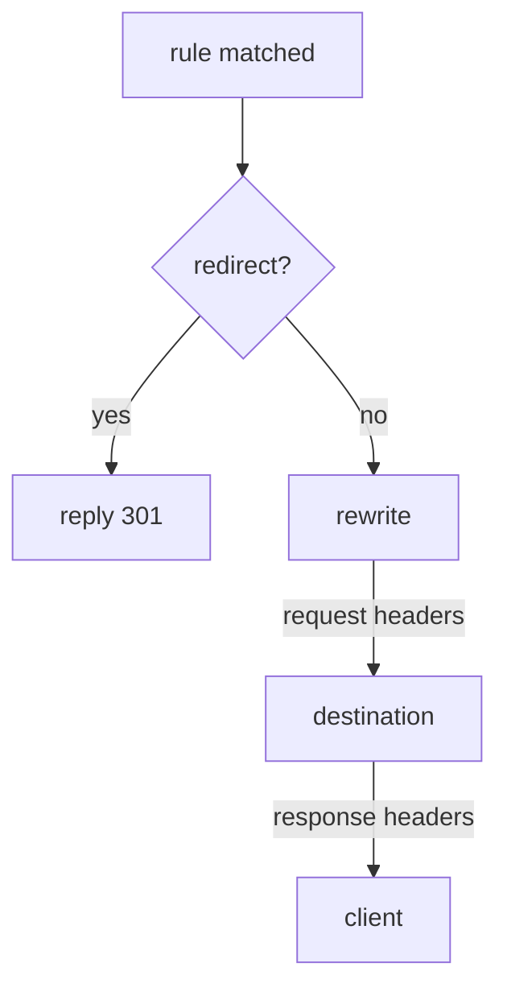

# Redirect And Rewrite Requests

A routing rule usually does one job: choose where a request goes. But the sidecar proxy can do more on the same rule. It can answer the request itself with a redirect, or change the path before it sends the request on. The application behind it never has to know.

A **`VirtualService`** is the Istio object that sets where requests to a host go. The **sidecar proxy** (Envoy) is the proxy container Istio adds to each pod; all traffic in and out of the pod passes through it. This part shows two extra fields on an `http` rule of a `VirtualService`: `redirect` and `rewrite`.

## The probe echo server

These fields change what a request looks like, so you need a server that shows you what it received. That is the `probe` Service in your playground, on port `8000`. It is an HTTP echo server: it sends back what reached it.

- `/headers` shows the request headers that arrived.
- `/anything` shows the path and headers that arrived.
- `/get` answers with a normal `200`.

The rules in this part send requests to the `probe` Service without a subset, so they need no `DestinationRule`.

## What a matched rule can do

Once a rule matches a request, the client's proxy applies the rule's fields in a fixed order. One of them ends the request at once.



The diagram shows the order. First the proxy checks for `redirect`. If the rule has one, the proxy answers the client itself and sends nothing on. If not, it applies `rewrite` and then the request `headers`, sends the request to the destination, and finally applies the response `headers` to the response on its way back.

`redirect` and `route` are alternatives. A rule has one or the other, never both, and Istio rejects an object that has both.

| Field | Does | In this part |
| --- | --- | --- |
| `route` | choose a destination | already known |
| `redirect` | answer the client with a 3xx instead of sending the request on | yes |
| `rewrite` | change the path or `Host` before sending the request on | yes |
| `headers` | add, set or remove request and response headers | no |
| `corsPolicy` | answer browser preflight requests and add CORS headers | no |
| `timeout`, `retries`, `fault`, `mirror` | give up, try again, inject faults, copy traffic | no |

## `redirect`: answer instead of sending on

A `redirect` makes the client's proxy answer the client with a `301` status code and a `Location` header that says where to go instead. The request reaches no server.

Three details are worth knowing:

- `redirectCode` sets the status code. It is `301` (Moved Permanently) if you leave it out. Use `302` for a temporary move.
- Use `308` when the method must stay the same. After a `301`, a client is allowed to turn a `POST` into a `GET`.
- `redirect.authority` also changes the host name in the `Location` header, so you can send a path to a different host.

### A rule that never reaches a server

This rule redirects requests for `/old` to `/get`, and routes every other request to `probe`.

<!-- astrona:playground:renew -->

Save this as `virtualservice-probe-redirect.yaml`:

```yaml
apiVersion: networking.istio.io/v1
kind: VirtualService
metadata:
  name: probe
  namespace: starfleet
spec:
  hosts:
  - probe
  http:
  - match:
    - uri:
        prefix: /old
    redirect:
      uri: /get
  - route:
    - destination:
        host: probe
```

Apply it:

```sh
kubectl apply -f virtualservice-probe-redirect.yaml
```

Then check the result. Request `/old` from the `shuttle` pod, and print the status code and the address in the `Location` header:

```sh
kubectl exec -n starfleet deploy/shuttle -- \
  curl -s -o /dev/null -w 'status=%{http_code} location=%{redirect_url}\n' http://probe:8000/old
```

You should see:

```text
status=301 location=http://probe:8000/get
```

The sidecar proxy of `shuttle` made that response. No `probe` pod was involved, and the client now has to send a second request to `/get`.

## `rewrite`: change the path before sending on

`redirect` tells the client to go somewhere else. `rewrite` changes the path of the request on its way to the destination, and the client never learns about it. The server receives a different path from the one the client sent.

How much of the path is replaced depends on how the rule matched:

- After a **`prefix`** match, `rewrite.uri` replaces **only the matched prefix**. `/beta/test`, matched on prefix `/beta` and rewritten to `/anything`, becomes `/anything/test`.
- After an **`exact`** match, the whole path is replaced.

`rewrite.authority` does the same job for the `Host` header. That matters when the destination serves several host names and expects its own.

### See the path the probe receives

This rule rewrites every path that starts with `/beta` to start with `/anything`.

Save this as `virtualservice-probe-rewrite.yaml`:

```yaml
apiVersion: networking.istio.io/v1
kind: VirtualService
metadata:
  name: probe
  namespace: starfleet
spec:
  hosts:
  - probe
  http:
  - match:
    - uri:
        prefix: /beta
    rewrite:
      uri: /anything
    route:
    - destination:
        host: probe
  - route:
    - destination:
        host: probe
```

Apply it:

```sh
kubectl apply -f virtualservice-probe-rewrite.yaml
```

Then check the result. Look at the rule in the route table of the `shuttle` proxy, and ask `probe` which path it received:

```sh
istioctl proxy-config routes deploy/shuttle -n starfleet --name 8000 -o json \
  | grep -E '"/beta"|prefixRewrite'
kubectl exec -n starfleet deploy/shuttle -- curl -s http://probe:8000/beta/test | grep '"url"'
```

You should see:

```text
                            "prefix": "/beta",
                            "prefixRewrite": "/anything",
  "url": "http://probe:8000/anything/test",
```

The route entry holds the match (`/beta`) and the rewrite (`/anything`) together. The `probe` pod received `/anything/test`: only the matched prefix was replaced, and the rest of the path stayed.

> [!TIP]
> Do not look for a rewrite in the access log. Istio logs the path the client *asked for*, so a working rewrite looks unchanged there, on both sides. Check the route table or an echo server instead.

## What you know now

A matched rule can do more than choose a destination. `redirect` ends the request with a 3xx response from the client's proxy, and the request reaches no server. `rewrite` changes the path or `Host` on the way to the server, and only the matched prefix is replaced after a `prefix` match. The open question is how to change the headers of a request and its response in the same way.

## Common pitfalls

> [!WARNING]
> - **`redirect` and `route` on the same rule.** They are alternatives. Istio rejects the object.
> - **Expecting `rewrite` to replace the whole path after a `prefix` match.** It replaces only the matched prefix.
> - **Looking for a rewrite in the access log.** A working rewrite logs the original path on both sides. Check `prefixRewrite` in the route table, or use an echo server.
