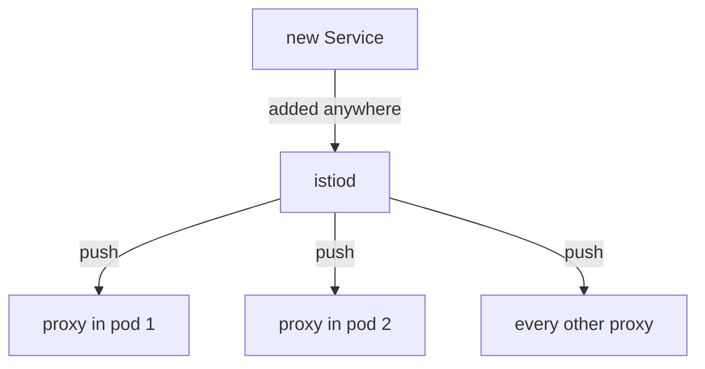

# Every Ship Carries The Whole Star Chart

Astronaut, before you can shrink a ship's star chart, you need to see how big it is and where it comes from. This part shows what mission control (`istiod`) gives every communications officer by default, how it gets there, and why the amount grows with the size of the solar system instead of with what your app actually does.

## The default is everything

Ask a communications officer (the sidecar proxy) in a fresh mesh which beacons it knows about, and the answer is: all of them. Every Service on every planet is on its star chart, whether or not the ship beside it will ever send a signal there.

That is a deliberate default. Routing works without you declaring anything. But it has a cost, and this module is about that cost.

<!-- astrona:playground:renew -->

### Count what the shuttle carries

Ask the shuttle's proxy how many destinations (clusters) it holds, and whether the probe on the `outpost` planet is one of them:

```sh
istioctl proxy-config cluster deploy/shuttle -n starfleet | wc -l
istioctl proxy-config cluster deploy/shuttle -n starfleet | grep outpost
```

You should see:

```text
      17
probe.outpost.svc.cluster.local            8000      -          outbound      EDS
```

The exact count depends on what is installed, so treat it as your own starting point, not a target. The second line is the point: the shuttle carries a destination for a beacon on another planet, purely because that beacon exists somewhere in the solar system.

## How it got there

Mission control watches Kubernetes, builds a model of the whole mesh, and pushes it to every proxy over long-lived streams. What matters here is the **fan-out**: how many ships one change reaches.



One new Service anywhere makes mission control radio new orders to every ship, whether or not that ship will ever call the new Service.

Two facts follow from this:

- **A running proxy is updated in place.** Mission control sends the new orders over the open stream and the proxy swaps them in. No pod restarts. That is why every `Sidecar` change in this module takes effect within seconds.
- **Every proxy receives every change.** Add one Service anywhere, and by default every ship gets a new star chart.

## What the star chart is made of

The star chart is not one list. The proxy holds four kinds of orders, and a `Sidecar` shrinks all four together: LDS (Listener Discovery Service), RDS (Route Discovery Service), CDS (Cluster Discovery Service) and EDS (Endpoint Discovery Service).

### Count all four kinds of orders

```sh
for L in listener route cluster endpoint; do
  printf '%-10s %s\n' "$L" "$(istioctl proxy-config $L deploy/shuttle -n starfleet 2>/dev/null | tail -n +2 | wc -l)"
done
```

You should see something like:

```text
listener         24
route             9
cluster          16
endpoint         16
```

Write your numbers down. This module is about watching them fall. The cluster count is the usual shorthand for "how much is this proxy carrying".

## Why Istio cannot work this out for itself

The obvious question is why mission control does not simply find out which beacons a ship calls, and send only those.

It cannot. Which beacons an app calls is only known while it runs: a name can come from a configuration file or from a user, at any moment. Mission control sees Kubernetes objects, not what your app intends to do. Sending everything is the only default that can never break a working app.

So shrinking the star chart is a promise **you** make: "this ship only flies to these planets". If the promise is wrong, anything outside it stops working.

## Why the default gets expensive

At ten Services, the default costs nothing. In a big mesh it becomes the main cost of running Istio.

Put numbers on it. Say the mesh has **N** proxies and **M** destinations. With no scoping, every proxy holds all M, so the fleet holds about **N × M** entries. Change one Service, and mission control recomputes and pushes to all N proxies.

| Cost | Where you see it |
| --- | --- |
| Proxy memory | each sidecar's memory, times every pod in the mesh |
| Control plane CPU | `istiod` recomputing orders on every change |
| Push delay | the time between a change and every proxy having it |

### See what the orders cost in memory

The proxy reports its own memory use. `pilot-agent`, the small helper that runs next to Envoy in the `istio-proxy` container, can ask for it:

```sh
kubectl -n starfleet exec deploy/shuttle -c istio-proxy -- pilot-agent request GET memory
```

You should see:

```text
2026/10/08 19:59:34 INFO GOMEMLIMIT is already set, skipping package=github.com/KimMachineGun/automemlimit/memlimit GOMEMLIMIT=1073741824
{
 "allocated": "7717368",
 "heap_size": "14680064",
 "pageheap_unmapped": "0",
 "pageheap_free": "5308416",
 "total_thread_cache": "897936",
 "total_physical_bytes": "17754942"
}
```

The first line is `pilot-agent` talking about itself. The JSON below it comes from Envoy, and `allocated` is the number to note.

Be honest about the scale. In this small playground, shrinking the star chart saves only a little memory, because the orders are a small part of an idle proxy. The saving grows with the number of Services in the mesh, which is exactly the N × M point above.

## Every ship can reach every beacon

There is a second effect of the default. Because the proxy holds a destination for every Service, it can **reach** every Service. Nobody allowed that. It is a side effect.

### Call a beacon on another planet

From the shuttle on `starfleet`, call the probe on `outpost`, and the cargo ship on the shuttle's own planet:

```sh
kubectl -n starfleet exec deploy/shuttle -- curl -s -o /dev/null -w '%{http_code}\n' http://probe.outpost:8000/get
kubectl -n starfleet exec deploy/shuttle -- curl -s -o /dev/null -w '%{http_code}\n' http://cargo:9080/details/0
```

You should see:

```text
200
200
```

No rule allowed the call to `outpost`. Every ship can address every other by default, and the first `200` is simply the destination you found in the first count.

## What the star chart contains

The star chart (the service registry) holds more than Kubernetes Services. It also holds outside hosts added with a `ServiceEntry`, and virtual machines added with a `WorkloadEntry`. To the `Sidecar` resource, all three are the same thing: a host on a planet. So a `Sidecar` can hide any of them from a ship.

## Common pitfalls

> [!WARNING]
> - **Assuming a proxy only knows what its app calls.** By default it knows every Service in the mesh. The cluster count is the proof.
> - **Reading the cluster count as a problem by itself.** At small scale it costs nothing. It becomes a problem as mesh size times rate of change.
> - **Confusing "can reach" with "is allowed".** Every ship reaching every beacon is a side effect of the default, not a decision anyone made.
> - **Expecting a restart to be needed.** New orders are swapped into running proxies. If a change has not taken effect, a restart is not the fix.

> *By default, mission control gives every ship the whole star chart, so the cost grows with the size of the solar system, not with your app.*
