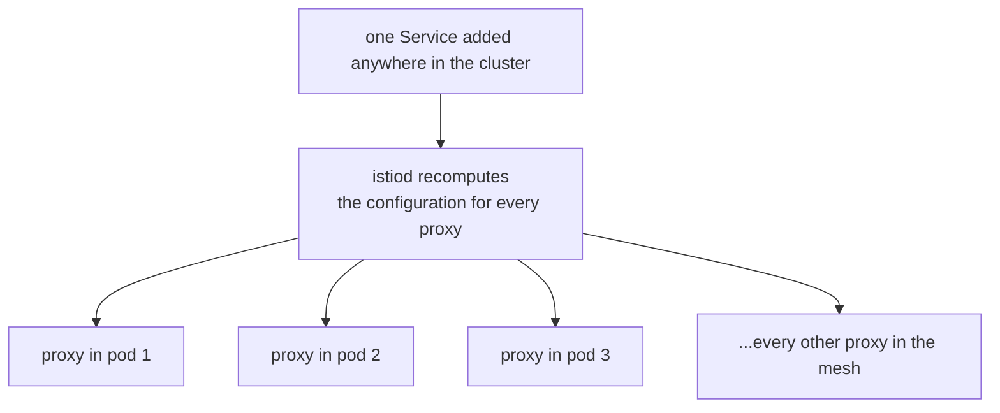

# What A Proxy Is Programmed With

> Prerequisite: [the module landing page](./course.md). Next: [The Sidecar Object And Its Host Language](./course-02-the-sidecar-object-and-host-language.md).

You cannot reason about narrowing a proxy's configuration until you know what is in it and where it came from. This part settles that: what `istiod` sends to a sidecar by default, how it gets there, and why the volume is a function of how big the cluster is rather than how much your application does.

## The default is "everything"

Module 1 showed one Service becoming clusters in the `tester` proxy. The part left implicit is that this happens for **every** Service in the mesh, in every namespace, for every proxy — regardless of whether the workload beside that proxy has ever resolved the name.

Start by counting.

> [!TIP]
> **Try it — what one proxy currently carries**
>
> ```sh
> istioctl proxy-config cluster deploy/tester -n sidecar-demo | wc -l
> istioctl proxy-config cluster deploy/tester -n sidecar-demo | grep sidecar-other
> ```
>
> Expect something like:
>
> ```text
>       28
> httpbin.sidecar-other.svc.cluster.local   8000   -   outbound   EDS
> ```
>
> The exact count depends on what else is installed — it is an example, not a target. The second line is the point: `tester` carries configuration for a Service in a namespace it has no relationship with, purely because that Service exists somewhere in the cluster.

## How it got there

Section 000 covered the delivery mechanism: `istiod` watches Kubernetes, builds a model of the mesh, and pushes it to every proxy over the xDS streams. What this module cares about is the **fan-out** — not how one proxy is configured, but how many proxies one change reaches.



Every proxy is a recipient, whether or not the workload beside it will ever call the new Service. That is the default this module exists to change.

Two consequences follow directly:

- **A running proxy is updated in place.** The stream is long-lived; `istiod` sends the new state and Envoy swaps it in. Nothing about this involves recreating a pod, which is why every `Sidecar` change in Part 3 takes effect in seconds on pods that never restarted.
- **Every proxy is a recipient of every relevant change.** Add one Service anywhere and `istiod` recomputes and re-pushes to the proxies that need to know — which, by default, is all of them.

## Why the default scales badly

Put numbers on it. With no scoping, each of the **N** proxies in a mesh holds roughly one cluster per (service, port, subset) across the whole mesh — call it **M** entries — plus matching listener and route state. That is **N × M** configuration in memory across the fleet.

Now change one Service. `istiod` recomputes and pushes to every proxy that could be affected, which is all N of them. The work is proportional to N × M again, and it happens on every change anywhere in the cluster.

At ten services this is free. At a thousand services and a thousand pods it is the dominant cost of running the mesh, and it shows up in three places:

| Cost | Where you see it |
| --- | --- |
| Proxy memory | each sidecar's RSS, multiplied by every pod in the mesh |
| Control plane CPU | `istiod` recomputing configuration on every registry change |
| Push latency | the time between a change and every proxy having it — and a "push storm" when many changes land together |

The first of those three is measurable from inside the pod. Envoy exposes its own statistics on the proxy's admin interface, and `pilot-agent` — the supervisor process that shares the `istio-proxy` container — can query it without any network access from outside.

> [!TIP]
> **Try it — what the configuration costs in memory**
>
> ```sh
> kubectl -n sidecar-demo exec deploy/tester -c istio-proxy -- \
>   pilot-agent request GET memory
> ```
>
> Expect something like:
>
> ```text
> {
>  "allocated": "9216824",
>  "heap_size": "37748736",
>  ...
> }
> ```
>
> Numbers vary with what is installed, so treat them as a baseline to compare against rather than a target. Run the same command again after Part 3's `Sidecar` narrows this proxy and the allocated figure should fall — the clearest evidence that scoping is a resource decision and not just tidiness.

The fix is not a bigger control plane. It is telling proxies about less, which is the rest of this module.

## The scale problem is not the only reason

There is a second, smaller argument that is easy to miss and useful on an exam.

Because the proxy holds a cluster for every service, it can *reach* every service. Nothing granted that; it is a side effect of the default. A workload with a compromised process, or simply a bug, can address anything in the mesh by name and the proxy will helpfully route it.

Narrowing configuration narrows that too — Part 3 shows the call failing — but note now that this is a *consequence* of the configuration change rather than an access-control decision, which is exactly why Part 3 also has to explain what `Sidecar` is not.

> [!TIP]
> **Try it — the cross-namespace call nobody authorised**
>
> ```sh
> kubectl -n sidecar-demo exec deploy/tester -- \
>   curl -s -o /dev/null -w '%{http_code}\n' http://httpbin.sidecar-other:8000/get
> ```
>
> Expect something like:
>
> ```text
> 200
> ```
>
> No policy permitted this. The mesh default is that every workload can address every other, and the `200` is just the visible face of the cluster you found in the first checkpoint. Keep the number in mind — it is the thing Part 3 changes.

## What "the registry" actually contains

One clarification before Part 2, because the host language you are about to learn selects over it.

The mesh registry is not only Kubernetes Services. It holds:

- every Kubernetes Service in every namespace the control plane watches;
- every `ServiceEntry` (section 070), which adds external hosts;
- every `WorkloadEntry` grouped by a `MESH_INTERNAL` `ServiceEntry` (section 070, module 3).

All three are "hosts in a namespace" as far as scoping is concerned, and all three are subject to the `egress.hosts` list. That is why a `Sidecar` can hide a correctly-written `ServiceEntry` from a workload — they are the same kind of entry to this machinery.

## Common pitfalls

> [!WARNING]
> **Assuming a proxy only knows about what its workload calls.** By default it knows about every Service in the mesh. The `wc -l` above is the proof.
>
> **Reading the cluster count as a problem in itself.** At small scale it costs nothing. It becomes a problem as a product of mesh size and change rate, not as an absolute number.
>
> **Confusing reachability with authorization.** Every workload being able to address every other is a side effect of the default configuration, not a policy decision — and narrowing configuration is not the same as denying access. Part 3 is explicit about this.
>
> **Expecting a restart to be needed.** Configuration is swapped in over a live stream. If a change has not taken effect, the reason is not that the pod needs recreating.

> *`istiod` pushes the whole registry to every proxy by default, so configuration cost grows with the size of the cluster, not the size of your application.*

## Reference

- [Performance and scalability](https://istio.io/latest/docs/ops/deployment/performance-and-scalability/) — Istio's own numbers for proxy memory and push cost, and the levers that move them.
- [Configuration scoping](https://istio.io/latest/docs/ops/configuration/mesh/configuration-scoping/) — the operational guide this module's object exists to serve.
- [xDS protocol overview](https://www.envoyproxy.io/docs/envoy/latest/api-docs/xds_protocol) — what the discovery services are and how a push works.
- `istioctl proxy-status` — one line per proxy showing whether each is `SYNCED` with the control plane; the first command to run when a push seems not to have landed.
