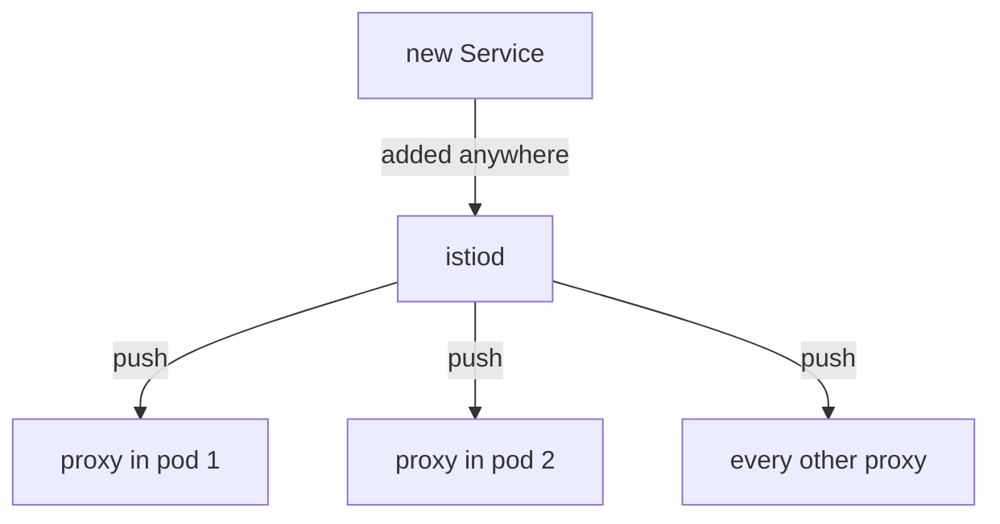

# What Every Proxy Receives By Default

Before you can make a proxy's configuration smaller, you need to see how big it is and where it comes from. In a fresh mesh, every sidecar proxy holds configuration for every Service in the mesh. This page measures that configuration on a running pod, shows how `istiod` delivers it, and explains why its cost grows with the size of the mesh instead of with what your application calls.

## The default is every Service in the mesh

A sidecar proxy is the Envoy container that Istio adds to each pod. All inbound and outbound traffic of the pod passes through it. `istiod` is Istio's control plane: it watches Kubernetes and sends configuration to every proxy.

By default, `istiod` gives each proxy a destination for every Service in every namespace. It does this whether or not the application in that pod will ever call the Service. Istio calls a destination inside the proxy a **cluster**: a named group of endpoints that the proxy can send requests to.

<!-- astrona:playground:renew -->

You can see this on the `shuttle` pod in the `starfleet` namespace. The first command counts the lines in the proxy's cluster list. The second looks for anything from the `outpost` namespace, where the `probe` Service runs:

```sh
istioctl proxy-config cluster deploy/shuttle -n starfleet | wc -l
istioctl proxy-config cluster deploy/shuttle -n starfleet | grep outpost
```

You should see:

```text
      17
probe.outpost.svc.cluster.local            8000      -          outbound      EDS
```

The exact count depends on what is installed, so treat it as your own starting point, not a target. The second line is the important one. The `shuttle` proxy holds a cluster for `probe` in another namespace only because that Service exists somewhere in the mesh.

## How the configuration reaches the proxy

The next question is how this configuration got into the proxy. `istiod` watches the Kubernetes API, builds a model of the whole mesh, and pushes it to every proxy over xDS. xDS is the set of discovery protocols that `istiod` uses to send configuration to proxies while they run, over a connection that stays open.



The diagram shows that one new Service, in any namespace, makes `istiod` send new configuration to every proxy, whether or not that proxy will ever call the new Service.

Two facts follow from this. First, `istiod` updates a running proxy in place: it sends the new configuration over the open connection, and the proxy starts to use it. No pod restarts, so every change on these pages takes effect within seconds. Second, every proxy receives every change. Add one Service anywhere, and by default every proxy in the mesh gets new configuration.

## The four kinds of configuration

The configuration is not one list. The proxy holds four kinds, and each kind has its own xDS service:

- **LDS** (Listener Discovery Service): listeners, the ports on which the proxy accepts connections.
- **RDS** (Route Discovery Service): routes, the rules that pick a destination for an HTTP request.
- **CDS** (Cluster Discovery Service): clusters, the destinations.
- **EDS** (Endpoint Discovery Service): endpoints, the pod addresses behind each cluster.

The `Sidecar` resource, which the rest of this module teaches, makes all four smaller at the same time. To have a baseline, count each kind on the `shuttle` proxy now:

```sh
for L in listener route cluster endpoint; do
  printf '%-10s %s\n' "$L" "$(istioctl proxy-config $L deploy/shuttle -n starfleet 2>/dev/null | tail -n +2 | wc -l)"
done
```

You should see something like:

```text
listener         24
route             9
cluster          16
endpoint         16
```

Write your numbers down, because the next pages make them fall. The cluster count is the usual short way to say how much configuration a proxy carries.

## Why Istio cannot work this out for itself

You might ask why `istiod` does not find out which Services an application calls, and send only those. It cannot. An application decides which host to call while it runs. The name can come from a configuration file or from a user at any moment.

`istiod` sees Kubernetes objects, not what the application will do. Sending everything is the only default that never breaks a working application. So a smaller configuration is a promise that you make: "the pods in this namespace only call these hosts". If the promise is wrong, calls to hosts outside it stop working.

## Why the default gets expensive

In a mesh with ten Services, the default costs almost nothing. In a large mesh it becomes one of the main costs of running Istio. Say the mesh has **N** proxies and **M** destinations. With no limits, every proxy holds all M destinations, so the proxies hold about **N × M** entries in total. When one Service changes, `istiod` rebuilds the configuration and pushes it to all N proxies.

| Cost | Where you see it |
| --- | --- |
| Proxy memory | the memory of each sidecar proxy, times every pod in the mesh |
| Control plane CPU | `istiod` rebuilding configuration on every change |
| Push delay | the time between a change and the moment every proxy has it |

The proxy reports its own memory use. `pilot-agent` is a small helper process that runs next to Envoy in the `istio-proxy` container, and it can ask Envoy for this number:

```sh
kubectl -n starfleet exec deploy/shuttle -c istio-proxy -- pilot-agent request GET memory
```

You should see:

```text
2026/10/08 19:59:34 INFO GOMEMLIMIT is already set, skipping package=github.com/KimMachineGun/automemlimit/memlimit GOMEMLIMIT=1073741824
{
 "allocated": "7717368",
 "heap_size": "14680064",
 "pageheap_unmapped": "0",
 "pageheap_free": "5308416",
 "total_thread_cache": "897936",
 "total_physical_bytes": "17754942"
}
```

The first line is a log message from `pilot-agent` itself. The JSON below it comes from Envoy, and `allocated` is the number to note. In this small playground, a smaller configuration saves only a little memory, because the configuration is a small part of an idle proxy. The saving grows with the number of Services in the mesh, which is the N × M effect above.

## Every pod can reach every Service

The default has a second effect. Because the proxy holds a cluster for every Service, it can also send requests to every Service. Nobody allowed that; it is a side effect of the default.

You can check this from the `shuttle` pod. The first request goes to the `probe` Service in the `outpost` namespace, and the second goes to the `cargo` Service in the `shuttle` pod's own namespace:

```sh
kubectl -n starfleet exec deploy/shuttle -- curl -s -o /dev/null -w '%{http_code}\n' http://probe.outpost:8000/get
kubectl -n starfleet exec deploy/shuttle -- curl -s -o /dev/null -w '%{http_code}\n' http://cargo:9080/details/0
```

You should see:

```text
200
200
```

No rule allowed the request to `outpost`. The first `200` uses the same `probe` cluster that you found in the first count.

## What the service registry contains

The service registry is the list of hosts that `istiod` knows about and turns into proxy configuration. It holds more than Kubernetes Services. It also holds hosts outside the cluster that you add with a `ServiceEntry`, and virtual machines that you add with a `WorkloadEntry`. To the `Sidecar` resource, all three are the same thing: a host in a namespace. So a `Sidecar` can remove any of them from a proxy.

You now know that every proxy holds a cluster for every host in the service registry, that `istiod` pushes each change to every proxy without a restart, and that the cost grows as proxies times destinations. The open question is how to tell `istiod` to send a namespace only the hosts it needs. That is the job of the `Sidecar` resource.

## Common pitfalls

> [!WARNING]
> - **Assuming a proxy only knows what its application calls.** By default it knows every Service in the mesh. The cluster count is the proof.
> - **Reading the cluster count as a problem by itself.** At small scale it costs nothing. It becomes a problem as the size of the mesh grows and as Services change more often.
> - **Confusing "can reach" with "is allowed".** Every pod reaching every Service is a side effect of the default, not a decision anyone made.
> - **Expecting a restart to be needed.** `istiod` pushes new configuration into running proxies. If a change has not taken effect, a restart is not the fix.
