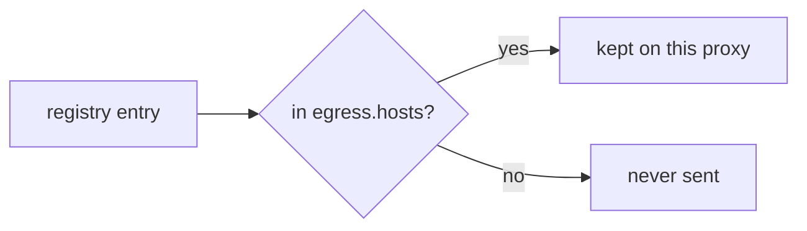
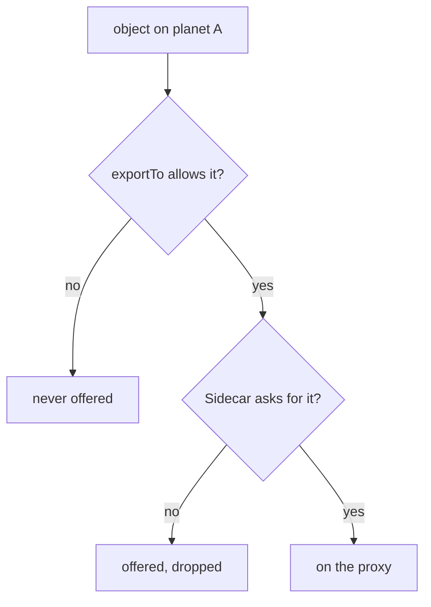

# Give A Ship A Smaller Star Chart

Astronaut, every ship on your `starfleet` planet carries the whole star chart. The `Sidecar` resource gives them a smaller one, with only the planets they need. This part shows its four fields, the small host language it uses, and what really happens to a signal for a planet that is no longer on the chart.

## The four fields

A `Sidecar` lives on a planet (a namespace) and changes the star chart of the ships there:

| Field | Decides |
| --- | --- |
| `workloadSelector` | **which ships** it applies to, by pod label. Leave it out, and it applies to **every ship on its own planet** |
| `egress[].hosts` | which hosts the proxy is told about, written as `<namespace>/<host>` |
| `outboundTrafficPolicy` | what happens to a signal for a host that is not on the chart, for these ships only |
| `ingress` | how traffic **arriving** at the ship is captured. Rare; leave it alone unless a task names it |

Leaving out `workloadSelector` is the normal way to use the object: one `Sidecar` for the whole planet. By convention it is called `default`, so "does this planet have a default?" is a one-line check.

## The host language

Every entry in `egress[].hosts` is `<namespace>/<host>`. Both halves accept `*`, and `.` means "the ship's own planet":

| Written | Selects |
| --- | --- |
| `./*` | every host on the **ship's own** planet |
| `*/*` | every host on every planet: the default, written down |
| `istio-system/*` | every host in `istio-system` |
| `outpost/*` | every host on the `outpost` planet |
| `outpost/probe.outpost.svc.cluster.local` | exactly one host |

Two details decide whether an entry matches:

- **The namespace half names where the *target* lives**, not where the `Sidecar` lives. `outpost/*` in a `Sidecar` on `starfleet` means "let `starfleet`'s ships see `outpost`'s beacons".
- **The host half is compared with the full name** of the host, like `probe.outpost.svc.cluster.local`. Use `*` or the full name.



Each entry in the star chart is checked against `egress.hosts`. Nothing is deleted from the registry and no other ship is affected: one ship just gets a smaller copy.

### Why `istio-system/*` is always on the list

A communications officer does not only carry your app's signals. It also talks to mission control, which lives in `istio-system`. Take that planet off the chart and the proxy loses destinations it needs for its own work. The pod still starts and local signals still work, so nothing points at your `Sidecar`.

Treat `./*` and `istio-system/*` as the floor of every planet-wide `Sidecar`, and add to it.

## Shrink the star chart

Now give every ship on `starfleet` a chart with only its own planet and `istio-system`.

<!-- astrona:playground:renew -->

### Look at the listener first

Before you change anything, look at the shuttle's listeners for port `8000`, the probe's port:

```sh
istioctl proxy-config listener deploy/shuttle -n starfleet | grep -E '8000|PORT'
```

You should see:

```text
ADDRESSES    PORT  MATCH                                                   DESTINATION
0.0.0.0      8000  Trans: raw_buffer; App: http/1.1,h2c                    Route: 8000
0.0.0.0      8000  ALL                                                     PassthroughCluster
```

The shuttle listens on port `8000` only because the probe on `outpost` uses it.

### Apply a planet-wide `Sidecar`

Save this as `sidecar-default.yaml`:

```yaml
apiVersion: networking.istio.io/v1
kind: Sidecar
metadata:
  name: default
  namespace: starfleet
spec:
  egress:
  - hosts:
    - "./*"
    - "istio-system/*"
```

Apply it:

```sh
kubectl apply -f sidecar-default.yaml
```

```text
sidecar.networking.istio.io/default created
```

Then count the shuttle's destinations again, and list them:

```sh
istioctl proxy-config cluster deploy/shuttle -n starfleet | wc -l
istioctl proxy-config cluster deploy/shuttle -n starfleet
```

You should see:

```text
      13
SERVICE FQDN                              PORT      SUBSET     DIRECTION     TYPE             DESTINATION RULE
BlackHoleCluster                          -         -          -             STATIC
InboundPassthroughCluster                 -         -          -             ORIGINAL_DST
PassthroughCluster                        -         -          -             ORIGINAL_DST
agent                                     -         -          -             STATIC
cargo.starfleet.svc.cluster.local         9080      -          outbound      EDS
istiod.istio-system.svc.cluster.local     443       -          outbound      EDS
istiod.istio-system.svc.cluster.local     15010     -          outbound      EDS
istiod.istio-system.svc.cluster.local     15012     -          outbound      EDS
istiod.istio-system.svc.cluster.local     15014     -          outbound      EDS
prometheus_stats                          -         -          -             STATIC
sds-grpc                                  -         -          -             STATIC
xds-grpc                                  -         -          -             STATIC
```

The count dropped. Only the cargo ship on `starfleet` and mission control in `istio-system` are left, plus a few built-in entries every proxy keeps. The probe on `outpost` is gone. You proved it without sending a single signal: this is the honest way to check scoping.

Now the listener again:

```sh
istioctl proxy-config listener deploy/shuttle -n starfleet | grep -E '8000|PORT'
```

```text
ADDRESSES    PORT  MATCH                                                   DESTINATION
```

Only the header is left. The shuttle has no reason to listen on port `8000` any more, so the listener went with the destination.

## What happens to a signal for a planet that is gone

The probe is off the star chart. So what happens when the shuttle calls it anyway? The answer depends on `outboundTrafficPolicy`.

### Call the planet you just removed

```sh
kubectl -n starfleet exec deploy/shuttle -- curl -s -o /dev/null -w '%{http_code}\n' --max-time 5 http://probe.outpost:8000/get
kubectl logs -n starfleet deploy/shuttle -c istio-proxy --tail=1
```

You should see (log line trimmed):

```text
200
"- - -" 0 - - - "-" 85 699 26 - "-" "-" "-" "-" "10.96.91.255:8000" PassthroughCluster ...
```

The call still works. The playground's mesh uses the default policy `ALLOW_ANY`: a signal for a host that is not on the chart is sent on as raw bytes through the `PassthroughCluster`. The flight log shows `- - -` instead of a method and path, because the proxy never read the signal as HTTP. No routing rule, retry or timeout applies to it any more.

### Signal only charted planets

Add `outboundTrafficPolicy` to the same `Sidecar`. `REGISTRY_ONLY` means: signal only planets on the chart. Save this as `sidecar-default.yaml`, replacing the old file:

```yaml
apiVersion: networking.istio.io/v1
kind: Sidecar
metadata:
  name: default
  namespace: starfleet
spec:
  outboundTrafficPolicy:
    mode: REGISTRY_ONLY
  egress:
  - hosts:
    - "./*"
    - "istio-system/*"
```

Apply it:

```sh
kubectl apply -f sidecar-default.yaml
```

Then call the probe again, and the cargo ship on the shuttle's own planet:

```sh
kubectl -n starfleet exec deploy/shuttle -- curl -s -o /dev/null -w '%{http_code}\n' --max-time 5 http://probe.outpost:8000/get
kubectl logs -n starfleet deploy/shuttle -c istio-proxy --tail=1
kubectl -n starfleet exec deploy/shuttle -- curl -s -o /dev/null -w '%{http_code}\n' http://cargo:9080/details/0
```

You should see (log line trimmed):

```text
000
command terminated with exit code 56
"- - -" 0 UH - - "-" 0 0 2 - "-" "-" "-" "-" "-" BlackHoleCluster ...
200
```

Now the signal falls into the `BlackHoleCluster`, a black hole: `curl` gets no answer at all (`000`), and the flight log shows `UH`. The cargo ship is still on the chart, so it still answers `200`.

> [!TIP]
> When a call fails with `000` and the flight log says `BlackHoleCluster`, the host is not on that ship's star chart. Check the `Sidecar` on the sender's planet before you look anywhere else.

## Add a planet back

The host list is ordinary configuration, so adding `outpost` back is an edit to the same file. Save this as `sidecar-default.yaml`, replacing the old file:

```yaml
apiVersion: networking.istio.io/v1
kind: Sidecar
metadata:
  name: default
  namespace: starfleet
spec:
  outboundTrafficPolicy:
    mode: REGISTRY_ONLY
  egress:
  - hosts:
    - "./*"
    - "istio-system/*"
    - "outpost/*"
```

Apply it:

```sh
kubectl apply -f sidecar-default.yaml
```

Then check that the probe is back on the chart and answers:

```sh
istioctl proxy-config cluster deploy/shuttle -n starfleet | grep outpost
kubectl -n starfleet exec deploy/shuttle -- curl -s -o /dev/null -w '%{http_code}\n' http://probe.outpost:8000/get
```

You should see:

```text
probe.outpost.svc.cluster.local           8000      -          outbound      EDS
200
```

Within seconds, with no pod restarted, the probe is back: mission control pushed the new star chart to the running proxy. Keep this `Sidecar` in place.

Notice that you restated the **whole** `hosts` list. If you change it with `kubectl patch --type merge` instead, the list you send replaces the old one completely. It never adds to it.

## Two places a host can be filtered

A `Sidecar` is the **receiving** side: one planet declaring what its ships want to know about. There is a **sending** side too. Most Istio objects, like `VirtualService`, `DestinationRule` and `ServiceEntry`, have an `exportTo` list that says which planets may see them at all. Left out, it means every planet.



Both gates must open. When a host is missing from a proxy and the object looks perfect, there are two places it can have been filtered: the object owner's `exportTo`, and the `Sidecar` on the ship's planet.

## Common pitfalls

> [!WARNING]
> - **Leaving `istio-system/*` out.** The proxy loses destinations it needs for its own work. The failure is partial and points nowhere near the `Sidecar`.
> - **Forgetting `./*`.** A planet-wide `Sidecar` without it hides the ship's own planet, including the services it most likely calls.
> - **Reading the namespace half as "where the `Sidecar` lives".** It names where the *target* lives.
> - **Expecting a removed host to be unreachable.** With the default `ALLOW_ANY`, the signal still leaves through `PassthroughCluster`. Set `outboundTrafficPolicy` to `REGISTRY_ONLY` to close that.
> - **Patching the `hosts` list and expecting an append.** A merge patch replaces the whole list. Restate every entry you want to keep.
> - **Forgetting `exportTo`.** A host can be missing because its owner never offered it to your planet.

> *A `Sidecar` gives every ship on a planet a smaller star chart. `./*` and `istio-system/*` are the floor, and `REGISTRY_ONLY` decides whether uncharted planets are really out of reach.*

## Your mission: Scope Proxy Configuration With The Sidecar Resource

You can now write a planet-wide `Sidecar`, read the result in the proxy's cluster list, and close uncharted planets with `REGISTRY_ONLY`. Now prove it in a graded mission: cut one planet's star chart down to exactly the planets it calls, and prove that a third planet is out of reach.

The mission runs in its own training solar system, so first pause your playground. Nothing in it is lost:

```sh
astrona stop ats-014-playground-010-02
```

Then start the mission:

```sh
astrona run --git git@github.com:astrona-io/ATS014.git -c sections/section-010/module-02/labs/lab-01
```

Read the task in [`question.md`](./labs/lab-01/question.md) and solve it on your own first. When you think you are done, send it for grading:

```sh
astrona submit -c sections/section-010/module-02/labs/lab-01
```

When the mission is done, remove it and wake your playground up again:

```sh
astrona destroy ats-014-lab-010-02
astrona start ats-014-playground-010-02
```
