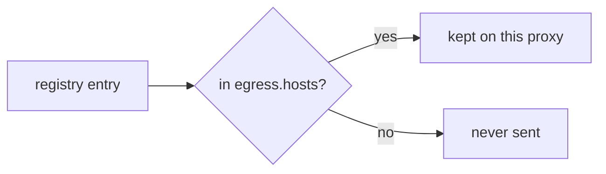
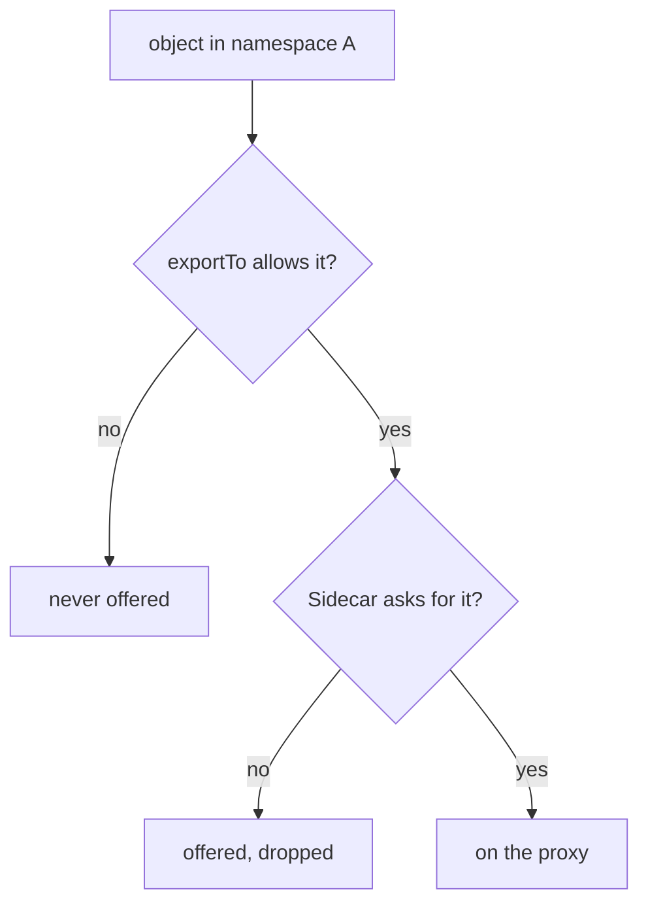

# Limit Egress Hosts With A Namespace-Wide Sidecar

Every sidecar proxy in the `starfleet` namespace holds a cluster for every Service in the mesh. The `Sidecar` resource tells `istiod` to send those proxies only the hosts they need. This page shows its four fields, the short host syntax it uses, and what happens to a request for a host that the proxy no longer knows.

Two words sound alike here, so keep them apart. The **sidecar proxy** is the Envoy container in each pod. The **`Sidecar` resource** is an Istio configuration object (`kind: Sidecar`) that changes the configuration `istiod` sends to those proxies.

## The four fields

A `Sidecar` lives in a namespace and changes the configuration of the proxies in that namespace. It has four fields:

| Field | Decides |
| --- | --- |
| `workloadSelector` | **which pods** it applies to, by pod label. Leave it out, and it applies to **every pod in its own namespace** |
| `egress[].hosts` | which hosts the proxy is told about, written as `<namespace>/<host>` |
| `outboundTrafficPolicy` | what happens to a request for a host that is not in the proxy's configuration, for these pods only |
| `ingress` | how traffic **arriving** at the pod is accepted. Rarely used; leave it alone unless a task names it |

The normal way to use the object is to leave out `workloadSelector`, so that one `Sidecar` covers the whole namespace. By convention this namespace-wide `Sidecar` is called `default`. With that name, "does this namespace have a default?" is a one-line check.

## The host syntax

Every entry in `egress[].hosts` has the form `<namespace>/<host>`. Both halves accept `*`, and `.` means "the namespace of the pod":

| Written | Selects |
| --- | --- |
| `./*` | every host in the **pod's own** namespace |
| `*/*` | every host in every namespace: the default, written down |
| `istio-system/*` | every host in `istio-system` |
| `outpost/*` | every host in the `outpost` namespace |
| `outpost/probe.outpost.svc.cluster.local` | exactly one host |

Two details decide whether an entry matches. The namespace half names where the *target host* lives, not where the `Sidecar` lives. So `outpost/*` in a `Sidecar` in `starfleet` means "let the proxies in `starfleet` know the hosts in `outpost`". The host half is compared with the full name of the host, such as `probe.outpost.svc.cluster.local`, so write `*` or the full name.



The diagram shows how `istiod` checks each entry of the service registry against `egress.hosts`. Nothing is deleted from the registry and no other namespace is affected: the selected proxies just get a smaller copy.

One entry belongs in almost every list: `istio-system/*`. The proxy does not only carry your application's requests. It also connects to `istiod`, which runs in `istio-system`. Leave that namespace out, and the proxy loses destinations it needs for its own work. The pod still starts and local requests still work, so nothing points at your `Sidecar`. Treat `./*` and `istio-system/*` as the minimum of every namespace-wide `Sidecar`, and add to it.

## Apply a namespace-wide Sidecar

Now you can give every proxy in `starfleet` only its own namespace and `istio-system`. Before you change anything, look at the `shuttle` proxy's listeners on port `8000`, the port of the `probe` Service:

<!-- astrona:playground:renew -->

```sh
istioctl proxy-config listener deploy/shuttle -n starfleet | grep -E '8000|PORT'
```

You should see:

```text
ADDRESSES    PORT  MATCH                                                   DESTINATION
0.0.0.0      8000  Trans: raw_buffer; App: http/1.1,h2c                    Route: 8000
0.0.0.0      8000  ALL                                                     PassthroughCluster
```

The `shuttle` proxy listens on port `8000` only because the `probe` Service in `outpost` uses that port.

Save this as `sidecar-default.yaml`:

```yaml
apiVersion: networking.istio.io/v1
kind: Sidecar
metadata:
  name: default
  namespace: starfleet
spec:
  egress:
  - hosts:
    - "./*"
    - "istio-system/*"
```

Apply it:

```sh
kubectl apply -f sidecar-default.yaml
```

```text
sidecar.networking.istio.io/default created
```

Then check the result. Count the `shuttle` proxy's clusters again, and list them:

```sh
istioctl proxy-config cluster deploy/shuttle -n starfleet | wc -l
istioctl proxy-config cluster deploy/shuttle -n starfleet
```

You should see:

```text
      13
SERVICE FQDN                              PORT      SUBSET     DIRECTION     TYPE             DESTINATION RULE
BlackHoleCluster                          -         -          -             STATIC
InboundPassthroughCluster                 -         -          -             ORIGINAL_DST
PassthroughCluster                        -         -          -             ORIGINAL_DST
agent                                     -         -          -             STATIC
cargo.starfleet.svc.cluster.local         9080      -          outbound      EDS
istiod.istio-system.svc.cluster.local     443       -          outbound      EDS
istiod.istio-system.svc.cluster.local     15010     -          outbound      EDS
istiod.istio-system.svc.cluster.local     15012     -          outbound      EDS
istiod.istio-system.svc.cluster.local     15014     -          outbound      EDS
prometheus_stats                          -         -          -             STATIC
sds-grpc                                  -         -          -             STATIC
xds-grpc                                  -         -          -             STATIC
```

The count dropped. Only `cargo` in `starfleet` and `istiod` in `istio-system` are left, plus a few built-in clusters that every proxy keeps. The `probe` cluster is gone. You proved this without sending a single request, which is the reliable way to check a `Sidecar`.

The listener list tells the same story:

```sh
istioctl proxy-config listener deploy/shuttle -n starfleet | grep -E '8000|PORT'
```

```text
ADDRESSES    PORT  MATCH                                                   DESTINATION
```

Only the header line is left. No known host uses port `8000` any more, so `istiod` removed the listener together with the cluster.

## Requests for a host the proxy does not know

The `probe` host is no longer in the `shuttle` proxy's configuration. What happens when the `shuttle` pod calls it anyway depends on `outboundTrafficPolicy`. Send the request and read the last line of the proxy's access log, the log in which the proxy writes one line per connection or request:

```sh
kubectl -n starfleet exec deploy/shuttle -- curl -s -o /dev/null -w '%{http_code}\n' --max-time 5 http://probe.outpost:8000/get
kubectl logs -n starfleet deploy/shuttle -c istio-proxy --tail=1
```

You should see (log line shortened):

```text
200
"- - -" 0 - - - "-" 85 699 26 - "-" "-" "-" "-" "10.96.91.255:8000" PassthroughCluster ...
```

The request still works. The playground's mesh uses the default policy `ALLOW_ANY`: the proxy forwards a request for an unknown host as raw TCP bytes through the `PassthroughCluster`. The access log shows `- - -` instead of a method and path, because the proxy never read the request as HTTP. No routing rule, retry or timeout applies to it any more.

To refuse unknown hosts, add `outboundTrafficPolicy` to the same `Sidecar`. The mode `REGISTRY_ONLY` means: send requests only to hosts that are in the proxy's configuration. Save this as `sidecar-default.yaml`, replacing the old file:

```yaml
apiVersion: networking.istio.io/v1
kind: Sidecar
metadata:
  name: default
  namespace: starfleet
spec:
  outboundTrafficPolicy:
    mode: REGISTRY_ONLY
  egress:
  - hosts:
    - "./*"
    - "istio-system/*"
```

Apply it:

```sh
kubectl apply -f sidecar-default.yaml
```

Then check the result. Call `probe` again, read the access log, and call `cargo` in the pod's own namespace:

```sh
kubectl -n starfleet exec deploy/shuttle -- curl -s -o /dev/null -w '%{http_code}\n' --max-time 5 http://probe.outpost:8000/get
kubectl logs -n starfleet deploy/shuttle -c istio-proxy --tail=1
kubectl -n starfleet exec deploy/shuttle -- curl -s -o /dev/null -w '%{http_code}\n' http://cargo:9080/details/0
```

You should see (log line shortened):

```text
000
command terminated with exit code 56
"- - -" 0 UH - - "-" 0 0 2 - "-" "-" "-" "-" "-" BlackHoleCluster ...
200
```

Now the proxy sends the request to the `BlackHoleCluster`, a built-in cluster with no endpoints that drops the connection. `curl` gets no response at all (`000`), and the access log shows the response flag `UH` (no healthy upstream). The `cargo` host is still in the configuration, so it still answers `200`.

> [!TIP]
> When a call fails with `000` and the access log says `BlackHoleCluster`, the host is not in that proxy's configuration. Check the `Sidecar` in the sender's namespace before you look anywhere else.

## Add a namespace back

The host list is ordinary configuration, so adding `outpost` back is an edit to the same file. Save this as `sidecar-default.yaml`, replacing the old file:

```yaml
apiVersion: networking.istio.io/v1
kind: Sidecar
metadata:
  name: default
  namespace: starfleet
spec:
  outboundTrafficPolicy:
    mode: REGISTRY_ONLY
  egress:
  - hosts:
    - "./*"
    - "istio-system/*"
    - "outpost/*"
```

Apply it:

```sh
kubectl apply -f sidecar-default.yaml
```

Then check that the `probe` cluster is back and that the Service answers:

```sh
istioctl proxy-config cluster deploy/shuttle -n starfleet | grep outpost
kubectl -n starfleet exec deploy/shuttle -- curl -s -o /dev/null -w '%{http_code}\n' http://probe.outpost:8000/get
```

You should see:

```text
probe.outpost.svc.cluster.local           8000      -          outbound      EDS
200
```

Within seconds, with no pod restarted, the `probe` cluster is back: `istiod` pushed the new configuration to the running proxy. Keep this `Sidecar` in place.

Notice that you wrote the **whole** `hosts` list again. If you change the list with `kubectl patch --type merge` instead, the list you send replaces the old one completely. It never adds to it.

## Two places a host can be filtered

A `Sidecar` works on the **receiving** side of configuration: one namespace says which hosts its proxies want to know about. There is a **publishing** side too. Most Istio objects, such as `VirtualService`, `DestinationRule` and `ServiceEntry`, have an `exportTo` list that says which namespaces may see them at all. If you leave it out, every namespace may see the object.



The diagram shows that both checks must pass before a host reaches a proxy. So when a host is missing from a proxy and the object looks correct, there are two places to look: the `exportTo` field set by the object's owner, and the `Sidecar` in the caller's namespace.

You can now write a namespace-wide `Sidecar`, prove its effect in the proxy's cluster and listener lists, and choose between `ALLOW_ANY` and `REGISTRY_ONLY` for hosts outside the list. One question is still open: what happens when more than one `Sidecar` could apply to the same pod.

## Common pitfalls

> [!WARNING]
> - **Leaving `istio-system/*` out.** The proxy loses destinations it needs for its own work. The failure is partial and points nowhere near the `Sidecar`.
> - **Forgetting `./*`.** A namespace-wide `Sidecar` without it hides the pod's own namespace, including the Services it most likely calls.
> - **Reading the namespace half as "where the `Sidecar` lives".** It names where the *target host* lives.
> - **Expecting a removed host to be unreachable.** With the default `ALLOW_ANY`, the request still leaves through `PassthroughCluster`. Set `outboundTrafficPolicy` to `REGISTRY_ONLY` to stop that.
> - **Patching the `hosts` list and expecting it to add entries.** A merge patch replaces the whole list. Write every entry you want to keep.
> - **Forgetting `exportTo`.** A host can be missing because its owner never made it visible to your namespace.

## Your mission: Limit A Namespace's Proxy Configuration With A Sidecar Lab

You can now limit the hosts that the proxies in a namespace know about and prove it from the proxy's own configuration. The lab asks you to limit one namespace to exactly the namespaces it calls, and to prove that a third namespace is out of reach. The lab uses its own small app (a `tester` client and `httpbin` Services in the `sidecar-demo`, `sidecar-other` and `sidecar-third` namespaces), not the Starfleet.

The lab runs in its own cluster, so first pause your playground. Nothing in it is lost:

```sh
astrona stop ats-014-playground-010-02
```

Then start the lab:

```sh
astrona run --git git@github.com:astrona-io/ATS014.git -c sections/section-010/module-02/labs/lab-01
```

The task is on the next page. Solve it on your own first. When you think you are done, send it for grading:

```sh
astrona submit -c sections/section-010/module-02/labs/lab-01
```

When the lab is done, remove it and start your playground again:

```sh
astrona destroy ats-014-lab-010-02
astrona start ats-014-playground-010-02
```
