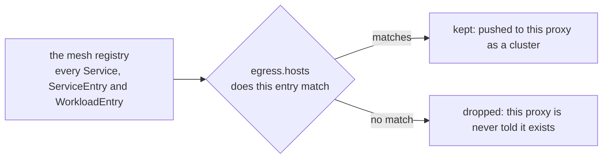
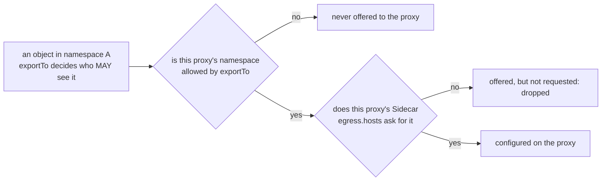

# The Sidecar Object And Its Host Language

> Prerequisite: [What A Proxy Is Programmed With](./course-01-what-a-proxy-is-programmed-with.md). Next: [Precedence, Reachability And What It Is Not](./course-03-precedence-reachability-and-limits.md).

Part 1 established that a proxy holds the whole registry. This part is the object that narrows it: four fields, one of which is a small host-selection language worth memorising because it is exam material and because getting it wrong fails silently.

## The four fields

```yaml
apiVersion: networking.istio.io/v1
kind: Sidecar
metadata:
  name: default
  namespace: sidecar-demo
spec:
  egress:
    - hosts:
        - "./*"
        - "istio-system/*"
```

| Field | Decides |
| --- | --- |
| `workloadSelector` | **which pods** this applies to, by label. Omitted, it applies to **every workload in its own namespace** |
| `egress[].hosts` | which registry entries the proxy is told about, as `<namespace>/<host>` |
| `outboundTrafficPolicy` | overrides the mesh-wide `ALLOW_ANY` / `REGISTRY_ONLY` setting for these workloads only (section 070) |
| `ingress` | overrides how **inbound** traffic is captured. Rare; leave it alone unless a task names it |

The omission-means-whole-namespace behaviour of `workloadSelector` is the normal way to use the object and also the way people accidentally break a namespace. Part 3 covers the consequences; for now just note that the example above, with no selector, applies to every pod in `sidecar-demo`.

Naming the namespace-wide resource `default` is convention, not syntax. It is worth following: "is there a namespace default here?" becomes a one-line check.

### Selecting workloads instead of a whole namespace

`workloadSelector` takes pod labels, exactly like a Service selector:

```yaml
spec:
  workloadSelector:
    labels:
      app: tester
  egress:
    - hosts:
        - "./*"
        - "istio-system/*"
```

That applies to the pods labelled `app: tester` in the `Sidecar`'s own namespace, and to nothing else. A `Sidecar` never reaches across namespaces to select workloads — the object lives where the workloads live.

Use a selector when one workload genuinely needs a different list from the rest of its namespace. Use the namespace-wide form otherwise, because two overlapping selectors is a shape Istio does not define, as Part 3 covers.

### The `ingress` field, and why you can ignore it

`egress` describes what this proxy may be told about. `ingress` is the opposite direction: it overrides how the proxy captures traffic *arriving* for the workload — the port it listens on and where it forwards to locally.

It exists for workloads that cannot be handled by the normal inbound capture, and it is rare enough that a task naming it is unusual. The thing to carry forward is only that **`egress` and `ingress` are unrelated controls**: narrowing `egress` never restricts who may call the workload.

## The host language

`egress[].hosts` entries are always `<namespace>/<host>`. Both halves accept `*`, and `.` is a shorthand for the proxy's own namespace:

| Written | Selects |
| --- | --- |
| `./*` | every host in the **proxy's own** namespace |
| `*/*` | every host in every namespace — the default behaviour, written down |
| `istio-system/*` | every host in `istio-system` |
| `sidecar-other/*` | every host in that one namespace |
| `sidecar-other/httpbin.sidecar-other.svc.cluster.local` | exactly one host |
| `*/httpbin.sidecar-other.svc.cluster.local` | that host, found in whichever namespace exports it |

Read `./*` as "this namespace, all hosts" — the same `.`-means-here convention as a shell path, applied to namespaces.

What the list actually does is act as a filter between the registry and one proxy:



Nothing is deleted and no other proxy is affected. The registry is unchanged; one proxy is simply told less of it.

Two details that decide whether an entry matches anything:

- **The host part is matched against the registry's name for the host**, which for a Kubernetes Service is its fully qualified name. Short names work when unambiguous, but the fully qualified form is what the entry is compared against, so prefer it when you are being specific rather than using `*`.
- **The namespace part is not about where the `Sidecar` lives.** It is about where the *target* lives. `sidecar-other/*` in a `Sidecar` in `sidecar-demo` means "let `sidecar-demo`'s proxies see `sidecar-other`'s hosts".

## Why `istio-system/*` is boilerplate

Almost every real `Sidecar` includes it, and the reason is mechanical rather than stylistic.

A sidecar does not only carry your application's traffic. It talks to the control plane, and depending on how the mesh is configured it also sends telemetry to collectors and may route to gateways — and those live in `istio-system`. Scope that namespace away and the proxy loses the destinations it needs for its own operation.

The failure is the worst kind: **partial**. The pod still starts, application traffic inside the namespace still works, and something else — telemetry, a gateway path, certificate-related behaviour — quietly stops. Nothing in the symptom points back at the `Sidecar` you wrote.

Treat `./*` and `istio-system/*` as the floor that every namespace-wide `Sidecar` starts from, and add to it.

> [!TIP]
> **Try it — scope the namespace down and watch the config shrink**
>
> ```sh
> kubectl apply -f - <<'EOF'
> apiVersion: networking.istio.io/v1
> kind: Sidecar
> metadata:
>   name: default
>   namespace: sidecar-demo
> spec:
>   egress:
>     - hosts:
>         - "./*"
>         - "istio-system/*"
> EOF
> sleep 3
> istioctl proxy-config cluster deploy/tester -n sidecar-demo | wc -l
> istioctl proxy-config cluster deploy/tester -n sidecar-demo | grep sidecar-other
> ```
>
> Expect something like:
>
> ```text
> sidecar.networking.istio.io/default created
>       14
> ```
>
> The count drops and the `grep` prints nothing at all. No traffic was sent and no response code was involved — this is the honest way to verify scoping, and it is what an exam task saying "restrict the proxy configuration" is really asking you to produce.

## Listeners shrink too

Clusters are the obvious casualty, but the proxy's **listeners** are built from the same model, and watching both move is a better mental picture of what scoping does. An outbound listener exists per port the proxy might need to intercept; scope away every host on a port and the listener for it goes with them.

> [!TIP]
> **Try it — the port the proxy no longer listens on**
>
> ```sh
> istioctl proxy-config listener deploy/tester -n sidecar-demo | grep -E '8000|PORT'
> ```
>
> Expect something like:
>
> ```text
> ADDRESSES PORT  MATCH                                          DESTINATION
> ```
>
> Before the `Sidecar` was applied, port 8000 appeared here because `httpbin.sidecar-other` used it. Now the header prints with no 8000 row: the proxy has no reason to intercept that port at all. Re-run the cluster count from the previous checkpoint alongside this and you can see both halves of the model shrinking together.

## Widening again, live

The list is ordinary configuration, so adding a namespace back is an edit. A merge patch is the shortest form and mirrors what a real change would look like:

```sh
kubectl -n sidecar-demo patch sidecar default --type merge -p '
spec:
  egress:
    - hosts:
        - "./*"
        - "istio-system/*"
        - "sidecar-other/*"'
```

Re-run the cluster count and `sidecar-other` is back, within seconds and with no pod restarted — the xDS push from Part 1 doing its job. Note that the patch restates the **whole** `hosts` list: a merge patch replaces a list rather than appending to it, which is the same trap as the `http` rule list in Module 1.

## Multiple `egress` entries

`egress` is a list, and each entry can carry a `port` alongside its `hosts`. Two entries with different ports let you say "these hosts on 80, those hosts on 8000". In practice most `Sidecar` resources have exactly one `egress` entry with no `port` — a single list of hosts — and multi-entry forms are worth recognising in a task rather than reaching for by default.

## Two directions of scoping

`Sidecar` is the **consumer** side: one proxy declaring what it wants to be told about. There is a producer side too, and the two meet in the middle.

Most Istio objects — `VirtualService`, `DestinationRule`, `ServiceEntry` — carry an `exportTo` list that says which namespaces may see them at all. Omitted, it means every namespace.



Both gates have to open. That is the single most useful thing to know when a host is missing from a proxy and the object looks perfect: there are two independent places it can be filtered out, one written by the object's owner and one written by the consumer's namespace. Section 070 covers `exportTo` on a `ServiceEntry`, where it matters most.

## Common pitfalls

> [!WARNING]
> **Leaving `istio-system/*` out.** The proxy loses the destinations it needs for its own operation. The failure is partial and points nowhere near the `Sidecar` you wrote.
>
> **Forgetting `./*`.** A namespace-wide `Sidecar` without it scopes away the proxy's own namespace — including the services its workload most likely calls.
>
> **Reading the namespace half as "where the `Sidecar` lives".** It names where the *target* host lives.
>
> **Patching the `hosts` list with `--type merge` and expecting an append.** A merge patch replaces the whole list. Restate every entry you want to keep.
>
> **Expecting a narrower `Sidecar` to block inbound traffic.** `egress` is about what this proxy can be told about, not about who may call it. `ingress` is a different field and a different direction.
>
> **Selecting workloads in another namespace.** `workloadSelector` only ever matches pods in the `Sidecar`'s own namespace.
>
> **Forgetting the producer side.** A host can be absent because `exportTo` never offered it, not because your `hosts` list omitted it.

> *`egress.hosts` entries are `<namespace>/<host>`, `./*` means this namespace, and `istio-system/*` belongs in the list unless you have a specific reason to leave it out.*

## Reference

- [Sidecar API](https://istio.io/latest/docs/reference/config/networking/sidecar/) — the full schema, including `ingress`, `port` on an egress entry, and `outboundTrafficPolicy`.
- [Configuration scoping](https://istio.io/latest/docs/ops/configuration/mesh/configuration-scoping/) — the host syntax with more worked combinations.
- [Sidecar resource in the traffic management concepts](https://istio.io/latest/docs/concepts/traffic-management/#sidecar-configurations) — where the object sits relative to the rest of the model.
- `istioctl proxy-config listener --help` — the filters that make the listener dump readable while you are watching it shrink.
