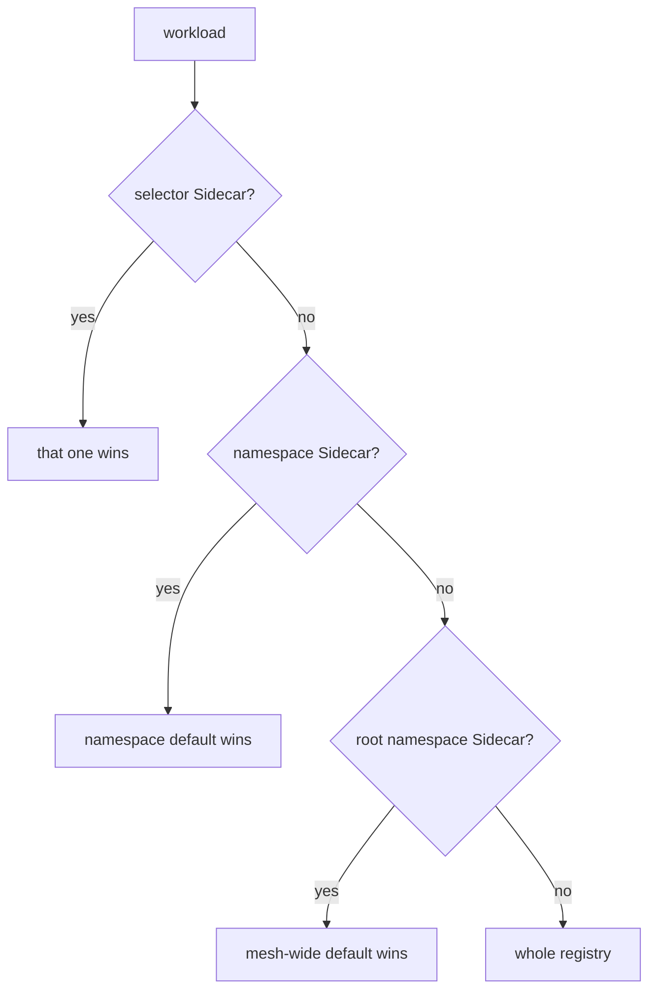
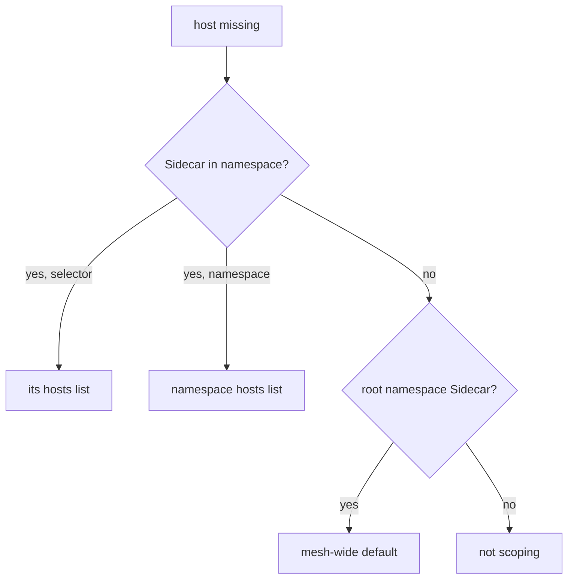

# Precedence, Reachability And What It Is Not

Two questions remain, and both cause real outages. When several `Sidecar` resources could apply to a pod, which one does? And what exactly have you prevented when you scope a host away — is it a routing change, or is it a permission? This part answers both, and ends with the module's consolidated pitfalls.

## Which `Sidecar` applies

There are three ways a `Sidecar` can reach a workload, and they form a precedence ladder:



A selector `Sidecar` sits in the workload's namespace with a `workloadSelector` that matches it. A namespace `Sidecar` has no `workloadSelector`. The root namespace is `istio-system` by default. Evaluation stops at the first "yes". Nothing below that point contributes anything.

The nearest applicable rung wins, and **it replaces the one below rather than merging with it**. A selective `Sidecar` that lists only `./*` does not inherit `istio-system/*` from the namespace default; whatever it lists is the complete list for the workloads it selects.

Two rules follow, and both are worth stating as rules because they are how tasks are marked:

- **At most one namespace-wide `Sidecar` per namespace.** More than one with no selector is not a merge; the outcome is unspecified.
- **Selective resources must not overlap.** Two `Sidecar` objects whose selectors both match the same pod is likewise undefined. Do not rely on whichever behaviour you happen to observe.

The supported shape is therefore: one namespace default, plus non-overlapping selective refinements for the workloads that need something different.

"Replaces rather than merges" is the claim worth testing, because it is the one that breaks namespaces. Add a selective `Sidecar` that lists *only* `./*` on top of the namespace default from Part 2, and watch `istio-system` disappear from the proxy even though the namespace default still lists it.

> [!TIP]
> **Try it — a selective `Sidecar` that inherits nothing**
>
> ```sh
> istioctl proxy-config cluster deploy/tester -n sidecar-demo | grep -c istio-system
> ```
>
> Save this as `sidecar-tester-only.yaml`:
>
> ```yaml
> apiVersion: networking.istio.io/v1
> kind: Sidecar
> metadata:
>   name: tester-only
>   namespace: sidecar-demo
> spec:
>   workloadSelector:
>     labels:
>       app: tester
>   egress:
>     - hosts:
>         - "./*"
> ```
>
> Apply it:
>
> ```sh
> kubectl apply -f sidecar-tester-only.yaml
> ```
>
> Then check the result:
>
> ```sh
> sleep 3
> istioctl proxy-config cluster deploy/tester -n sidecar-demo | grep -c istio-system
> kubectl -n sidecar-demo delete sidecar tester-only
> ```
>
> Expect something like:
>
> ```text
> 3
> sidecar.networking.istio.io/tester-only created
> 0
> ```
>
> The exact counts depend on what is installed. What matters is that the second number is zero: the namespace default still says `istio-system/*`, and the selected workload got none of it. A selective `Sidecar` is the complete list for the pods it matches, and the last line removes it again.

### The mesh-wide default

Rung 3 is worth a worked example, because it is how a platform team applies scoping to namespaces that have never heard of `Sidecar`. A `Sidecar` with no `workloadSelector`, created in the **root namespace** — `istio-system` unless `meshConfig.rootNamespace` says otherwise — becomes the default for every namespace that has no `Sidecar` of its own:

```yaml
apiVersion: networking.istio.io/v1
kind: Sidecar
metadata:
  name: default
  namespace: istio-system
spec:
  egress:
    - hosts:
        - "./*"
        - "istio-system/*"
```

Read that `./*` carefully: it is evaluated per proxy, so it means "each workload's own namespace", not "istio-system". One object, a different effective host list for every namespace it lands on.

This is a high-blast-radius change, a Death Star of a setting: one object, and every unscoped namespace in the mesh is narrowed at once, and the symptom in each is a call that used to work. It belongs to whoever owns the mesh, and it is the reason a namespace default that "does nothing" may still be worth writing: it stops the mesh-wide one from applying to you.

## Removing configuration removes reachability

Part 1 ended with `tester` calling `httpbin.sidecar-other:8000` and getting a `200`, with nothing having authorised it. Part 2 scoped that namespace away and the cluster disappeared from the proxy.

The consequence is not subtle: the planet is gone from this ship's star chart, so the proxy has nowhere to route that name to, and the call fails. This is what makes `Sidecar` a real control rather than a memory optimisation — and it is also the source of the most common self-inflicted outage with this object, because the blast radius of a namespace-wide resource is the whole namespace.

> [!TIP]
> **Try it — the same call, now scoped out**
>
> ```sh
> kubectl -n sidecar-demo patch sidecar default --type merge -p '
> spec:
>   egress:
>     - hosts:
>         - "./*"
>         - "istio-system/*"'
> sleep 3
> kubectl -n sidecar-demo exec deploy/tester -- \
>   curl -s -o /dev/null -w '%{http_code}\n' --max-time 5 http://httpbin.sidecar-other:8000/get
> ```
>
> Expect something like:
>
> ```text
> 000
> ```
>
> `000` is curl's way of saying it never received an HTTP response at all; depending on the mesh's `outboundTrafficPolicy` you may see `502` instead. Either way the call no longer succeeds, and the cause is the missing cluster you confirmed with `proxy-config` — not a NetworkPolicy, not a firewall, not DNS.

That last sentence is the diagnostic value of this module. "It used to work and now returns 000/502, and `proxy-config cluster` has no entry for the host" is a signature with exactly one cause.

## What `Sidecar` is not

This is the most examinable idea in the module, and the one most likely to be tested as a "which object would you use" question.

`Sidecar` controls what the proxy is **configured** for. It does not control what the pod can reach at the network level. Three ways around it, none exotic:

- A process in the pod that **bypasses the proxy** — talking to an IP address directly rather than a service name, or using a port excluded from interception.
- A workload with **no sidecar at all**, which has no configuration to scope.
- Anything operating below the mesh, since the pod's network namespace still has ordinary routes to the cluster network.

So the honest description is: a configuration control with a useful side effect on reachability, not a boundary. For enforcement, combine it with the objects that are:

| Goal | Object |
| --- | --- |
| Shrink proxy configuration and push cost | `Sidecar` — this module |
| Deny a call inside the mesh, enforced on the **server** side | `AuthorizationPolicy` |
| Deny traffic at the pod network layer, proxy or not | Kubernetes `NetworkPolicy` |
| Refuse destinations not in the registry | `outboundTrafficPolicy: REGISTRY_ONLY` (section 070) |

The mental model: `Sidecar` decides what a proxy *knows* (its star chart); `AuthorizationPolicy` decides what a server *accepts*; `NetworkPolicy` decides what the network *carries*.

## Interaction with the rest of the course

Because `egress.hosts` selects over the whole registry — Part 1 noted it includes `ServiceEntry` and `WorkloadEntry` hosts — a `Sidecar` can hide things you configured correctly elsewhere.

The case to remember is section 070: you write a `ServiceEntry` for an external host, it is valid, it is exported mesh-wide, and calls from one particular namespace still fail with a 502. The cause is a `Sidecar` in that namespace whose `hosts` list never mentioned the external host. When a `ServiceEntry` works from one namespace and not another, check for a `Sidecar` before re-reading the `ServiceEntry`.

The same applies to gateways and to `MESH_INTERNAL` workloads. If a host is in the registry but absent from a given proxy's clusters, something scoped it away.

## Diagnosing a missing host

Putting the module together, here is the order to work through when a host that should be reachable is not in a proxy's clusters:



Start when a host is missing from `proxy-config cluster`. For a namespace `Sidecar`, check that `./*` and `istio-system/*` are listed. If no `Sidecar` applies, check `exportTo`, then the registry. Each branch ends at exactly one object to read. That is the value of the precedence rules: there is never more than one `Sidecar` to blame.

## Common pitfalls

> [!WARNING]
> **Forgetting `istio-system/*`.** The proxy loses control plane and telemetry destinations. The failure is partial and diffuse, and nothing points back at the `Sidecar`.
>
> **Writing a narrow `Sidecar` "just to test" with no `workloadSelector`.** It applies to the entire namespace the moment it is applied, including every workload you were not testing.
>
> **Assuming a selective `Sidecar` inherits the namespace default.** It replaces it. List everything the selected workloads need, including `istio-system/*`.
>
> **Two overlapping selectors, or two namespace-wide resources.** Undefined behaviour, not a merge. One default plus non-overlapping refinements is the only supported shape.
>
> **Treating it as a security boundary.** It governs proxy configuration. A process that bypasses the proxy, or a pod with no sidecar, is unaffected.
>
> **Expecting a pod restart to be needed.** Changes are pushed to running proxies over xDS. If nothing changed, look at the selector and the namespace — not at the pod.
>
> **Patching `egress[].hosts` expecting an append.** A merge patch replaces the list. Restate every host you want to keep.
>
> **Debugging a `ServiceEntry` that works elsewhere.** A `Sidecar` in the failing namespace is the usual answer, and the symptom is identical to the host never having been registered.

> *`Sidecar` decides what a proxy knows; `AuthorizationPolicy` decides what a server accepts; `NetworkPolicy` decides what the network carries.*
