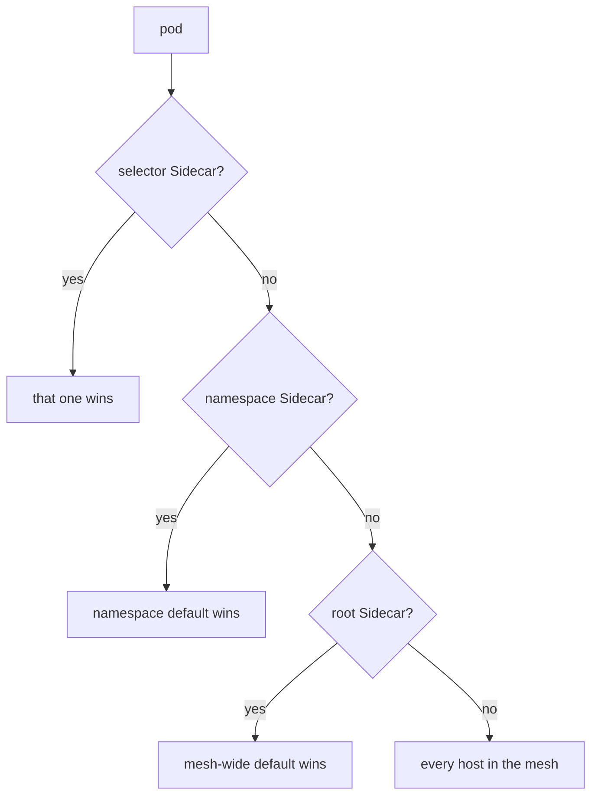

# Which Sidecar Applies To A Workload

A namespace can hold more than one `Sidecar` resource: one for the whole namespace, and others for single workloads. A `Sidecar` in the root namespace can also act as a default for the whole mesh. When several could apply to the same pod, `istiod` uses exactly one and ignores the others completely. This page shows which one wins, and the mistake that silently breaks a workload.

The commands below need the namespace-wide `Sidecar` called `default` in `starfleet`, with the hosts `./*`, `istio-system/*` and `outpost/*`, and `outboundTrafficPolicy` set to `REGISTRY_ONLY`.

## Three levels, one winner

A `Sidecar` resource can apply to a pod in three ways. `istiod` checks them in a fixed order and stops at the first one that applies:



The diagram shows the order in which `istiod` looks for a `Sidecar` for one pod:

1. **A selector `Sidecar`** is in the pod's namespace and has a `workloadSelector` that matches the pod's labels.
2. **A namespace-wide `Sidecar`** is in the pod's namespace and has no `workloadSelector`.
3. **A root `Sidecar`** is in the root namespace, `istio-system`, and has no `workloadSelector`.

The first one that applies **replaces** everything below it. It does not merge with it. A selector `Sidecar` that lists only `./*` does not take `istio-system/*` or `outboundTrafficPolicy` from the namespace default. Its own list is the complete configuration for the pods it selects.

Two rules follow, and exam tasks are graded on them. A namespace may have at most one `Sidecar` without a selector: two of them do not merge, and which one applies is not defined. Selector `Sidecar` objects must not overlap: if two selectors match the same pod, the result is not defined either. So the only safe layout is one namespace default, plus selector `Sidecar` objects that never select the same pod twice.

## A selector Sidecar takes nothing from the default

The quickest way to believe the "replaces, never merges" rule is to watch it happen on the `shuttle` pod. First, count the clusters that the `shuttle` proxy holds for `istio-system` under the namespace default:

<!-- astrona:playground:renew -->

```sh
istioctl proxy-config cluster deploy/shuttle -n starfleet | grep -c istio-system
```

```text
4
```

Now give only the `shuttle` pod its own `Sidecar`, with just its own namespace. Save this as `sidecar-shuttle-only.yaml`:

```yaml
apiVersion: networking.istio.io/v1
kind: Sidecar
metadata:
  name: shuttle-only
  namespace: starfleet
spec:
  workloadSelector:
    labels:
      app: shuttle
  egress:
  - hosts:
    - "./*"
```

Apply it:

```sh
kubectl apply -f sidecar-shuttle-only.yaml
```

```text
sidecar.networking.istio.io/shuttle-only created
```

Then check the result. Count the clusters for `istio-system` and for `outpost`, call the `probe` Service, and read the access log:

```sh
istioctl proxy-config cluster deploy/shuttle -n starfleet | grep -c istio-system
istioctl proxy-config cluster deploy/shuttle -n starfleet | grep -c outpost
kubectl -n starfleet exec deploy/shuttle -- curl -s -o /dev/null -w '%{http_code}\n' --max-time 5 http://probe.outpost:8000/get
kubectl logs -n starfleet deploy/shuttle -c istio-proxy --tail=1
```

You should see (log line shortened):

```text
0
0
200
"- - -" 0 - - - "-" 85 699 5 - "-" "-" "-" "-" "10.96.91.255:8000" PassthroughCluster ...
```

Three things changed at once, all because the selector `Sidecar` replaced the namespace default for the `shuttle` pod. The `istio-system` clusters are gone, although the namespace default lists that namespace. The `outpost` cluster is gone too. And `probe` still answers `200`, but through `PassthroughCluster`: the namespace default's `REGISTRY_ONLY` no longer applies to the `shuttle` pod, so the mesh default `ALLOW_ANY` is back.

The other pods in the namespace are not affected. Check the `cargo-v1` workload, which the selector does not match:

```sh
istioctl proxy-config cluster deploy/cargo-v1 -n starfleet | grep -c outpost
```

```text
1
```

The `cargo-v1` proxy still uses the namespace default, so it still holds the `outpost` cluster. Remove the `shuttle` pod's own `Sidecar` again:

```sh
kubectl delete -f sidecar-shuttle-only.yaml
```

```text
sidecar.networking.istio.io "shuttle-only" deleted from starfleet namespace
```

> [!TIP]
> When you write a selector `Sidecar`, copy the `hosts` list and `outboundTrafficPolicy` of the namespace default into it first, then change what you need. It takes nothing from the default.

## The mesh-wide default

The third level lets the team that runs the mesh limit every namespace that has no `Sidecar` of its own. A `Sidecar` with no `workloadSelector` in the root namespace `istio-system` becomes the default for every namespace without its own `Sidecar`. Read its `./*` carefully: `istiod` works it out for each pod, so it means "the pod's own namespace", not `istio-system`.

The `outpost` namespace has no `Sidecar`. Count the clusters that the `probe-v1` proxy holds:

```sh
istioctl proxy-config cluster deploy/probe-v1 -n outpost | wc -l
```

```text
      18
```

Save this as `sidecar-root-default.yaml`:

```yaml
apiVersion: networking.istio.io/v1
kind: Sidecar
metadata:
  name: default
  namespace: istio-system
spec:
  egress:
  - hosts:
    - "./*"
    - "istio-system/*"
```

Apply it:

```sh
kubectl apply -f sidecar-root-default.yaml
```

```text
Warning: duplicated egress host: istio-system/*
sidecar.networking.istio.io/default created
```

The API server prints this warning because, read inside `istio-system`, `./*` and `istio-system/*` mean the same thing. It is harmless: for every other namespace, `./*` means that namespace.

Then check the result. Count the `probe-v1` clusters again, list the ones from `starfleet` and `outpost`, and count the `outpost` clusters on the `shuttle` proxy:

```sh
istioctl proxy-config cluster deploy/probe-v1 -n outpost | wc -l
istioctl proxy-config cluster deploy/probe-v1 -n outpost | grep -E "starfleet|outpost"
istioctl proxy-config cluster deploy/shuttle -n starfleet | grep -c outpost
```

You should see:

```text
      14
probe.outpost.svc.cluster.local           8000      -          outbound      EDS
1
```

The `probe-v1` proxy now holds only its own namespace and `istio-system`; the `starfleet` hosts are gone. The `shuttle` proxy still holds the `outpost` cluster, because `starfleet` has its own namespace default, and a namespace default wins over the root default.

Remove the root default again:

```sh
kubectl delete -f sidecar-root-default.yaml
```

This is a powerful setting: one object limits every namespace in the mesh that has no `Sidecar` of its own. It belongs to whoever runs the mesh. It is also a good reason to give your own namespace a default, even one that only lists `*/*`: then the mesh-wide default never applies to your pods.

You now know the three levels, the order in which `istiod` checks them, and that the winner replaces the rest instead of merging with it. What remains is to see what a `Sidecar` cannot do, even when it is the one that applies.

## Common pitfalls

> [!WARNING]
> - **Assuming a selector `Sidecar` takes settings from the namespace default.** It replaces it, including `istio-system/*` and `outboundTrafficPolicy`. List everything again.
> - **Writing a narrow `Sidecar` "just to test" without a selector.** It applies to every pod in the namespace as soon as you apply it.
> - **Two namespace-wide `Sidecar` objects, or two overlapping selectors.** The result is not defined. One default plus selectors that do not overlap is the only supported layout.
> - **Reading `./*` in the root default as `istio-system`.** It means each pod's own namespace.
> - **Forgetting that the root default exists.** If a namespace without a `Sidecar` lost destinations, check `istio-system` for one.

## Your mission: Repair A Workload-Selected Sidecar Lab

You can now tell which `Sidecar` applies to a pod, and you know that a selector `Sidecar` replaces the namespace default instead of adding to it. In the lab, requests from the `shuttle` pod to the `probe` Service fail because its own `Sidecar` lists too few hosts, and you must repair that `Sidecar` without removing it.

The lab runs in its own cluster, so first pause your playground. Nothing in it is lost:

```sh
astrona stop ats-014-playground-010-02
```

Then start the lab:

```sh
astrona run --git git@github.com:astrona-io/ATS014.git -c sections/section-010/module-02/labs/lab-02
```

The task is on the next page. Solve it on your own first. When you think you are done, send it for grading:

```sh
astrona submit -c sections/section-010/module-02/labs/lab-02
```

When the lab is done, remove it and start your playground again:

```sh
astrona destroy ats-014-lab-010-02-02
astrona start ats-014-playground-010-02
```
