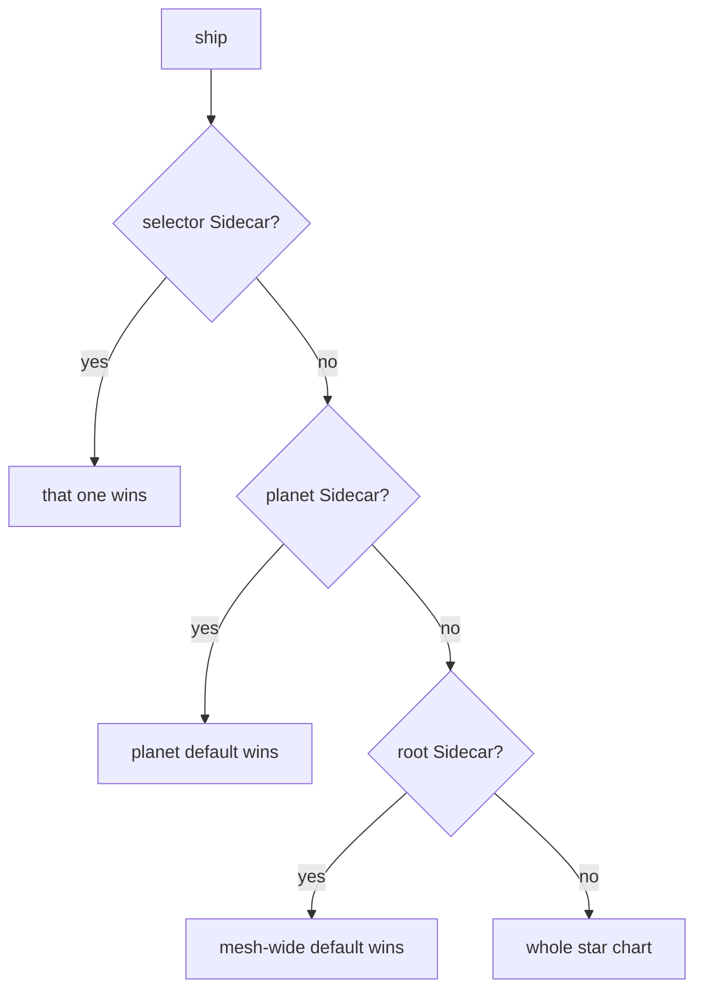

# Which Star Chart A Ship Uses

Astronaut, a planet can have more than one `Sidecar`: one for the whole planet, and others for single ships. Mission control can also hand out a default for the whole solar system. When several could apply to the same ship, exactly one wins, and the others are ignored completely. This part shows which one, and the mistake that silently breaks a ship.

The commands below need the planet-wide `Sidecar` called `default` on `starfleet`, with `./*`, `istio-system/*`, `outpost/*` and `outboundTrafficPolicy: REGISTRY_ONLY`.

## Three levels, one winner

A `Sidecar` can reach a ship in three ways. Mission control checks them in this order and stops at the first one that applies:



1. **A selector `Sidecar`** sits on the ship's planet with a `workloadSelector` that matches the ship's labels.
2. **A planet `Sidecar`** sits on the ship's planet with no `workloadSelector`.
3. **A root `Sidecar`** sits in the root namespace, `istio-system`, with no `workloadSelector`.

The first one that applies **replaces** everything below it. It does not merge with it. A selector `Sidecar` that lists only `./*` does not inherit `istio-system/*` or `outboundTrafficPolicy` from the planet default. What it lists is the complete star chart for the ships it selects.

Two rules follow, and exam tasks are graded on them:

- **At most one planet-wide `Sidecar` per planet.** Two without a selector do not merge; which one applies is not defined.
- **Selector `Sidecar` objects must not overlap.** If two selectors match the same ship, the result is not defined either.

So the only safe shape is: one planet default, plus selector refinements that never select the same ship twice.

<!-- astrona:playground:renew -->

### A selector `Sidecar` that inherits nothing

First, count what the shuttle knows about `istio-system` under the planet default:

```sh
istioctl proxy-config cluster deploy/shuttle -n starfleet | grep -c istio-system
```

```text
4
```

Now give only the shuttle its own star chart, with just its own planet. Save this as `sidecar-shuttle-only.yaml`:

```yaml
apiVersion: networking.istio.io/v1
kind: Sidecar
metadata:
  name: shuttle-only
  namespace: starfleet
spec:
  workloadSelector:
    labels:
      app: shuttle
  egress:
  - hosts:
    - "./*"
```

Apply it:

```sh
kubectl apply -f sidecar-shuttle-only.yaml
```

```text
sidecar.networking.istio.io/shuttle-only created
```

Then count again, for `istio-system` and for `outpost`, and call the probe:

```sh
istioctl proxy-config cluster deploy/shuttle -n starfleet | grep -c istio-system
istioctl proxy-config cluster deploy/shuttle -n starfleet | grep -c outpost
kubectl -n starfleet exec deploy/shuttle -- curl -s -o /dev/null -w '%{http_code}\n' --max-time 5 http://probe.outpost:8000/get
kubectl logs -n starfleet deploy/shuttle -c istio-proxy --tail=1
```

You should see (log line trimmed):

```text
0
0
200
"- - -" 0 - - - "-" 85 699 5 - "-" "-" "-" "-" "10.96.91.255:8000" PassthroughCluster ...
```

Three things happened at once, all because the selector `Sidecar` replaced the planet default:

- `istio-system` is gone from the shuttle's chart, although the planet default lists it.
- `outpost` is gone too.
- The probe still answers `200`, but through `PassthroughCluster`. The planet default's `REGISTRY_ONLY` no longer applies to the shuttle either, so the mesh default `ALLOW_ANY` is back.

Now look at a ship the selector does not match, the cargo ship on the same planet:

```sh
istioctl proxy-config cluster deploy/cargo-v1 -n starfleet | grep -c outpost
```

```text
1
```

The cargo ship still follows the planet default, so `outpost` is still on its chart. Remove the shuttle's own `Sidecar` again:

```sh
kubectl delete -f sidecar-shuttle-only.yaml
```

```text
sidecar.networking.istio.io "shuttle-only" deleted from starfleet namespace
```

> [!TIP]
> When you write a selector `Sidecar`, copy the planet default's `hosts` list and `outboundTrafficPolicy` into it first, then change what you need. It inherits nothing.

## The mesh-wide default

The third level is how a platform team shrinks the star chart of planets that have never heard of `Sidecar`. A `Sidecar` with no `workloadSelector`, placed in the root namespace `istio-system`, becomes the default for every planet that has no `Sidecar` of its own.

Read its `./*` carefully: it is worked out per ship. It means "each ship's own planet", not `istio-system`.

### Shrink every unscoped planet at once

The `outpost` planet has no `Sidecar`. Count what the probe's proxy carries:

```sh
istioctl proxy-config cluster deploy/probe-v1 -n outpost | wc -l
```

```text
      18
```

Save this as `sidecar-root-default.yaml`:

```yaml
apiVersion: networking.istio.io/v1
kind: Sidecar
metadata:
  name: default
  namespace: istio-system
spec:
  egress:
  - hosts:
    - "./*"
    - "istio-system/*"
```

Apply it:

```sh
kubectl apply -f sidecar-root-default.yaml
```

```text
Warning: duplicated egress host: istio-system/*
sidecar.networking.istio.io/default created
```

The warning appears because, read inside `istio-system`, `./*` and `istio-system/*` look the same. It is harmless: for every other planet, `./*` means that planet.

Then count again, and see which planets the probe still knows:

```sh
istioctl proxy-config cluster deploy/probe-v1 -n outpost | wc -l
istioctl proxy-config cluster deploy/probe-v1 -n outpost | grep -E "starfleet|outpost"
istioctl proxy-config cluster deploy/shuttle -n starfleet | grep -c outpost
```

You should see:

```text
      14
probe.outpost.svc.cluster.local           8000      -          outbound      EDS
1
```

The probe's chart shrank to its own planet and `istio-system`: `starfleet` is gone from it. The shuttle still sees `outpost`, because `starfleet` has its own planet default, and a planet default beats the root default.

Remove the root default again:

```sh
kubectl delete -f sidecar-root-default.yaml
```

This is a Death Star of a setting: one object, and every unscoped planet in the mesh is narrowed at once. It belongs to whoever runs the mesh. It is also a good reason to give your own planet a default, even one that only lists `*/*`: then the mesh-wide one never applies to you.

## Common pitfalls

> [!WARNING]
> - **Assuming a selector `Sidecar` inherits the planet default.** It replaces it, including `istio-system/*` and `outboundTrafficPolicy`. List everything again.
> - **Writing a narrow `Sidecar` "just to test" without a selector.** It applies to every ship on the planet the moment you apply it.
> - **Two planet-wide `Sidecar` objects, or two overlapping selectors.** The result is not defined. One default plus non-overlapping refinements is the only supported shape.
> - **Reading `./*` in the root default as `istio-system`.** It means each ship's own planet.
> - **Forgetting the root default exists.** If a planet without a `Sidecar` lost destinations, check `istio-system` for one.

> *Mission control uses the closest `Sidecar` that applies to a ship: selector, then planet, then root. The winner replaces the rest; it never merges.*

## Your mission: Fix One Ship's Star Chart

You can now tell which `Sidecar` a ship uses, and you know that a selector `Sidecar` replaces the planet default instead of adding to it. Now prove it in a graded mission: one ship has lost its way because its own `Sidecar` inherits nothing, and you have to give it back the planets it needs.

The mission runs in its own training solar system, so first pause your playground. Nothing in it is lost:

```sh
astrona stop ats-014-playground-010-02
```

Then start the mission:

```sh
astrona run --git git@github.com:astrona-io/ATS014.git -c sections/section-010/module-02/labs/lab-02
```

Read the task in [`question.md`](./labs/lab-02/question.md) and solve it on your own first. When you think you are done, send it for grading:

```sh
astrona submit -c sections/section-010/module-02/labs/lab-02
```

When the mission is done, remove it and wake your playground up again:

```sh
astrona destroy ats-014-lab-010-02-02
astrona start ats-014-playground-010-02
```
